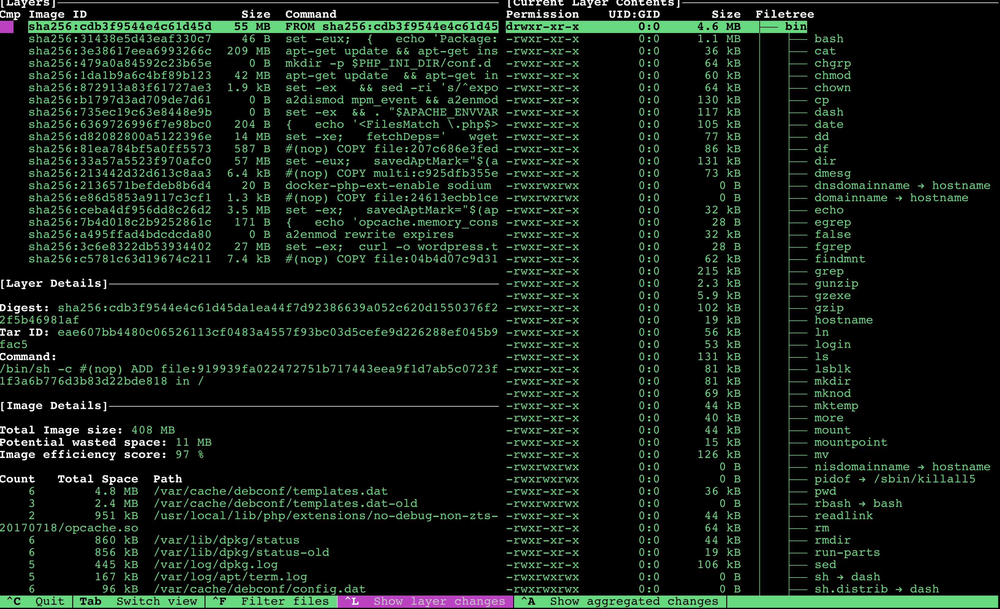

# Docker 镜像分析工具 Dive

我们知道用 `docker inspect` 命令可以查看一个 `docker` 镜像的 `meta` 信息，用`docker history`命令可以了解一个镜像的构建历史，但是这些信息对我们去分析一个镜像的具体一层的组成来说还是不太够，不够清晰明了。

```
$ docker images

REPOSITORY                                       TAG                 IMAGE ID            CREATED             SIZE
sshd                                             dockerfile          b59b2f96ecd5        3 months ago        251 MB
my-nginx                                         latest              6680bfdb1445        3 months ago        109 MB
apache2-image                                    latest              47b3702ac331        3 months ago        178 MB
docker.io/ghost                                  latest              871648027f18        3 months ago        529 MB
docker.io/wordpress                              latest              e2c4085bbc2b        3 months ago        408 MB

$ docker inspect docker.io/wordpress:latest
[
    {
        "Id": "sha256:e2c4085bbc2bb988bdb87e73f63be1048799385a6ccff6acd7b36233475c9278",
        "RepoTags": [
            "docker.io/wordpress:latest"
        ],
        "RepoDigests": [
            "docker.io/wordpress@sha256:d92a0d4e9aae885789af8538bb8afe8624c23cb5d763dcc1d3a2e4ac57531d21"
        ],
...

docker history docker.io/wordpress:latest
IMAGE               CREATED             CREATED BY                                      SIZE                COMMENT
e2c4085bbc2b        3 months ago        /bin/sh -c #(nop)  CMD ["apache2-foreground"]   0 B
<missing>           3 months ago        /bin/sh -c #(nop)  ENTRYPOINT ["docker-ent...   0 B
<missing>           3 months ago        /bin/sh -c #(nop) COPY file:04b4d07c9d3136...   7.4 kB
<missing>           4 months ago        /bin/sh -c set -ex;  curl -o wordpress.tar...   27.3 MB
<missing>           4 months ago        /bin/sh -c #(nop)  ENV WORDPRESS_SHA1=0945...   0 B
<missing>           4 months ago        /bin/sh -c #(nop)  ENV WORDPRESS_VERSION=4...   0 B
<missing>           4 months ago        /bin/sh -c #(nop)  VOLUME [/var/www/html]       0 B
<missing>           4 months ago        /bin/sh -c a2enmod rewrite expires              60 B
<missing>           4 months ago        /bin/sh -c {   echo 'opcache.memory_consum...   171 B
<missing>           4 months ago        /bin/sh -c set -ex;   savedAptMark="$(apt-...   3.5 MB
<missing>           4 months ago        /bin/sh -c #(nop)  CMD ["apache2-foreground"]   0 B
<missing>           4 months ago        /bin/sh -c #(nop)  EXPOSE 80/tcp                0 B
<missing>           4 months ago        /bin/sh -c #(nop) WORKDIR /var/www/html         0 B
<missing>           4 months ago        /bin/sh -c #(nop) COPY file:24613ecbb1ce6a...   1.35 kB
<missing>           4 months ago        /bin/sh -c #(nop)  ENTRYPOINT ["docker-php...   0 B
<missing>           4 months ago        /bin/sh -c docker-php-ext-enable sodium         20 B
<missing>           4 months ago        /bin/sh -c #(nop) COPY multi:c925dfb355ea1...   6.44 kB
<missing>           4 months ago        /bin/sh -c set -eux;   savedAptMark="$(apt...   56.9 MB
<missing>           4 months ago        /bin/sh -c #(nop) COPY file:207c686e3fed4f...   587 B
<missing>           4 months ago        /bin/sh -c set -xe;   fetchDeps='   wget  ...   13.5 MB
<missing>           4 months ago        /bin/sh -c #(nop)  ENV PHP_SHA256=53ba0708...   0 B
<missing>           4 months ago        /bin/sh -c #(nop)  ENV PHP_URL=https://sec...   0 B
<missing>           4 months ago        /bin/sh -c #(nop)  ENV PHP_VERSION=7.2.8        0 B
<missing>           4 months ago        /bin/sh -c #(nop)  ENV GPG_KEYS=1729F83938...   0 B
<missing>           4 months ago        /bin/sh -c #(nop)  ENV PHP_LDFLAGS=-Wl,-O1...   0 B
<missing>           4 months ago        /bin/sh -c #(nop)  ENV PHP_CPPFLAGS=-fstac...   0 B
<missing>           4 months ago        /bin/sh -c #(nop)  ENV PHP_CFLAGS=-fstack-...   0 B
<missing>           4 months ago        /bin/sh -c #(nop)  ENV PHP_EXTRA_CONFIGURE...   0 B
<missing>           4 months ago        /bin/sh -c #(nop)  ENV PHP_EXTRA_BUILD_DEP...   0 B
<missing>           4 months ago        /bin/sh -c {   echo '<FilesMatch \.php$>';...   237 B
<missing>           4 months ago        /bin/sh -c set -ex  && . "$APACHE_ENVVARS"...   33 B
<missing>           4 months ago        /bin/sh -c a2dismod mpm_event && a2enmod m...   68 B
<missing>           4 months ago        /bin/sh -c set -ex   && sed -ri 's/^export...   1.92 kB
<missing>           4 months ago        /bin/sh -c #(nop)  ENV APACHE_ENVVARS=/etc...   0 B
<missing>           4 months ago        /bin/sh -c #(nop)  ENV APACHE_CONFDIR=/etc...   0 B
<missing>           4 months ago        /bin/sh -c apt-get update  && apt-get inst...   42.3 MB
<missing>           4 months ago        /bin/sh -c mkdir -p $PHP_INI_DIR/conf.d         0 B
<missing>           4 months ago        /bin/sh -c #(nop)  ENV PHP_INI_DIR=/usr/lo...   0 B
<missing>           4 months ago        /bin/sh -c apt-get update && apt-get insta...   209 MB
<missing>           4 months ago        /bin/sh -c #(nop)  ENV PHPIZE_DEPS=autocon...   0 B
<missing>           4 months ago        /bin/sh -c set -eux;  {   echo 'Package: p...   46 B
<missing>           4 months ago        /bin/sh -c #(nop)  CMD ["bash"]                 0 B
<missing>           4 months ago        /bin/sh -c #(nop) ADD file:919939fa0224727...   55.3 MB
```

## 介绍

接下来我们给大家介绍一个用来分析 docker 镜像层信息的一个工具：dive，地址：[https://github.com/wagoodman/dive](https://github.com/wagoodman/dive)，该工具主要用于探索 docker 镜像层内容以及发现减小 docker 镜像大小的方法。

要分析一个 **docker** 镜像，只需要在 **dive** 工具后面添加上镜像的 `tag` 即可：

```
$ dive <镜像TAG>
```

除此之外，还可以通过 `build` 命令去构建 `docker` 镜像后，直接进入分析结果：

```
$ dive build -t <镜像TAG> .
```

## 基本功能

* 显示每层的 `docker` 镜像内容：当您在左侧选择一个层时，将在右侧线上显示该层的所有内容，此外，您可以使用箭头按键来浏览整个文件树内容。
* 指出每层中发生了哪些变化：在文件树中标明已修改、添加或删除的文件，可以调整此值以显示特定层的更改。
* 估计“镜像效率”：左下方窗格显示基本层信息和一个实验指标，用于猜测图像所包含的空间浪费。这可能是跨层的一些重复文件，跨层移动文件或不完全删除的文件。提供了一个百分比的“得分”和总浪费的文件空间。
* 快速构建/分析周期：您可以构建 docker 镜像并使用一个命令立即进行分析：`dive build -t some-tag .`，您只需要将 `docker build` 命令用相同的`dive build`命令替换即可。

## 安装

安装非常简单，我们这里为了方便，直接使用 `docker` 镜像的方式，其他的安装方法在 `dive` 文档中查看即可。

```
$ docker pull wagoodman/dive
```

镜像 `pull` 下来后，然后使用该镜像运行一个临时的容器，加上我们需要分析的镜像即可

```
$ docker run --rm -it \
    -v /var/run/docker.sock:/var/run/docker.sock \
    wagoodman/dive:latest <dive arguments...>
```

比如，我们这里来分析 `wordpress:latest` 这个镜像：

```
$ docker run --rm -it \
>     -v /var/run/docker.sock:/var/run/docker.sock \
>     wagoodman/dive:latest wordpress:latest
Unable to find image 'wagoodman/dive:latest' locally
Trying to pull repository docker.io/wagoodman/dive ...
latest: Pulling from docker.io/wagoodman/dive
a88163799460: Pull complete
f0093b067e8b: Pull complete
Digest: sha256:22835b2a8b00306c1142a090d7e4dc7512e1db2a73d7b464da12d46d764eb057
Status: Downloaded newer image for docker.io/wagoodman/dive:latest
Analyzing Image
  Fetching metadata...
  Fetching image...
    ├─ [layer:  0] 0b92b8d740f42ec : [========================================>] 100 % (691/691)
    ├─ [layer:  1] 1f2344cf856b2a4 : [========================================>] 100 % (6/6)
    ├─ [layer:  2] 35fd237095a30e6 : [========================================>] 100 % (4/4)
    ├─ [layer:  3] 3a0b1de078b463c : [========================================>] 100 % (4/4)
    ├─ [layer:  4] 45696810d11401f : [========================================>] 100 % (4/4)
    ├─ [layer:  5] 45707b19a825a58 : [========================================>] 100 % (12/12)
    ├─ [layer:  6] 531837cefef3084 : [========================================>] 100 % (1650/1650)
    ├─ [layer:  7] 5a37da1b02c404c : [========================================>] 100 % (7/7)
    ├─ [layer:  8] 6dff8b7fa587c6b : [========================================>] 100 % (14/14)
    ├─ [layer:  9] 7365f9c112e03e1 : [========================================>] 100 % (6/6)
    ├─ [layer: 10] 7e26e6227f8544e : [========================================>] 100 % (5801/5801)
    ├─ [layer: 11] 894ee34376705eb : [========================================>] 100 % (4/4)
    ├─ [layer: 12] b92bd416f4ae184 : [========================================>] 100 % (103/103)
    ├─ [layer: 13] bc50b12acd241c1 : [========================================>] 100 % (977/977)
    ├─ [layer: 14] cee78c2b61bdafd : [========================================>] 100 % (6/6)
    ├─ [layer: 15] ea5e890a246b002 : [========================================>] 100 % (12/12)
    ├─ [layer: 16] eae607bb4480c06 : [========================================>] 100 % (4559/4559)
    ├─ [layer: 17] f7e90d6560bd5e8 : [========================================>] 100 % (5/5)
    ├─ [layer: 18] fc3be77e3b1be7d : [========================================>] 100 % (17/17)
    ├─ [layer: 19] fd9aa34279803f5 : [========================================>] 100 % (50/50)
    ╧
  Building tree...
  Analyzing layers...
```
分析完成后，我们就可以进入到一个可操作的界面之中，然后可以使用键盘上的上下按键去切换镜像的每一层，在左下角会出现这一层的详细信息，有的层就会出现计算出的一些浪费空间的结果，我们就可以根据这个信息去分析如何减少镜像大小，而右侧区域则是显示当前镜像层的内容文件树：



更多的信息可以查看 dive 的github仓库页面


