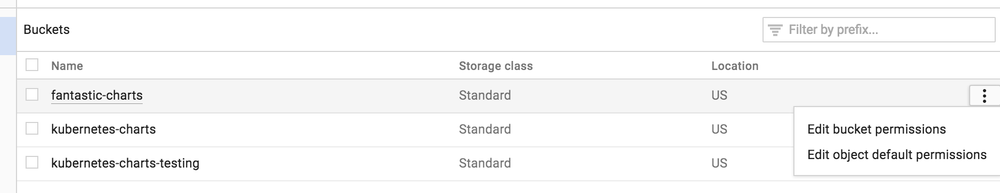

# Chart Repository 存储库指南 (创建 `chart` 库 / 托管 `chart` 库 / 管理 `chart` 库 / 同步 `chart` 库)

本节介绍如何创建和使用 `Helm chart repo`。在高层次上，`chart` 库是可以存储和共享打包 `chart` 的位置。

官方 chart 库由 [Helm Charts](https://github.com/helm/charts) 维护 ，我们欢迎参与贡献。Helm 还可以轻松创建和运行自己的 chart 库。本指南讲解了如何做到这一点。


## 创建 chart 库

`chart` 库是带有一个 `index.yaml` 文件和任意个打包 `chart` 的 `HTTP` 服务器。当准备好分享 `chart` 时，首选方法是将其上传到 `chart` 库。

**注意**： 对于 `Helm 2.0.0`，chart 库没有任何内部认证。 在 GitHub 中有一个跟踪进度的问题 issue tracking progress。

由于 `chart` 库可以是任何可以提供 `YAML` 和 `tar` 文件并可以回答 `GET` 请求的 `HTTP` 服务器，因此当托管自己的 `chart` 库时，很多选择。

例如，可以使用 `Google` 云端存储（`GCS`）存储桶，`Amazon S3` 存储桶，`Github Pages`，甚至可以创建自己的 `Web` 服务器。

### chart 库结构

`chart` 库由打包的 `chart` 和一个名为的特殊文件组成， `index.yaml` 其中包含 `chart` 库中所有 `chart` 的索引。通常，`index.yaml` 描述的 `chart` 也是托管在同一台服务器上，源代码文件也是如此。

例如，chart 库的布局 `https://example.com/charts` 可能如下所示：

```
charts/
  |
  |- index.yaml
  |
  |- alpine-0.1.2.tgz
  |
  |- alpine-0.1.2.tgz.prov
```

这种情况下，索引文件包含有关一个 `chart（Alpine chart）`的信息，并提供该 `chart` 的下载 URL `https://example.com/charts/alpine-0.1.2.tgz`。

**不要求 `chart` 包与 `index.yaml` 文件位于同一台服务器上 。但是，发在一起这样做通常是最简单的。**


### 索引文件

索引文件是一个叫做 `yaml` 文件 `index.yaml`。它包含一些关于包的元数据，包括 `chart` 的 `Chart.yaml` 文件的内容。

一个有效的 `chart` 库必须有一个索引文件。索引文件包含有关 `chart` 库中每个 `chart` 的信息。`helm repo index` 命令将根据包含打包的 `chart` 的给定本地目录生成索引文件。

下面一个索引文件的例子：

```
apiVersion: v1
entries:
  alpine:
    - created: 2016-10-06T16:23:20.499814565-06:00
      description: Deploy a basic Alpine Linux pod
      digest: 99c76e403d752c84ead610644d4b1c2f2b453a74b921f422b9dcb8a7c8b559cd
      home: https://k8s.io/helm
      name: alpine
      sources:
      - https://github.com/helm
      urls:
      - https://technosophos.github.io/tscharts/alpine-0.2.0.tgz
      version: 0.2.0
    - created: 2016-10-06T16:23:20.499543808-06:00
      description: Deploy a basic Alpine Linux pod
      digest: 515c58e5f79d8b2913a10cb400ebb6fa9c77fe813287afbacf1a0b897cd78727
      home: https://k8s.io/helm
      name: alpine
      sources:
      - https://github.com/helm
      urls:
      - https://technosophos.github.io/tscharts/alpine-0.1.0.tgz
      version: 0.1.0
  nginx:
    - created: 2016-10-06T16:23:20.499543808-06:00
      description: Create a basic nginx HTTP server
      digest: aaff4545f79d8b2913a10cb400ebb6fa9c77fe813287afbacf1a0b897cdffffff
      home: https://k8s.io/helm
      name: nginx
      sources:
      - https://github.com/helm/charts
      urls:
      - https://technosophos.github.io/tscharts/nginx-1.1.0.tgz
      version: 1.1.0
generated: 2016-10-06T16:23:20.499029981-06:00
```

**生成的索引和包可以从基本的网络服务器提供。可以使用 `helm serve` 启动本地服务器，在本地测试所有内容.**

```
$ helm serve --repo-path ./charts
Regenerating index. This may take a moment.
Now serving you on 127.0.0.1:8879
```

上面启动了一个本地 `web `服务器，为它在 `./charts` 目录找到的 `chart` 提供服务。`serve` 命令将在启动过程中自动生成一个 `index.yaml` 文件。


## 托管 chart 库


### ChartMuseum


**`Helm` 提供了一个 `open-source Helm` 库服务叫 [ChartMuseum](https://chartmuseum.com)，你可以自己托管这个服务.**

`ChartMuseum` 支撑多种云存储后端. 配置它指向你存放 `chart` 包的目录或者 `bucket`，`index.yaml` 文件会自动动态生成。

它也可以通过 [Helm chart](https://github.com/helm/charts/tree/master/stable/chartmuseum) 部署:

```
helm install stable/chartmuseum
```

或者 [Docker image](https://hub.docker.com/r/chartmuseum/chartmuseum/tags):

```
docker run --rm -it \
  -p 8080:8080 \
  -v $(pwd)/charts:/charts \
  -e DEBUG=true \
  -e STORAGE=local \
  -e STORAGE_LOCAL_ROOTDIR=/charts \
  chartmuseum/chartmuseum
```

你可以将它加到本地存储库:


```
helm repo add chartmuseum http://localhost:8080
```

ChartMuseum 提供其他特性, 如 chart 上传的 API. 查看更多信息 [README](https://github.com/helm/chartmuseum).

### Google 云端存储

第一步是创建 GCS 存储桶。我们会给我们称之为 `fantastic-charts`。

创建一个 `GCS` 桶


*图片 - `Create a GCS Bucket`*


接下来，通过 **编辑存储桶权限** 使存储桶公开。

编辑权限



*图片 - `Edit Permissions`*

插入此行 item 来 **公开存储 bucket**：

开放 Bucket


恭喜，现在你有一个空的 `GCS bucket` 准备好给 `chart` 提供服务！

可以使用 `Google Cloud Storage` 命令行工具或使用 `GCS Web UI` 上传 `chart` 库。这是官方 `Kubernetes Charts` 存储库托管其 `chart` 的技术，因此如果遇到困难，可能需要查看该项目 peek at that project 。


**注意**： 可以通过此处的 `HTTPS` 地址方便的访问公开的 `GCS` 存储桶 `https://bucket-name.storage.googleapis.com/`。


### JFrog Artifactory


还可以使用 `JFrog Artifactory` 来设置 chart 库。在 [此处](https://www.jfrog.com/confluence/display/RTF/Helm+Chart+Repositories) 阅读更多关于 `JFrog Artifactory` 和 `chart` 库的信息

### Github Pages 示例


以类似的方式，可以使用 `GitHub Pages` 创建 `chart` 库。

`GitHub` 允许两种不同的方式提供静态网页：

* 通过配置一个项目来提供其 ``docs/`` 目录的内容
* 通过配置一个项目来为特定分支提供服务

我们会采取第二种方法，尽管第一种方法很简单。

第一步是创建你的 `gh-pages` 分支。可以在本地做到这一点。

```
$ git checkout -b gh-pages
```

或者通过使用网络浏览器在 `Github` 存储库上的分支按钮：


*图片 - `Create Github Pages branch`*

接下来，需要确保 `gh-pages` 分支设置为 `Github Pages`，点击 `repo Settings` 并向下滚动到 `Github Pages` 部分并按照以下设置：


*图片 - Create Github Pages branch*


默认情况下，源通常设置为 `gh-pages` 分支。如果这不是默认设置，那么请选择 `gh-pages`。


也可以在那里使用自定义域名。

并检查是否勾选了强制使用 `HTTPS`，以便在提供 `chart` 时使用 `HTTPS`。

这样的设置中，可以使用 `master` 分支来存储 `chart` 代码，并将 `gh-pages` 分支作为 `char` 库，例如： `https://USERNAME.github.io/REPONAME`。

演示 [TS Charts](https://github.com/technosophos/tscharts) 库可以通过 `https://technosophos.github.io/tscharts/` 访问。

#### 如何从 `GitHub` 托管 `Helm repo`

`Helm` 是 `Kubernetes` 常用的包管理器，提供很多开箱即用的 `Charts`。在使用过程中，管理自定义 `Charts` 的一种方法是将源保留在某个目录中，然后通过引用目录来使用此类 `Charts`。**但这种方法仍有缺陷，比如版本控制和工具要求。**

我们知道，`Helm repo` 托管的是打包 `Charts` 文件和指向它们的 `index.yaml`。其中 `index.yaml` 还存储有关 `repo` 的元数据。因此，我们可以通过 `GitHub` 来托管这些文件。

首先，创建私有 `GitHub repo`，然后推送一些文件：

```
$ helm package -/my-helm-charts/my-app-chart #这将在当前目录创建带有 Charts 的 tgz 文件
$ helm repo index .  # 这将引用 my-app-chart.yml 创建 index.yaml 文件


$ git add .
$ git commit -m "my-app-chart"
$ git push
```

为了让 `Helm` 能够从这样的 `repo` 中提取文件，我们需要为它提供 `GitHub` 用户名和令牌：

```
$ helm repo add - username <your_github_username> - password <your_github_token> my-github-helm-repo 'https://raw.githubusercontent.com/my_organization/my-github-helm-repo/master 

$ helm repo update 

$ helm repo list
NAME URL 
stable https://kubernetes-chart.storage.googleapis.com
local http://127.0.0.1:8879/charts
ny-github-helmrepo https://raw.githubusercontent.com/my_organization/my-github-helm-repo/master

$ helm search my-app 
NAME CHART VERSION APP VERSION DESCRIPTION 
my-github-helmrepo/my-app-chart 0.1.0 1.0 A Helm chart Kubernetes 
```

最后，将新包添加到现有 `repo`：

* 将新包放入 repo 根目录；
* 运行 `helm repo index`，这将检查新文件并更新 `index.yaml`；
* 提交、推送新包并更新 `index.yaml`；
* `helm repo update`。

安全说明：**这里最重要的是要意识到 `Helm` 实际存储 `GitHub` 令牌的位置。** 
它以纯文本形式存储在 `~/.helm/repository/repositories.yaml`，建议各位读者使用尽可能少的权限生成令牌。


### 普通的 web 服务器


要配置普通 `Web` 服务器来服务 `Helm chart`，只需执行以下操作：

* 将索引和 `chart` 置于服务器目录中
* 确保 `index.yaml` 可以在没有认证要求的情况下访问
* 确保 `yaml` 文件的正确内容类型（`text/yaml` 或 `text/x-yaml`）

例如，如果想在 `$WEBROOT/charts` 以外的目录为 `chart` 提供服务，请确保 `Web` 根目录中有一个 `charts/` 目录，并将索引文件和 `chart` 放入该文件夹内。

## 管理 chart 库

### 将 `chart` 存储在 `chart` 库中

现在已有一个 `chart` 存储库，让我们上传一个 `chart` 和一个索引文件到存储库。`chart` 库中的 `chart` 必须正确打包（`helm package chart-name/`）和版本（遵循 SemVer 2 标准）。

接下来的这些步骤是一个示例工作流程，也可以用你喜欢的任何工作流程来存储和更新 `chart` 库中的 `chart`。

准备好打包 `chart` 后，创建一个新目录，并将打包 `chart` 移动到该目录。

```
$ helm package docs/examples/alpine/
$ mkdir fantastic-charts
$ mv alpine-0.1.0.tgz fantastic-charts/
$ helm repo index fantastic-charts --url https://fantastic-charts.storage.googleapis.com
```

**最后一条命令采用刚创建的本地目录的路径和远程 `chart` 库的 `URL`，并在给定的目录路径中生成 `index.yaml`。**


现在可以使用同步工具或手动将 `chart` 和索引文件上传到 `chart` 库。如果使用 `Google` 云端存储，请使用 `gsutil` 客户端查看此示例工作流程。对于 `GitHub`，可以简单地将 `chart` 放入适当的目标分支中。

### 新添加 `chart` 添加到现有存储库

每次将新 `chart` 添加到存储库时，都必须重新生成索引。`helm repo index` 命令将 `index.yaml` 从头开始完全重建该文件，但仅包括它在本地找到的 `chart`。

可以使用 `--merge` 标志向现有 `index.yaml` 文件增量添加新 `chart`（在使用远程存储库（如 GCS）时，这是一个很好的选择）。运行 `helm repo index --help` 以了解更多信息，

确保上传修改后的 `index.yaml` 文件和 `chart`。如果生成了出处 `provenance` 文件，也要上传。


### 与他人分享 chart


准备好分享 chart 时，只需让别人知道存储库的 URL 是什么就可以了。


他们将通过 `helm repo add [NAME] [URL]` 命令将仓库添加到他们的 `helm` 客户端，并可以起一个带有任何想用来引用仓库的名字。

```
$ helm repo add fantastic-charts https://fantastic-charts.storage.googleapis.com
$ helm repo list
fantastic-charts    https://fantastic-charts.storage.googleapis.com
```

如果 `chart` 由 `HTTP` 基本认证支持，也可以在此处提供用户名和密码：

```
$ helm repo add fantastic-charts https://fantastic-charts.storage.googleapis.com --username my-username --password my-password
$ helm repo list
fantastic-charts    https://fantastic-charts.storage.googleapis.com
```

**注意**： <mark>如果存储库不包含有效信息库 `index.yam` 文件，则添加不会成功。</mark>


之后，用户将能够搜索 `chart`。更新存储库后，他们可以使用该 `helm repo update` 命令获取最新的 `chart` 信息。

**原理是`helm repo add`和`helm repo update`命令获取`index.yaml`文件并将它们存储在 `$HELM_HOME/repository/cache/`目录中。这是`helm search` 找到有关`chart`的信息的地方。**


## 同步(Google Cloud Storage（GCS)) chart 库

**注意**： 这个样例适用于于提供 chart 库的 Google Cloud Storage（GCS）存储 bucket。

### 前提条件

* 安装 [gsutil](https://cloud.google.com/storage/docs/gsutil) 工具。 **这个样例依赖于 `gsutil rsync` 功能。**
* 确保有权访问 `Helm` 客户端文件
* 可选：我们建议在 `GCS` 存储桶上设置对象版本控制，以防意外删除某些内容。

> gsutil is a Python application that lets you access Cloud Storage from the command line. You can use gsutil to do a wide range of bucket and object management tasks, including:

### 设置本地 chart 库目录


像我们在 [the chart repository guide]() 中一样创建一个本地目录，并将打包的 chart 放入该目录中。


例如:

```
$ mkdir fantastic-charts
$ mv alpine-0.1.0.tgz fantastic-charts/
```

### 生成更新的 index.yaml

使用 `Helm` 通过将远程存储库的目录路径和`url` 传递到 `helm repo index` 命令来生成更新的 `index.yaml` 文件，如下所示：

```
$ helm repo index fantastic-charts/ --url https://fantastic-charts.storage.googleapis.com
```

这将生成一个更新的 `index.yaml` 文件并放置在 `fantastic-charts/` 目录中。


### 同步本地和远程 chart 库

通过运行 `scripts/sync-repo.sh` 并传入本地目录名称和 `GCS` 存储桶名称, 将目录的内容上传到您的 GCS 存储桶。

例如：


```
$ pwd
/Users/funuser/go/src/github.com/kubernetes/helm


$ scripts/sync-repo.sh fantastic-charts/ fantastic-charts
Getting ready to sync your local directory (fantastic-charts/) to a remote repository at gs://fantastic-charts
Verifying Prerequisites....
Thumbs up! Looks like you have gsutil. Let’s continue.
Building synchronization state...
Starting synchronization
Would copy file://fantastic-charts/alpine-0.1.0.tgz to gs://fantastic-charts/alpine-0.1.0.tgz
Would copy file://fantastic-charts/index.yaml to gs://fantastic-charts/index.yaml
Are you sure you would like to continue with these changes?? [y/N]} y
Building synchronization state...
Starting synchronization
Copying file://fantastic-charts/alpine-0.1.0.tgz [Content-Type=application/x-tar]...
Uploading   gs://fantastic-charts/alpine-0.1.0.tgz:              740 B/740 B
Copying file://fantastic-charts/index.yaml [Content-Type=application/octet-stream]...
Uploading   gs://fantastic-charts/index.yaml:                    347 B/347 B
Congratulations your remote chart repository now matches the contents of fantastic-charts/
```


### 更新 chart 库

你可能需要保留 `chart` 库内容的本地副本，或者运行 `gsutil rsync` 将远程 `chart` 存储库的内容复制到本地目录。

例如：

```
$ gsutil rsync -d -n gs://bucket-name local-dir/    # the -n flag does a dry run
Building synchronization state...
Starting synchronization
Would copy gs://bucket-name/alpine-0.1.0.tgz to file://local-dir/alpine-0.1.0.tgz
Would copy gs://bucket-name/index.yaml to file://local-dir/index.yaml

$ gsutil rsync -d gs://bucket-name local-dir/       # performs the copy actions
Building synchronization state...
Starting synchronization
Copying gs://bucket-name/alpine-0.1.0.tgz...
Downloading file://local-dir/alpine-0.1.0.tgz:                        740 B/740 B
Copying gs://bucket-name/index.yaml...
Downloading file://local-dir/index.yaml:                              346 B/346 B
```

**`rsync - Synchronize content of two buckets/directories`**:

`https://cloud.google.com/storage/docs/gsutil/commands/rsync#description`

```
gsutil rsync [OPTION]... src_url dst_url
```

