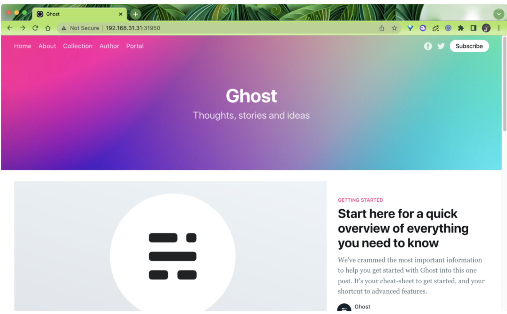
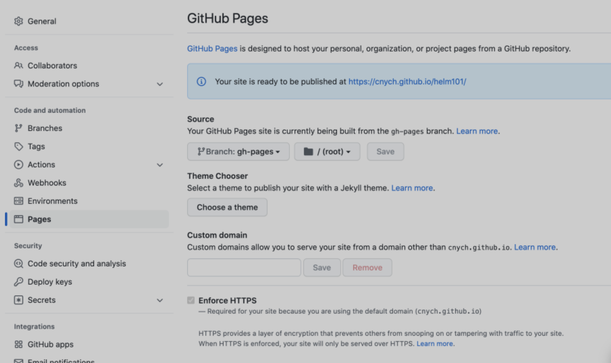

# **Helm Charts 开发完整示例(2022)**

Helm 的使用是比较简单的，但是要让我们自己开发一个 Chart 包还是有不小难度的，主要还是 go template 的语法规则不够人性化，这里我们用一个完整的实例来演示下如何开发一个 Helm Chart 包。

## **应用**

我们这里以 Ghost 博客应用为例来演示如何开发一个完整的 Helm Chart 包，`Ghost` 是基于 `Node.js` 的开源博客平台。在开发 Helm Chart 包之前我们最需要做的的就是要知道我们自己的应用应该如何使用、如何部署，不然是不可能编写出对应的 Chart 包的。

启动 Ghost 最简单的方式是直接使用镜像启动：

```
docker run -d --name my-ghost -p 2368:2368 ghost
```

然后我们就可以通过 `http://localhost:2368 `访问 Ghost 博客了。如果我们想要在 Kubernetes 集群中部署两个副本的 Ghost，可以直接应用下面的资源清单文件即可：

```
# ghost/deployment.yaml
apiVersion: apps/v1
kind: Deployment
metadata:
  name: ghost
spec:
  selector:
    matchLabels:
      app: ghost-app
  replicas: 2
  template:
    metadata:
      labels:
        app: ghost-app
    spec:
      containers:
        - name: ghost-app
          image: ghost
          ports:
            - containerPort: 2368
---
# ghost/service.yaml
apiVersion: v1
kind: Service
metadata:
  name: ghost
spec:
  type: NodePort
  selector:
    app: ghost-app
  ports:
    - protocol: TCP
      port: 80
      targetPort: 2368
```

直接通过 kubectl 应用上面的资源对象即可：

```
➜ kubectl apply -f ghost/deployment.yaml ghost/service.yaml
deployment.apps/ghost created
service/ghost created
➜ kubectl get pod -l app=ghost-app
NAME                    READY   STATUS    RESTARTS   AGE
ghost-dfd958cc9-4s9b9   1/1     Running   0          2m54s
ghost-dfd958cc9-84kmv   1/1     Running   0          2m54s
➜ kubectl get svc ghost
NAME    TYPE       CLUSTER-IP      EXTERNAL-IP   PORT(S)        AGE
ghost   NodePort   10.97.227.160   <none>        80:31950/TCP   3m33s
```



看上去要部署 Ghost 是非常简单的，但是如果我们需要针对不同的环境进行不同的设置呢？比如我们想将它部署到不同环境（staging、prod）中去，是不是我们需要一遍又一遍地复制我们的 Kubernetes 资源清单文件，这还只是一个场景，还有很多场景可能需要我们去部署应用，这种方式维护起来是非常困难的，这个时候就可以理由 Helm 来解放我们了。

## **基础模板**

现在我们开始创建一个新的 Helm Chart 包。直接使用 helm create 命令即可：

```

➜ helm create my-ghost

Creating my-ghost
➜ tree my-ghost
my-ghost
├── Chart.yaml
├── charts
├── templates
│   ├── NOTES.txt
│   ├── _helpers.tpl
│   ├── deployment.yaml
│   ├── hpa.yaml
│   ├── ingress.yaml
│   ├── service.yaml
│   ├── serviceaccount.yaml
│   └── tests
│       └── test-connection.yaml
└── values.yaml

3 directories, 10 files
```

该命令会创建一个默认 Helm Chart 包的脚手架，可以删掉下面的这些使用不到的文件：

```
templates/tests/test-connection.yaml
templates/serviceaccount.yaml
templates/ingress.yaml
templates/hpa.yaml
templates/NOTES.txt
```

然后修改 `templates/deployment.yaml` 模板文件：

```

# templates/deployment.yaml
apiVersion: apps/v1
kind: Deployment
metadata:
  name: ghost
spec:
  selector:
    matchLabels:
      app: ghost-app
  replicas: {{ .Values.replicaCount }}
  template:
    metadata:
      labels:
        app: ghost-app
    spec:
      containers:
        - name: ghost-app
          image: {{ .Values.image }}
          ports:
            - containerPort: 2368
          env:
            - name: NODE_ENV
              value: {{ .Values.node_env | default "production" }}
            {{- if .Values.url }}
            - name: url
              value: http://{{ .Values.url }}
            {{- end }}
```

这和我们前面的资源清单文件非常类似，只是将 `replicas` 的值使用 `{{ .Values.replicaCount }}` 模板来进行替换了，表示会用 `replicaCount` 这个 `Values` 值进行渲染，然后还可以通过设置环境变量来配置 Ghost，同样修改 `templates/service.yaml` 模板文件的内容

```
# templates/service.yaml
apiVersion: v1
kind: Service
metadata:
  name: ghost
spec:
  selector:
    app: ghost-app
  type: {{ .Values.service.type }}
  ports:
    - protocol: TCP
      targetPort: 2368
      port: {{ .Values.service.port }}
      {{- if (and (or (eq .Values.service.type "NodePort") (eq .Values.service.type "LoadBalancer")) (not (empty .Values.service.nodePort))) }}
      nodePort: {{ .Values.service.nodePort }}
      {{- else if eq .Values.service.type "ClusterIP" }}
      nodePort: null
      {{- end }}
```

同样为了能够兼容多个场景，这里我们允许用户来定制 `Service` 的 `type`，如果是` NodePort `类型则还可以配置 nodePort 的值，不过需要注意这里的判断，因为有可能即使配置为 `NodePort` 类型，用户也可能不会主动提供 nodePort，所以这里我们在模板中做了一个条件判断：

```
{{- if (and (or (eq .Values.service.type "NodePort") (eq .Values.service.type "LoadBalancer")) (not (empty .Values.service.nodePort))) }}
```

**需要 `service.type` 为 `NodePort` 或者 `LoadBalancer` 并且 `service.nodePort` 不为空的情况下才会渲染 `nodePort`。**

然后最重要的就是要在 `values.yaml` 文件中提供默认的 Values 值，如下所示是我们提供的默认的 Values 值：

```
# values.yaml
replicaCount: 1
image: ghost
node_env: production
url: ghost.k8s.local

service:
  type: NodePort
  port: 80
```

然后我们可以使用 helm template 命令来渲染我们的模板输出结果：

```
➜ helm template --debug my-ghost
install.go:178: [debug] Original chart version: ""
install.go:195: [debug] CHART PATH: /Users/ych/devs/workspace/yidianzhishi/course/k8strain3/content/helm/manifests/my-ghost

---
# Source: my-ghost/templates/service.yaml
apiVersion: v1
kind: Service
metadata:
  name: ghost
spec:
  selector:
    app: ghost-app
  type: NodePort
  ports:
    - protocol: TCP
      targetPort: 2368
      port: 80
---
# Source: my-ghost/templates/deployment.yaml
apiVersion: apps/v1
kind: Deployment
metadata:
  name: ghost
spec:
  selector:
    matchLabels:
      app: ghost-app
  replicas: 1
  template:
    metadata:
      labels:
        app: ghost-app
    spec:
      containers:
        - name: ghost-app
          image: ghost
          ports:
            - containerPort: 2368
          env:
            - name: NODE_ENV
              value: production
            - name: url
              value: http://ghost.k8s.local
```

上面的渲染结果和我们上面的资源清单文件基本上一致了，只是我们现在的灵活性更大了，比如可以控制环境变量、服务的暴露方式等等。

## **命名模板**

虽然现在我们可以使用 Helm Charts 模板来渲染安装 Ghost 了，但是上面我们的模板还有很多改进的地方，比如资源对象的名称我们是固定的，这样我们就没办法在同一个命名空间下面安装多个应用了，所以一般我们也会根据 Chart 名称或者 Release 名称来替换资源对象的名称。

前面默认创建的模板中包含一个 `_helpers.tpl` 的文件，该文件中包含一些和名称、标签相关的命名模板，我们可以直接使用即可，下面是默认生成的已有的命名模板：

```
{{/*
Expand the name of the chart.
*/}}
{{- define "my-ghost.name" -}}
{{- default .Chart.Name .Values.nameOverride | trunc 63 | trimSuffix "-" }}
{{- end }}

{{/*
Create a default fully qualified app name.
We truncate at 63 chars because some Kubernetes name fields are limited to this (by the DNS naming spec).
If release name contains chart name it will be used as a full name.
*/}}
{{- define "my-ghost.fullname" -}}
{{- if .Values.fullnameOverride }}
{{- .Values.fullnameOverride | trunc 63 | trimSuffix "-" }}
{{- else }}
{{- $name := default .Chart.Name .Values.nameOverride }}
{{- if contains $name .Release.Name }}
{{- .Release.Name | trunc 63 | trimSuffix "-" }}
{{- else }}
{{- printf "%s-%s" .Release.Name $name | trunc 63 | trimSuffix "-" }}
{{- end }}
{{- end }}
{{- end }}

{{/*
Create chart name and version as used by the chart label.
*/}}
{{- define "my-ghost.chart" -}}
{{- printf "%s-%s" .Chart.Name .Chart.Version | replace "+" "_" | trunc 63 | trimSuffix "-" }}
{{- end }}

{{/*
Common labels
*/}}
{{- define "my-ghost.labels" -}}
helm.sh/chart: {{ include "my-ghost.chart" . }}
{{ include "my-ghost.selectorLabels" . }}
{{- if .Chart.AppVersion }}
app.kubernetes.io/version: {{ .Chart.AppVersion | quote }}
{{- end }}
app.kubernetes.io/managed-by: {{ .Release.Service }}
{{- end }}

{{/*
Selector labels
*/}}
{{- define "my-ghost.selectorLabels" -}}
app.kubernetes.io/name: {{ include "my-ghost.name" . }}
app.kubernetes.io/instance: {{ .Release.Name }}
{{- end }
```

然后我们可以将 Deployment 的名称和标签替换掉：

```
# templates/deployment.yaml
apiVersion: apps/v1
kind: Deployment
metadata:
  name: {{ template "my-ghost.fullname" . }}
  labels:
{{ include "my-ghost.labels" . | indent 4 }}
spec:
  selector:
    matchLabels:
{{ include "my-ghost.selectorLabels" . | indent 6 }}
  replicas: {{ .Values.replicaCount }}
  template:
    metadata:
      labels:
{{ include "my-ghost.selectorLabels" . | indent 8 }}
    spec:
    # other spec...
```

为 Deployment 增加 label 标签，同样 labelSelector 中也使用 `my-ghost.selectorLabels` 这个命名模板进行替换，同样对 Service 也做相应的改造：

```
apiVersion: v1
kind: Service
metadata:
  name: {{ template "my-ghost.fullname" . }}
  labels:
{{ include "my-ghost.labels" . | indent 4 }}
spec:
  selector:
{{ include "my-ghost.selectorLabels" . | indent 4 }}
  type: {{ .Values.service.type }}
  # other spec...
```

现在我们可以再使用 helm template 渲染验证结果是否正确：

```
➜ helm template --debug my-ghost
install.go:178: [debug] Original chart version: ""
install.go:195: [debug] CHART PATH: /Users/ych/devs/workspace/yidianzhishi/course/k8strain3/content/helm/manifests/my-ghost

---
# Source: my-ghost/templates/service.yaml
apiVersion: v1
kind: Service
metadata:
  name: release-name-my-ghost
  labels:
    helm.sh/chart: my-ghost-0.1.0
    app.kubernetes.io/name: my-ghost
    app.kubernetes.io/instance: release-name
    app.kubernetes.io/version: "1.16.0"
    app.kubernetes.io/managed-by: Helm
spec:
  selector:
    app.kubernetes.io/name: my-ghost
    app.kubernetes.io/instance: release-name
  type: NodePort
  ports:
    - protocol: TCP
      targetPort: 2368
      port: 80
---
# Source: my-ghost/templates/deployment.yaml
apiVersion: apps/v1
kind: Deployment
metadata:
  name: release-name-my-ghost
  labels:
    helm.sh/chart: my-ghost-0.1.0
    app.kubernetes.io/name: my-ghost
    app.kubernetes.io/instance: release-name
    app.kubernetes.io/version: "1.16.0"
    app.kubernetes.io/managed-by: Helm
spec:
  selector:
    matchLabels:
      app.kubernetes.io/name: my-ghost
      app.kubernetes.io/instance: release-name
  replicas: 1
  template:
    metadata:
      labels:
        app.kubernetes.io/name: my-ghost
        app.kubernetes.io/instance: release-name
    spec:
      containers:
        - name: ghost-app
          image: ghost
          ports:
            - containerPort: 2368
          env:
            - name: NODE_ENV
              value: production
            - name: url
              value: http://ghost.k8s.local
```

## **版本兼容**

由于 Kubernetes 的版本迭代非常快，所以我们在开发 Chart 包的时候有必要考虑到对不同版本的 Kubernetes 进行兼容，最明显的就是 Ingress 的资源版本。

Kubernetes 在 1.19 版本为 Ingress 资源引入了一个新的 API：`networking.k8s.io/v1`，这与之前的 `networking.k8s.io/v1beta1 beta` 版本使用方式基本一致，但是和前面的 `extensions/v1beta1` 这个版本在使用上有很大的不同，资源对象的属性上有一定的区别，所以要兼容不同的版本，我们就需要对模板中的 Ingress 对象做兼容处理。

新版本的资源对象格式如下所示：

```
apiVersion: networking.k8s.io/v1
kind: Ingress
metadata:
  name: minimal-ingress
  annotations:
    nginx.ingress.kubernetes.io/rewrite-target: /
spec:
  ingressClassName: nginx
  rules:
  - http:
      paths:
      - path: /testpath
        pathType: Prefix
        backend:
          service:
            name: test
            port:
              number: 80
```

而旧版本的资源对象格式如下：

```
apiVersion: extensions/v1beta1
kind: Ingress
metadata:
  name: minimal-ingress
  annotations:
    kubernetes.io/ingress.class: nginx
    nginx.ingress.kubernetes.io/rewrite-target: /
spec:
  rules:
  - http:
      paths:
      - path: /testpath
        backend:
          serviceName: test
          servicePort: 80
```

现在我们再为 Ghost 添加一个 Ingress 的模板，新建 `templates/ingress.yaml ` 模板文件，先添加一个 v1 版本的 Ingress 模板：

```
apiVersion: networking.k8s.io/v1
kind: Ingress
metadata:
  name: ghost
spec:
  ingressClassName: nginx
  rules:
  - host: ghost.k8s.local
    http:
      paths:
      - path: /
        pathType: Prefix
        backend:
          service:
            name: ghost
            port:
              number: 80
```

然后同样将名称和服务名称这些使用模板参数进行替换：

```
apiVersion: networking.k8s.io/v1
kind: Ingress
metadata:
  name: {{ template "my-ghost.fullname" . }}
  labels:
{{ include "my-ghost.labels" . | indent 4 }}
spec:
  ingressClassName: nginx
  rules:
  - host: {{ .Values.url }}
    http:
      paths:
      - path: /
        pathType: Prefix
        backend:
          service:
            name: {{ template "my-ghost.fullname" . }}
            port:
              number: {{ .Values.service.port }}
```

然后接下来我们来兼容下其他的版本格式，**这里需要用到 `Capabilities` 对象**，在 Chart 包的 `_helpers.tpl ` 文件中添加几个用于判断集群版本或 API 的命名模板：

```
{{/* Allow KubeVersion to be overridden. */}}
{{- define "my-ghost.kubeVersion" -}}
  {{- default .Capabilities.KubeVersion.Version .Values.kubeVersionOverride -}}
{{- end -

{{/* Get Ingress API Version */}}
{{- define "my-ghost.ingress.apiVersion" -}}
  {{- if and (.Capabilities.APIVersions.Has "networking.k8s.io/v1") (semverCompare ">= 1.19-0" (include "my-ghost.kubeVersion" .)) -}}
      {{- print "networking.k8s.io/v1" -}}
  {{- else if .Capabilities.APIVersions.Has "networking.k8s.io/v1beta1" -}}
    {{- print "networking.k8s.io/v1beta1" -}}
  {{- else -}}
    {{- print "extensions/v1beta1" -}}
  {{- end -}}
{{- end -}}

{{/* Check Ingress stability */}}
{{- define "my-ghost.ingress.isStable" -}}
  {{- eq (include "my-ghost.ingress.apiVersion" .) "networking.k8s.io/v1" -}}
{{- end -}}

{{/* Check Ingress supports pathType */}}
{{/* pathType was added to networking.k8s.io/v1beta1 in Kubernetes 1.18 */}}
{{- define "my-ghost.ingress.supportsPathType" -}}
  {{- or (eq (include "my-ghost.ingress.isStable" .) "true") (and (eq (include "my-ghost.ingress.apiVersion" .) "networking.k8s.io/v1beta1") (semverCompare ">= 1.18-0" (include "my-ghost.kubeVersion" .))) -}}
{{- end -}}
```


上面我们通过 `.Capabilities.APIVersions.Has` 来判断我们应该使用的 `APIVersion`，如果版本为 `networking.k8s.io/v1`，则定义为 `isStable`，此外还根据版本来判断是否需要支持 `pathType` 属性，然后在 `Ingress` 对象模板中就可以使用上面定义的命名模板来决定应该使用哪些属性，如下所示：

```
{{- if .Values.ingress.enabled }}
{{- $apiIsStable := eq (include "my-ghost.ingress.isStable" .) "true" -}}
{{- $ingressSupportsPathType := eq (include "my-ghost.ingress.supportsPathType" .) "true" -}}
apiVersion: {{ include "my-ghost.ingress.apiVersion" . }}
kind: Ingress
metadata:
  name: {{ template "my-ghost.fullname" . }}
  annotations:
    nginx.ingress.kubernetes.io/ssl-redirect: "false"
    {{- if and .Values.ingress.ingressClass (not $apiIsStable) }}
    kubernetes.io/ingress.class: {{ .Values.ingress.ingressClass }}
    {{- end }}
  labels:
    {{- include "my-ghost.labels" . | nindent 4 }}
spec:
  {{- if and .Values.ingress.ingressClass $apiIsStable }}
  ingressClassName: {{ .Values.ingress.ingressClass }}
  {{- end }}
  rules:
  {{- if not (empty .Values.url) }}
  - host: {{ .Values.url }}
    http:
  {{- else }}
  - http:
  {{- end }}
      paths:
      - path: /
        {{- if $ingressSupportsPathType }}
        pathType: Prefix
        {{- end }}
        backend:
          {{- if $apiIsStable }}
          service:
            name: {{ template "my-ghost.fullname" . }}
            port:
              number: {{ .Values.service.port }}
          {{- else }}
          serviceName: {{ template "my-ghost.fullname" . }}
          servicePort: {{ .Values.service.port }}
          {{- end }}
{{- end }}
```


由于有的场景下面并不需要使用 Ingress 来暴露服务，所以首先我们通过一个 `ingress.enabled`  属性来控制是否需要渲染，然后定义了一个 `$apiIsStable` 变量，来表示当前集群是否是稳定版本的 API，然后需要根据该变量去渲染不同的属性，比如对于 `ingressClass`，如果是稳定版本的 API 则是通过 `spec.ingressClassName `来指定，否则是通过 `kubernetes.io/ingress.class` 这个 `annotations` 来指定。然后这里我们在 `values.yaml` 文件中添加如下所示默认的 Ingress 的配置数据：

```
ingress:
  enabled: true
  ingressClass: nginx
```

现在我们再次渲染 Helm Chart 模板来验证资源清单数据：

```
➜ helm template --debug my-ghost
install.go:178: [debug] Original chart version: ""
install.go:195: [debug] CHART PATH: /Users/ych/devs/workspace/yidianzhishi/course/k8strain3/content/helm/manifests/my-ghost

---
# Source: my-ghost/templates/service.yaml
apiVersion: v1
kind: Service
metadata:
  name: release-name-my-ghost
  labels:
    helm.sh/chart: my-ghost-0.1.0
    app.kubernetes.io/name: my-ghost
    app.kubernetes.io/instance: release-name
    app.kubernetes.io/version: "1.16.0"
    app.kubernetes.io/managed-by: Helm
spec:
  selector:
    app.kubernetes.io/name: my-ghost
    app.kubernetes.io/instance: release-name
  type: NodePort
  ports:
    - protocol: TCP
      targetPort: 2368
      port: 80
---
# Source: my-ghost/templates/deployment.yaml
apiVersion: apps/v1
kind: Deployment
metadata:
  name: release-name-my-ghost
  labels:
    helm.sh/chart: my-ghost-0.1.0
    app.kubernetes.io/name: my-ghost
    app.kubernetes.io/instance: release-name
    app.kubernetes.io/version: "1.16.0"
    app.kubernetes.io/managed-by: Helm
spec:
  selector:
    matchLabels:
      app.kubernetes.io/name: my-ghost
      app.kubernetes.io/instance: release-name
  replicas: 1
  template:
    metadata:
      labels:
        app.kubernetes.io/name: my-ghost
        app.kubernetes.io/instance: release-name
    spec:
      containers:
        - name: ghost-app
          image: ghost
          ports:
            - containerPort: 2368
          env:
            - name: NODE_ENV
              value: production
            - name: url
              value: http://ghost.k8s.local
---
# Source: my-ghost/templates/ingress.yaml
apiVersion: networking.k8s.io/v1
kind: Ingress
metadata:
  name: release-name-my-ghost
  annotations:
    nginx.ingress.kubernetes.io/ssl-redirect: "false"
  labels:
    helm.sh/chart: my-ghost-0.1.0
    app.kubernetes.io/name: my-ghost
    app.kubernetes.io/instance: release-name
    app.kubernetes.io/version: "1.16.0"
    app.kubernetes.io/managed-by: Helm
spec:
  ingressClassName: nginx
  rules:
  - host: ghost.k8s.local
    http:
      paths:
      - path: /
        pathType: Prefix
        backend:
          service:
            name: release-name-my-ghost
            port:
              number: 80
```

从上面的资源清单可以看出是符合我们的预期要求的，我们可以来安装测试下结果：

```

➜ helm upgrade --install my-ghost ./my-ghost -n default
Release "my-ghost" does not exist. Installing it now.
NAME: my-ghost
LAST DEPLOYED: Thu Mar 17 13:11:15 2022
NAMESPACE: default
STATUS: deployed
REVISION: 1
TEST SUITE: None

➜ helm ls -n default
NAME            NAMESPACE       REVISION        UPDATED                                 STATUS          CHART                APP VERSION
my-ghost        default         1               2022-03-17 13:11:15.79828 +0800 CST     deployed        my-ghost-0.1.0       1.16.0

➜ kubectl get pods -n default
NAME                        READY   STATUS      RESTARTS   AGE
my-ghost-7cf7fb6484-75hkk   1/1     Running     0          3m9s

➜ kubectl get svc -n default
NAME         TYPE        CLUSTER-IP       EXTERNAL-IP   PORT(S)        AGE
kubernetes   ClusterIP   10.96.0.1        <none>        443/TCP        142d
my-ghost     NodePort    10.108.125.187   <none>        80:32433/TCP   3m20s

➜ kubectl get ingress -n default
NAME       CLASS   HOSTS             ADDRESS         PORTS   AGE
my-ghost   nginx   ghost.k8s.local   192.168.31.31   80      3m32s
```

正常就可以部署成功 Ghost 了，并且可以通过域名 http://ghost.k8s.local 进行访问了：


## **持久化**

上面我们使用的 Ghost 镜像默认使用 SQLite 数据库，所以非常有必要将数据进行持久化，当然我们要将这个开关给到用户去选择，修改 `templates/deployment.yaml` 模板文件，增加 volumes 相关配置：

```
# other spec...
spec:
  volumes:
    - name: ghost-data
    {{- if .Values.persistence.enabled }}
      persistentVolumeClaim:
        claimName: {{ .Values.persistence.existingClaim | default (include "my-ghost.fullname" .) }}
    {{- else }}
      emptyDir: {}
    {{ end }}
  containers:
    - name: ghost-app
      image: {{ .Values.image }}
      volumeMounts:
        - name: ghost-data
          mountPath: /var/lib/ghost/content
      # other spec...
```

这里我们通过 `persistence.enabled` 来判断是否需要开启持久化数据，如果开启则需要看用户是否直接提供了一个存在的 `PVC` 对象，如果没有提供，则我们需要自己创建一个合适的 `PVC` 对象，如果不需要持久化，则直接使用 `emptyDir:{}` 即可，添加 `templates/pvc.yaml` 模板，内容如下所示：

```
{{- if and .Values.persistence.enabled (not .Values.persistence.existingClaim) }}
kind: PersistentVolumeClaim
apiVersion: v1
metadata:
  name: {{ template "my-ghost.fullname" . }}
  labels:
    {{- include "my-ghost.labels" . | nindent 4 }}
spec:
  {{- if .Values.persistence.storageClass }}
  storageClassName: {{ .Values.persistence.storageClass | quote }}
  {{- end }}
  accessModes:
  - {{ .Values.persistence.accessMode | quote }}
  resources:
    requests:
      storage: {{ .Values.persistence.size | quote }}
{{- end -}}
```

其中访问模式、存储容量、StorageClass、存在的 PVC 都通过 Values 来指定，增加了灵活性。对应的 values.yaml 配置部分我们可以给一个默认的配置：

```

## 是否使用 PVC 开启数据持久化
persistence:
  enabled: true
  ## 是否使用 storageClass，如果不适用则补配置
  # storageClass: "xxx"
  ##
  ## 如果想使用一个存在的 PVC 对象，则直接传递给下面的 existingClaim 变量
  # existingClaim: your-claim
  accessMode: ReadWriteOnce  # 访问模式
  size: 1Gi  # 存储容量
```

## **定制**

**除了上面的这些主要的需求之外，还有一些额外的定制需求，比如用户想要配置更新策略，因为更新策略并不是一层不变的，这里和之前不太一样，我们需要用到一个新的函数 `toYaml`**

```
{{- if .Values.updateStrategy }}
strategy: {{ toYaml .Values.updateStrategy | nindent 4 }}
{{- end }}
```

意思就是我们将** `updateStrategy` 这个 `Values` 值转换成 `YAML` 格式，并保留4个空格**。然后添加其他的配置，比如是否需要添加 `nodeSelector`、容忍、亲和性这些，这里我们都是使用 toYaml 函数来控制空格，如下所示：

```

{{- if .Values.nodeSelector }}
nodeSelector: {{- toYaml .Values.nodeSelector | nindent 8 }}
{{- end -}}
{{- with .Values.affinity }}
affinity: {{- toYaml . | nindent 8 }}
{{- end }}
{{- with .Values.tolerations }}
tolerations: {{- toYaml . | nindent 8 }}
{{- end }}
```

接下来当然就是镜像的配置了，如果是私有仓库还需要指定 imagePullSecrets：

```
{{- if .Values.image.pullSecrets }}
imagePullSecrets:
{{- range .Values.image.pullSecrets }}
- name: {{ . }}
{{- end }}
{{- end }}
containers:
- name: ghost
  image: {{ printf "%s:%s" .Values.image.name .Values.image.tag }}
  imagePullPolicy: {{ .Values.image.pullPolicy | quote }}
  ports:
  - containerPort: 2368
```
对应的 Values 值如下所示：

```
image:
  name: ghost
  tag: latest
  pullPolicy: IfNotPresent
  ## 如果是私有仓库，需要指定 imagePullSecrets
  # pullSecrets:
  #   - myRegistryKeySecretName
```

然后就是 resource 资源声明，这里我们定义一个默认的 `resources` 值，同样用 `toYaml` 函数来控制空格：

```
resources:
{{ toYaml .Values.resources | indent 10 }}
```

最后是健康检查部分，虽然我们之前没有做 livenessProbe，但是我们开发 Chart 模板的时候就要尽可能考虑周全一点，这里我们加上存活性和可读性、启动三个探针，并且根据 `livenessProbe.enabled` 、`readinessProbe.enabled` 以及 `startupProbe.enabled` 三个 Values 值来判断是否需要添加探针，探针对应的参数也都通过 Values 值来配置：

```
{{- if .Values.startupProbe.enabled }}
startupProbe:
  httpGet:
    path: /
    port: 2368
  initialDelaySeconds: {{ .Values.startupProbe.initialDelaySeconds }}
  periodSeconds: {{ .Values.startupProbe.periodSeconds }}
  timeoutSeconds: {{ .Values.startupProbe.timeoutSeconds }}
  failureThreshold: {{ .Values.startupProbe.failureThreshold }}
  successThreshold: {{ .Values.startupProbe.successThreshold }}
{{- end }}
{{- if .Values.livenessProbe.enabled }}
livenessProbe:
  httpGet:
    path: /
    port: 2368
  initialDelaySeconds: {{ .Values.livenessProbe.initialDelaySeconds }}
  periodSeconds: {{ .Values.livenessProbe.periodSeconds }}
  timeoutSeconds: {{ .Values.livenessProbe.timeoutSeconds }}
  failureThreshold: {{ .Values.livenessProbe.failureThreshold }}
  successThreshold: {{ .Values.livenessProbe.successThreshold }}
{{- end }}
{{- if .Values.readinessProbe.enabled }}
readinessProbe:
  httpGet:
    path: /
    port: 2368
  initialDelaySeconds: {{ .Values.readinessProbe.initialDelaySeconds }}
  periodSeconds: {{ .Values.readinessProbe.periodSeconds }}
  timeoutSeconds: {{ .Values.readinessProbe.timeoutSeconds }}
  failureThreshold: {{ .Values.readinessProbe.failureThreshold }}
  successThreshold: {{ .Values.readinessProbe.successThreshold }}
{{- end }}
```

默认的 `values.yaml` 文件如下所示：

```
replicaCount: 1
image:
  name: ghost
  tag: latest
  pullPolicy: IfNotPresent

node_env: production
url: ghost.k8s.local

service:
  type: ClusterIP
  port: 80

ingress:
  enabled: true
  ingressClass: nginx

## 是否使用 PVC 开启数据持久化
persistence:
  enabled: true
  ## 是否使用 storageClass，如果不适用则补配置
  # storageClass: "xxx"
  ##
  ## 如果想使用一个存在的 PVC 对象，则直接传递给下面的 existingClaim 变量
  # existingClaim: your-claim
  accessMode: ReadWriteOnce  # 访问模式
  size: 1Gi  # 存储容量

nodeSelector: {}

affinity: {}

tolerations: {}

resources: {}

startupProbe:
  enabled: false

livenessProbe:
  enabled: false

readinessProbe:
  enabled: false
```

现在我们再去更新 Release：

```

➜ helm upgrade --install my-ghost ./my-ghost -n default
Release "my-ghost" has been upgraded. Happy Helming!
NAME: my-ghost
LAST DEPLOYED: Thu Mar 17 16:03:02 2022
NAMESPACE: default
STATUS: deployed
REVISION: 2
TEST SUITE: None

➜ helm ls -n default
NAME            NAMESPACE       REVISION        UPDATED                                 STATUS          CHART            APP VERSION
my-ghost        default         2               2022-03-17 16:05:07.123349 +0800 CST    deployed        my-ghost-0.1.0   1.16.0

➜ kubectl get pods -n default
NAME                        READY   STATUS      RESTARTS   AGE
my-ghost-6dbc455fc7-cmm4p   1/1     Running     0          2m42s

➜ kubectl get pvc -n default
NAME       STATUS   VOLUME                                     CAPACITY   ACCESS MODES   STORAGECLASS   AGE
my-ghost   Bound    pvc-2f0b7d5a-04d4-4331-848b-af21edce673e   1Gi        RWO            nfs-client     4m59s

➜ kubectl get ingress -n default
NAME       CLASS   HOSTS             ADDRESS         PORTS   AGE
my-ghost   nginx   ghost.k8s.local   192.168.31.31   80      3h24m
```

到这里我们就基本完成了这个简单的 Helm Charts 包的开发，当然以后可能还会有新的需求，我们需要不断去迭代优化。

## **共享 Charts**

Helm Charts 包开发完成了，如果别人想要使用我们的包，则需要我们共享出去，我们可以通过 Chart 仓库来进行共享，Helm Charts 可以在远程存储库或本地环境/存储库中使用，远程存储库可以是公共的，如 Bitnami Charts 也可以是托管存储库，如 Google Cloud Storage 或 GitHub。为了演示方便，这里我们使用 GitHub 来托管我们的 Charts 包。

我们可以使用 GitHub Pages 来创建 Charts 仓库，GitHub 允许我们以两种不同的方式提供静态网页：

* 通过配置项目提供其 `docs/` 目录的内容
* 通过配置项目来服务特定的分支

这里我们将采用第二种方法，首先在 GitHub 上创建一个代码仓库：[https://github.com/chao-xi/helm]()，将上面我们创建的 my-ghost 包提交到仓库 charts 目录下，然后打包 chart 包：

```
➜ helm package charts/my-ghost
Successfully packaged chart and saved it to: /Users/ych/devs/workspace/yidianzhishi/course/k8strain3/content/helm/manifests/helm101/my-ghost-0.1.0.tgz
```

我们可以将打包的压缩包放到另外的目录 repo/stable 中去，现在仓库的结构如下所示：

```
➜ tree .
.
├── LICENSE
├── README.md
├── charts
│   └── my-ghost
│       ├── Chart.lock
│       ├── Chart.yaml
│       ├── charts
│       ├── templates
│       │   ├── _helpers.tpl
│       │   ├── deployment.yaml
│       │   ├── ingress.yaml
│       │   ├── pvc.yaml
│       │   ├── service.yaml
│       │   └── tests
│       └── values.yaml
└── repo
    └── stable
        └── my-ghost-0.1.0.tgz
```

执行如下所示命令生成 index 索引文件：

```
➜ helm repo index repo/stable --url https://raw.githubusercontent.com/cnych/helm101/main/repo/stable
```

上述命令会在 `repo/stable` 目录下面生成一个如下所示的 `index.yaml` 文件：

```
apiVersion: v1
entries:
  my-ghost:
  - apiVersion: v2
    appVersion: 1.16.0
    created: "2022-03-17T17:40:21.093654+08:00"
    description: A Helm chart for Kubernetes
    digest: f6d6308d6a6cd6357ab2b952650250c2df7b2727ce84c19150531fd72732626b
    name: my-ghost
    type: application
    urls:
    - https://raw.githubusercontent.com/cnych/helm101/main/repo/stable/my-ghost-0.1.0.tgz
    version: 0.1.0
generated: "2022-03-17T17:40:21.090371+08:00"
```

该 index.yaml 文件是我们通过仓库获取 Chart 包的关键。然后将代码推送到 GitHub：

```

➜ git status
On branch main
Your branch is up to date with 'origin/main'.

Untracked files:
  (use "git add <file>..." to include in what will be committed)

        charts/
        repo/

nothing added to commit but untracked files present (use "git add" to track)
➜ git commit -m "add charts and index.yaml"
[main aae1059] add charts and index.yaml
 11 files changed, 431 insertions(+)
 create mode 100644 charts/my-ghost/.helmignore
 create mode 100644 charts/my-ghost/Chart.lock
 create mode 100644 charts/my-ghost/Chart.yaml
 create mode 100644 charts/my-ghost/templates/_helpers.tpl
 create mode 100644 charts/my-ghost/templates/deployment.yaml
 create mode 100644 charts/my-ghost/templates/ingress.yaml
 create mode 100644 charts/my-ghost/templates/pvc.yaml
 create mode 100644 charts/my-ghost/templates/service.yaml
 create mode 100644 charts/my-ghost/values.yaml
 create mode 100644 repo/stable/index.yaml
 create mode 100644 repo/stable/my-ghost-0.1.0.tgz

➜ git push origin main
Enumerating objects: 18, done.
Counting objects: 100% (18/18), done.
Writing objects: 100% (18/18), 8.71 KiB | 2.18 MiB/s, done.
Total 18 (delta 0), reused 0 (delta 0)
To github.com:cnych/helm101.git
   9c389a6..aae1059  main -> main
```

接下来为该仓库设置 GitHub Pages，首先在本地新建一个 gh-pages 分支：

```
➜ git checkout -b gh-pages
```

只将 repo/stable/index.yaml 文件保留到根目录下面，其他文件忽略，然后推送到远程仓库：

```
➜ git push origin gh-pages
Enumerating objects: 2, done.
Counting objects: 100% (2/2), done.
Writing objects: 100% (2/2), 301 bytes | 301.00 KiB/s, done.
Total 2 (delta 0), reused 0 (delta 0)
remote:
remote: Create a pull request for 'gh-pages' on GitHub by visiting:
remote:      https://github.com/cnych/helm101/pull/new/gh-pages
remote:
To github.com:cnych/helm101.git
 * [new branch]      gh-pages -> gh-pages
```

在 GitHub Pages 页面选择使用 gh-pages 分支即可：



现在我们就可以通过 https://cnych.github.io/helm101/ 来获取我们的 Chart 包了。

使用如下所示命令添加 repo 仓库：

```
➜ helm repo add helm101 https://cnych.github.io/helm101/

"helm101" has been added to your repositories
```

我们也可以使用 helm search 来搜索仓库中的 Chart 包，正常就包含上面我们的 my-ghost 了：

```
➜ helm search repo helm101
NAME                    CHART VERSION   APP VERSION     DESCRIPTION
helm101/my-ghost        0.1.0           1.16.0          A Helm chart for Kubernetes
```

接下来就可以正常使用 chart 包进行操作了，比如进行安装：


```
➜ helm install my-ghost helm101/

```