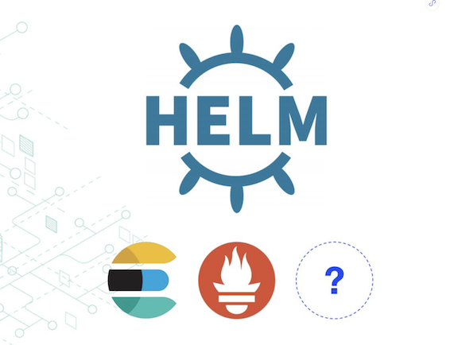
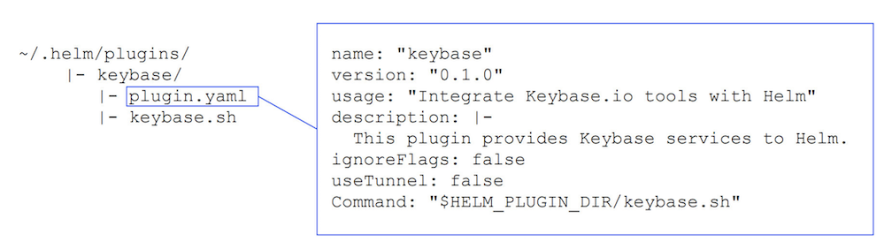
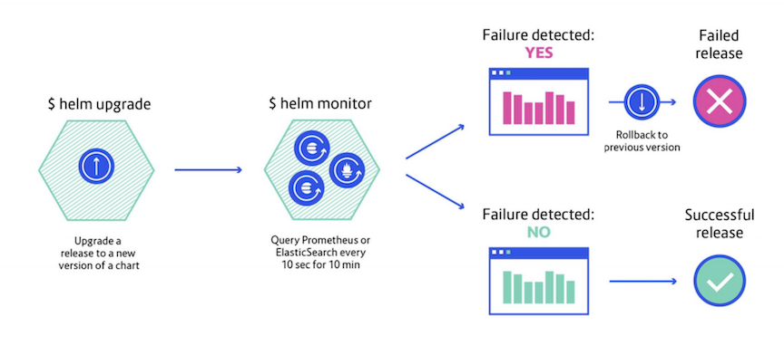
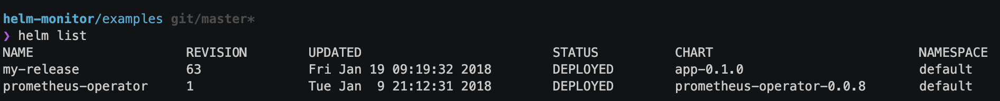
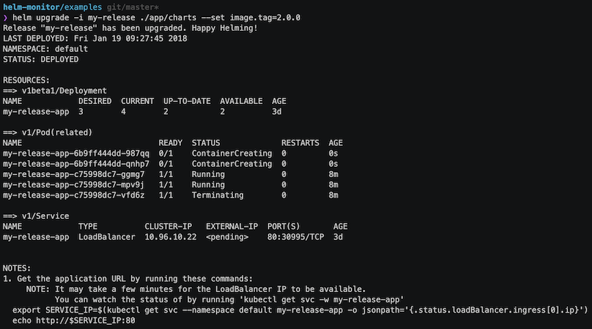
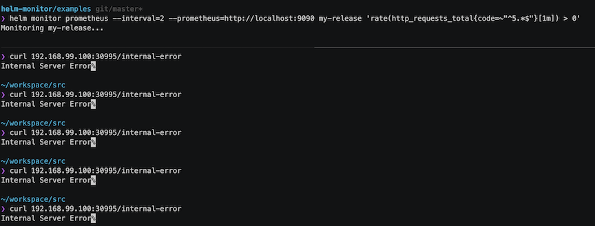
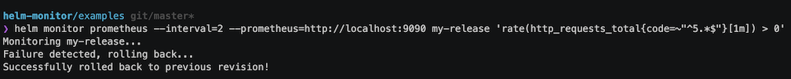

# Helm monitor 插件

### Helm release 基于日志或监控的自动回滚



使用 `Helm` 可以很方便的部署 `Kubernetes` 应用，但是如果对于线上的应用部署或者更新后出现了问题，要及时回滚到之前的版本该如何去做呢？当然我们可以手动通过`kubectl rollout`去进行控制，但是难免需要手动去操作。

**今天给大家介绍一个 `Helm` 的插件 `Helm monitro`，通过监听 `Prometheus` 或 `ElasticSearch` 监控或者日志数据，在发生故障时自动回滚 `release`。**


## Helm 命令

使用 `helm` 命令更新一个 `release`:

```
$ helm upgrade my-release company-repo/common-chart
```

如果需要回滚：

```
$ helm rollback my-release
```

安装 `Helm` 插件：

```
$ helm plugin install https://github.com/repo/name
```

然后可以使用下面命令查看插件使用方法：

```
$ helm foo --help
```

`Helm` 插件文件结构如下：



## Helm monitor

通过 `Helm monitor` 插件监控一个 `release` 示意图如下：



**安装 `Helm monitor` 插件：**

```
$ helm plugin install https://github.com/ContainerSolutions/helm-monitor
```

查看使用方法：

```
$ helm monitor --help

    This command monitor a release by querying Prometheus or Elasticsearch at a given interval and take care of rolling back to the previous version if the query return a non-empty result.

    Usage:
        monitor [command]

    Available Commands:
        elasticsearch query an elasticsearch server
        help Help about any command
        prometheus query a prometheus server
```

**如果在过去5分钟内的5xx错误率超过`0`，则启动回滚：**

```
$ helm monitor prometheus \
--prometheus=http://prometheus \
my-release \
'rate(http_requests_total{code=~"^5.*$"}[5m]) > 0'
```

**需要通过`--prometheus`参数指定 `prometheus server` 的地址，默认连接地址`http://localhost:9090`。**

**使用 `ElasticSearch`, `Lucene Query`，在发现了 `500` 状态码后触发回滚操作：**

```
$ helm monitor elasticsearch \
--elasticsearch=http://elasticsearch:9200 \
my-release \
'status:500 AND kubernetes.labels.app:app AND version:2.0.0'
```

同样需要通过`--elasticsearch`参数指定 `Elasticsearch` 集群的地址，默认连接地址：`http://localhost:9200`。

当然也可以使用一个查询的`DSL`文件进行监控:

```
$ helm monitor elasticsearch my-release ./elasticsearch-query.json
```

除了使用 `Prometheus` 和 `Elasticsearch` 进行监控触发回滚之外，也可以使用`Sentry`：

```
$ helm monitor sentry my-app \
    --api-key <SENTRY_API_KEY> \
    --organization sentry \
    --project my-project \
    --sentry http://sentry:9000 \
    --tag release=2.0.0 \
    --regexp
    'Error with database connection.*'
```

## Demo

`Helm monitor` 插件地址：[https://github.com/ContainerSolutions/helm-monitor](https://github.com/ContainerSolutions/helm-monitor)


```
$ helm list
```



```
$ helm upgrade -i my-release ./app/chatrs --set image.tag=2.0.0
```


### monitor the release



#### Failure detect, rolling back




