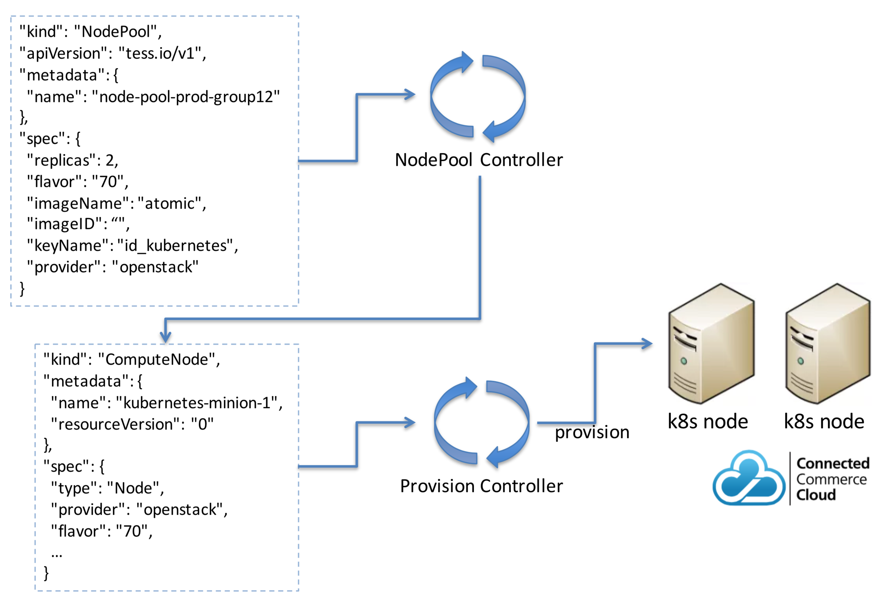

# Kubernetes案例分析 

# 声明式集群管理

## 什么是声明式集群管理?

### 1.通过SEPC(WISB)驱动的集群管理
### 2.基于声明管理集群
### 3.Controller确保集群的实际状态与期望状态一致

##  为什么用声明式集群管理?

1. Kubernetes是声明式管理系统
2. 我们希望kubernetes集群管理本身也是基于声明式管理的， 以便得到下列目的。

* 轻量级管理
* 完全自动化
* 自我管理的集群 
* 扩展性强
 
 
##  声明式CI – S2I build

* `S2I` 是把应用源代码(application source code)作为输入，通过编译，生成镜像(Image)的过程
* ·Builder· 容器化，并定义成为`POD`，以便利用kubernetes的高可用优势


## 声明式CI – BuildSpec


## 声明式cluster 配置


## 声明式扩容



## 声明式持续发布


```
"kind": "ClusterDeployment", 
"apiVersion": "tess.io/v1", 
"metadata": {
"name": "cluster-deployment-13" },
"spec": {
  "saltTarUrl": "", 
  "serverTarUrl": "", 
  "version": "1.13", 
  "strategy": "HalfHalf",
  "clusterAttributes": {
     "name": "cluster-attributes-1.13", 
       "data": {
       "domain_suffix": "xxx",
       "yyy": "zzz" 
       }
} 
}
```

