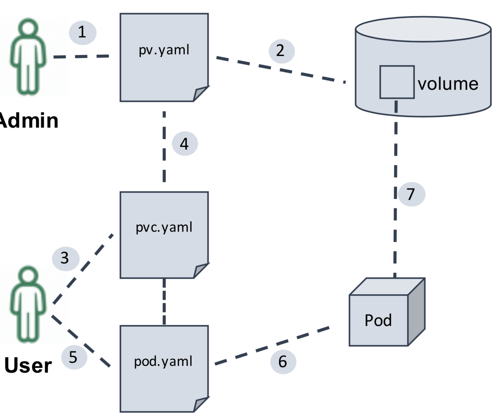
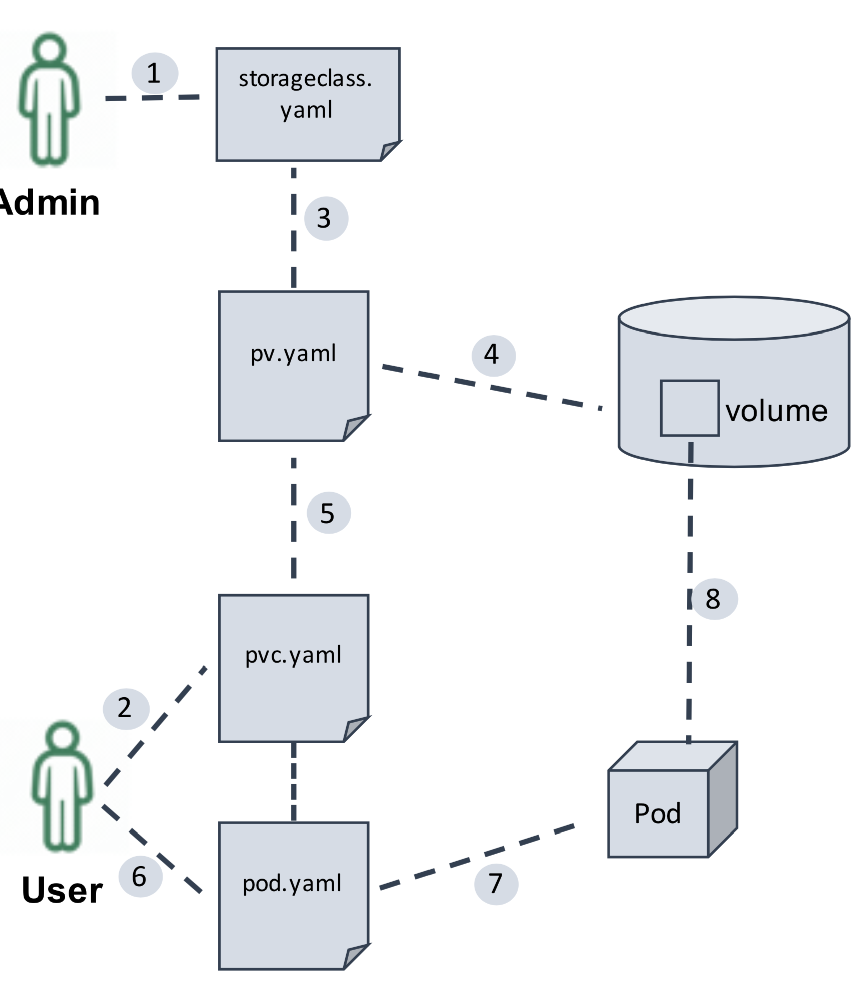
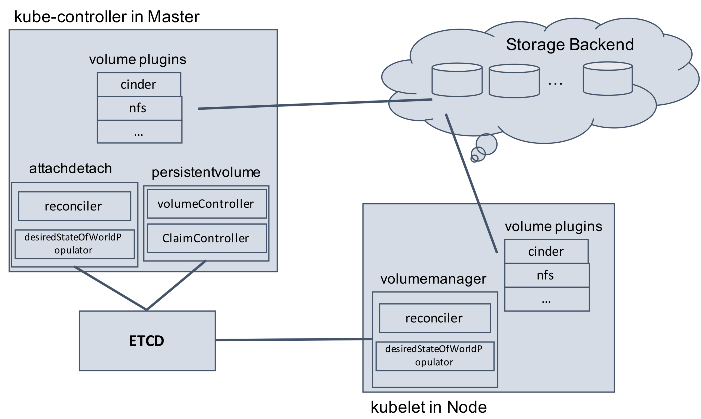
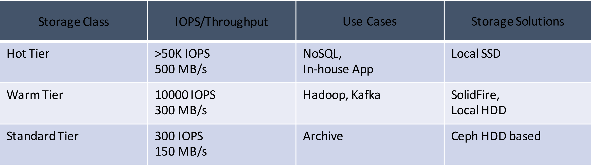
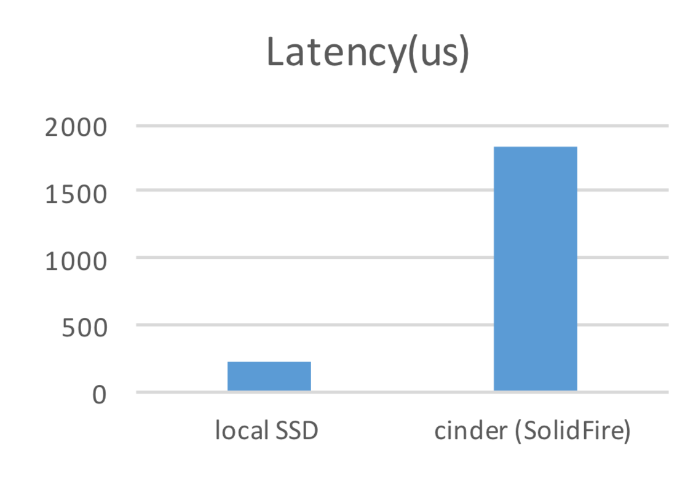
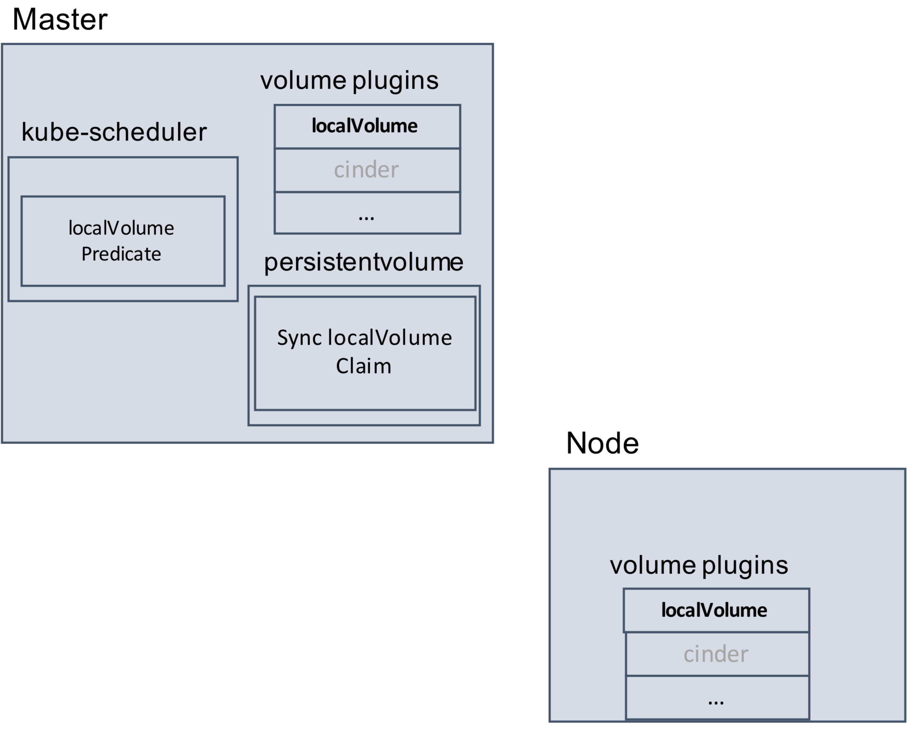
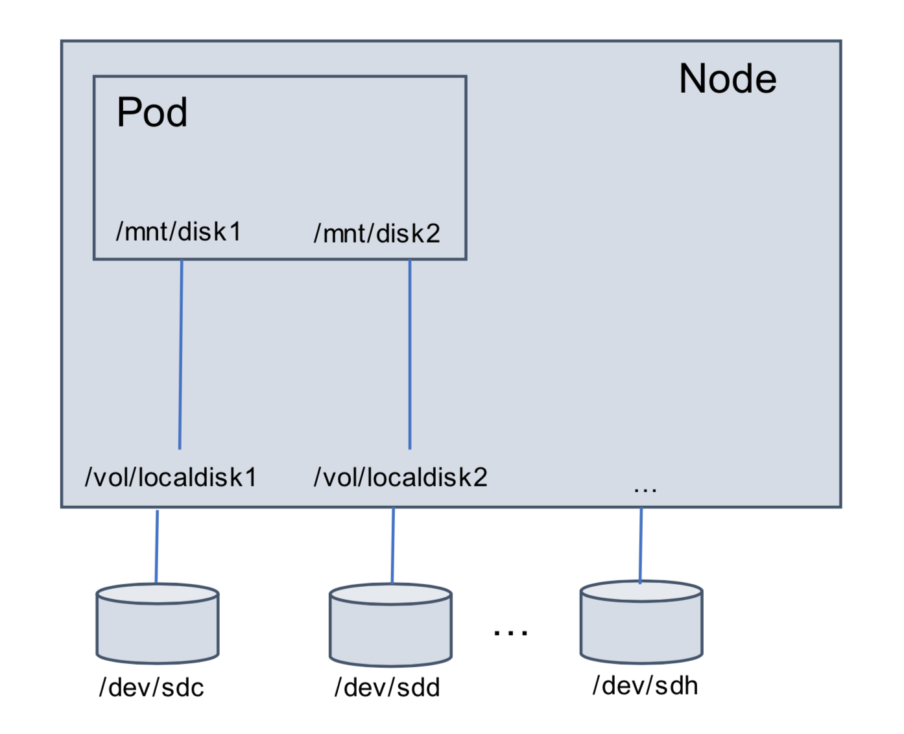
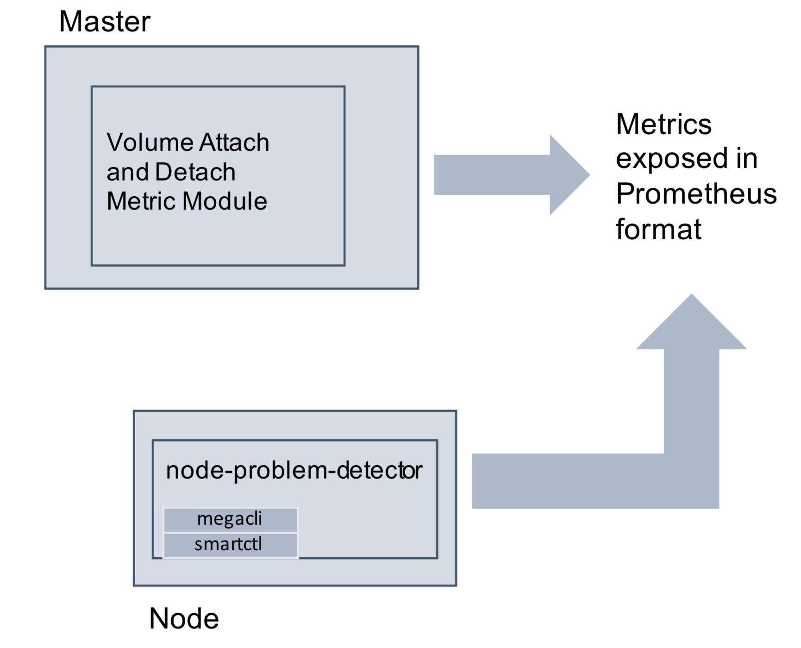

# Kubernetes案例分析 

# 存储管理

## Volumes 插件

### 网络卷

```
cinder 
nfs
iscsi 
rbd
cephfs 
gcePersistentDisk 
awsElasticBlockStore 
flocker
glusterfs 
azureFileVolume 
azureDisk 
vsphereVolume 
Quobyte
```

### 本地卷

```
emptyDir 
hostPath 
localvolume
```

## Expose Kubernetes API

```
secret
downwardAPI
```

```
apiVersion: v1
kind: Pod
metadata:
  name: test-pd
spec:
  containers:
  - image: gcr.io/google_containers/test-webserver
    name: test-container
    volumeMounts:
    - mountPath: /cache
      name: cache-volume
  volumes:
  - name: cache-volume
    emptyDir: {}
```

## PV/PVC

### PersistentVolume (PV)

* 由管理员创建的网络存储块
* 有独立于使用PV的POD的生命周期

### PersistentVolumeClaim(PVC)

* 用户的存储请求
* 可以指定大小和访问模式




## Dynamic Volumes Provisioning

* 当用户收到用户请求时再创建存储快 
* 移除系统管理员提前创建存储的步骤 
* 动态创建基于StorageClasses

```
kind: StorageClass
apiVersion: storage.k8s.io/v1beta1
metadata:
  name: cinder-standard
provisioner: kubernetes.io/cinder
parameters:
  type: standard
```

```
kind: PersistentVolumeClaim
...
volume.alpha.kubernetes.io/storage-class: "cinder-standard"
```




### Kubernetes 存储相关组件




### StorageClass 定义



## 网络卷

### Kubernetes Cinder Volume

### 为什么使用网络卷?

### 两种`storageclass`

* cinder-standard
* cinder-performance

### 稳定性

* Openstack 
* Qemu
* Kubernetes

## 本地存储管理

### 动机

### 与网络卷比较

```
• 性能
• 成本
• 可用性(Availability)
```

### EmptyDir和HostPath的局限性

```
• No PV/PVC support
• No“Guaranteed”,size/IOPS
```



## 本地卷管理

### 本地卷

本地硬盘插件，支持

```
• Disk/Partition 
• LVM
```

`PV/PVC`

动态创建，并定义两个`storageclass`

调度:

```
• Pod调度
• PV分配
```



## 本地卷

```
apiVersion: v1
kind: Pod
metadata:
  name: ld-test
spec:
  containers:
  - image: busybox
    command:
    - sleep
    - "3600"
    imagePullPolicy: IfNotPresent
    name: ld-test
    volumeMounts:
    - mountPath: /mnt/disk1
      name: test-vol1
    - mountPath: /mnt/disk2
      name: test-vol2
  volumes:
    - localVolume:
        type: disk
    name: test-vol1
    - localVolume:
        type: disk 
    name: test-vol2
    restartPolicy: Always   

```
 
 


## 本地卷
 
```
kind: StorageClass
apiVersion: storage.k8s.io/v1beta1metadata:
  name: local-ssd
provisioner: kubernetes.io/local-volume 
parameters:
  type: disk
```

```
apiVersion: v1
kind: PersistentVolumeClaim 
metadata:
  name: myclaim 
  annotations:
    volume.beta.kubernetes.io/storage-class:"local-ssd" 
spec:
accessModes:
- ReadWriteOnce 
resources:
  requests:  
    storage: 100Gi
```

```
apiVersion: v1 
kind: Pod 
metadata:
  name: ld-test 
spec:
containers:
- image: busybox command:
- sleep - "3600" 
imagePullPolicy: IfNotPresent name: ld-test
volumeMounts:
- mountPath: /mnt/vol
  name: test-vol 
volumes:
- PersistentVolumeClaim: 
    claimName: myclaim
  name: test-vol 
restartPolicy: Always
```

### `Local Volume` 回收

### 一个pod需要多个`local volume`

```
annotations:
  volume.beta.kubernetes.io/storage-class:"local-ssd" 
  volume.beta.kubernetes.io/group: '{"name":"group1", "count":"2"}
```

### 反亲和性

```
annotations:
  volume.beta.kubernetes.io/storage-class:"local-ssd" volume.alpha.kubernetes.io/antiaffinity: '{"labelSelector":{"matchLabels":{ "key":"ssdtest" } }, "topologyKey":"kubernetes.io/hostname"}'
```

## 健康检查和监控

### 网络卷

采集`volumeattach`和`detach`的数据

### 本地卷

采集`raidcontroller`工具和磁盘 `smartctl`的信息


 