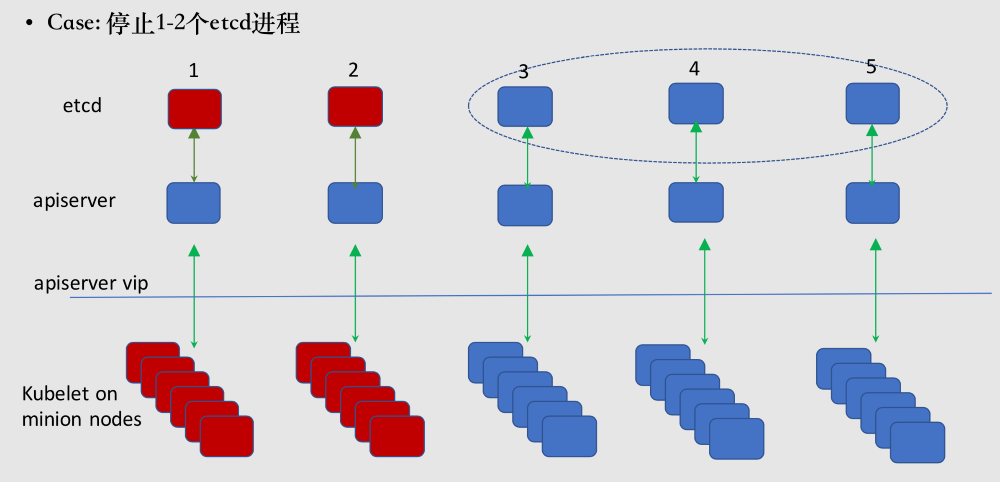
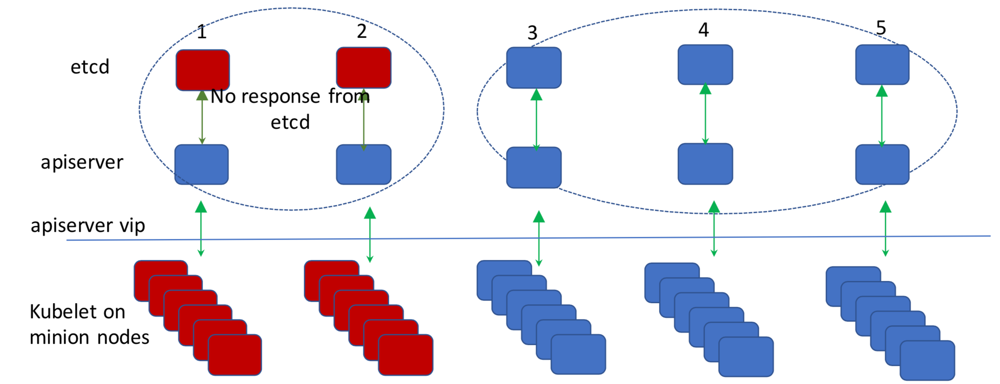
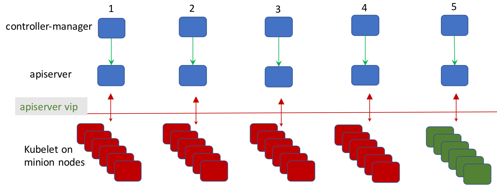
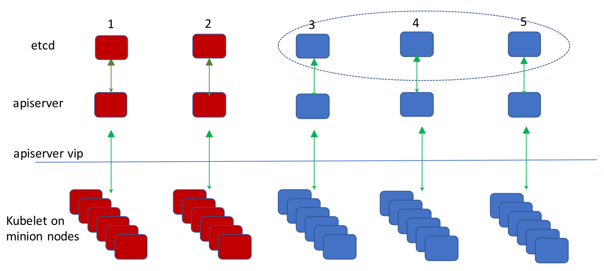
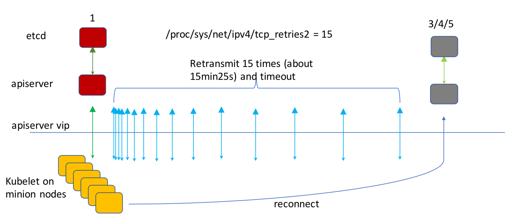
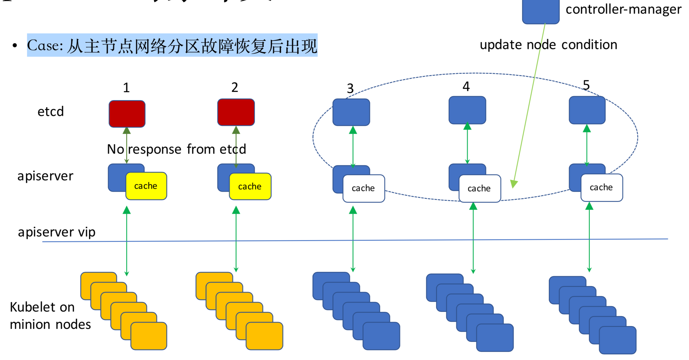
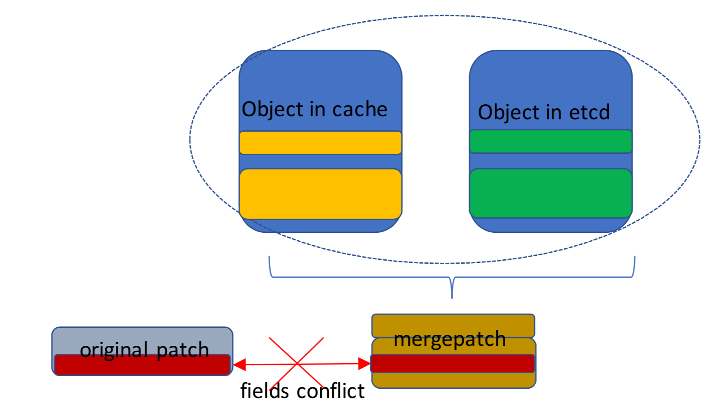

# Kubernetes案例分析 

# 故障测试

## 面临问题

### 影响: 集群会不定期出现`Notready`节点，导致`Pod eviction`，影响用户使用

### 可能原因

* 少数`etcd member down`
* 网络故障，导致主节点出现网络分区
* 负载均衡故障，导致APIServer的LBVIP不可访问 
* 少数masternodedown
* 对象版本冲突

## 少数etcd member down



## 主节点出现网络分区

###  Case: 主节点出现网络分区，etcd分裂成两个小集群

第一组:master-1,master-2

第二组: master-3, master-4, master-5



### 解决方案

### 在`apiserver`中增加`etcd`的`healthcheck `
### `Healthcheck` 从`TCP` 更改为`ECV`

## Apiserver LB vip不可达

### `Case`:`Lb`故障导致`APIServer LB VIP`不可达，但所有节点工作正常



### 解决方案

### `kubelet`和`controller manager`使用同样的`accesspoint`连接`apiserver`

## 少数主节点故障

### Case:关闭`1-2`个主节点



### Case:关闭1-2个主节点




## 解决方案: `client←→apiserver`

### 方案1: 应用层解决方案

```
uses setsockopt to configure socket option "TCP_USER_TIMEOUT" for a tcp connection
```

### 方案2: 系统层面解决

```
set system parameter “/proc/sys/net/ipv4/tcp_retries2” to 8 (default is 15)
```

### 方案3: 修改负载均衡器配置

```
change config option of apiserver LB pool to reject package when service down.
```

## Apiserver 对象冲突

### Case:从主节点网络分区故障恢复后出现




## Apiserver 对象冲突

### Case:从主节点网络分区故障恢复后出现

