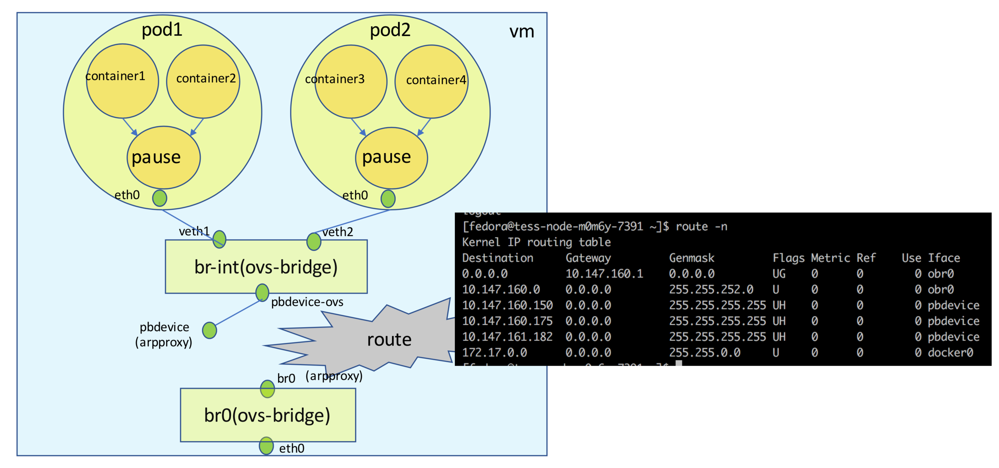

# Kubernetes案例分析 

# 网络

## 基于三层的网络

### 通过物理防火墙隔离不通网络分区(Dev/Prod)


## Kubernetes部署

* 对于`overlay`网络环境，
* `kubernetes`网络也采用`overlay`
* `Pod`和`pod`之间的访问无限制
*  跨`zone`访问需要通过防火墙


## 网络分区

* 定义新的`kubernetes`对象`NetworkZone` 
* 一个`NetworkZone`对象可以跨不同地理位置的多个集群


## 对集群的抽象
 


## Kubenet 插件


## kubenet – 网桥模式


## kubeNet – 路由模式 Network


 
## 基于`OVS`的`kubernetes`网络



## 基于`calico`的`kubernetes`网络


## Kubernetes NetworkPolicy

```
apiVersion:networking/v1
kind:NetworkPolicy
metadata:
  name:test-network-policy
  namespace:default
spec:
  podSelector：
    matchLabels：
      role:db
  ingress:
  - from:
    - namespaceSelector:
        matchLabels
          project:myproject
    - podSelector:
        matchLabels:
          role:frontend
  ports:
  - protocol:tcp
    port:6379    
```

[https://kubernetes.io/docs/concepts/services-networking/networkpolicies/](https://kubernetes.io/docs/concepts/services-networking/networkpolicies/)


