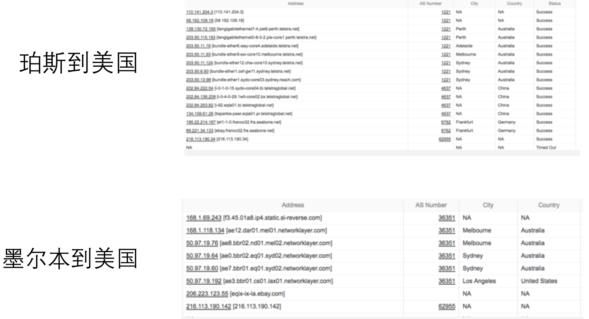

# Kubernetes案例分析 

# Ingress 实践

## Ingress

### 1.`Ingress`是一层代理
### 2. 负责根据`hostname`和`path`将流量转发到不同的服务上，使得一个负载均衡器用于多个后台应用
### 3. `Kubernetes Ingress Spec`是转发规则的集合

## Ingress Controller

### 1.在`kubernetes`领域，确保实际 状态(`Actual`)与期望状态 (`Desired`)一致的组件称为 `controller`

### 2.`Ingress Controller`确保

```
• 负载均衡配置
• 边缘路由配置
• DNS配置
```

## 载均衡技术概览


## kubernetes中的负载均衡技术

### 基于L4的服务

1. 基于四层负载均衡技术
2. 多种`Load Balancer Provider`提供与企业现有 ELB的整合
3. `Kube-proxy`基于`iptables rules`为`kubernetes`形 成全局统一的`distributed load balancer`
4.  `Kube-proxy`是一种`mesh`, `Internal Client`无论通过`podip`，`nodeport`还是`LB VIP`都经由 `kube-proxy`跳转至`pod`

### 基于L7的Ingress

**基于七层，提供更多功能**

```
• TLS termination
• L7 path forwarding
• URL/http header rewrite
```
**与采用7层软件紧密相关**

## Service与Ingress的对比

### 基于L4的服务

* 每个应用独占ELB, 浪费资源
* 为每个服务动态创建DNS记录，频繁的DNS更新
* 支持TCP和UDP，业务部门需要启动HTTPS服务，自己管理证书


### 基于L7的Ingress

* 多个应用共享`ELB`，节省资源
* 多个应用共享一个`Domain`，可采用静态DNS配置
* `TLS termination`发生在`Ingress` 层，可集中管理证书
* 更多复杂性，更多的网络`hop`


## Ingress示例


## 起步: 支撑传统业务
## 目标:
### 1.硬件负载均衡器集成
### 2.DNS集成
### 3.支撑传统的两层负载均衡拓扑

## 传统应用网络拓扑


## 快速构建Ingress Controller

### 支撑现有两层LB的网络拓扑
### 基于开源`nginx/gce controller`
### 明确业务差异


## 三步构建Ingress Controller

### 1.复用`Kubernetes LoadBalancer`接口

```
GetLoadBalancer(clusterName string, service *api.Service) (*api.LoadBalancerStatus, bool, 
error) EnsureLoadBalancer(clusterName string, service *api.Service, members []string) 
(*api.LoadBalancerStatus, error) UpdateLoadBalancer(clusterName string, service *api.Service, 
members []string) (*api.LoadBalancerStatus, error) EnsureLoadBalancerDeleted(clusterName 
string, service *api.Service) error
```

### 2.定义`Informer`，监控`ingress`, `secret`, `service`, `endpoint`的变化，加入相应的队列

```
lbc.ingLister.Store, lbc.ingController = framework.NewInformer( &cache.ListWatch{
ListFunc: ingressListFunc(lbc.client, namespace),
WatchFunc: ingressWatchFunc(lbc.client, namespace), },
&extensions.Ingress{}, resyncPeriod, framework.ResourceEventHandlerFuncs{ AddFunc: func(obj interface{}) {
lbc.ingQueue.enqueueIng(obj) },
})
```

### 3.启动worker，遍历ingress队列

* 为`Ingress Domain`创建`LoadBalancer service`，依赖s`ervice controller`创建`ingress vip` 
* 为`Ingress Domain`创建`DNS A record`并指向`Ingress VIP`
* 更新`Ingress`状态

## 进阶: 软件取代硬件

### 1.基于SLB方案综述
### 2.基于domain的权限管理

### 成本

* 硬件`LB` 价格昂贵
* 固定的`tech refresh`周期

### 配置管理

* LB设备的onboard/offboard由不同team管理 
* 不同设备api不一样，不支持L7 API
* 基于传统的ssh 接口，效率低下
* Flexup/down以及Migration复杂

### 部署模式

* 1+1模式
* 隔离性差


## 堪待解决的问题

### 负载均衡配置

**7层方案: Envoy vs. Nginx vs. Haproxy**
**4层方案: 抛弃传统HLB的支持，用IPVS取代**
 
### 边缘路由配置

**Ingress VIP通过BGP协议发布给TOR**

### DNS配置

**为Ingress VIP配置DNS A record**


##  L4 集群架构


##  L7 集群架构


## 管理域名和路径

### 解决问题:谁能为什么`domain`创建`DNS record`
### 引入新的k8s对象`zone`, `domain`, `path`

* 将domain和path分配给不同业务组
* Domain owner可以为任何subdomain创建L4 pool和dns记录 
* Path owner只能在现有L4 pool上增加L7 rule
* 权限可像RBAC管理一样赋予其他业务组


## 野望: UFES

### 1.Unified Frond End Service
### 2.利用ingresscontroller来优化用户访问路径

## UFES – 堪待解决的问题


## 互联网路径的不确定性



## UFES方案综述


## UFES组件


## 对网络路径的优化


### 不同方案的响应时间对比


