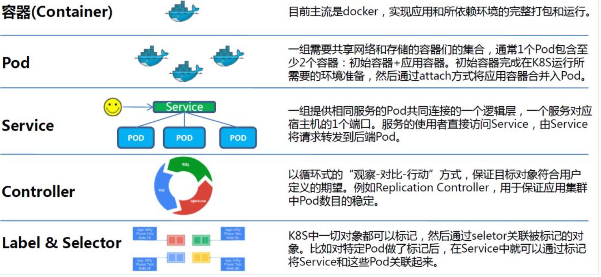
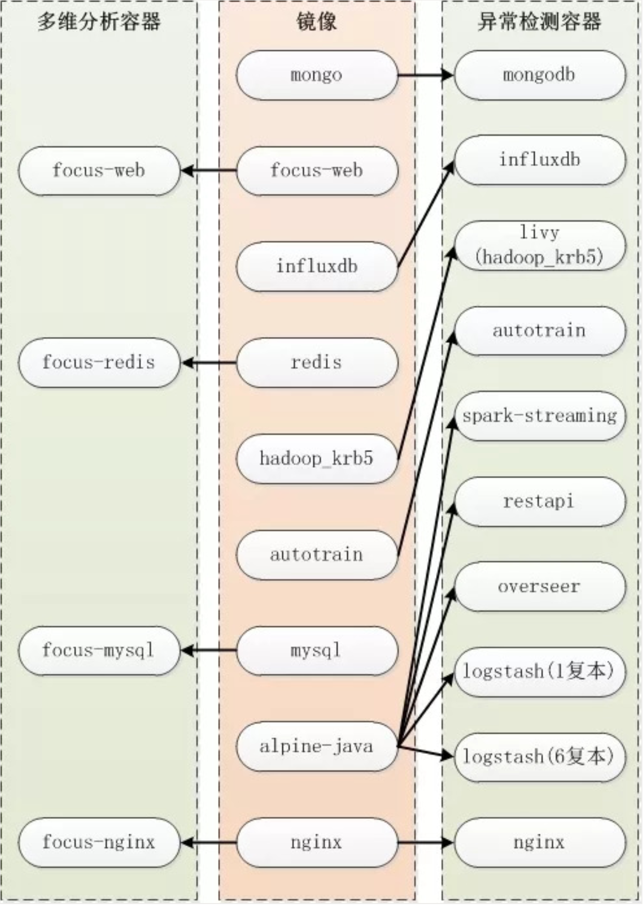
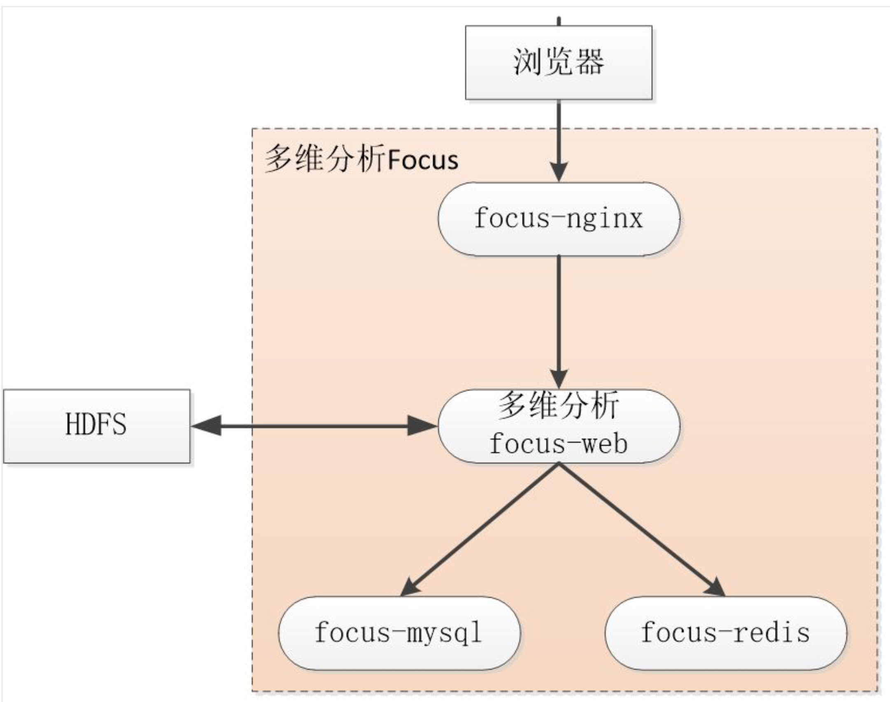
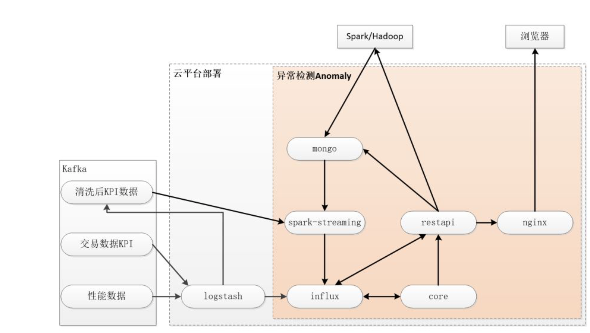

# 民生银行智能运维项目在容器云平台的部署

## 引言

伴随着大数据和机器学习技术的发展，世界已经在全面向智能化迈进。当下，人工智能技术持续不断地向传统行业赋能，改变人类的生活。而在运维领域工程师们也希望借助 `AIOps` 改变IT行业中原有的完全依靠人工经验、重复而枯燥的工作模式，完成从生产运维到技术运营的转变。

## 相关名词

基于机器学习的智能运维项目致力于在科技运维领域，引入大数据技术、机器学习算法、自然语言处理等人工智能领域前沿技术，能够充分利用已有的报警、监控和日志信息构建大数据平台，使用人工智能技术分析大数据，发掘出有用知识，帮助运维工程师更快更准确地发现系统异常、找到问题原因甚至给出解决方案，让运维工作更加高效、准确和智能。

科技运维团队与清华大学实验室合作，搭建多维分析和异常检测平台。此外还结合当前运维痛点，自主研发其他分析工具，如变更检查、工单处理推荐等，更多更好的为运维工程师服务，提高整体运维水平。

## 民生容器云平台

已经有越来越多的应用，特别是创新类应用需要用到容器技术，来实现快速上线、快速迭代、精益控制。传统的应用也需要容器技术的支撑，来实现`DevOps`和`微服务`改造。

我行容器云平台基于`kubernetes`和 `docker` 技术构建，**采用分布式存储提供数据持久化存储能力**，可帮助我们DevOps快速落地，使应用微服务化，提升资源使用效率，实现快速高效的HA切换能力，更有利于应用创新，有利于标准化的配置管理和版本管理，有利于标准化的监控和日志处理。

### docker

`docker`镜像（`Image`）是较精简版的linux虚拟机镜像，以磁盘文件体现，含有操作系统和应用程序，使用Dockerfile文件生成镜像；`docker`容器（`Container`）为实际运行着的镜像，可使用`docker`命令进入容器内部进行操作，修改后的容器若未反向保存为镜像，则容器在删除后，使用镜像再次启动容器时已经启动了新的容器，修改的内容已经丢失；一个镜像可启动N个容器，镜像与容器的关系类似于类和实例的关系。更多知识可参考docker官网。

### k8s客户端

k8s为kubernetes缩写，Google开源容器集群管理系统，使用中重点理解如下概念：

也需了解`yaml`文件语法，`k8s`平台通过`yaml`来配置、管理各个`Pod/Service`等资源

`k8s`客户端工具——`kubectl`（一个二进制文件），可直接复制-粘贴使用。用于连接k8s平台，使用token方式认证客户端，客户端可提交`yaml`文件，管理`pod/service/deployment`等资源，还可进入容器中进行操作。

### Jenkins

基于Java开发的一种持续集成的开源工具，把我们日常开发、测试中重复使用的命令，整理汇总成一条条流水线，使开发、测试、发布自动化，并通过网页显示进度等信息。
本文针对云平台的使用，主要使用Jenkins来管理/提交yaml文件、编译部署容器，从而降低人工维护文件复杂度及操作的重复度。

## 部署流程

假设您已经准备好可发布的应用程序包，我们的目标是将此应用程序部署在云平台中，从而提高后期变更、迁移、维护（如重启）等的效率。因此完整的上线部署关键步骤为：

下文分别讲解各个步骤的关键知识：

### 镜像准备:

docker镜像来源一般有2种：官方或社区（Docker Hub）镜像和自己编译的镜像。

**社区镜像**，可登录Docker Hub (https://hub.docker.com)进行搜索，如`ubuntu/mysql/mongo/redis`等，常用的镜像一般都可以找到。若未找到所需的，可基于这些已有镜像编译自己的镜像。

**自定义镜像**，一般是将应用程序打包在镜像里，在本地电脑或云服务器进行编译生成。

本项目中共使用9个镜像，其中50%为社区镜像，50%为自定义镜像。社区镜像有`mongodb、influxdb、mysql、redis、nginx`，自定义镜像有`focus-web、hadoop_krb5、autotrin、alpine-java`。

针对自定义镜像，主要基于`alpine`、`python`、`jdk`镜像编译生成，镜像清单详见后文。

### 测试云平台应用部署:

当准备好镜像后，则需上线云平台的测试环境进行验证、调试。下文使用znyw表示当前项目的英文编写名称。整个上线云平台的过程如下

1.申请相关账户，**主要为svn账户**、**云平台账户**、**Jenkins账户**。

* `svn`账户：用于上传镜像，jenkins会从svn中下载镜像并上传到DTR（镜像库）中；
* 云平台账户：用于操作云平台资源，如查看容器资源状态、操作容器启停等、操作DTR库等，主要包括DTR（镜像库）账号、k8s的config文本文件；
* `Jenkins`账户用于`jenkins`界面操作。

2.云平台运行环境的相关配置，主要是**DTR仓库创建、密钥制作**。

* **DTR仓库创建**：仓库创建是在DTR的对应组织(znyw)下创建对应的镜像仓库，如nginx.tar镜像包应创建nginx这个仓库名称；
* **密钥制作**：DTR密钥存在DTR服务端，与申请下来的客户端config文件配对使用，密钥需根据config文件制作生成，可使用kubectl小工具制作，也可在jenkins界面中制作。

3.`yaml` 文件语法可参考 `k8s`官网，也可参考我行制定的部署文档。编写好后通过jenkins界面上传保存，当然也可以自行保存，但为达到统一配置管理目的，不建议自行保管。当前主要使用`Deployment`和`Service`两种模板。

4.`jenkins`界面可进行构建编译，当在线修改完`yaml`配置后，可进行重新构建并重启容器。在构建过程中，也可使用`kubectl`客户端工具查看进度，kubectl的常用基本命令有：

1. `Pod/Deploy/Service/`集群情况概述【`kubectl get pod/deploy/svc/quota`】
2. 查询单个描述信息【`kubectl describe pod/deploy/svc 相应名称`】
3. 查看pod日志【`kubectl logs pod的名称`】，即容器运行过程中的日志
4. 查看集群资源情况【`kubectl get quota 集群名称 -o yaml`】
5. 删除某个资源【`kubectl delete pod/deploy/svc 相应名称`】
6. 进入容器【`kubectl exec -it pod的名称 bash`】，假设容器安装了`bash`

## 智能运维项目应用部署

生产云平台应用部署参照测试云平台步骤，但应遵循在测试中调试通过的程序、脚本等资源，应重新编译成新镜像，配置尽量均写到yaml文件中，确保生产的镜像在运行时不再需要手工进入容器进行变更操作，从而提高程序的可维护性。

本项目应用程序按功能可分为两类：**多维分析和异常检测**。因此在部署时容器的名称按此两类进行命名。

### 镜像与容器的对应关系

在云平台中运行的容器，与镜像存在多对一的关系。**同镜像的不同功能容器，是根据应用的配置或运行的程序代码决定的**。其对应关系如下图所示：

* **多维分析模块**（简称`Focus`）共使用`4`个镜像及`4`个容器。
* **异常检测模块**（简称`Anomaly`）使用`6`个镜像及`15`个容器。

### 多维分析部署架构

多维分析`Focus`的架构图如下。主要通过浏览器上传需分析的文件（`csv格式`），然后平台通过机器学习分析，在网页上展现出分析的结果。

### 异常检测部署架构

异常检测`Anomaly` 的架构图如下:

其中“云平台部署”中每一个节点均为一个（或多个复本的）容器。主要包括以下功能：

**实时的异常检测**：后台通过`spark-streaming`实时计算出结果，保存至`influx`中。前端浏览器通过调用api查询influx中异常结果数据。

**自动发现KPI配置**：将`influx`中`KPI`结果与`mongo`中`KPI`配置对比，发现新增的KPI配置，再调api将新配置保存至mongo中。

**异常告警及根因定位**：查询`influx`中异常检测结果，若存在符合配置要求的告警（配置数据在`mongo`中，由人工设定），则发送邮件通知，并触发异常定位，调`api`，通过`spark`集群计算，找到与此异常相关的服务器信息。

**自动更新模型**：会定期（时间由人工设定）调`api`，使用`spark`集群进行模型训练，并将新模型保存至`mongo`中，保证模型的及时更新。

**mongo**：保存了存KPI/训练模型/异常信息

## 常见问题

### 1. `jenkins`构建过程中显示`Pod`状态为非 `Running`状态

可使用 `describe` 和 `logs`两个命令结合，查看`pod`在启动过程中的详细报错信息。主要原因可能有：

1. 容器的启动脚本在执行时异常了，导致容器自动退出。可先在启动脚本中写个死循环，循环体内`sleep`一下（也可使用`tail -f`命令），确保容器不会主动退出，然后再进入容器中，手工执行脚本，检查错误原因。
2. DTR密钥不正确。需按文档中步骤重建DTR密钥。

### 2. 构建后`Pod`一直未显示在`get pod`的列表中

可先查看`deploy`，是否`Deployment`部署成功。再看`DESIRED`数目是否与`CURRENT`数目一致，若不一致，则很可能是当前项目的所有部署的`yam`l文件中申请/限制的计算资源（即CPU和内存）的总和超过云平台资源的设定。

* 资源限制规则一：`yaml`中`requests`的数量总和不能超过项目集群的50%。
* 资源限制规则二：单个`yaml`中`limits`不能超过单个虚拟机的70%。

**例如本项目申请2台虚拟机（每台`8C/32G`），则正在运行的yaml文件的`requests`总和不能超过`8C/32G`，单个`yaml`中`limits`不能超过`5.6C/22G`。**

最后可视情况进行扩容或缩小资源使用情况。
