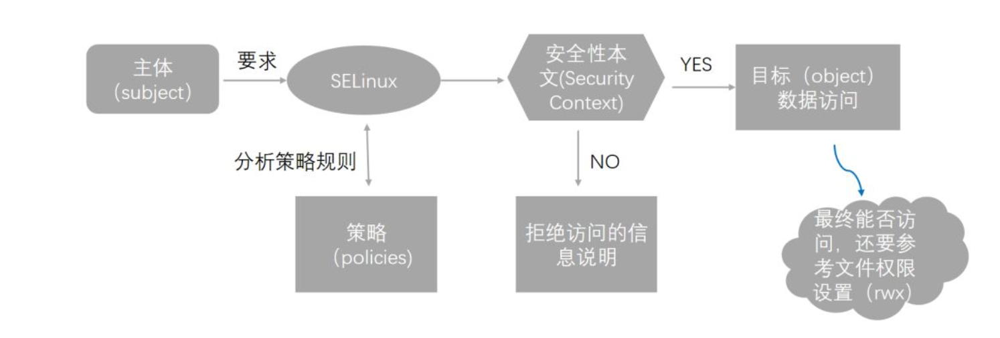

# 浅谈Docker安全性支持(二）

## `User Namespace`隔离

`Linux` 命名空间为运行中的进程提供了隔离，限制他们对系统资源的访问，而进程没有意识到这些限制。

### 为防止容器内的特权升级攻击的最佳方法是将容器的应用程序配置为非特权用户运行，对于其进程必须作为容器中的 `root `用户运行的容器，可以将此用户重新映射到 `Docker` 主机上权限较低的用户。映射的用户被分配了一系列 `UID`，这些` UID `在命名空间内作为从 `0` 到 `65536` 的普通 `UID` 运行，但在主机上没有特权。

重新映射由两个文件处理：`/etc/subuid` 和 `/etc/subgid`，其中前者关注**用户 ID** 范围，后者关注**用户组 ID** 范围。

例如，如下 `/etc/subuid` 中的条目：

```
testuser:231072:65536
```

这意味着 `testuser` 将从 `231072` 开始，在后面的 `65536` 个整数中按顺序为用户分配一个 `ID`。例如，命名空间中的 `UID 231072` 映射到容器中的 `UID 0（root`），`UID 231073` 映射为 `UID`

1，依此类推。如果某个进程尝试提升特权到命名空间外部，则该进程将作为主机上无特权的高数字 `UID` 运行，该 `UID` 甚至不映射到真实用户，这意味着该进程完全没有主机系统的权限。

在`Docker1.10`以后，可以通过在`Dockerd`启动参数中指定`userns-remap` 来启用这个功能 

下面我们做一下演示：

1、查看`Docker Daemon`是否以`root`用户身份运行

```
$ ps -ef | grep dockerd
root       906     1  0 Sep12 ?        00:06:57 /usr/bin/dockerd-current --add-runtime docker-runc=/usr/libexec/docker/docker-runc-current --default-runtime=docker-runc --exec-opt native.cgroupdriver=systemd --userland-proxy-path=/usr/libexec/docker/docker-proxy-current --init-path=/usr/libexec/docker/docker-init-current --seccomp-profile=/etc/docker/seccomp.json --selinux-enabled --log-driver=journald --signature-verification=false --storage-driver overlay2
vagrant  25283 25258  0 16:20 pts/0    00:00:00 grep --color=auto dockerd
```

* -e - show all processes, not just those belonging to the user
* -f - show processes in full format (more detailed than default)

2、运行容器，指定 id 命令

```
$ docker run --rm alpine id
uid=0(root) gid=0(root) groups=0(root),1(bin),2(daemon),3(sys),4(adm),6(disk),10(wheel),11(floppy),20(dialout),26(tape),27(video)
```

上面输出的最后一行显示容器以`root`身份运行：`uid = 0（root）`和`gid = 0（root）`。

3、执行`docker run` 指定参数`--user` ，指定容器以当前用户身份来运行

```
$ id
uid=1000(vagrant) gid=1000(vagrant) groups=1000(vagrant),1001(docker)
```

```
docker run --rm --user 1000:1000 alpine id 
uid=1000 gid=1000
```

可以看到容器使用的我们设置的用户和组来运行。

有时候，我们更希望容器里面是以`root`用户来运行，但是并不需要具有宿主机上`root权限`，可以使用`User Namespace`做到这些。

### 使用`User Namespace`，容器中的`root`用户会被重新映射到宿主机上一个非特权用户，这意味着该进程完全没有主机系统的权限。

下面我们带大家一起演示一下：

1、停止`Docker Daemon`

```
sudo systemctl stop docker
```

2、指定在`User Namespace`模式下运行`Docker Daemon`

```
sudo dockerd --userns-remap=default &
```

当你将 `Docker` 配置为使用 `userns-remap` 功能时，可以指定为现有用户或组，也可以指定为 `default`。如果指定为`default`，则会为此创建并使用用户和组 d`ockremap` 。也可以在 `daemon.json` 配置文件中指定。

通过 id 命令验证 Docker 已经创建了这个用户

```
id dockremap
uid=123(dockremap) gid=132(dockremap) groups=132(dockremap)
```

验证条目已经添加到了 `/etc/subuid` 和 `/etc/subgid` 文件中。

```
$ grep dockremap /etc/subuid
dockremap:165536:65536

$ grep dockremap /etc/subgid
dockremap:165536:65536
```

如果这些条目不存在，需要以 `root` 用户身份编辑文件，并且分配起始的 `UID` 和 `GID`（在最高的已经分配的值的基础上加上偏移，`65536`）。注意不要使范围重叠。

3、使用 `docker info` 命令验证`Docker`是否正确启用了用户命名空间支持

```
$ docker info
...
Docker Root Dir: /home/docker/165536.165536
...

$ ls -ld /home/docker/165536.165536
drwx------ 14 165536 165536 4096 Sep 17 21:44 /home/docker/165536.165536

$ sudo ls -l /home/docker/165536.165536/
total 48
drwx------ 2 165536 165536 4096 Sep 17 21:44 volumes
drwx--x--x 3 root root 4096 Sep 17 21:44 containerd
drwx------ 2 165536 165536 4096 Sep 17 21:44 containers
drwx------ 3 root root 4096 Sep 17 21:44 image
drwxr-x--- 3 root root 4096 Sep 17 21:44 network
drwx------ 4 165536 165536 4096 Sep 17 21:44 overlay2
...
```

可以看到Docker 工作目录在原有`/var/lib/docker/` 目录下多了一层以`“用户UID.GID”`命名的目录。查看该目录下各个子目录权限，有些子目录仍有 `root` 拥有，有些子目录已经继承了上级目录权限。

4、查看本地镜像

```
$ docker images
REPOSITORY TAG IMAGE ID CREATED SIZE
```

可以看到本地没有任何镜像，很奇怪，我们在上面使用的`alpine`镜像消失了

5、下面我们以交互模式运行一个容器，将宿主机的`/bin`目录挂载到容器

```
$ docker run -it --rm -v /bin:/host/bin busybox /bin/sh
Unable to find image 'busybox:latest' locally
latest: Pulling from library/busybox
8c5a7da1afbc: Pull complete 
Digest: 
sha256:cb63aa0641a885f54de20f61d152187419e8f6b159ed11a251a09d115fdff9bd
Status: Downloaded newer image for busybox:latest
/ # id
uid=0(root) gid=0(root) groups=10(wheel)
/ #
```

上面的输出显示容器内部是以root用户的安全上下文下运行。

6、下面我们尝试执行命令

```
/ # rm /host/bin/sh
rm: can't remove 'sh': Permission denied
```

操作失败并显示权限被拒绝，这是因为要删除的文件存在于`Docker`宿主机的本地文件系统中，并且容器在其所在的命名空间之外没有`root`访问权限。如果未启用`User Namespace`，执行相同的操作，操作将成功。

## SELinux支持

我们知道系统的用户主要分为系**统管理员与一般用户**，

### 1.而这两种身份能否使用系统文件资源与 `rwx` 的权限设置有关，这种存取文件系统的方式被称为`“自主式存取控制（DAC）”`。

### 2.不过你要注意的是，各种权限设置对 `root` 是无效的，这个时候就可以使用`委任式存取控制（MAC`）了，使用`MAC`可以针对特定的程序与特定的文件资源来进行权限的控管，也就是说，即使是`root`用户，那么在使用不同的程序时，你所能取得的权限并不一定是`root`，而要根据当时程序的设置而定。

`SELinux` 就是通过 `MAC` 的方式来控管程序，他控制的主体是程序， 而目标则是该程序能否读写的“文件资源”。下面是使用`SeLinux`基本流程：



由上图我们可以发现：

(1) 主体程序必须要通过 `SELinux` 政策内的规则放行后，就可以与目标资源进行安全性本文的比对。

(2) 比对安全性本文，比对成功就可以访问目标，比对失败，记录拒绝信息。

* `Enforcing 模式`：**将受限主体进入规则比对、安全本文比对，如果失败，抵挡主体程序的读写行为，并且记录这一行为。 如果成功，这才进入到 `rwx` 权限的判断**。

* `Permissive模式`：**不会抵挡主体程序读写行为，只是将该动作记录下来**。

* `Disabled 的模式`：禁用SELinux，直接去判断 `rwx`。


`Docker`守护进程的`SELinux`功能默认是禁用的，需要使用`--selinux-enabled`来启用，容器的标签限制可使用-`security-opt`加载`SELinux`或者`AppArmor`的策略进行配置。

下面演示使用`SELinux`：

1、我们在宿主机上开启 `SELinux`，尝试启动一个 `Nginx` 容器并将 `nginx.conf` 挂载到容器内。

```
# 查看系统Selinux是否开启，及当前模式，policy

$ sestatus
SELinux status:                 disabled

# Docker开启Selinux

$ ps -ef|grep dockerd
root       906     1  0 Sep12 ?        00:06:59 /usr/bin/dockerd-current --add-runtime docker-runc=/usr/libexec/docker/docker-runc-current --default-runtime=docker-runc --exec-opt native.cgroupdriver=systemd --userland-proxy-path=/usr/libexec/docker/docker-proxy-current --init-path=/usr/libexec/docker/docker-init-current --seccomp-profile=/etc/docker/seccomp.json --selinux-enabled --log-driver=journald --signature-verification=false --storage-driver overlay2
root     26116 26091  0 17:02 pts/0    00:00:00 grep --color=auto dockerd


# 运行一个容器，将本地nginx.conf文件挂载到容器中

# docker run --name test-selinux-nginx -v /root/nginx/conf/nginx.conf:/etc/nginx/nginx.conf -d nginx
bbef34e4caa4e8c3a19f9eae5859691e3504731568e7e585108e26aade95be76
```

使用 `docker ps` 查看容器状态，容器已经退出，退出日志为“Permission denied”

```
$ docker ps -a
CONTAINER ID IMAGE COMMAND CREATED STATUS PORTS NAMES
bbef34e4caa4 nginx "nginx -g 'daemon of…" 15 seconds ago Exited (1) 13 seconds ago test-selinux-nginx

$ # docker logs -f bbef34e4caa4
2018/09/17 15:16:02 [emerg] 1#1: open() "/etc/nginx/nginx.conf" failed (13: Permission denied)
nginx: [emerg] open() "/etc/nginx/nginx.conf" failed (13: Permission denied)
```

可以看到错误信息好像是权限被拒绝，那么我们检查一下`nginx.conf` 的权限是否符合我们的要求。

使用 `ls -Z` 查看 `nginx.conf`的 `DAC` 与 `MAC` 权限信息。

```
ls -Z
-rw-r--r--. root root unconfined_u:object_r:admin_home_t:s0 nginx.conf
```

文件的权限为 `644`。我们在上面查看 `Docker` 进程，`Docker` 进程的权限为 `root`，对于`644`的权限文件是可读可写的。 看来，问题应该是出在 `MAC` 权限上。

### 分析 `ls -Z` 的结果，`nginx.conf` 对应的安全性文本的类型为 `admin_home_t:s0`，在启用SELinux后，我们的主体是无法操作这种类型的object的，所以无论 `Docker` 容器的权限是否是 `root`，`Docker` 容器进程都没有权限读取宿主上的 `nginx.conf`。

Docker 官方提供了一种解决方案专门用来解决与 `SELinux` 相关的权限问题，在将 `SELinux` 上的文件挂载到容器中时，在挂载的路径最后加上`:z`。如：

```
docker run -v /var/db:/var/db:z rhel7 /bin/sh
```

Docker 会自动将被挂载的宿主目录的安全性文本配置为目标可读。

```
# docker run --name test-selinux-z-nginx -v /root/nginx/conf/nginx.conf:/etc/nginx/nginx.conf:z -d nginx
db49bbe352ff1ab800274a17fd18f9c7d86c281e60ac3ffa36ba14e12949285d

# docker ps
CONTAINER ID IMAGE COMMAND CREATED STATUS PORTS NAMES
db49bbe352ff nginx "nginx -g 'daemon of…" 5 seconds ago Up 2 seconds 80/tcp test-selinux-z-nginx
```

这个时候看到Nginx正常启动了，说明SELinux审核通过了。

## pid-limits的支持

### `Linux`内核会限制所有进程可以打开的文件总数，同时为了防止某个进程消耗过多文件资源，也会对单个进程设置限制，这个时候`ulimit`就派上了用场，使用`ulimit`命令可以限制进程最多打开文件句柄数、最多打开进程数、线程栈大小等等。

`Docker`对`ulimit`也提供了支持，`Docker 1.6`之前，Docker容器的`ulimit`设置，继承自`Docker daemon`，`Docker 1.6`之后，既可以设置全局默认的`ulimit`，也可以对单个容器指定`ulimit`。

如下，指定容器最多可打开文件句柄数为2048，最多打开100个进程。


```
$ docker run -it --ulimit nofile=2048 --ulimit nproc=100 busybox sh 
/ # ulimit -a
-f: file size (blocks) unlimited
-t: cpu time (seconds) unlimited
-d: data seg size (kb) unlimited
-s: stack size (kb) 8192
-c: core file size (blocks) unlimited
-m: resident set size (kb) unlimited
-l: locked memory (kb) 64
-p: processes 100
-n: file descriptors 2048
-v: address space (kb) unlimited
-w: locks unlimited
-e: scheduling priority 0
-r: real-time priority 0
/ #
```

## 容器进程数限制坑介绍

说起进程数限制，大家可能都知道`ulimit`的`nproc`这个配置，`nproc`是存在坑的，与其他`ulimit`选项不同的是，`nproc`是一个以用户为管理单位的设置选项，即他调节的是属于一个用户`UID`的最大进程数之和。如下面输出：

```
# 我们使用daemon用户启动4个容器，并设置允许的最大进程数为3
$ docker run -d -u daemon --ulimit nproc=3 busybox top
$ docker run -d -u daemon --ulimit nproc=3 busybox top
$ docker run -d -u daemon --ulimit nproc=3 busybox top
# 这个容器会失败并报错，资源不足
$ docker run -d -u daemon --ulimit nproc=3 busybox top
```

我们指定使用`daemon`用户来在容器中启动`top`进程，结果启动到第`4`个容器的时候就报错了。而实际上，我们本来是想限制每个容器里用户最多只能创建`3`个进程。另外，默认情况下，`Docker`在容器中启动进程是以`root`用户身份启动的，而`ulimit`的`nproc`参数是无法对`root`用户进行限制。

Docker从1.10以后，支持为容器指定`--pids-limit` 限制容器内进程数，和容器里用户无关。如下面例子：

```
$ docker exec -ti test-pids-limit sh
/ # ps -ef
PID   USER     TIME  COMMAND
    1 root      0:00 top
    5 root      0:00 sh
    9 root      0:00 ps -ef
/ # nohup top &
/ # nohup: appending output to nohup.out
 nohup top &
/ # nohup: appending output to nohup.out
nohup top &
/ # nohup: appending output to nohup.out
 nohup top &
sh: can't fork: Resource temporarily unavailable
```
容器启动参数中，我们通过--pids-limit设置容器里最多只能运行5个进程，可以看到，当进程数达到5个后，在启动进程时就提示`can't fork: Resource temporarily unavailable`。

## 其他内核安全特性工具支持


在容器生态的周围，还有很多工具可以为容器安全性提供支持。

1、可以使用 docker-bench-security检查你的Docker运行环境，如Docker daemon配置，宿主机配置

2、使用Sysdig Falco（地址：https://sysdig.com/opensource/falco/）可以监视容器的行为，检测容器中是否有异常活动。

3、使用GRSEC 和 PAX来加固系统内核，还可以使用GRSecurity为系统提供更丰富的安全限制。等等。


