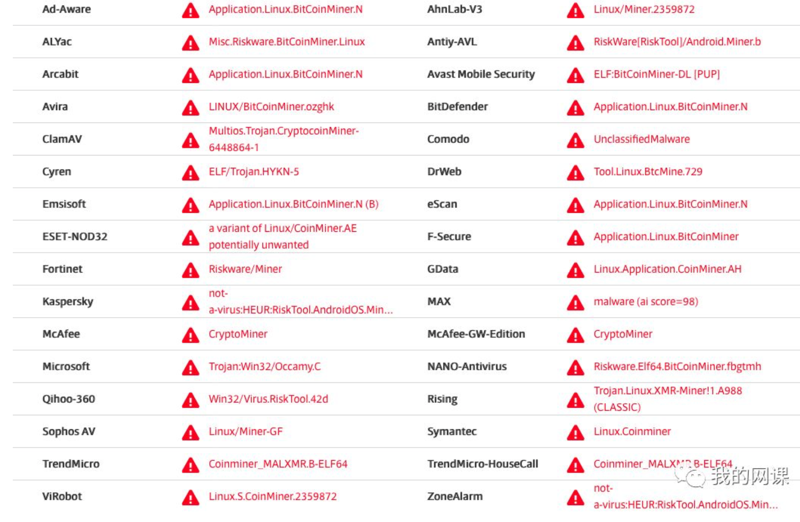

# Kubernetes集群节点被入侵挖矿

首先发现几个`Docker`进程的`CPU`飙升：

### [top command to check machine CPU](https://github.com/Chao-Xi/JacobTechBlog/blob/master/ops/top_command.md) 

### `top`


`Docker`突然占用了这么多`CPU`，咋回事？`Docker`又有什么大`Bug`了吗？

**看了一下这几个进程，有点诡异：**

### `ps aux | grep docker`


程序文件是`/tmp/docker`，父进程号是`1`，可是`/tmp`目录中找不到`docker`文件。

考虑到`docker`、`kubelet`利用了众多的特性，经常搞点没见过的场面出来，此时，还不敢断定是外部因素。

找不到程序文件，没招，只能去扒内存。

查看了下进程的内存地址：

### `sudo pmap -XX 16210`


### [然后用gdb将内存dump出来](https://sourceware.org/gdb/onlinedocs/gdb/Dump_002fRestore-Files.html)：

查看了下内存数据，在里面发现几个域名：


### 内存的内容分析，就交给专业人士处理了。`www.xmrig.com`，这个域名被重定向到挖矿程序github首页，`/tmp/docker`是来自于外部的，确定无疑。


问题的关键是，它怎么进来的？洞堵不住，做啥都白搭。

### 鉴于`Github`已经有人提到是`kubelet`开的后门，重点筛查了一下`kubelet`的日志。

### `journalctl -xeu kubelet`


这不典型地从公网拉取脚本运行嘛。

把脚本拿下来瞅了眼，果然如此


在网上的一篇文章里，看到有人对这个问题进行了分析，不过他们发现的是另一套脚本，估计是不同的人在利用同一个漏洞。

### 我们按照脚本中的方式获取了被更名为`docker`的`xmrig_64`文件和`k.conf`文件。提交检测



我们的紧要任务是找到入侵路径，尽快封堵。

中招的机器担负有特殊的任务，是具有公网`IP`的，做了下端口探测，悲催。`10250`和`10255`从公网可以访问：

```
sudo netstat -lntp | grep kubelet
```

可是我们配置的监听地址是内网地址，没有错～


这涉及到使用云主机的时候，需要特别注意的一个问题。

做过云计算的都知道，`Floating IP`是特别的，在虚拟机里看不到它，但通过它可以访问到虚拟机。中招的机器正是一台绑定了`Floating IP`的云主机。

因此，虽然`kubelet`的监听地址是正确的，并没有因为失误配置成`0.0.0.0`，但通过公网`IP`一样能够访问。

我们的防火墙策略不够精细，被钻了空子。

而组件的漏洞在`Github`上已经有讨论了，认为是`kubelet`的认证缺陷，使匿名用户能够操作`kubelet`。


我们将对此进行验证，当前的处置方式是：

```
对网络防火墙的策略进行全面梳理，阻断从公网发起的对特殊端口的访问
没有访问需求的内网机器对特殊端口的访问，也要进行阻断
中招的机器隔离下线（已经被root，完全不可信了）
对内网所有机器进行排查
```
### Kubernetes节点有对外开放需求的，建议赶紧筛查一下日志，看看有没有中招。通过这个漏洞，拿到的是root权限，用来进行动静很大的挖矿，其实是很浪费的。完全可以消灭一切痕迹，安心蛰伏，或者将数据加密进行勒索。

有些事再怎么细致地去做，都不过分，这次中招暴露了不少的问题。

我们那台不幸的机器上发现了669条入侵日志。。。


