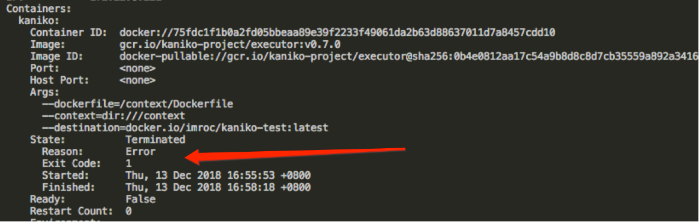
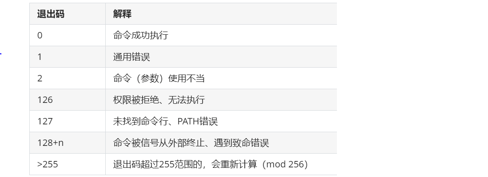

# Kubernetes 问题定位技巧：分析 ExitCode

使用 `kubectl describe pod` 查看异常的 `pod` 的状态，在容器列表里看 `State` 字段，其中 `ExitCode` 即程序退出时的状态码，正常退出时为`0`。如果不为`0`，表示异常退出，我们可以分析下原因。



## 退出码历史

退出码的历史可以追溯到Unix操作系统的早期。在Unix系统中，进程退出码是进程终止时向其父进程传递的一个整数值，用于表示进程的终止状态。这个整数值通常在0到255之间，其中0表示进程成功终止，其他值通常用来表示不同的错误或异常情况。


进程退出码最初被设计用于提供一种简单的机制，使父进程能够了解子进程的执行结果。这使得父进程能够根据子进程的退出码来采取适当的行动，比如处理错误情况或继续执行其他操作。

在Unix系统中，特定的退出码值通常具有特定的含义，例如：


* 0：表示成功执行，没有错误。

* 1：通常表示通用的错误。

* 2：表示命令的语法错误。

* 127：表示命令未找到。


随着时间的推移，Unix操作系统的发展和不同的实现，进程退出码的含义可能有所不同，但基本的概念保持不变。

在Linux系统中，进程退出码的使用与Unix系统类似。Linux继承了Unix的进程管理机制，并在其基础上进行了扩展和改进。因此，Linux中的进程退出码仍然是一个重要的概念，用于帮助理解和诊断进程的执行状态。

进程退出码的历史可以追溯到早期的Unix系统，是Unix和Linux操作系统中的一个重要概念，为进程间通信提供了一种简单而有效的机制。


当应用程序或命令因致命错误而终止或执行失败时，将产生 128 系列退出码（128+n），其中 n 为信号编号。n 包括所有类型的终止代码，如 SIGTERM、SIGKILL 等。

### 退出码 127

退出码 127 不是特定于 Kubernetes 的错误代码，而是 Linux 和类 Unix 操作系统中使用的标准退出码。当然，我们在Kubernetes中经常看到它，并且通常表示容器内执行的命令或二进制文件找不到。

一些标准的退出码包括：



### 常见原因

让我们看一下退出码 127 的一些常见原因：

**1 命令或二进制文件未安装**

Kubernetes 容器的 command 字段中指定的可执行文件未安装在容器的文件系统中。需要确保所需的二进制文件或命令可用。

**2 路径或命令不正确**

Pod 定义中指定的命令不正确或在指定的路径中不存在。这是错误的最常见原因之一，通常是由于 Dockerfile 或 pod  spec中的entrypoint或command输入不正确造成的。

**3 缺少依赖**

在容器内运行的应用程序或脚本未安装相关依赖。需要确保所有必需的依赖项包含在容器映像中。

**4 shell 解释器**

如果指定了脚本作为命令，需要确保脚本有效 （例如#!/bin/bash），且在容器中可用。

**5 shell 脚本语法错误**

如果 shell 脚本退出码是127，请检查脚本是否存有语法错误或可能阻止其执行的问题。

**6 权限不足**

在容器内运行命令的用户可能没有执行指定命令所需的必要权限。确保容器以适当的特权运行。

**7 镜像兼容性问题**

确保使用的容器镜像与宿主机架构和操作系统兼容。不匹配的映像可能导致命令找不到，比如x86的镜像运行在arm的机器上

**8 卷挂载**

如果命令是卷挂载的文件，请检查卷挂载是否配置正确，且所需的文件可以被访问到。

**9 环境变量**

一些命令可能依赖于特定的环境变量。确保必需的环境变量设置正确。


**10 Kubernetes RBAC 策略**

 如果启用了RBAC，需要确保具有执行指定命令所需的权限。


### 如何排查

要排除问题，可以使用以下命令检查 Pod 的日志：

```
kubectl logs -f <pod-name>
```

还可以检查 Pod 状态，该状态提供有关 Pod 的详细信息，包括其当前状态、最近事件和任何错误消息。

```
kubectl describe pod <pod-name>
```

还可以为把调试容器attach到Pod 中，该容器包括一个 shell（例如 BusyBox）。这允许您进入容器并手动检查环境、路径和命令的可用性。

使用 BusyBox 进行调试的示例：

```
containers:
  - name: my-container
    image: my-image:latest
    command: ["/bin/sleep", "infinity"]
  - name: debug-container
    image: busybox:latest
    command: ["/bin/sh"]
    tty: true
    stdin: true
```

如果是高版本K8s，也可以使用Ephemeral Containers，它就是一个临时容器。


这是一个自Kubernetes v1.16中作为alpha引入的新功能，启用临时容器的特性也非常简单，在kubernetes v1.16之后的版本中将启动参数`--feature-gates=EphemeralContainers=true`配置到`kube-api`和`kubelet`服务上重启即可。

通过仔细查看日志并排查上述几个方向，应该能够确定退出码 127 问题的原因。


### **如何修复**


我们知道了退出码 127 的常见原因以及排查方式，现在让我们看看如何修复它们。

**1. 命令或二进制文件未安装**

如果所需的命令或二进制文件丢失，则可能需要在容器镜像中安装。修改 Dockerfile 或构建过程安装所需软件。

示例：

```
FROM alpine:latest 
RUN apk --no-cache add <package-name>
```

**2. 路径或命令不正确**

在 Pod 定义中指定命令时，考虑使用二进制文件的绝对路径。这有助于确保不受当前工作目录的影响， runtime可以找到二进制文件。

示例：

```
containers:
  - name: my-container
    image: my-image:latest
    command: ["/usr/local/bin/my-command"]
```

**3. 缺少依赖项**

导致命令无法运行的原因可能是容器镜像需要安装额外的软件。如果命令需要额外的设置或安装步骤，可以使用init容器在主容器启动之前执行这些任务。

示例（使用init容器安装软件包）：

```
initContainers:
  - name: install-package
    image: alpine:latest
    command: ["apk", "--no-cache", "add", "<package-name>"]
    volumeMounts:
    - name: shared-data
      mountPath: /data
```

**4. shell解释器**

如果指定了脚本作为命令，需要确保脚本有效 （例如`#!/bin/bash`），且在容器中可用。

示例：


```
#!/bin/bash
```


**5. 卷挂载**

检查Pod的配置，确保卷已正确挂载。验证卷名称、挂载路径和 subPaths是否正确。


示例：

```
volumes:
  - name: my-volume
    emptyDir: {}
containers:
  - name: my-container
    image: my-image:latest
    volumeMounts:
    - name: my-volume
      mountPath: /path/in/container
```

同时我们需要确认Pod 定义指定的卷存在且可用。如果是持久卷（PV），需要检查其状态。如果是 emptyDir 或其他类型的卷，需要验证其是否正确创建和挂载。如果在卷挂载中使用了 subPaths，需要确保源目录或文件中存在指定的 subPaths。

示例：

```
volumeMounts:
  - name: my-volume
    mountPath: /path/in/container
    subPath: my-file.txt
```


## 退出码 137

在Kubernetes中，**137退出码表示进程被强制终止**。在Unix和Linux系统中，当进程由于信号而终止时，退出码由信号编号加上128确定。信号编号为9，意味着“SIGKILL”，因此将9加上128，得到137退出码。


当Kubernetes集群中容器超出其内存限制时，它可能会被Kubernetes系统终止，并显示“OOMKilled”错误，这表示进程因内存不足而被终止。此错误的退出码为137OOM代表“内存耗尽（out-of-memory）”。

如果Pod状态将显示为“OOMKilled”，你可以使用以下命令查看：

```
kubectl describe pod <podname>
```

### OOMKiller

OOMKiller是Linux内核中的一种机制，它负责通过终止消耗过多内存的进程来防止系统耗尽内存。

当系统内存耗尽时，内核会调用OOMKiller来选择一个要终止的进程，以释放内存并保持系统运行。

内核中有两种不同的OOM Killer；**一种是全局的OOM Killer，另一种是基于cgroup内存控制器的OOM Killer，可以是cgroup v1或cgroup v2**。

简单来说是，当内核在分配物理内存页面时遇到问题时，全局的OOM Killer 会触发。当内核尝试分配内存页面（无论是用于内核使用还是用于需要页面的进程），并且最初失败时，它将尝试各种方式来回收和整理内存。

如果这种尝试成功或者至少取得了一些进展，内核将继续重试分配；如果无法释放页面或者取得进展，在许多情况下它将触发OOM Killer。

一旦OOMKiller选择要终止的进程，它会向该进程发送信号，要求其优雅地终止。如果进程不响应信号，则内核会强制终止该进程并释放其内存。

注意：由于内存问题而被终止的Pod不一定会被节点驱逐，如果其设置的重启策略设置为“Always”，它将尝试重新启动Pod。

在系统层面，Linux内核为运行在主机上的每个进程维护一个`oom_score`。进程被终止的机率取决于分数有多高。

`oom_score_adj`值允许用户自定义OOM进程，并定义何时应终止进程。Kubernetes在定义Pod的Quality of Service（QoS）时使用`oom_score_adj`值。

K8s针对Pod定义了三种QoS，每个类型具有对应的`oom_score_adj`值：

* Guaranteed: -997
* BestEffort: 1000
* Burstable: min(max(2, 1000 — (1000 * memoryRequestBytes) / machineMemoryCapacityBytes), 999)


其中Pod为Guaranteed QoS，则其`oom_score_adj`的值是`-997`，因此它们在节点内存不足时最后一个被终止。`BestEffort Pod`配置的是1000，所以它们第一个被被终止。

要查看Pod的QoS，可以通过下述命令：


```
kubectl get pod -o jsonpath='{.status.qosClass}'
```

下面是定义PodGuaranteed QoS 类型的计算策略：


* Pod 中的每个容器必须有内存 limit 和内存 request。
* 对于 Pod 中的每个容器，内存 limit 必须等于内存 request。
* Pod 中的每个容器必须有 CPU limit 和 CPU request。
* 对于 Pod 中的每个容器，CPU limit 必须等于 CPU request。

**退出码137通常有两种情况：**

1. 最常见的原因是与资源限制相关。通常情况下，Kubernetes超出了容器的分配内存限制。
2. 另一种情况是手动干预 - 用户或脚本可能会向容器进程发送“SIGKILL”信号，导致此退出码。

### 如何排查

**1 检查Pod日志**

诊断OOMKilled错误的第一步是检查Pod日志，查看是否有任何内存相关的错误消息。

```

kubectl describe pod <podname>
State:          Running
       Started:      Fri, 12 May 2023 11:14:13 +0200
       Last State:   Terminated
       Reason:       OOMKilled
       Exit Code:    137
       ...
```

您还可以查询Pod日志：

```
cat /var/log/pods/<podname>
```

当然也可以通过(标准输出)

```
kubectl logs -f <podname>
```

**2. 监视内存使用情况**

使用监视系统（如Prometheus或Grafana）监视Pod和容器中的内存使用情况。**这可以帮助我们排查出哪些容器消耗了过多的内存从而触发了OOMKilled错误，同时也可以在容器宿主机使用dmesg查看当时oomkiller的现场**

**3. 使用内存分析器**

使用内存分析器（如pprof）来识别可能导致过多内存使用的内存泄漏或低效代码。


### 如何修复

以下是OOMKilled Kubernetes错误的常见原因及其解决方法。

**1. 容器内存限制已达到**

这可能是由于在容器指定的内存限制值设置不当导致的。解决方法是增加内存限制的值，或者调查导致负载增加的根本原因并进行纠正。导致这种情况的常见原因包括大文件上传，因为上传大文件可能会消耗大量内存资源，特别是当多个容器在一个Pod内运行时，以及突然增加的流量量。

**2. 因为应用程序内存泄漏,容器内存使用达到上限**

需要调试应用程序来定位内存泄漏的原因，

**3. 所有Pod使用的总内存大于节点可用内存**

通过增加节点可用内存来增加节点内存，或者将Pod迁移到内存更多的节点。当然也可以调整运行在节点上的Pod的内存限制，使其符合内存限制，注意你还应该注意内存请求设置，它指定了Pod应该使用的最小内存量。如果设置得太高，可能不是有效利用可用内存，关于资源配置相关的建议，可以参看VPA组件

在调整内存请求和限制时，当节点过载时，Kubernetes按照以下优先级顺序终止Pod：

* 没有请求或限制的Pod。
* 具有请求但没有限制的Pod。
* 使用超过其内存请求值的内存 - 指定的最小内存值 - 但低于其内存限制的Pod。
* 使用超过其内存限制的Pod。

### **如何预防**

有几种方法可以防止OOMKilled的发生：

**1. 设置适当的内存限制**

通过压测及监控来确定应用程序的内存使用，通过上述方式配置容器允许使用的最大内存量。过度保守可能会导致因资源利用率低效而造成资金的浪费，同时低估会导致频繁出现OOMKilled现象。

**2. HPA**

最佳做法是利用K8s提供的HPA机制，当应用程序的内存使用升高时自动增加Pod副本数量。

**3. 节点资源分配**

确保节点具有足够的资源来处理业务。

**4. 优化应用程序内存使用**

监视应用程序并进行适当优化，以减少内存消耗。

**5. 避免应用程序中的内存泄漏**

从应用程序来看，需要长期检查并修复内存泄漏。


## 退出状态码的区间

* 必须在 `0-255` 之间
* **`0` 表示正常退出**
* 外界中断将程序退出的时候状态码区间在 `129-255`，(操作系统给程序发送中断信号，比如 `kill -9` 是 `SIGKILL`，`ctrl+c` 是 `SIGINT`)
* 一般程序自身原因导致的异常退出状态区间在 `1-128` (这只是一般约定，程序如果一定要用`129-255`的状态码也是可以的)


假如写代码指定的退出状态码时不在 `0-255` 之间，例如: `exit(-1)`，这时会自动做一个转换，最终呈现的状态码还是会在 `0-255` 之间。我们把状态码记为 `code`


* 当指定的退出时状态码为负数，那么转换公式如下:

```
256 - (|code| % 256)
```

* 当指定的退出时状态码为正数，那么转换公式如下:

```
code % 256
```


## 常见异常状态码

### 退出码 127


退出码 127 不是特定于 Kubernetes 的错误代码，而是 Linux 和类 Unix 操作系统中使用的标准退出码。当然，我们在Kubernetes中经常看到它，并且通常表示容器内执行的命令或二进制文件找不到。

一些标准的退出码包括：

### 137

* 此状态码一般是因为 `pod` 中容器内存达到了它的资源限制(`resources.limits)`，**一般是内存溢出(`OOM`)，`CPU`达到限制只需要不分时间片给程序就可以**。因为限制资源是通过 `linux` 的 `cgroup` 实现的，所以 `cgroup` 会将此容器强制杀掉，类似于 `kill -9`
* **还可能是宿主机本身资源不够用了(OOM)，内核会选取一些进程杀掉来释放内存**
* 不管是 `cgroup` 限制杀掉进程还是因为节点机器本身资源不够导致进程死掉，都可以从系统日志中找到记录:

* `ubuntu` 的系统日志在 `/var/log/syslog`
* `centos` 的系统日志在 `/var/log/messages`
* 都可以用 `journalctl -k` 来查看系统日志


### 1 和 255


这种可能是一般错误，具体错误原因只能看容器日志，因为很多程序员写异常退出时习惯用 `exit(1)` 或 `exit(-1)`，`-1` 会根据转换规则转成 `255`


### 状态码参考

这里罗列了一些状态码的含义：[Appendix E. Exit Codes With Special Meanings](http://tldp.org/LDP/abs/html/exitcodes.html)


## Linux 标准中断信号


`Linux` 程序被外界中断时会发送中断信号，程序退出时的状态码就是中断信号值加上 `128` 得到的，比如 `SIGKILL` 的中断信号值为 `9`，那么程序退出状态码就为 `9+128=137`。以下是标准信号值参考：

```
Signal     Value     Action   Comment
──────────────────────────────────────────────────────────────────────
SIGHUP        1       Term    Hangup detected on controlling terminal
                                     or death of controlling process
SIGINT        2       Term    Interrupt from keyboard
SIGQUIT       3       Core    Quit from keyboard
SIGILL        4       Core    Illegal Instruction
SIGABRT       6       Core    Abort signal from abort(3)
SIGFPE        8       Core    Floating-point exception
SIGKILL       9       Term    Kill signal
SIGSEGV      11       Core    Invalid memory reference
SIGPIPE      13       Term    Broken pipe: write to pipe with no
                                     readers; see pipe(7)
SIGALRM      14       Term    Timer signal from alarm(2)
SIGTERM      15       Term    Termination signal
SIGUSR1   30,10,16    Term    User-defined signal 1
SIGUSR2   31,12,17    Term    User-defined signal 2
SIGCHLD   20,17,18    Ign     Child stopped or terminated
SIGCONT   19,18,25    Cont    Continue if stopped
SIGSTOP   17,19,23    Stop    Stop process
SIGTSTP   18,20,24    Stop    Stop typed at terminal
SIGTTIN   21,21,26    Stop    Terminal input for background process
SIGTTOU   22,22,27    Stop    Terminal output for background process
```

## C/C++ 退出状态码

`/usr/include/sysexits.h` 试图将退出状态码标准化(仅限 C/C++):

```
#define EX_OK           0       /* successful termination */

#define EX__BASE        64      /* base value for error messages */

#define EX_USAGE        64      /* command line usage error */
#define EX_DATAERR      65      /* data format error */
#define EX_NOINPUT      66      /* cannot open input */
#define EX_NOUSER       67      /* addressee unknown */
#define EX_NOHOST       68      /* host name unknown */
#define EX_UNAVAILABLE  69      /* service unavailable */
#define EX_SOFTWARE     70      /* internal software error */
#define EX_OSERR        71      /* system error (e.g., can't fork) */
#define EX_OSFILE       72      /* critical OS file missing */
#define EX_CANTCREAT    73      /* can't create (user) output file */
#define EX_IOERR        74      /* input/output error */
#define EX_TEMPFAIL     75      /* temp failure; user is invited to retry */
#define EX_PROTOCOL     76      /* remote error in protocol */
#define EX_NOPERM       77      /* permission denied */
#define EX_CONFIG       78      /* configuration error */

#define EX__MAX 78      /* maximum listed value */
```


