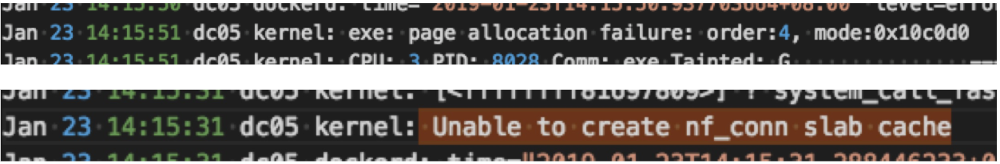
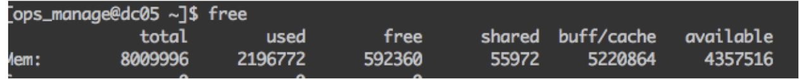
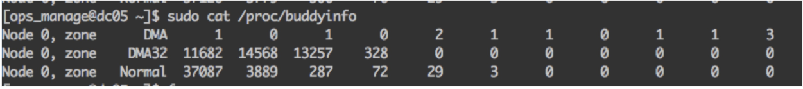

# Kubernetes 最佳实践：处理内存碎片化


### 内存碎片化造成的危害


节点的内存碎片化严重，导致`docker`运行容器时，无法分到大的内存块，导致`start docker`失败。最终导致服务更新时，状态一直都是启动中


### 判断是否内存碎片化严重


内核日志显示：



进一步查看的系统内存(cache多可能是io导致的，为了提高io效率留下的缓存，这部分内存实际是可以释放的)：



查看`slab` (**后面的0多表示伙伴系统没有大块内存了**)：

```
sudo cat /proc/buddyinfo
```

```
$ sudo cat /proc/buddyinfo
Node 0, zone      DMA      4      3      2      2      3      3      0      2      1      1      0
Node 0, zone    DMA32      2     44     23      0      2      1      1      1      9      5     11
```




### 解决方法

* 周期性地或者在发现大块内存不足时，先进行`drop_cache`操作: 

```
bash echo 3 > /proc/sys/vm/drop_caches
```

* 必要时候进行内存整理，开销会比较大，会造成业务卡住一段时间(慎用): 

```
bash echo 1 > /proc/sys/vm/compact_memory
```


