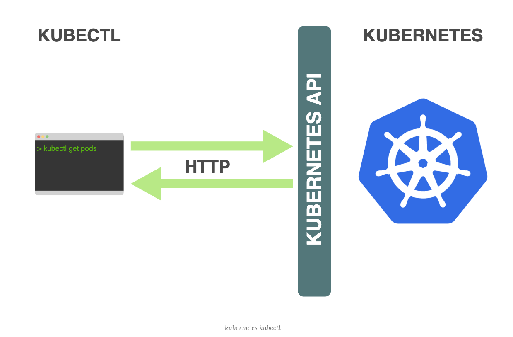
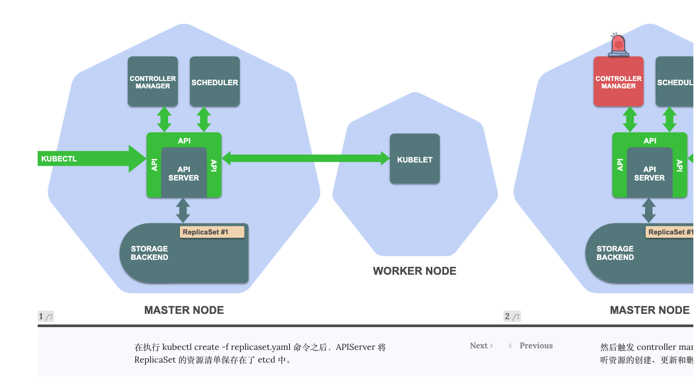

# 提高 kubectl 使用生产力

### Abbr

* 1.命令自动补全安装(Linux/Mac(**Upgrading Bash on macOS**))
* 2.快速查找资源 `kubectl explain`
* 3.使用自定义列格式化输出 `-o custom-columns=<header>:<jsonpath>`
* 4.`JSONPath` 表达式
* 5.切换集群和命名空间
* 6.使用插件扩展 `kubectl`


我们知道在使用 Kubernetes 的过程中，kubectl 工具可能是最常用的工具了（可能还没有之一），所以当我们花费大量的时间在使用 kubectl 上面的时候，那么我们就非常有必要去了解下如何高效的使用它了。

本文包含一系列提示和技巧，可以让你更加高效的使用 kubectl，同时还可以加深你对 Kubernetes 各方面工作原理的理解。


## 什么是 kubectl?


在学习如何更高效地使用 `kubectl` 之前，我们应该去了解下 `kubectl` 是什么已经它是如何工作的。

从用户角度来说，`kubectl` 就是控制 `Kubernetes` 的驾驶舱，它允许你执行所有可能的 Kubernetes 操作；从技术角度来看，`kubectl` 就是 `Kubernetes API` 的一个客户端而已。

`Kubernetes API` 是一个 `HTTP REST API` 服务，该 `API` 服务才是` Kubernetes `的真正的用户接口，`Kubernetes` 通过该 `API` 进行实际的控制。这也就意味着每个 `Kubernetes` 的操作都会通过 `API` 端点暴露出去，当然也就可以通过对这些 `API` 端口进行 `HTTP` 请求来执行相应的操作。

所以，`kubectl` 最主要的工作就是执行 `Kubernetes API` 的 `HTTP` 请求：



> `Kubernetes` 是一个完全以资源为中的系统，`Kubernetes` 维护资源的内部状态，所有 `Kubernetes` 的操作都是对这些资源的 [CRUD](https://kubernetes.io/docs/reference/generated/kubernetes-api/v1.15/#resource-operations) 操作，你可以通过操作这些资源来完全控制 `Kubernetes`（Kubernetes 会根据当前的资源状态来确定需要做什么）。

比如下面的例子。

假如现在我们想要创建一个 `ReplicaSet` 的资源，然后创建一个名为 `replicaset.yaml` 的资源文件来定义 `ReplicaSet`，然后运行下面的命令：

```
$ kubectl create -f replicaset.yaml
```
这个命令执行后会在 `Kubernetes` 中创建一个 `ReplicaSet` 的资源，但是这幕后发生了什么呢？

`Kubernetes` 具有创建 `ReplicaSet` 的操作，并且和其他 `Kubernetes` 操作一样的，也是通过 `API` 端点暴露出来的，上面的操作会通过指定的 `API` 端口进行如下的操作：

```
POST /apis/apps/v1/namespaces/{namespace}/replicasets
```


> 我们可以在 [API 文档](https://kubernetes.io/docs/reference/generated/kubernetes-api/v1.15/) 中找到所有 `Kubernetes` 操作的 `API Endpoint`（包括上面的端点），要向 `Endpoint` 发起实际的请求，我们需要将 `APIServer` 的 `URL` 添加到 `API` 文档中列出的 `Endpoint` 路径中。

所以，当我们执行上面的命令时，`kubectl` 会向上面的 `API Endpoint` 发起一个 `HTTP POST` 请求，`ReplicaSet` 的定义（`replicaset.yaml` 文件中的内容）通过请求的 `body` 进行传递。这就是 `kubectl` 与 `Kubernetes` 集群交互的命令如何工作的。

> 我们也完全可以使用 `curl` 等工具手动的向 `Kubernetes API` 发起 `HTTP` 请求，`kubectl` 只是让我们更加容易地使用 `Kubernetes API` 了。

这些是 `kubectl` 的最基础的知识点，但是每个 `kubectl `操作者还有很多 `Kubernetes API` 的知识点需要了解，所以我们这里再简要介绍一下 `Kubernetes` 的内部结构。

## Kubernetes 架构

`Kubernetes` 由一组独立的组件组成，这些组件在集群的节点上作为单独的进行运行，有些组件在 `Master` 节点上运行，有一些组件在 `Node` 节点上运行，每个组件都有一些特定的功能。

Master 节点上最主要的组件有下面几个：

* `etcd`: 存储后端，整个集群的资源信息都存在 `etcd` 里面
* `kube-apiserver`: 提供给整个集群的 API 服务，是唯一一个直接和 etcd 进行交互的组件
* `kube-controller-manager`: 控制器，主要是确保资源状态符合期望值
* `kube-scheduler`: 调度器，将 `Pod` 调度到工作节点

Node 节点上最重要的组件：

* `kubelet`: 管理工作节点上的容器


为了了解这些组件之间是如何协同工作的，我们再来看下上面的例子，假如我们执行了上面的`kubectl create -f replicaset.yaml`命令，`kubectl` 对创建 `ReplicaSet` 的 `API Endpoint` 发起了一个 `HTTP POST` 请求，这个时候我们的集群有什么变化呢？看下面的演示：





经过上面的几个步骤 ReplicaSet 就可以运行起来了。

## Kubernetes API 的作用


从上面的示例中我们可以看出，`Kubernetes` 组件（`APIServer` 和 `etcd` 除外）都是通过监听后端的资源变化来工作的。但是这些组件是不会直接访问 `etcd` 的，只能通过 `APIServer` 去访问 `etcd`。我们再回顾下上面的资源创建过程：

* ReplicaSet 控制器使用 ReplicaSets API 的 List 操作和 watch 参数来监听 ReplicaSet 资源的变化。
* ReplicaSet 控制器使用 create Pod API 来创建 Pod。
* 调度器通过 `patch Pod API` 来更新 `Pod` 和工作节点相关的信息。


我们使用 `kubectl` 来操作也是使用这些相同的 `API` 的。有了这些知识点后，我们就可以总结出 `Kubernetes` 的工作原理了：

* 存储后端（etcd）存储 Kubernetes 的资源。
* `APIServer` 通过 `Kubernetes API `的形式提供存储后端的相关接口。
* 所有其他组件和外部用户都是通过 `Kubernetes API` 来读取、监听和操作 `Kubernetes` 的资源。


> 熟悉这些基本概念将会有助于我们更好地理解 kubectl。

接下来就让我们来看一看 kubectl 的一系列具体的使用技巧，以帮助我们提供 kubectl 的使用生产力。


## 1.命令自动补全

命令补全是提高生产力最有用但也是经常被忽略的技巧之一。命令补全允许你使用 tab 键自动补全 kubectl 的相关命令，包括子命令、选项和参数，以及资源名称等一些复杂的内容。

在下图中我们可以看到使用 kubectl 命令自动补全的相关演示：


命令补全可用于 `Bash` 和 `Zsh shell` 终端。


官方文档中就包含了一些关于命令补全的相关说明，当然也可以参考下面我们为你提供的一些内容。

### 命令补全的工作原理

一般来说，命令补全是通过执行一个补全脚本的 `shell` 功能，补全脚本也是一个 shell 脚本，用于定义特定命令的补全功能。

`kubectl` 在 `Bash` 和 `Zsh` 下可以使用下面的命令自动生成并打印出补全脚本：

```
$ kubectl completion bash
# 或者
$ kubectl completion zsh
```


理论上在合适的 `shell` 中 `source` 上面命令的输出就可以开启 `kubectl` 的命令补全功能了。但是，在实际使用的时候，`Bash`（包括 Linux 和 Mac 之间的差异）和 `Zsh 有一些细节上的差异，下面是关于这些差异的相关说明。


### Bash on Linux

Bash 的命令补全脚本依赖[`bash-completion`](https://github.com/scop/bash-completion)项目，所以需要先安装该项目。

我们可以使用各种包管理器来安装`bash-completion`，例如：

```
$ sudo apt-get install bash-completion
# 或者
$ yum install bash-completion
```

安装完成后可以使用一下命令测试是否安装成功了：

```
$ type _init_completion
```
如果输出一段 `shell` 函数，则证明已经安装成功了，如果输出未找到的相关错误，则可以将下面的语句添加到你的`~/.bashrc`文件中去：

```
source /usr/share/bash-completion/bash_completion
```

> 是否必须将上面内容添加到`~/.bashrc`文件中，这取决于你使用的包管理工具，对于 `apt-get` 来说是必须的，`yum` 就不需要了。

一旦 `bash-completion` 安装完成后，我们就需要进行一些配置来让我们在所有的 `shell` 会话中都可以获取 `kubectl` 补全脚本。

 
一种方法是将下面的内容添加到`~/.bashrc`文件中：

```
source <(kubectl completion bash)
```

另一种方法是将 `kubectl` 补全脚本添加到`/etc/bash_completion.d`目录（如果不存在则新建）：

```
$ kubectl completion bash >/etc/bash_completion.d/kubectl
```

> `/etc/bash_completion.d`目录下面的所有补全脚本都会由 `bash-completion` 自动获取。

上面两种方法都是可行的，重新加载 shell 后，kubectl 的自动补全功能应该就可以正常使用了！

### Bash on MacOS


在 Mac 下面，就稍微复杂一点点了，因为 `Mac` 上的 `Bash` 默认版本是`3.2`，已经过时了，`kubectl` 的自动补全脚本至少需要 `Bash 4.1` 版本。

```
$ echo $BASH_VERSION
3.2.57(1)-release
```

所以要在 `Mac` 上使用 `kubectl` 自动补全功能，你就需要安装新版本的 `Bash`，更新 `Bash` 是很容易的，可以查看这篇文章：[`Upgrading Bash on macOS`](https://itnext.io/upgrading-bash-on-macos-7138bd1066ba)。

```
$ bash --version
GNU bash, version 3.2.57(1)-release (x86_64-apple-darwin18)
Copyright (C) 2007 Free Software Foundation, Inc.
```

* Install


```
$ brew install bash
Updating Homebrew...
Warning: bash 5.0.7 is already installed and up-to-date
To reinstall 5.0.7, run `brew reinstall bash`
```

```
$ which -a bash
/usr/local/bin/bash
/bin/bash
```

```
$ /usr/local/bin/bash --version
GNU bash, version 5.0.7(1)-release (x86_64-apple-darwin18.5.0)
Copyright (C) 2019 Free Software Foundation, Inc.
License GPLv3+: GNU GPL version 3 or later <http://gnu.org/licenses/gpl.html>

This is free software; you are free to change and redistribute it.
There is NO WARRANTY, to the extent permitted by law.

$ /bin/bash --version
GNU bash, version 3.2.57(1)-release (x86_64-apple-darwin18)
Copyright (C) 2007 Free Software Foundation, Inc.
```

```
$ bash --version
GNU bash, version 5.0.7(1)-release (x86_64-apple-darwin18.5.0)
```

*  add to `Whitelist`

```
$ sudo vim /etc/shells
# /usr/local/bin/bash
```

* Set Default Shell

```
$ chsh -s /usr/local/bin/bash
```

*  If you close and reopen the terminal window,  you should now be using the new version already

```
$ echo $BASH_VERSION
5.0.7(1)-release
```


在继续向下之前，请确保你的 Bash 版本在 `4.1` 以上。和 `Linux` 中一样，`Bash` 的补全脚本依赖 `bash-completion` 项目，所以我们也必须要安装它。


我们可以使用 Homebrew 工具来安装：

```
$ brew install bash-completion@2
```

> `@2` 代表 `bash-completion v2` 版本，`kubectl` 命令补全脚本需要 `v2` 版本，而 `v2` 版本至少需要 `Bash 4.1` 版本，所以这就是不能在低于`4.1`的 `Bash` 下面使用 `kubectl` 的补全脚本的原因。

`brew` 安装命令完成会输出一段提示信息，其中包含将下面内容添加到`~/.bash_profile`文件中的说明：

```
export BASH_COMPLETION_COMPAT_DIR=/usr/local/etc/bash_completion.d
[[ -r "/usr/local/etc/profile.d/bash_completion.sh" ]] && . "/usr/local/etc/profile.d/bash_completion.sh"
```

这样就完成了 `bash-completion` 的安装，但是建议将上面这一行信息添加到`~/.bashrc`当中，这样可以在子 `shell` 中也可以使用 `bash-completion`。


重新加载 shell 后，可以使用以下命令测试是否正确安装了 `bash-completion`:


```
$ type _init_completion
```

如果输出一个 `shell` 函数，证明安装成功了。然后就需要进行一些配置来让我们在所有的 `shell` 会话中都可以获取 `kubectl` 补全脚本。

一种方法是将下面的内容添加到`~/.bashrc`文件中：

```
source <(kubectl completion bash)
```

另外一种方法是添加 kubectl 补全脚本到`/usr/local/etc/bash_completion.d`目录下面：

```
$ kubectl completion bash >/usr/local/etc/bash_completion.d/kubectl
```

> 使用 `Homebrew` 安装 `bash-completion` 时上面的方法才会生效。


如果你还是使用 Homebrew 安装的 `kubectl` 的话，上面的步骤都可以省略，因为补全脚本已经被自动放置到`/usr/local/etc/bash_completion.d`目录中去了，这种情况，`kubectl` 命令补全应该在安装完 `bash-completion` 后就可以正常使用了。

最后，重新加载 `shell` 后，`kubectl` 自动提示应该就可以正常工作了。

Add those to `.bashrc`

```
export BASH_COMPLETION_COMPAT_DIR=/usr/local/etc/bash_completion.d
[[ -r "/usr/local/etc/profile.d/bash_completion.sh" ]] && . "/usr/local/etc/profile.d/bash_completion.sh"

source <(kubectl completion bash)
```

```
source .bashrc
```

```
$ kubectl get p
persistentvolumeclaims          poddisruptionbudgets.policy     pods.metrics.k8s.io             podsecuritypolicies.policy
persistentvolumes               pods
```


### Zsh


Zsh 的补全脚本没有任何依赖，所以我们要做的就是设置让所有的 shell 会话中都可以自动补全即可。

可以在`~/.zshrc`文件中添加下面的内容来完成配置：

```
source <(kubectl completion zsh)
```
然后重新加载 `shell` 即可生效，如果重新加载 `shell` 后出现了`compdef error`错误，则需要开启`compdef builtin`， 可以在`~/.zshrc`文件的开头添加下面的内容来实现：

```
autoload -Uz compinit
compinit
```

* [Boosting your kubectl productivity](https://learnk8s.io/blog/kubectl-productivity/)


## 2. 快速查找资源

我们在使用 YAML 文件创建资源时，需要知道这些资源的一些字段和含义，一个比较有效的方法就是去 API 文档中查看这些资源对象的完整规范定义。

但是如果每次要查找某些内容的时候都切换到浏览器去查询也是很麻烦的一件事情，所以，`kubectl` 为我们提供了一个 `kubectl explain` 命令，可以在终端中直接打印出来所有资源的规范定义。`kubectl explain`命令的用法如下所示：


```
$ kubectl explain resource[.field]...
```

该命令可以输出请求的资源或者属性的一些规范信息，通过该命令显示的信息和 API 文档中的信息是相同的，参考下面使用示例：


默认情况下，`kubectl explain` 命令只会显示属性的一级数据，我们可以使用`--recursive`参数来显示整个属性的数据：

```
$ kubectl explain deployment.spec --recursive
```

该命令会将 `deployment.spec` 属性下面所有的规范都打印出来。


```
$ kubectl api-resources
```

该命令会线上资源名称的复数形式（比如显示 `deployments` 而不是 `deployment`），还会显示一个资源的简写（比如 `deploy`），不过不用担心，我们可以用任意一个名称来结合kubectl explain命令使用的：

```
$ kubectl explain deployments.spec
# 或者
$ kubectl explain deployment.spec
# 或者
$ kubectl explain deploy.spec
```

## 3. 使用自定义列格式化输出

`kubectl get`命令（读取集群资源）的默认输出格式如下：

```
$ kubectl get pods
NAME                                      READY   STATUS    RESTARTS   AGE
nginx-app-76b6449498-86b55                1/1     Running   0          23d
nginx-app-76b6449498-nlnkj                1/1     Running   0          23d
opdemo-64db96d575-5mhgg                   1/1     Running   2          23d
```

上面的输出结果是一种比较友好的格式，但是它包含的信息比较有限，比如上面只显示了 Pod 资源中的一些信息（与完整资源定义相比）。

所以这个时候就有[自定义输出格式](https://kubernetes.io/docs/reference/kubectl/overview/#custom-columns)的用武之地了，它允许我们自由定义要显示的列和数据，可以选择要在输出中显示为单独列的资源的任何字段。

自定义列输出的用法如下：


```
-o custom-columns=<header>:<jsonpath>[,<header>:<jsonpath>]...
```


需要将每个输出列定义为`<header>:<jsonpath>`这样的键值对：

* `<header>`是列的名称，可以选择任何想要显示的内容。
* `<jsonpath>`是一个选择资源属性的表达式。


我们来看一个简单的例子：

```
$ kubectl get pods -o custom-columns='NAME:metadata.name'
NAME
nginx-app-76b6449498-86b55
nginx-app-76b6449498-nlnkj
opdemo-64db96d575-5mhgg
```

```
$ kubectl get pods -o custom-columns='NAME:metadata.name' -n kube-system
NAME
kube-dns-7dc9f9f4c5-6gmg4
metric-metrics-server-78996fbfbf-plcww
tiller-deploy-c5c655fc5-zldr4
```

我们可以看到上面的命令输出了一个包含所有 `Pod` 名称的列。选择 `Pod` 名称的表达式是`metadata.name`，这是因为 `Pod` 的名称被定义在 `Pod` 资源的 `metadata` 字段下面的 name 字段中（我们可以在 API 文档或者使用`kubectl explain pod.metadata.name`命令来查看）。

现在假如我们要在输出结果中添加另外一列数据，比如显示每个 Pod 正在运行的节点，这时我们只需要向自定义列的选项中添加合适的列规范数据即可：

```
$ kubectl get pods \
  -o custom-columns='NAME:metadata.name,NODE:spec.nodeName' 
```
 
```
$ kubectl get pods \
>   -o custom-columns='NAME:metadata.name,NODE:spec.nodeName' -n kube-system
NAME                                     NODE
kube-dns-7dc9f9f4c5-6gmg4                jam-m2xlarge-fphgs
metric-metrics-server-78996fbfbf-plcww   jam-m2xlarge-sxrj8
tiller-deploy-c5c655fc5-zldr4            jam-m2xlarge-fphgs
```

节点名称的表达式是`spec.nodeName`，这是因为已调度 `Pod` 的节点信息被保存在了 `Pod` 的`spec.nodeName`字段中（可以通过`kubectl explain pod.spec.nodeName`查看）。

```
$ kubectl explain pod.spec.nodeName
KIND:     Pod
VERSION:  v1

FIELD:    nodeName <string>

DESCRIPTION:
     NodeName is a request to schedule this pod onto a specific node. If it is
     non-empty, the scheduler simply schedules this pod onto that node, assuming
     that it fits resource requirements.
```


> 注意，Kubernetes 资源字段是区分大小写的。


我们可以通过这种方式将资源的任何字段设置为输出列的数据，只需要去查看资源规范并使用我们需要的任何字段即可！

但首先，我们还是来仔细来看看这些字段的选择表达式吧！

## `JSONPath` 表达式


选择资源字段的表达式是基于 [JSONPath](https://goessner.net/articles/JsonPath/index.html) 的。

`JSONPATH` 是一种从 `JSON` 文件中提取数据的一种语言（类似于 `XPath for XML`）。选择单个字段只是 `SJONPath` 的最基本的用法，它还有很多其他的功能，比如列表选择器、过滤器等。

但是我们在使用`kubectl explain`命令的时候只支持部分 `JSONPath` 功能，下面我们用一些简单的示例来介绍下这些支持的功能：


#### 选择一个列表的所有元素

**`DATA:spec.containers[*].X`**

```
$ kubectl get pods -o custom-columns='DATA:spec.containers[*].image' --all-namespaces
```

#### 选择一个列表的指定元素

**`DATA:spec.containers[0].X`**

```
$ kubectl get pods -o custom-columns='DATA:spec.containers[0].image'
```


#### 选择和一个过滤表达式匹配的列表元素

**`DATA:spec.containers[?(@.image!="nginx")].X`**

```
$ kubectl get pods -o custom-columns='DATA:spec.containers[?(@.image!="nginx")].image'
```

#### 选择特定位置下的所有字段（无论名称是什么）

**`metadata.*`**

```
$ kubectl get pods -o custom-columns='DATA:metadata.*'
```

```
$ kubectl get pods   -o custom-columns='NAME:metadata.name'
NAME
loki-0
loki-promtail-5xts8
loki-promtail-9sfvl
loki-promtail-ngvsp
```


#### 选择具有特定名称的所有字段（无论其位置如何）

```
$ kubectl get pods -o custom-columns='DATA:..image'

DATA
grafana/loki:v0.1.0,grafana/loki:v0.1.0
grafana/promtail:v0.1.0,grafana/promtail:v0.1.0
grafana/promtail:v0.1.0,grafana/promtail:v0.1.0
grafana/promtail:v0.1.0,grafana/promtail:v0.1.0
```

**另外一个非常重要的操作符是`[]`，`Kubernetes` 的资源很多字段都是列表，改操作符可以让我们选择这些列表中的一些元素，它通常与通配符`[*]`一起使用来选择列表中的所有元素。**


### 示例演示


使用自定义列输出格式的结果是多种多样的，因为我们可以在输出中显示资源的任何字段或者字段的组合，下面是一些示例演示，当然也可以根据自己的实际需求就自行实践。

> 提示：如果你经常使用某一个命令，那么我们可以为这个命令创建一个 shell alias 别名，可以提高效率。

#### 显示 Pod 的所有容器镜像

下面的命令显示 `default` 命名空间下面的每个 `Pod` 的所有容器镜像的名称：

```
$ kubectl get pods \
  -o custom-columns='NAME:metadata.name,IMAGES:spec.containers[*].image'
NAME                       IMAGES
engine-544b6b6467-22qr6    rabbitmq:3.7.8-management,nginx
engine-544b6b6467-lw5t8    rabbitmq:3.7.8-management,nginx
engine-544b6b6467-tvgmg    rabbitmq:3.7.8-management,nginx
web-ui-6db964458-8pdw4     wordpress
```

> 由于一个 `Pod` 可能包含多个容器，这种情况下，每个 `Pod` 的容器镜像会在同一列中用逗号隔开显示。

#### 显示节点的可用区域

```
$ kubectl get nodes \
>   -o custom-columns='NAME:metadata.name,ZONE:metadata.labels.failure-domain\.beta\.kubernetes\.io/zone'
NAME                 ZONE
jam-m2xlarge-6zqkq   eu-de-1a
jam-m2xlarge-fphgs   eu-de-1a
jam-m2xlarge-sxrj8   eu-de-1a
```

如果你的 `Kubernetes` 集群部署在公有云上面（比如 AWS、Azure 或 GCP），那么上面的命令就非常有用了，它可以用来显示每个节点所在的可用区。

每个节点的可用区都可以通过标签`failure-domain.beta.kubernetes.io/zone`来获得，集群在公有云上面运行的话，会自动创建该标签的，并将其值设置为节点的可用区名称。


**`failure-domain\.beta\.kubernetes\.io/zone`**

`Label` 标签不是 `Kubernetes` 资源规范的一部分，所以无法在 `API` 文档中找到上面的标签，不过我们可以将节点信息输出为 `YAML` 或者 `JSON` 格式，这样就可以看到标签信息了：


```
$ kubectl get nodes -o yaml
# 或者
$ kubectl get nodes -o json
```

这种方法除了用来查看资源规范之外，这也是用来发现资源更多信息的一种很好的方式。


## 切换集群和命名空间

* 当 `kubectl` 向 `APIServer` 发起请求的时候，会读取系统上的 `kubeconfig` 文件，首先会加载`KUBECONFIG`这个环境变量指向的文件，

* 如果没有的话则会去加载`~/.kube/config`文件，去获取需要访问的连接相关参数发起请求。

但是当有多个集群需要管理的时候，`kubeconfig` 文件中就需要配置多个集群的相关参数，所以需要有一种方法来告诉 `kubectl` 我们希望它去连接到哪个集群。

在集群中可以设置多个 `namespace` (命名空间)，`kubectl` 也会通过 `kubeconfig` 文件来确定请求哪个 `namespace`，所以，同样也需要一种方法来告诉 `kubectl` 去连接哪些命名空间。


接下来我们来给大家演示如何实现上面的功能。


> 我们可以在`KUBECONFIG`环境变量中列出多个 `kubeconfig` 文件，在这种情况下，所有这些文件会在执行时合并成一个有效的配置文件，当然你还可以使用 `kubectl` 命令的`--kubeconfig`参数来覆盖默认的 `kubeconfig` 文件，可以参考官方文档相关说明。

### Kubeconfig 文件

我们先来看看 `kubeconfig` 文件包含了哪些内容：

从上图我们可以看出 `kubeconfig` 文件由一组 `Context（上下文）`组成，一个 `Context` 包含以下3个元素：

* 集群：Kubernetes 集群的 APIServer 的 URL 地址
* 用户：集群某个特定用户的身份验证凭据
* 命名空间：连接到集群时使用的命名空间

> 大多数用户在 `kubeconfig` 文件中经常使用集群的单个 `Context`，但是每个集群也有可能有多个 `Context`，对应的用户或者 `namespace` 有所不同，但是这好像不是很常见，所以通常在集群和上下文之间是一对一的映射。

在任何时间，`kubeconfig` 文件中的一个 `Context` 被设置为当前使用的 `Context `上下文（通过 `kubeconfig` 文件中的专有字段指定）：


当 `kubectl` 读取 `kubeconfig` 文件时，它总是会使用当前 `Context` 中的信息，所以，上面图片中的例子，`kubectl` 会连接到 `HARE` 集群。所以，要切换到另外一个集群，我们只需要更改 `kubeconfig` 文件中的当前上下文 `Context` 即可：


> 注意，`kubect`l 还提供了`--cluster`、`--user`、`--namespace`和`--context`选项，允许你覆盖单个的元素和当前的上下文本身，详细说明可以查看 `kubectl options`命令。


理论上，我们当然可以通过手动去编辑 `kubeconfig` 文件来达到切换的目的，但是这样也的确有些麻烦，下面我们将介绍一些允许我们自动来执行更改的一些工具。

### kubectx

[kubectx](https://github.com/ahmetb/kubectx/) 是一个用于在集群和命名空间切换的非常流行的工作。

该工具提供了`kubectx`和`kubens`命令，运行更改当前上下文和命名空间。

> 如果每个集群只有一个上下文，更改当前上下文也就意味着更改集群了。

下面是上述命令的演示示例：


> 当然底层原理还是一样的，这些命令都是去编辑 kubeconfig 文件而已。


安装 kubectx 非常简单，只需要安装其 [GitHub 页面上的安装说明操作即可](https://github.com/ahmetb/kubectx/#installation)。

`kubectx` 和 `kubens` 命令都提供了命令补全脚本，这样我们就不需要完全输入目标信息就可以自动补全上下文和命名空间信息了，当然也可以在 GitHub 页面上找到相关配置的说明。

`kubectx` 的另外一个非常有用的功能是交互模式，该模式需要和`fzf`工具结合使用，需要单独安装该工具（安装 `fzf` 会自动启用 `kubectx` 交互模式），交互模式允许我们通过交互式模糊搜索界面（`fzf `提供）来选择目标上下文或者命名空间。

### shell 别名

实际上，我们也可以不使用额外的工具来切换上下文和命名空间，因为 `kubectl` 也提供了切换操作的命令，`kubectl config`命令就提供了用于编辑 kubeconfig 文件的功能，下面是一些基本用法：

* `kubectl config get-contexts`: 列出所有的 `context`
* `kubectl config current-context`: 获取当前的 `context`
* `kubectl config use-context`: 更改当前 `context`
* `kubectl config set-context`: 修改 `context` 的元素

很显然直接使用这些命令来说并不是特别方便，但是我们可以将这些命令包装成可以更容易执行的 shell 别名，如下图所示：


> 这里我们通过fzf来提供交互式的模糊搜索界面（类似于 kubectx 的交互模式），所以我们需要提前安装 [`fzf`](https://github.com/junegunn/fzf#installation)

下面是我们定义的别名：

```
# 获取当前上下文
alias krc='kubectl config current-context'
# 列出所有上下文
alias klc='kubectl config get-contexts -o name | sed "s/^/  /;\|^  $(krc)$|s/ /*/"'
# 更改当前上下文
alias kcc='kubectl config use-context "$(klc | fzf -e | sed "s/^..//")"'

# 获取当前 namespace
alias krn='kubectl config get-contexts --no-headers "$(krc)" | awk "{print \$5}" | sed "s/^$/default/"'
# 列出所有 namespace
alias kln='kubectl get -o name ns | sed "s|^.*/|  |;\|^  $(krn)$|s/ /*/"'
# 更改当前 namespace
alias kcn='kubectl config set-context --current --namespace "$(kln | fzf -e | sed "s/^..//")"'
```

要让这些别名生效，只需要将上述定义添加到`~/.bashrc`或`~/.zshrc`文件中，然后重新加载 `shell `即可。

### 使用插件

`kubectl` 允许安装类似于原生命令的一样被调用的插件，比如，我们可以安装一个名为 `kubectl-foo` 的插件，然后就可以将其作为 `kubectl foo` 命令进行调用。

能够像这样来切换当前上下文和命名空间也是一种很好的方式吧？比如，运行 `kubectl ctx` 命令来更改上下文，运行 `kubectl ns` 命令来更改命名空间。我这里就创建了两个这样的插件：

* [kubectl-ctx](https://github.com/weibeld/kubectl-ctx)
* [kubectl-ns](https://github.com/weibeld/kubectl-ns)

这两个插件的原理其实也比较简单，也是基于前面提到的 shell 别名来构建的，下图是我们使用这两个插件的实际效果：


> 同样要注意[安装 fzf](https://github.com/junegunn/fzf#installation)。

安装这两个插件非常简单，只需要将上面名为 `kubectl-ctx` 和 `kubectl-ns` 的 `shell` 脚本下载到任意一个 `PATH` 目录下面，将其设置为可执行（使用 `chmod + x` 命令）即可，这样我们就可以使用`kubectl ctx`和`kubectl ns`命令了，是不是很简单？

## 6.使用插件扩展 kubectl


从1.12版本开始，kubectl 就提供了一个[插件机制](https://kubernetes.io/docs/tasks/extend-kubectl/kubectl-plugins/)，允许我们通过自定义命令来扩展 kubectl。

下面是一个插件示例，可以通过调用`kubectl hello`来打印一句话：


> kubectl 的插件机是严格遵循 [Git 的插件机制的](https://adamcod.es/2013/07/12/how-to-create-git-plugin.html)。

接下来我们将介绍如何安装插件和在什么地方可以找到已有的插件以及如何创建自己的插件。

### 安装插件

kubectl 插件是作为一个简单的可执行文件进行发布的，名称格式为`kubectl-x`，前缀`kubectl-`是必须的，然后就是通过一些配置来允许调用插件的新的 kubectl 子命令。


比如，上面显示的 `hello` 插件就是通过名为`kubectl-hello`的可执行文件发布的。

要安装插件，只需要将 `kubectl-x` 文件复制到 `PATH` 目录下任意一个目录中，然后将其设置为可执行状态（比如使用 `chmod + x` 命令），然后就可以使用 kubectl x 命令调用插件了。


我们可以使用以下命令列出系统上当前安装的所有插件：

```
$ kubectl plugin list
```

如果你有多个具有相同名称的插件或者有不可执行的插件，该命令都会出现一些警告信息。

### 使用 krew 查找和安装插件

kubectl 插件可以像软件包一样共享和重用，但是在哪里可以找到其他人共享的插件呢？

[`krew`](https://github.com/kubernetes-sigs/krew)项目就旨在为共享、搜索、安装和管理 kubectl 插件提供统一的解决方案，该项目将自己称为kubectl 插件的包管理器（krew 的名字灵感也是来源于 brew）。

krew 围绕 kubectl 插件[索引](https://github.com/kubernetes-sigs/krew-index)为中心，可以从中选择和安装，下图是 krew 使用的一个示例：


事实上，krew 本身也是一个 kubectl 插件，所以安装 krew 本质上就像安装其他 kubectl 插件一样，我们可以在 GitHub 页面上找到 krew 的详细安装说明。

下面是几个最重要的 krew 命令：

```
# 搜索 krew 索引 (带一个可选的搜索 query 参数)
$ kubectl krew search [<query>]
# 显示一个插件的相关信息
$ kubectl krew info <plugin>
# 安装插件
$ kubectl krew install <plugin>
# Upgrade all plugins to the newest versions
$ kubectl krew upgrade
# 列出 krew 安装的所有插件krew
$ kubectl krew list
# 卸载一个插件
$ kubectl krew remove <plugin>
```

需要注意的使用使用 krew 安装插件也并不会妨碍我们用传统的方式去安装插件，我们仍然还是可以通过其他方式去安装或者自己创建插件。

> 不过需要注意的是`kubectl krew list`命令只会列出使用 `krew` 安装的插件，而`kubectl plugin list`命令会列出所有的插件，包括 `krew` 安装的和其他方式安装的插件。

### 在其他地方查找插件

krew 还是一个非常年轻的项目，目前 `krew index` 中只有大约 `30 `多个插件，如果你找不到合适的插件，可以在其他地方去查找，比如在 `GitHub` 上面搜索。


建议可以在 GitHub 上面查看 [kubectl-plugins 主题](https://github.com/topics/kubectl-plugins)，会发现有几十个可用的插件值得一试的。

### 创建自己的插件

当然，我们可以[创建自己的 `kubectl` 插件](https://kubernetes.io/docs/tasks/extend-kubectl/kubectl-plugins/#writing-kubectl-plugins)，只需要创建一个可执行文件，执行想要的操作，为其命名为 `kubectl-x` 的形式，然后安装上面的方法来安装即可。

可执行的文件可以是任何类型的，比如 Bash 脚本、编译好的 Go 程序、Python 脚本等都是可以的，唯一的要求就是在你操作的系统里面可以直接执行。

下面我们来创建一个简单的插件示例，在前面的一节中，我们通过 kubectl 命令列出了每个 Pod 的容器镜像，我们可以轻松地将该命令转换为可以调用的插件，例如 kubectl img。

创建一个名为 `kubectl-img` 的文件，内容如下：

```
#!/bin/bash
kubectl get pods -o custom-columns='NAME:metadata.name,IMAGES:spec.containers[*].image'
```

然后执行以下命令使文件变成可执行：


```
$ chmod +x kubectl-img
```
然后将 `kubectl-img` 文件移动到 `PATH` 中任意一个目录，然后我们就可以使用 `kubectl img` 命令了：

```
$ kubectl plugin list
The following compatible plugins are available:

/Users/ych/devs/workspace/yidianzhishi/kubernetes/bin/kubectl-img
$ kubectl img
NAME                                      IMAGES
cm-test-pod                               busybox
nfs-client-provisioner-6985f88c47-pd6mr   quay.io/external_storage/nfs-client-provisioner:latest
nginx                                     nginx:1.7.9
nginx-app-76b6449498-86b55                nginx:1.7.9
nginx-app-76b6449498-nlnkj                nginx:1.7.9
opdemo-64db96d575-5mhgg                   cnych/opdemo
```

> 如上所示，kubectl 插件可以使用任何编程语言或者脚本来实现的，如果使用 shell 脚本，则可以在插件中轻松调用 kubectl，当然我们也可以使用实际编程语言来编写更复杂的插件，例如，使用 [Kubernetes 客户端库](https://kubernetes.io/docs/reference/using-api/client-libraries/)，如果使用 Go 语言，还可以使用 [cli-runtime 库](https://github.com/kubernetes/cli-runtime)，它是专门用于编写 kubectl 插件的。

### 分享你的插件


如果你认为你的插件可能对其他人也有用，那么可以随时在 GitHub 上面分享，最好添加到 kubectl-plugins 主题中，这样可以方便别的用户找到。

你还可以请求将你的插件添加到 `krew index` 中去，可以在 [krew 的 GitHub 仓库](https://github.com/kubernetes-sigs/krew/blob/master/docs/DEVELOPER_GUIDE.md)上面找到有关如何执行该操作的说明。


### 命令提示

目录，插件机制还不支持命令提示功能，所以我们需要完全输入插件的名称和插件的参数下可以使用。

不过不用担心，在 `kubectl GitHub` 仓库中有一个是 `open feature request`，所以，该功能应该很快就会被支持了。


