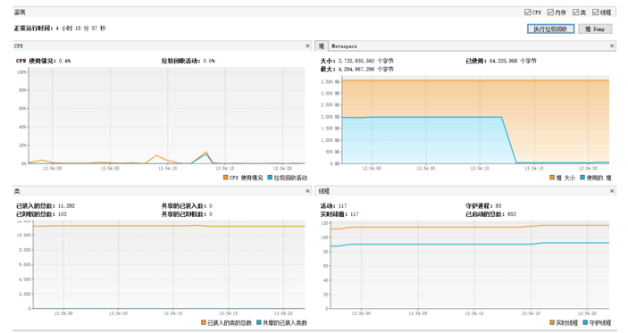
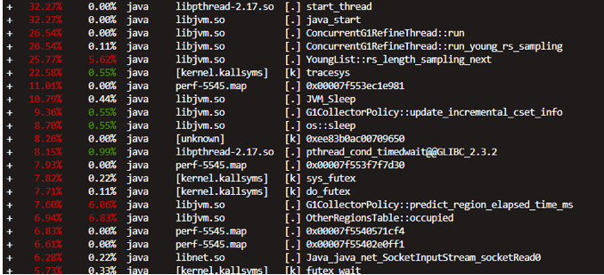

# **内存泄漏排查攻略之：Show me your Memory**


## **1：top 等查看系统内存概况**


top：显示所有进程运行情况，按M键按照内存大小排序，立马看到罪魁祸首。具体命令请参考网上资料。

top简要使用方法如下：


```
使用格式：
top [-] [d] [p] [q] [c] [C] [S] [s] [n]
参数说明：
d：指定每两次屏幕信息刷新之间的时间间隔。当然用户可以使用s交互命令来改变之。
p:通过指定监控进程ID来仅仅监控某个进程的状态。
q:该选项将使top没有任何延迟的进行刷新。如果调用程序有超级用户权限，那么top将以尽可能高的优先级运行。
S：指定累计模式。
s：使top命令在安全模式中运行。这将去除交互命令所带来的潜在危险。
i：使top不显示任何闲置或者僵死进程。
c:显示整个命令行而不只是显示命令名。

常用命令说明：
Ctrl+L：擦除并且重写屏幕
K：终止一个进程。系统将提示用户输入需要终止的进程PID，以及需要发送给该进程什么样的信号。一般的终止进程可以使用15信号；如果不能正常结束那就使用信号9强制结束该进程。默认值是信号15。在安全模式中此命令被屏蔽。
i：忽略闲置和僵死进程。这是一个开关式命令。
q：退出程序
r:重新安排一个进程的优先级别。系统提示用户输入需要改变的进程PID以及需要设置的进程优先级值。输入一个正值将使优先级降低，反之则可以使该进程拥有更高的优先权。默认值是10。
S：切换到累计模式。
s：改变两次刷新之间的延迟时间。系统将提示用户输入新的时间，单位为s。如果有小数，就换算成m s。输入0值则系统将不断刷新，默认值是5 s。需要注意的是如果设置太小的时间，很可能会引起不断刷新，从而根本来不及看清显示的情况，而且系统负载也会大大增加。
f或者F：从当前显示中添加或者删除项目。
o或者O：改变显示项目的顺序
l：切换显示平均负载和启动时间信息。
m:切换显示内存信息。
t:切换显示进程和CPU状态信息。
c:切换显示命令名称和完整命令行。
M:根据驻留内存大小进行排序。
P:根据CPU使用百分比大小进行排序。
T:根据时间/累计时间进行排序。
W:将当前设置写入~/.toprc文件中。
```

另外在内存查看方面，还可以使用 free用于快速直接查看内存，还可以看到有多少是系统缓存；（系统缓存一般不被计入真正已使用内存中）


## **2. jmx 快速发现jvm中的内存异常项**


jmx，如果开启了jmx，则我们可以直接通过jvisualvm查看内存，线程监控情况，还可以查看其他jmx指标；

从这里你可以，看到内存的变化趋势，垃圾回收，cpu变化趋势等等，很多直观的问题完全可以在这一环节发现。

另外，你可以通过采集cpu和采集内存的方式，发现代码中的瓶颈点。

可以说，jmx是我们进行代码优化或者参数调优的绝对王者工具。




性能问题，可以适当进行CPU/内存采样，以快速发现瓶颈点！

建议新增插件： 

* Btrace Workbench  用于远程调试，也许有用；
* BufferMonitor 用于查看堆外内存情况，其实可能不准；
* Threads Inspector 用于快速查看各线程情况；
* VisualJVM-MBeans 用于查看 jmx 暴露出来的 指标信息，可作为业务监控使用；

## **3. jmap dump 详细分析jvm的内存使用情况**


jmap dump，发现内存异常，而其他方面没啥思路时，那就jvm内存dump下来，慢慢分析。
dump整个内存下来，全量分析，`jmap -dump:format=b,file=/tmp/a.dump` . 然后就可以使用jvm内存分析工具进行分析了，如 `mat` 。分析工具的技巧可能还是需要去掌握下的，不过我这里简单提两个点，一个是看得到的堆内存，一个是不可达的堆内存，分析时就注意这两点。一般可达堆内存是很好分析的，不可达堆内存则要凭借一定的经验才能发现问题了。

对于快速查询，则直接在服务器上使用 jmap -heap 就可以查看了。


```
jmap -dump:format=b,file=/tmp/a.dump <pid> # dump倒是堆内存
jmap -heap <pid> # 直接在服务器上查看堆的使用情况
```

会一些OQL查询语言，将会对你的排查如虎添翼！ 

## **4. lsof 列举出正在使用的文件，看看是否能发现一些端倪**

lsof，这个工具用于排查是否存在很在很多超出预料的文件的情况，比如打开某文件未关闭，建立很多的socket连接等等。当然，发现问题只能靠眼力劲了。

```
lsof -p <pid> #查看进程打开的文件情况。
```

## **5. pmap 查看进程内存概要**

pmap，用于查看进程的内存映像信息， 发现内存中大块的占用所在，以及分析内存可能存在的异常。

从中，你可以看到哪些内存上面占用了多少内存，正常的内存如 JVM 所在内存段，应该是和你的堆内存一致的，而其他内存段，则是你看不到的地方，这些地方将是你排查内存泄漏的方向。

```
简要命令下:
    pmap [ -x | -d ] [ -q ] pids...
结果样例如下:
[root@abtest ~]# pmap -x 27466 
27466:   /usr/local/jdk1.8.0_211/bin/java -Dzookeeper.log.dir=. -Dzookeeper.root.logger=INFO,CONSOLE -cp /opt/zookeeper/zookeeper-3.4.14/bin/../zookeeper-server/target/classes:/opt/zookeeper/zookeeper-3.4.14/bin/../build/classes:/opt/zookeeper/zookeeper-3.4.14/bin/../zookeeper-server/target/lib/*.jar:/opt/zookeeper/zookeeper-3.4.14/bin/../build/lib/*.jar:/opt/zookeeper/zookeeper-3.4.14/bin/../lib/slf4j-log4j12-1.7.25.jar:/opt/zookeeper/zookeeper-3.4.14/bin/../lib/slf4j-api-1.7.25.jar:/opt/zookeeper/zookeeper-3.4.1
Address           Kbytes     RSS   Dirty Mode  Mapping
0000000000400000       4       4       0 r-x-- java
0000000000600000       4       4       4 r---- java
0000000000601000       4       4       4 rw--- java
...
00007fff10253000     136      36      36 rw---   [ stack ]
00007fff102ce000       8       4       0 r-x--   [ anon ]
ffffffffff600000       4       0       0 r-x--   [ anon ]
---------------- ------- ------- -------
total kB         5421732  100608   87672
```

命令操作详情请参考网上资料：: https://www.cnblogs.com/txw1958/archive/2012/07/26/linux-pmap.html

## **6. NMT,  nativeMemoryTracking jvm 的内存追踪工具**


nmt，这个jdk8以后，jvm提供的内存跟踪工具，nativeMemoryTracking, 可以用于排查内存方案的问题。 

```
XX:NativeMemoryTracking=summary     # 开启NMT追踪
jcmd 1 VM.native_memory summary        # 查看当前的内存概况
jcmd 1 VM.native_memory baseline    # 创建基准 baseline
jcmd 1 VM.native_memory summary.diff    # 一段时间后，比对内存差异，可以用于发现内存的走向问题，如下
[root@abtest ~]# jcmd 5545 VM.native_memory summary.diff
5545:

Native Memory Tracking:

Total: reserved=5942859KB +2339KB, committed=4104347KB +1519KB

-                 Java Heap (reserved=4194304KB, committed=3645440KB)
                            (mmap: reserved=4194304KB, committed=3645440KB)

-                     Class (reserved=1109328KB +2056KB, committed=66640KB +264KB)
                            (classes #11172 +2)
                            (malloc=1360KB +8KB #15153 +331)
                            (mmap: reserved=1107968KB +2048KB, committed=65280KB +256KB)

-                    Thread (reserved=133119KB, committed=133119KB)
                            (thread #130)
                            (stack: reserved=132544KB, committed=132544KB)
                            (malloc=422KB #652)
                            (arena=152KB #256)

-                      Code (reserved=255919KB +247KB, committed=37519KB +1219KB)
                            (malloc=6319KB +247KB #8248 +270)
                            (mmap: reserved=249600KB, committed=31200KB +972KB)

-                        GC (reserved=209075KB +8KB, committed=188707KB +8KB)
                            (malloc=20659KB +8KB #28406 +320)
                            (mmap: reserved=188416KB, committed=168048KB)

-                  Compiler (reserved=277KB +5KB, committed=277KB +5KB)
                            (malloc=146KB +5KB #592 +9)
                            (arena=131KB #6)

-                  Internal (reserved=12648KB, committed=12648KB)
                            (malloc=12616KB #39090 +5)
                            (mmap: reserved=32KB, committed=32KB)

-                    Symbol (reserved=16444KB +8KB, committed=16444KB +8KB)
                            (malloc=12569KB +8KB #121265 +2)
                            (arena=3876KB #1)

-    Native Memory Tracking (reserved=3362KB +15KB, committed=3362KB +15KB)
                            (malloc=18KB #204 +2)
                            (tracking overhead=3344KB +15KB)

-               Arena Chunk (reserved=192KB, committed=192KB)
                            (malloc=192KB)

-                   Unknown (reserved=8192KB, committed=0KB)
                            (mmap: reserved=8192KB, committed=0KB)
```


如上结果，我们可以得得出些结论，随着时间的推移, code 部分的占用空间增加了最多(JIT), Compiler 也增加一些，而堆内存则一直保持不变！

## **7. perf，这是一个性能监控调优工具，但是我们也可能从中发现内存问题点**


可以先捕获数据，然后进行性能分析，然后得到可疑的点。

帮助信息如下:

```
usage: perf [--version] [--help] [OPTIONS] COMMAND [ARGS]
...
```


示例

```
 perf record -g -e cpu-clock -p 5545        # 记录进程 5545 的相关性能信息
    perf report -i perf.data                # 读取刚刚记录的数据，可以显示出种操作的占用情况，如下
Samples: 908  of event 'cpu-clock', Event count (approx.): 227000000
  Children      Self  Command  Shared Object       Symbol
+   32.27%     0.00%  java     libpthread-2.17.so  [.] start_thread
+   32.27%     0.00%  java     libjvm.so           [.] java_start
+   26.54%     0.00%  java     libjvm.so           [.] ConcurrentG1RefineThread::run
+   26.54%     0.11%  java     libjvm.so           [.] ConcurrentG1RefineThread::run_young_rs_sampling
+   25.77%     5.62%  java     libjvm.so           [.] YoungList::rs_length_sampling_next
+   22.58%     0.55%  java     [kernel.kallsyms]   [k] tracesys
+   11.01%     0.00%  java     perf-5545.map       [.] 0x00007f553ec1e981
+   10.79%     0.44%  java     libjvm.so           [.] JVM_Sleep
+    9.36%     0.55%  java     libjvm.so           [.] G1CollectorPolicy::update_incremental_cset_info
+    8.70%     0.55%  java     libjvm.so           [.] os::sleep
+    8.26%     0.00%  java     [unknown]           [k] 0xee83b0ac00709650
+    8.15%     0.99%  java     libpthread-2.17.so  [.] pthread_cond_timedwait@@GLIBC_2.3.2
+    7.93%     0.00%  java     perf-5545.map       [.] 0x00007f553f7f7d30
```




## **8. gdb 调试工具dump出可疑内存**

gdb, linux下强大的调试工具，但是我们不用它来调试，我们只用来输出内存的内容。即dump内存，前面用到的jmap dump只能看到jvm的内存信息，而gdb则可以看所有的，当然我们会用来看其他部分的内存。

```
 gdb attach <pid>                    # 先连接到进程中
 gdb dump memory /path/dump.bin 0x0011  0x0021    # dump 出内存段的信息,具体要 dump 的内存段地址，可以借助之前pmap 排查的结果,以及 cat /proc/<pid>/maps 中指示的地址段得出
    strings /path/dump.bin | less # 查看内存内容, 相信你能从中发现一些不一样的东西
```
