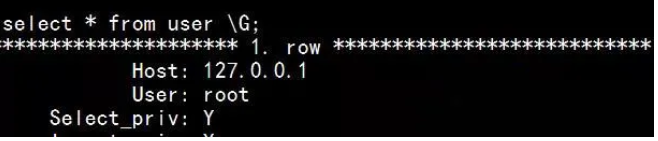
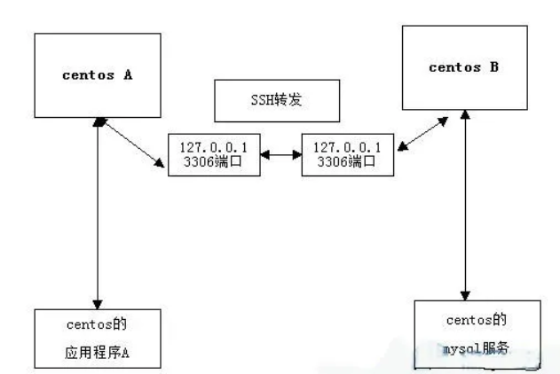

# SSH平时常用的几大场景

## 什么是SSH？

SSH是一种网络协议，用于计算机之间的加密登录。最早的时候，互联网通信都是明文通信，一旦被截获，内容就暴露无疑。1995年，芬兰学者Tatu Ylonen设计了SSH协议，将登录信息全部加密，成为互联网安全的一个基本解决方案，迅速在全世界获得推广，目前已经成为Linux系统的标准配置。

## 登录原理

 

## SSH基本用法

语法:

```
ssh -p 22 user@host
```

参数:

* `-p`：指定端口号。
* user：登录的用户名。
* host：登录的主机。

默认的端口号为22，当端口号为22的时候，可以省略，直接使用如下方式:

```
ssh user@host
```

此外，如果本地正在使用的用户名与远程登录的用户名一致，登录用户名也是可以省略的，即如下：

```
ssh host
```

## SSH远程登录实例

现在我有两台linux虚拟机，上面安装都是centOS6.5，ip分别为`192.168.13.135`和`192.168.13.138`，如下图：

 

**现在，我需要操作的是通过SSH在192.168.13.138上面，登录到192.168.13.135上面。**

首先，我们可以使用如下命令，查看两台机器是否启用了ssh。

```
netstat -ntlp |grep ssh
```

使用如下命令进行连接。

```
ssh -p 22 root@192.168.13.135
```

## SSH端口转发


SSH 不仅仅能够自动加密和解密 SSH 客户端与服务端之间的网络数据，同时，SSH 还能够提供了一个非常有用的功能，**那就是端口转发，即将TCP 端口的网络数据，转发到指定的主机某个端口上，在转发的同时会对数据进行相应的加密及解密。**

如果工作环境中的防火墙限制了一些网络端口的使用，但是允许 SSH 的连接，那么也是能够通过使用SSH转发后的端口进行通信。转发，主要分为本地转发与远程转发两种类型。

### 转发的参数

```
-C：压缩数据
-f ：后台认证用户/密码，通常和-N连用，不用登录到远程主机。
-N ：不执行脚本或命令，通常与-f连用。
-g ：在-L/-R/-D参数中，允许远程主机连接到建立的转发的端口，如果不加这个参数，只允许本地主机建立连接。
-L : 本地端口:目标IP:目标端口
-D : 动态端口转发
-R : 远程端口转发
-T ：不分配 TTY 只做代理用
-q ：安静模式，不输出 错误/警告 信息
```

### 本地转发

有本地网络服务器的某个端口，转发到远程服务器某个端口。说白了就是，将发送到本地端口的请求，转发到目标端口。格式如下：

`ssh -L` 本地网卡地址:本地端口:目标地址:目标端口 用户@目标地址。

现在我们利用本地转发来解决一个问题，比如我们有两台机器，如下：

* centos A（192.168.13.139）
* centos B（192.168.13.142）

现在，centos B（192.168.13.142）机器上面安装了mysql，**并设置了运行任何主机连接**，如下：

 

此时，在centos A（192.168.13.139）上面是可以连上centos B（192.168.13.142）的mysql，如下

 

那么，现在我开始centos B（192.168.13.142）限制不允许外部ip连接，仅仅让127.0.0.1连接，如下：

 

此时，centos A（192.168.13.139）上面怎么连接上centos B（192.168.13.142）的mysql呢？

此时，我们还是使用上面的mysql连接方式，肯定会报错，如下

 

当然在centos B（192.168.13.142）mysql还是可访问的。

***这个时候，我们就可以使用本地端口转发了，将本地的某个端口，映射到centos B（192.168.13.142）机器上面的，如下：***

```
ssh -L 3306:127.0.0.1:3306 root@192.168.13.142
```

当然，ssh连接的时候，若两台机器的用户名相同，也是可以省略的，即命令可以简写为：

```
ssh -L 3306:127.0.0.1:3306 192.168.13.14
```

上面的代码就是将本地的3306端口，转发到192.168.13.142的3306端口。因为centos B（192.168.13.142）上面的mysql使用的3606端口。当然，我们首先得看看本地的3306端口是否被占用，如被占用，可以使用其他的端口。

数据流向如图：

 

首先，centos A（192.168.13.139）上的应用将数据发送到本地的127.0.0.1上面的3306端口。

然后，centos A（192.168.13.139）将3306端口的数据，通过SSH转发到centos B（192.168.13.142）的3306端口。

接着，centos B（192.168.13.142）将处理后的数据，原路返回给centos A（192.168.13.139）。

此时，**我们在centos A上面连接centos B上面的mysql，就可以这么写了**。

```
bin/mysql -h127.0.0.1 -uroot -p
```

 

我们可以通过下面命令，在centosA查看ssh转发监听的进程。

 


### 3. 远程转发

由远程服务器的某个端口，转发到本地网络的服务器某个端口。说白了，**就是将发送到远程端口的请求，转发到目标端口**。格式如下：


`ssh -R` 远程网卡地址:远程端口:目标地址:目标端口

下面三台机器为例，如下：

* centos A（192.168.13.139）
* centos B（192.168.13.142）
* win7（10.18.78.135）

假设，win7（10.18.78.135）与centos B（192.168.13.142）不能直接连接，但是win7（10.18.78.135）与centos A（192.168.13.139）可以连接centos B（192.168.13.142）也可以centos A（192.168.13.139）连接，那么，我们就可以在centos A（192.168.13.139）上面使用远程端口转发了，让win7（10.18.78.135）与centos B（192.168.13.142）进行通信。


```
ssh -R 127.0.0.1:80:10.18.78.135:80 root@192.168.13.142
```

即centos B（192.168.13.142）监听自己的80端口，然后将所有数据，由centos A（192.168.13.139）发给win7（10.18.78.135）。

## SSH的远程操作

ssh远程操作，主要用于在远程的机器上面执行某个操作，格式如下：

```
ssh user@host 'command'
```

**案例1、在机器A（192.168.13.148）中查看机器B（192.168.13.149）的操作系统类型。**

在A机器上面执行如下代码：

```
ssh  dequan@192.168.13.149  'uname -a'
```

**案例2、将机器A（192.168.13.148）中test文件夹复制到B机器（192.168.13.149）**。

在A机器上面，执行如下命令：

```
 tar -cz test | ssh dequan@192.168.13.149 'tar -xz'
```

当然，我们也可以使用scp命令或rz命令，传输文件。

**案例3、在机器A（192.168.13.148）处查看B机器（192.168.13.149）是否监听了1080端口。**

在A机器上面，执行如下命令：

```
ssh dequan@192.168.13.149 'netstat -tln |grep 1080'
```

 

## SSH本地转发

本地转发，说白了，就是把发到本地的某个端口请求，转发到远程的某台机器上面。格式如下：

```
ssh -L  [本地地址:]本地端口:远程地址:远程端口 远程用户@远程地址
```

**案例1、在机器B（192.168.13.149）上面访问机器A（192.168.13.148）的服务。**

现在，我们在A机器上面，启动了Nginx服务

我们希望B机器也能够这样使用A机器上面的服务。需要把B机器上面80端口请求，转发到A机器上面

需要在B机器上面，执行如下代码：

```
ssh -f -N -L 127.0.01:80:192.168.13.148:80 dequan@192.168.13.148
```

## SSH远程转发

远程转发，即把发给远程机器的某个端口请求，转发到本地的机器上面。格式如下：

```
ssh -R [远程地址:]远程端口:本地地址:本地端口 远程用户@远程地址
```

在上面的案例中，我们也可以通过远程转发来实现。即在A机器上面执行如下代码：

```
sudo ssh -f -N -R 8081:127.0.0.1:80 dequan@192.168.13.149
```

我们监听了B机器的8081端口，把该端口的请求，转发到A机器上面。

可以在B机器上面看到，我们的监听，如下：


此时，执行如下命令，就会被转发到A机器的127.0.0.1的80端口，如下


```
curl 127.0.0.1:8001
hello world
```

 

### **1. 利用远程转发，实现代理功能**

目前B机器，只能在自己127.0.0.1的80端口监听并转发，如何让B机器作为代理，转发其他机器的请求到A机器上面呢？比如，现在有一台机器C（192.168.13.143），C不能访问A，但是能够访问B。如何让C利用B来访问A呢？

此时，需要将B的监听，由127.0.0.1:8081，改为0:0.0.0:8081，修改sshd的配置/etc/ssh/`sshd_config`。

```
vim /etc/ssh/sshd_config如果有GatewayPorts no改为GatewayPorts yes 没有，添加即可然后重启sshd
sudo service sshd restart
```

然后重新，设置动态转发，如下：

```
 ssh -f -g  -N -R 8081:127.0.0.1:80 dequan@192.168.13.149
```

可以看到，此时B机器，已经监听了0:0.0.0:8081


 

在C机器上面，我们通过curl模拟请求，利用B机器做代理，如下：

```
 curl -x 192.168.13.149:8081 127.0.0.1
```

 

## SSH的动态转发

对于SSH的本地转发和远程转发，都需要将本地端口和远程端口一一绑定，格式如下：

```
ssh -D [本地地址:]本地端口号 远程用户@远程地址
```

比如，把发到B机器上面的请求，都转发到A机器上面，让A机器去执行请求。

## SSH存在的问题

如果有人截获了登录请求，然后冒充远程主机，将伪造的公钥发给用户，那么用户很难辨别真伪。因为不像https协议，SSH协议的公钥是没有证书中心（CA）公证的，也就是说，都是自己签发的。


可以设想，如果攻击者插在用户与远程主机之间（比如在公共的wifi区域），用伪造的公钥，获取用户的登录密码。再用这个密码登录远程主机，那么SSH的安全机制就荡然无存了。这种风险就是著名的"中间人攻击"（Man-in-the-middle attack）。