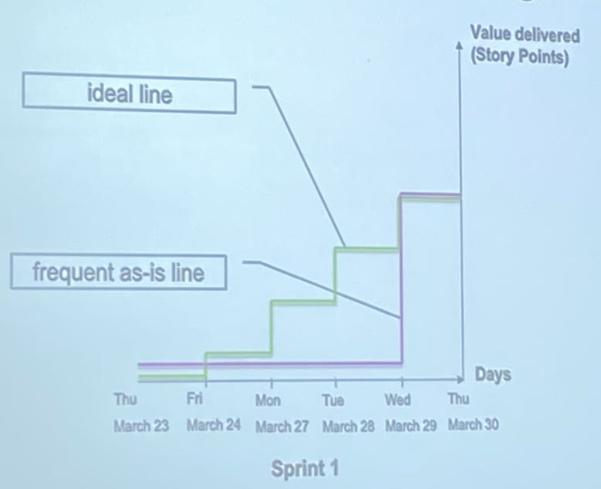
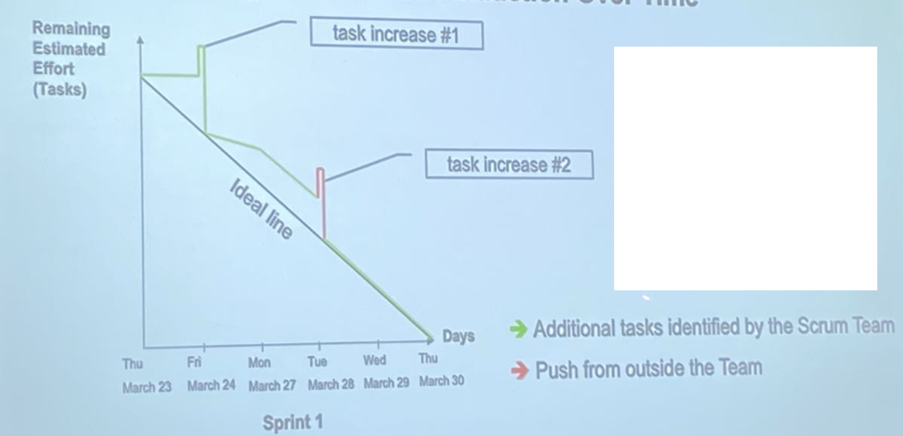
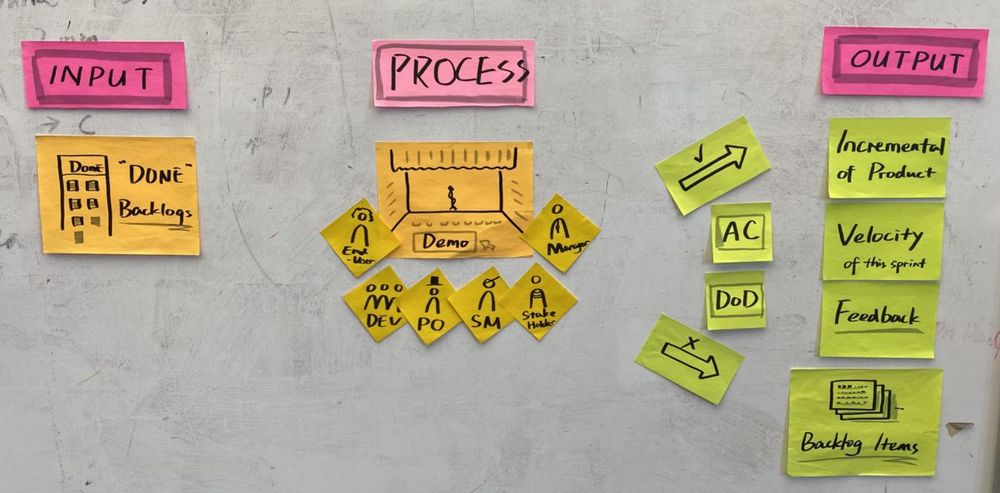
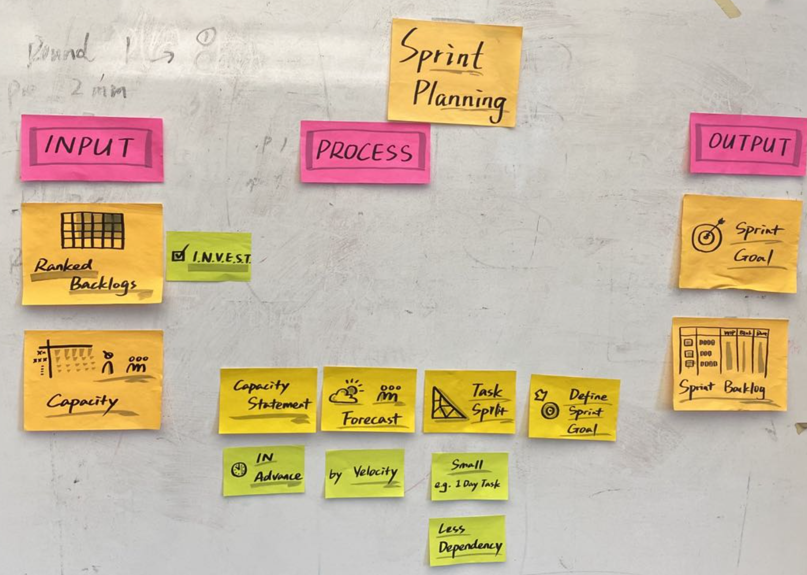

# **Scrum Traninig Review**

       | Backlog Refinement| Sprint Planning | Daily Scruem | In-sprint Inspection | Sprint Review |
-------|-------|------|------| ------ | ------ |
 Goal| Backlog "Readiness"| Sprint Goal  | Meet the goal| Early Involved | Demo & Collaboration| 
 When| Before Sprint | Enter Sprint  | Same Place / Same Time  | After Scrum | End of Sprint | 
 How Often|Every Sprint | Every Sprint  | Every Working Day| Every Working Day | Every Sprint | 
 How Long| 120min(5%-10%) | 1 Hour / 1 week Sprint | 15min|15min |1 Hour / 1 week Sprint |
 Whom| Scrum Team | Scrum Team |Scrum Team |Scrum Team |Scrum Team | 
 
## Team Burnup Chart Shows The Progress On Finishing User Stories 

Possible reasons ... 

* Too many user stories in parallel 
* One single dependency 
* **Other bottlenecks blocking everyone** 
* **Confirmation of tasks delayed** 

 

## Team Burndown Chart Shows The Progress On Task Reduction Over Time 

Possible reasons ... 

* Detailed task planning by developer 
* More insights on the backlog item 
* Unexpected effort 

 

## Backlog

1. Input (Done Backlogs)
2. Process (Demo)[End User, Dev, PO, SM, Stake Holder, Manager]
3. Output
	* Incremental of Product
	* Velocity of this Sprint  
	* Feedback

 

## Sprint Planning

1. **Input** (Backend Backlogs / Capacity)
2. **Process** 
	* Capacity Sataement (In Advance)
	* Forecast(by Velocity)
	* **Task Split (Small 1 day Task)**  / Less Dependency
	* Define Sprint Goal
3. **Output**
	* Sprint Goal
	* Sprint Backlog

 
	

## Sprint Refinement

### Input

Backlog / Item 

### Process

* Sprint N+2
* **Story Split**
	* User Value
	* Acceptance Criteria
	* Spkie

* **Share** 
	* Team Agreement

* T-Shirt Sizing (INVEST: Independent / Negotiable / Valuable / Estimable / Small / Testable)
	* Silent
	* Bounce
	* Estimation

* Re-rank
	* urgent

### **Formats of Acceptance Criteria** 

**Behavior Driven Development format** 

* Given `<some precondition>` and/or `<an alternative precondition>` 
* When `<some action by the role>` and/or `<some other action by the role>` 
* Then `<some testable outcome is achieved>` and `<some other testable outcome is achieved>
* but `<some testable exception is achieved>` 

**Example**: 

Given an order is in progress, when the order gets placed successfully then a unique order number is generated 

### **Typical User Story Formats** 

**User Story format** 

* As a `<type of user>` Who are we building it for, who the user is? 
* I want `<some goal or objective >` What are we building, what is the intention? 
* So that `<benefit, value>` Why are we building it, what value it bring for the user? 

Examples: 

* As a online shopper, I want to know the order number, so that I can track/cancel my order 
* As a stock dealer, I want to know the closing price of a stock, so that I can decide to sell or hold 

