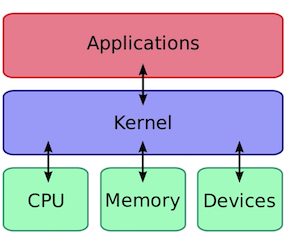
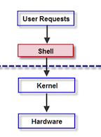
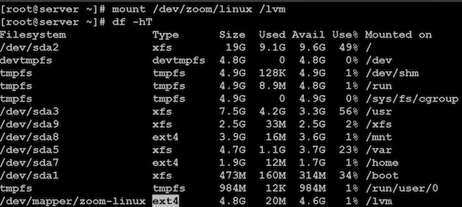
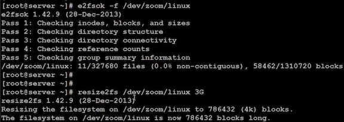
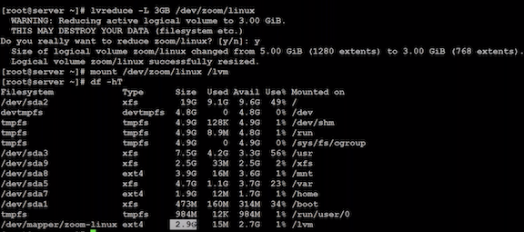
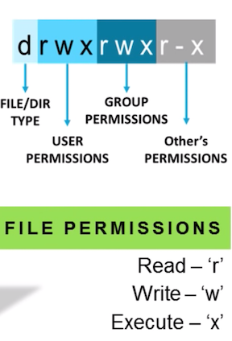
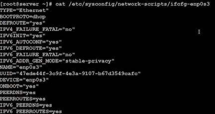
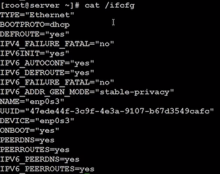
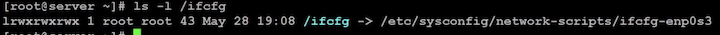
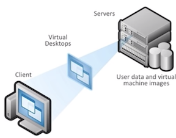

# Linux Interview Questions And Answers

## 1.What's is Linux 


* Linux is an **open-source** operating system inspired by UNIX. 
* It was first introduced by **Linus Torvalds**. 
* Linux is just a **Kernel** and a **Linux distribution** makes it a usable operating systems. 
* It's the preferred OS for computers, servers, mainframes, mobile devices and embedded devices. 


## 2.How different is Linux when compared to Unix 

* Unix is a **propriety** operating system from Bell Laboratories. 

The **Open Group** holds the **UNIX trademark & manage** the UNIX trademark licensing program. Companies have their own licensed UNIX: **IBM**(AIX), **Solaris**(Sun OS), **HP**(HP-UX), **Apple**(OSX).

* Linux is **free, open source** and intended as a **non-propriety** operating system for the masses. 

Linux is a clone of Unix, written from scratch by **Linus Torvalds** & his team. 

`Linux distro ->  GUI system + GNU utilities`. 

## 3.What is the importance of GNU project?

* **GNU** project is a result of the **Free Software Movement** started by Richard Stallman. 
* It supported the **open-source** & **collaborated development** of operating system software. 
* Acronym of GNU is **"GNU's Not Unix!"**. 
* GNU project was intended to create a UNIX-like OS; but free & open-source. 
* This lead to the birth of Linux OS -> **Linux Kernel + GNU utilities**. 

## 4.What is Linux Kernel

* The **Linux Kernel** is a **low-level systems software** whose main role is to **manage hardware resources for the user**. 
* It is the **core** of any OS & **it is responsible for translating the user commands into equivalent language understood by the computer hardware**. 





## 5.What is Shell & What is BASH

### Shell 

* The Shell is a program that takes commands from the keyboard and passes them to the operating system (kernel) for performing. 
* During the initial days, Shell was the only mode for communicating with kernel (via the CLI). 

### BASH 

* **BASH** is short for **Bourne Again SHell**. It's a replacement to the original Shell (**/bin/sh)**. 
* BASH combines the features of the **original Shell + additional functionality** to make it easier and more convenient to use. 
* Nowadays, BASH has been adopted as the default shell for most Linux systems. 



```
$ cat /etc/shells
# /etc/shells: valid login shells
/bin/sh
/bin/dash
/bin/bash
/bin/rbash
/usr/bin/tmux
/usr/bin/screen
```

## 6.What are Daemons?

* A daemon is a type of program that **runs in the background**, **free of user control**. 
* They can be activated (initiated as a process) by the occurrence of a specific event or condition.
*  Daemons accommodate service requests from other programs or hardware activity or requests from other computers on a network. 
* **After the request is serviced**, the Daemon disconnects and waits for further requests. 

### Process end with `d` are Daemons

```
$ ps -ef
UID        PID  PPID  C STIME TTY          TIME CMD
root         1     0  0 Feb28 ?        00:00:00 /sbin/init
root         2     0  0 Feb28 ?        00:00:00 [kthreadd]
root         3     2  0 Feb28 ?        00:00:09 [ksoftirqd/0]
root         5     2  0 Feb28 ?        00:00:00 [kworker/0:0H]
root         7     2  0 Feb28 ?        00:00:10 [rcu_sched]
```

## 7.What is LILO?

* **LILO** is an acronym for **Linux Loade**r. 
* It is a **boot loader**, which loads the Linux operating system into main memory so 
that it can begin its operations. 
* LILO can be configured to boot other operating systems also. 
* LILO is customizable, which means that if the default configuration is not correct, it can be changed. Config file for LILO is **lilo.conf**. 


## 8.What are advantages of Linux being Open-Source

* Being **open-source**, Linux gives users access to the source code. 
* Open source allows users to **distribute** the software, including source the code (freely) to anyone 
interested. 
* It allows users to **add features, debug** and **correct** errors in the original source code. 
* When the source code has been improved, it can be freely redistributed (**open-source collaboration**). 
* This benefits everyone in the open-source community. 


## 9.What are basic components of Linux OS

### Kernel

* Kernel is the core of Linux OS which is responsible for all the major activities. 
* It interacts directly with the underlying hardware while also providing the required abstraction to hide low level hardware details to the system or application programs. 

### Shells & GUI (System Libraries) 

* They are special functions or programs using which application programs or system utilities access Kernel's features. 
* These libraries implement most of the functionalities of the OS & do not require Kernel module's code access rights. 

### System Utilities 

* System utility programs are responsible for the execution of special and individual tasks. 


## 10.How to check memory stats and CPU stats as Linux admin

* By using **'free' & Vmstat'** command, you can see the** physical memory & virtual memory** statistics respectively. 
* By using the **'sar'** command, you can see the **CPU utilization & other stats**. 

### Free

free command for physical and swap memory usage in Linux

### vmstat

performance monitoring with "vmstat" command

### sar => System Activity Report (CPU utilization & other stats)

```
# m -> megabytes 
$ free -m
             total       used       free     shared    buffers     cached
Mem:           993        713        280          0         96        421
-/+ buffers/cache:        195        798
Swap:            0          0          0
```

```
# g -> gigabytes  
$ free -g
             total       used       free     shared    buffers     cached
Mem:             0          0          0          0          0          0
-/+ buffers/cache:          0          0
Swap:            0          0          0
```

```
# mh -> human read

$ free -mh
             total       used       free     shared    buffers     cached
Mem:          993M       713M       280M       384K        96M       421M
-/+ buffers/cache:       195M       798M
Swap:           0B         0B         0B
```

```
$ vmstat -a
procs -----------memory---------- ---swap-- -----io---- -system-- ------cpu-----
 r  b   swpd   free  inact active   si   so    bi    bo   in   cs us sy id wa st
 0  0      0 287476 169892 462392    0    0     1     2   19    8  0  0 100  0  0
```

```
# output every 2 seconds and 6 times
$ vmstat 2 6
procs -----------memory---------- ---swap-- -----io---- -system-- ------cpu-----
 r  b   swpd   free   buff  cache   si   so    bi    bo   in   cs us sy id wa st
 2  0      0 287476  98864 431576    0    0     1     2   19    8  0  0 100  0  0
 0  0      0 287468  98864 431576    0    0     0     0   20   62  0  0 100  0  0
 0  0      0 287468  98864 431576    0    0     0     0   23   61  0  0 100  0  0
 0  0      0 287468  98864 431576    0    0     0     0   17   54  0  0 100  0  0
 0  0      0 287468  98864 431576    0    0     0     0   18   55  0  0 100  0  0
 0  0      0 287468  98864 431576    0    0     0     0   21   57  0  0 100  0  0
```

```
$ sar -u
```

## 11.How to reduce or shrink the size of LVM partition

The actions need to be performed in the below order: 

* Unmount the filesystem using `unmount` command 

Syntax: `umount /dev/hda2 /dir1` 

* Use `resize2fs` command 

Syntax: `resiz32fs /dev/mapper/myvg-mylv 10G` 

* Now use the `lvreduce` command 

Syntax: `lvreduce -L 10G /dev/mapper/myvg-mylv `

The above Command will **shrink the size LVM partition and fixes the filesystem size to 10GB**. 


### for example: shrink `/dev/mapper/zoom-linux`

```
$ df -hT
# 4.8G
```



```
$ unmount /lvm

$ e2fsck -f /dev/zoom/linux

$ resize2fs /dev/zoom/linux 3g
```



```
$ lvreduce -L 3GB /dev/zoom/linux

$ mount /dev/zoom/linux /lvm

$ df -hT
# 2.9G
```


## 12.Explain the functionality of root user

* The root user is similar to a **superuser** or a **system administrator**. 
* Root user (superuser) has ultimate control and access to all files/ directories in the system. 
* Examples: Creating and maintaining user accounts, assigning different permissions for each account, etc. 
* Another advantage: restricted programs can be executed from the terminal by using the root account 
* Root is the default account every time Linux is installed. 


## 13.What is CLI & What is GUI

* **CLI** stands for Command Line Interface. This interface allows user to type declarative commands to instruct the computer to perform operations. 
* Linux CLI is called Terminal and the commands will be interpreted by the Shell. Preferred by developers/ programmers.
* Advantage: Multiple steps can be executed by specifying a single command. 


* **GUI** stands for Graphical User Interface and makes the system attractive 
* Users who find it difficult to remember commands, can use the GUI. 
* GUI allows the users to navigate/ access files by clicking on images and icons. 

## 14.How can you find out how much memory linux is using

```
$ free -mh
```

```
$ cat /proc/meminfo
MemTotal:        1017768 kB
MemFree:          287476 kB
Buffers:           98872 kB
Cached:           431576 kB
SwapCached:            0 kB
Active:           462412 kB
Inactive:         169860 kB
Active(anon):     101936 kB
Inactive(anon):      272 kB
Active(file):     360476 kB
Inactive(file):   169588 kB
Unevictable:           0 kB
Mlocked:               0 kB
SwapTotal:             0 kB
SwapFree:              0 kB
Dirty:                 0 kB
Writeback:             0 kB
AnonPages:        101860 kB
Mapped:            23928 kB
Shmem:               384 kB
Slab:              77484 kB
SReclaimable:      68324 kB
SUnreclaim:         9160 kB
KernelStack:         824 kB
PageTables:         2900 kB
NFS_Unstable:          0 kB
Bounce:                0 kB
WritebackTmp:          0 kB
CommitLimit:      508884 kB
Committed_AS:     296236 kB
VmallocTotal:   34359738367 kB
VmallocUsed:        8520 kB
VmallocChunk:   34359724540 kB
HardwareCorrupted:     0 kB
AnonHugePages:      2048 kB
HugePages_Total:       0
HugePages_Free:        0
HugePages_Rsvd:        0
HugePages_Surp:        0
Hugepagesize:       2048 kB
DirectMap4k:       38848 kB
DirectMap2M:     1009664 kB
```

## 15. What is Swap space

### What is the typical size for a swap partition under linux system

* **Swap space** is a certain amount of space **used by Linux to temporarily** hold active programs. **This happens when RAM does not have enough memory to hold all programs that are being executed. Swap space is defined in File System.** 
* The **preferred size** for a swap partition is **twice the amount of physical memory available on the system**. If this is not possible, then the minimum size should be the same as the amount of memory installed. 


## 16.How to you access partitions under Linux

```
$ sudo fdisk -l

Disk /dev/sda: 42.9 GB, 42949672960 bytes
4 heads, 32 sectors/track, 655360 cylinders, total 83886080 sectors
Units = sectors of 1 * 512 = 512 bytes
Sector size (logical/physical): 512 bytes / 512 bytes
I/O size (minimum/optimal): 512 bytes / 512 bytes
Disk identifier: 0x000c5984

   Device Boot      Start         End      Blocks   Id  System
/dev/sda1   *        2048    83886079    41942016   83  Linux
```

## 17.How are hard drives and floppy drives referred in Linux filesystem

* Floppy drives can be accessed by using: **`/dev/fd0`** and **`/dev//fdl`**
* IDE/EIDE hard drives can be accessed by using: **`/dev/hda`**, **`/dev/hdb`**, **`/dev/hdc`**, and so forth. 


## 18.In linux, how are names are assigned to different serial ports

* Serial ports are identified as `/dev/ttyS0` to `/dev/ttyS7`. 
* These are the equivalent names of **COM1** to **COM8** in Windows. 

```
$ ls -l /dev/ttyS*
crw-rw---- 1 root dialout 4, 64 Feb 15 08:18 /dev/ttyS0
crw-rw---- 1 root dialout 4, 65 Feb 15 08:18 /dev/ttyS1
crw-rw---- 1 root dialout 4, 74 Feb 15 08:18 /dev/ttyS10
crw-rw---- 1 root dialout 4, 75 Feb 15 08:18 /dev/ttyS11
crw-rw---- 1 root dialout 4, 76 Feb 15 08:18 /dev/ttyS12
crw-rw---- 1 root dialout 4, 77 Feb 15 08:18 /dev/ttyS13
crw-rw---- 1 root dialout 4, 78 Feb 15 08:18 /dev/ttyS14
crw-rw---- 1 root dialout 4, 79 Feb 15 08:18 /dev/ttyS15
crw-rw---- 1 root dialout 4, 80 Feb 15 08:18 /dev/ttyS16
crw-rw---- 1 root dialout 4, 81 Feb 15 08:18 /dev/ttyS17
crw-rw---- 1 root dialout 4, 82 Feb 15 08:18 /dev/ttyS18
crw-rw---- 1 root dialout 4, 83 Feb 15 08:18 /dev/ttyS19
...
```

```
$ ls -l /dev/lp*
```

## 19.How are parallel ports (like printers) referenced in Linux


In Linux, parallel ports are referred to as **/dev/IpO**, **/dev/lp1** , **/dev/lp2** and so forth. 

## 20.What are kind of permissions available in Linux

### There are basically 3 levels of file/ directory permissions in Linux: 

* **Read**: Users only read the files or list the directory contents 
* **Write**: Users can write information to the file and create files/ sub-directories in a directory 
* **Execute**: Users can run the file or lookup a specific file within a directory 


Besides these, you can have a combination of all these three levels of permissions or two of them or only one of them. 




## 21.How to change permissions under Linux

The following commands are used along with operators as arguments:

* **chmod** : To change the permissions of files and directories 
* **chown** : To change the owner of files and directories 
* **chgrp** : To change the group ownership of file and directories

Examples: 

* `chmod g+wx,o-wx,u=rwx filename` 
* `chown username filename`

### Denotions 

* Users - `u`
* Groups - `g`
* Others - `o`
* All - `a`

### Operators

* Add permission: `+`
* Revoke permission: `-`
* Replace permission: `=`


## 22.What are Symbolic links

* **Symbolic links are similar to shortcuts** in Windows. Also called **Soft links**. 
* Symbolic links can point to either programs or files or directories; but **do not contain the data in the target file**. 
* **Benefit**: Allows instant access to a file without having to navigate to the entire pathname. 

```
$ cat /etc/sysconfig/network-scripts/ifcfg-enp0s3
```



```
$ ln -s /etc/sysconfig/network-scripts/ifcfg-enp0s3 /ifcfg
```






## 23.What are qualities of soft links

* Soft link files have different inode numbers compared to the source file. 
* The soft link file will be of no use if original file is deleted.
* Soft links are not updated. 
* They can create links between directories.
* They can cross file system boundaries. 


## 24.What are Hard links

* **Hard links point directly to the physical file on disk, and not to the path name**. 
* Even if you rename or move the original file, this link will not break. 
* Since this link points to the file itself and not the path where the file is located. 

## 25.What is maximum length of filename under linux

* The filename can have maximum of 255 characters 
* This limit does not include path name

## 26.Which type of files are prefixed with a dot?

* Filenames that are prefixed with a dot are **hidden files**. 
* These hidden files can be configuration files that **hold important data or setup info**. 
* Setting these files as hidden makes it **less likely to be accidentally deleted**. 


## 27.What is virtual desktop?

* When a user's desktop environment (icons, wallpaper, windows, folders, toolbars, widgets, etc.) is stored in a remote server, rather than on a local PC, then it's called a **virtual desktop**. 
* Desktop virtualization software separates the server and the client. 
* The remote server supporting virtual desktops uses a software called hypervisor to create a "**virtual machine**" that simulates the user's desktop environment. 
* Internet connection is the only need for accessing virtual desktops. 



## 28.What is the benefit of Virtual desktops in Linux

**You can share a program/ file/ directory across various virtual desktops using Linux OS.**

* To share a program across different virtual desktops, press the pushpin button in the upper left-hand corner of a 
program window. 
* This will cause the "pinned" application to appear in all virtual desktops, in the same position onscreen. 

## 29.What does a nameless(empty) directory represent?

* An empty directory name serves as a nameless base for the Linux file system
* This severs as an attachment for all directories, files, drives and devices

## 30.How can you create folders and files using the terminal


* To create a folder the command used is: **mkdir**
* To create a file any of the following commands can be used: 
  * **vi** 
  * **vim** 
  * **gedit** 
  * **nano** and many more. 


## 31.What are different ways to view the contents of a file

To view file contents, you can use any of Linux's inbuilt editor or a graphical editor. Some of them are: 

* cat 
* vi 
* vim 
* gedit 
* kate/kwrite 
* pico 
* nano and many more. 

## 32.What are environmental variables

* Environmental variables are global settings that control the behavior of Shell, **software packages installed in Linux and other processes**. 
* The path where the various software's are installed, will be stored as environment variables.
* Environmental variables are thus used to pass information into processes that are spawned from the shell. 

## 33.What are functionality of `tab` ket in CLI

* `Tab` key is a shortcut key which is used to **autofill the complete filename/ pathname of any file or directory**. 
* For example, while navigating to a directory, the next directory in the path is shortlisted. typing in a few characters like: `/ho[tab]/edur[tab]/Docu[tab]/Fo[tab]/Fi[tab]`

```
$ ca # double click tab
caffeinate  cal         calendar    caller      cancel      cap_mkdb    captoinfo   case        cat
```

## 34. What is Redirection in Linux

* In Linux, Redirection is used to pass the output of one operation as input to another operation in the same command. 
* The operator used for Redirection is **`>'** 
* Examples:  
   * `cat file1 file2 > file3.txt` 
   * `cat >> filel.txt`

```
$ w
 06:54:41 up 8 days, 23:53,  1 user,  load average: 0.08, 0.03, 0.05
USER     TTY      FROM             LOGIN@   IDLE   JCPU   PCPU WHAT
vagrant  pts/0    10.0.2.2         06:54    0.00s  0.06s  0.00s w

$ w > w.log

$ cat w.log
 06:54:49 up 8 days, 23:53,  1 user,  load average: 0.06, 0.03, 0.05
USER     TTY      FROM             LOGIN@   IDLE   JCPU   PCPU WHAT
vagrant  pts/0    10.0.2.2         06:54    0.00s  0.07s  0.00s w
```

## 35. What is GREP command

* To search for a particular string/ word in a text file `grep' command is used. 
* It also supports pattern-based searching. 
* Pattern-based searching is done by including options and parameters in the command. 


## 36.How to terminate an ongoing process in Linux

* Every process in the Linux system is identified by a unique process id or `pid`. 
* To terminate any process, use the 'kill' command followed by its pid. 
* To **terminate all process at once**, use `kill 0`. 
* You can also terminate an ongoing process by pressing **`ctrl + Z`**. 


## 37.How to insert comments in command prompt

* Comments are inserted by using the **`#`** symbol before the comment text. 
* When **`#`** is prefixed to any line, then that line is ignored and will not be executed by the Shell. 

## 38.Can you insert several commands in a single command line entry?

- Several commands can be combined by separating each of them by using a semicolon(;). 
- For example, you can issue such a series of commands in a single entry. 

## 39.Write a command that will display all ".txt" files, along with its permissions

**`ls -a -l *.txt`**

* **ls** command will list down all the content in the directory. 
* **-a** is used to include even hidden files. 
* **-l** is used to display the contents in long format. 
* **.txt** filters the results and displays only .txt files. 

## 40.Write a command that will look for files with "txt" extension, and has special "string" in it


```
$ find / -name *.txt | Xargs grep -i "example"
```
## 41.How to find the status of a process

```
$ ps aux
USER       PID %CPU %MEM    VSZ   RSS TTY      STAT START   TIME COMMAND
root         1  0.0  0.2  33624  2960 ?        Ss   Mar01   0:00 /sbin/init
root         2  0.0  0.0      0     0 ?        S    Mar01   0:00 [kthreadd]
root         3  0.0  0.0      0     0 ?        S    Mar01   0:09 [ksoftirqd/0]
```

```
$ ps aux | grep pid
```
## 42.What is the command to calculate the size of a folder

The following command can be used to find the size of a folder:

```
$ du -sh folder-names
```


## 43.How to check the memory status of the system

You can use the **'free'** command to check the memory status of the system. 

* `$ free -m // Displays the output in MB` 
* `$ free -g // Displays the output in GB `

## 44.How to log in as root in Linux from the terminal

The **`su`** command can be used to switch user account to root user (superuser). 

```
$ su root 
# apt-get update 
```

The `**sudo**' command can be used to execute only that command as root user. 

`$ sudo apt-get update`

## 45.How can you run a Linux program in the background simultaneously when you start your Linux Server?

* By using the `**nohup**' command, the process will run in the background. 
* The process receiving the **NOHUP** signal will be terminated when you log out of the program, which was used to invoke it. 

## 46. Which daemon tracks events on your system

The **syslogd** daemon tracks the system information and saves it to specified log files

## 47. What is partial backup

When you select only a portion of your file hierarchy or a single partition for backup, it called partial backup

## 48. What is an Inode?

* Contents of the file will be stored in Data blocks. 
* Whereas, information about that file will be stored in **Inode**. 
* The information stored would be: 
  * File-size  
  * Number of hard links to the file 
  * Mode/permission (protection) 
  * Time last accessed  
  * Owner ID
  * Time last modified 
  * Group ID 
  * Time Inode last modified 

## 49. Which command is used to set a processor-intensive job to execute in less CPU time

* Priority of the jobs can be changed by using the '**nice**' command. 
* Syntax:

`nice [OPTION] [COMMAND [ARG]...]`
 
* Priority ranges from -20 to 19 where, **`-20` is the highest priority and `19` is the lowest priority.** 

## 50. What are shadow passwords? And how are they enabled

* Shadow passwords are given for better system security.
* Every user's password will be stored in `/etc/passwd` file. 
* By implementing shadow passwords, all passwords will be stored in encrypted form in a new file: `/etc/passwd` 
* Passwords in the original file will then be replaced with 'x'. 

```
$ ls -l /etc/passwd
-rw-r--r-- 1 root root 1457 Jul 24  2018 /etc/passwd
```

```
$ ls -l /etc/shadow
-rw-r----- 1 root shadow 986 Jul 24  2018 /etc/shadow
```
