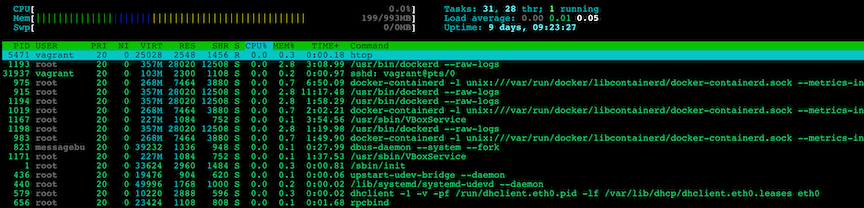
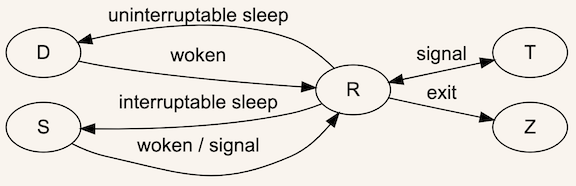

# Linux Sysadmin Basics - Process

## Process overview

**Process id 1 is always `init`, mother of all processes.**

```
$ ps aux
USER       PID %CPU %MEM    VSZ   RSS TTY      STAT START   TIME COMMAND
root         1  0.0  0.2  33624  2960 ?        Ss   Mar01   0:00 /sbin/init
root         2  0.0  0.0      0     0 ?        S    Mar01   0:00 [kthreadd]
root         3  0.0  0.0      0     0 ?        S    Mar01   0:09 [ksoftirqd/0]
root         5  0.0  0.0      0     0 ?        S<   Mar01   0:00 [kworker/0:0H]
root         7  0.0  0.0      0     0 ?        S    Mar01   0:11 [rcu_sched]
root         8  0.0  0.0      0     0 ?        S    Mar01   0:17 [rcuos/0]
...
```

**`htop`**



* You can have **two init processes**, one is host machine so the real machine and another one is on the virtual machine


**Parent process IDs**, **each process is spawned by some parents**. If the parent process died, so the process without parent will reparent under init process. **Init is mommy process for all processes whose parents have died**


### Other definitions

#### UID

UID of process, which user owns this process, for example `statd` own process `rpc.statd -L`

#### niceness

How nice is this process being to others, **low priority with higher the niceness number,** you set low priority task with high niceness number

### Basic life-cycle of process

* All process are created by other process first
* Parent process needs to spawn some other program or process
     1. Parent process **forks or clones itself**
     2. After fork, there are **two identical process**(give two different return number and to track which is which )
     3. The child process will start other program like a new program or process
     4. Kernel start it during boot (new process)
     5. **Init process is first initial process using boot**
     6. **Death**: end of process is life process, will generally have a system call exit, with return value
     7. Tell kernel I'm done, the kernel will kill the process and notify the parents process


## Process Signals

[SIGNAL Page](http://man7.org/linux/man-pages/man7/signal.7.html)

### Standard signals
	
```	
		Signal        x86/ARM     Alpha/   MIPS   PARISC   Notes
		SIGHUP           1           1       1       1
       SIGINT           2           2       2       2
       SIGQUIT          3           3       3       3
       SIGILL           4           4       4       4
       SIGTRAP          5           5       5       5
       SIGABRT          6           6       6       6
       SIGIOT           6           6       6       6
       SIGBUS           7          10      10      10
       SIGEMT           -           7       7      -
       SIGFPE           8           8       8       8
       SIGKILL          9           9       9       9
       SIGUSR1         10          30      16      16
       SIGSEGV         11          11      11      11
       SIGUSR2         12          31      17      17
       SIGPIPE         13          13      13      13
       SIGALRM         14          14      14      14
       SIGTERM         15          15      15      15
       SIGSTKFLT       16          -       -        7
```

* Signals can be **sent by the kernel** when a process does something really bad
* They also send two processes to **notify** the parent process
* Signals are really how process **communicate information about themselves to each other and to the kernel and how the kernel communicates information about the state of the system in the state of the hardware to processes**, 

```
$ kill -l
 1) SIGHUP	 2) SIGINT	 3) SIGQUIT	 4) SIGILL	 5) SIGTRAP
 6) SIGABRT	 7) SIGBUS	 8) SIGFPE	 9) SIGKILL	10) SIGUSR1
11) SIGSEGV	12) SIGUSR2	13) SIGPIPE	14) SIGALRM	15) SIGTERM
16) SIGSTKFLT	17) SIGCHLD	18) SIGCONT	19) SIGSTOP	20) SIGTSTP
21) SIGTTIN	22) SIGTTOU	23) SIGURG	24) SIGXCPU	25) SIGXFSZ
26) SIGVTALRM	27) SIGPROF	28) SIGWINCH	29) SIGIO	30) SIGPWR
31) SIGSYS	34) SIGRTMIN	35) SIGRTMIN+1	36) SIGRTMIN+2	37) SIGRTMIN+3
38) SIGRTMIN+4	39) SIGRTMIN+5	40) SIGRTMIN+6	41) SIGRTMIN+7	42) SIGRTMIN+8
43) SIGRTMIN+9	44) SIGRTMIN+10	45) SIGRTMIN+11	46) SIGRTMIN+12	47) SIGRTMIN+13
48) SIGRTMIN+14	49) SIGRTMIN+15	50) SIGRTMAX-14	51) SIGRTMAX-13	52) SIGRTMAX-12
53) SIGRTMAX-11	54) SIGRTMAX-10	55) SIGRTMAX-9	56) SIGRTMAX-8	57) SIGRTMAX-7
58) SIGRTMAX-6	59) SIGRTMAX-5	60) SIGRTMAX-4	61) SIGRTMAX-3	62) SIGRTMAX-2
63) SIGRTMAX-1	64) SIGRTMAX
```

Run this code and so that this signal will handled inside of this process

### 9) SIGKILL and 15) SIGTERM

```
$ kill
kill: usage: kill [-s sigspec | -n signum | -sigspec] pid | jobspec ... or kill -l [sigspec]
```

#### `kill -15 pid`

The 15 signal kills the process too but only after the process has had a chance to mop up and clean up what it was doing, flush any buffers, or do any other housekeeping, before the process is terminated.

**So `SIGTERM` kill can be caught and ignored**

#### `kill -9 pid`

The 9 signal kills a process period. Saying that it cannot be caught means that the process cannot receive this signal so as to be able to do anything with it. Other than be terminated. No flushing of buffers. No nothing. **Just terminated**. 


### killall

```
$ sudo killall pid
```

### kill all process start by one user

```
$ sudo pkill -u username
```

```
$ sudo pkill -u vagrant
```


## Linux process states

As in every Unix flavour, in Linux a process can be in a number of states. It's easiest to observe it in tools like `ps` or `top`: it's usually in the column named `S`. The documentation of `ps` describes the possible values:

```
PROCESS STATE CODES
   R  running or runnable (on run queue)
   D  uninterruptible sleep (usually IO)
   S  interruptible sleep (waiting for an event to complete)
   Z  defunct/zombie, terminated but not reaped by its parent
   T  stopped, either by a job control signal or because
      it is being traced
   [...]
```

A process starts its life in an `R` "running" state and finishes after its parent reaps it from the `Z` "zombie" state.



### Zombies

A zombie process is a process that exited successfully, but its state change wasn't yet acknowledged by the parent. That is, the parent didn't call `wait()` / `waitpid()` functions.

The `Z` "zombie" process state is required in order to give a parent time to ask the kernel about the resources used by the deceased child, using `getrusage(2)`. A parent informs a kernel that it's done with the child by calling `waitpid`.

## The `/proc` Filesystem

```
$ man proc
```

```

NAME
  proc - process information pseudo-filesystem

DESCRIPTION
  The  proc  filesystem is a pseudo-filesystem which provides an interface to kernel data 
structures.  It is commonly mounted at /proc.  Most of it is read-only, but some files allow 
kernel variables to be changed.
```

```
$ ls -l /proc
total 0
dr-xr-xr-x  9 root       root                     0 Feb 15 08:18 1
dr-xr-xr-x  9 root       root                     0 Feb 15 08:18 10
dr-xr-xr-x  9 root       root                     0 Feb 15 08:18 1065
dr-xr-xr-x  9 root       root                     0 Feb 15 08:18 1068
dr-xr-xr-x  9 root       root                     0 Feb 15 08:18 1072
dr-xr-xr-x  9 root       root                     0 Feb 15 08:18 1073
dr-xr-xr-x  9 root       root                     0 Feb 15 08:18 1075
dr-xr-xr-x  9 root       root                     0 Feb 15 08:18 109
...
```

```
$ sudo ls -alh /proc/1
total 0
dr-xr-xr-x  9 root root 0 Feb 15 08:18 .
dr-xr-xr-x 89 root root 0 Feb 15 08:18 ..
dr-xr-xr-x  2 root root 0 Mar 11 09:05 attr
-rw-r--r--  1 root root 0 Mar 11 09:05 autogroup
-r--------  1 root root 0 Mar 11 09:05 auxv
-r--r--r--  1 root root 0 Feb 15 08:18 cgroup
--w-------  1 root root 0 Mar 11 09:05 clear_refs
-r--r--r--  1 root root 0 Feb 15 08:18 cmdline
-rw-r--r--  1 root root 0 Mar 11 09:05 comm
-rw-r--r--  1 root root 0 Mar 11 09:05 coredump_filter
-r--r--r--  1 root root 0 Mar 11 09:05 cpuse
```

```
$ cat /proc/1/cmdline
/sbin/init
```

```
$ sudo cat /proc/1/environ
HOME=/init=/sbin/initrecovery=TERM=linuxBOOT_IMAGE=/boot/vmlinuz-3.13.0-135-genericPATH=/sbin:/usr/sbin:/bin:/usr/binPWD=/rootmnt=/root
```

## strace

`$ man strace`

```
NAME
 strace - trace system calls and signals

DESCRIPTION
       In the simplest case strace runs the specified command until it exits.  It intercepts and records the system calls which are called by a  process
       and  the signals which are received by a process.  The name of each system call, its arguments and its return value are printed on standard error
       or to the file specified with the -o option.

       strace is a useful diagnostic, instructional, and debugging tool.  System  administrators,  diagnosticians  and  trouble-shooters  will  find  it
       invaluable  for  solving problems with programs for which the source is not readily available since they do not need to be recompiled in order to
       trace them.  Students, hackers and the overly-curious will find that a great deal can be learned about a system and its system calls  by  tracing
       even  ordinary  programs.   And  programmers will find that since system calls and signals are events that happen at the user/kernel interface, a
       close examination of this boundary is very useful for bug isolation, sanity checking and attempting to capture race conditions.
```

      


