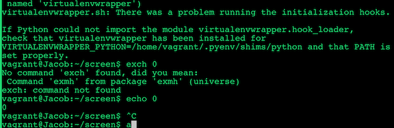

# How to use GNU SCREEN - the Terminal Multiplexer

### 1.Open screen

```
$ screen 
```


### 2.`Ctrl + a + d` exit the screen and detach from screen

```
[detached from 9364.pts-0.Jacob]
```


### 3.List screen 

```
$ screen -ls
There is a screen on:
        9364.pts-0.Jacob        (03/12/2019 02:23:37 AM)        (Attached)
1 Socket in /var/run/screen/S-vagrant.
```

#### It's actual a process and 9364 is process id

```
$ ps -e | grep 9364
 9364 ?        00:00:00 screen
```
```
$ ps aux | grep 9364
vagrant   9364  0.0  0.1  25912  1440 ?        Ss   02:23   0:00 SCREEN
```

### 4.`screen -r` reattach the screen

```
$ screen -r
```

#### Within the screen use `screen -r`

```
$ screen -r
There is a screen on:
        9364.pts-0.Jacob        (03/12/2019 02:23:38 AM)        (Attached)
There is no screen to be resumed.
```

### 5. Create second screen

```
$ screen -S scondscreen
```

```
$ screen -ls
There are screens on:
	10393.scondscreen	(03/12/2019 02:52:28 AM)	(Detached)
	9364.pts-0.Jacob	(03/12/2019 02:23:38 AM)	(Detached)
2 Sockets in /var/run/screen/S-vagrant.
```

#### Reattach the second screen

```
$ screen -r scondscreen
```

### 6. Quit one session from outside

```
$ screen -ls
There are screens on:
	10393.scondscreen	(03/12/2019 02:52:28 AM)	(Detached)
	10088.pts-0.Jacob	(03/12/2019 02:52:01 AM)	(Detached)
	9364.pts-0.Jacob	(03/12/2019 02:23:38 AM)	(Detached)
3 Sockets in /var/run/screen/S-vagrant.
```

**`screen -X -S pid quit`**

```
$ screen -X -S 10088 quit
$ screen -ls
There are screens on:
	10393.scondscreen	(03/12/2019 02:52:28 AM)	(Detached)
	9364.pts-0.Jacob	(03/12/2019 02:23:38 AM)	(Detached)
2 Sockets in /var/run/screen/S-vagrant.
```

### 7. kill the process from inside screen

`screen -r`

`ctrl + a` + `k`


### 8. create multiple windows inside screen

#### Create new screen

**`ctrl + a` + `c`**

#### List all screen

**`ctrl + a` + `w`**


#### Move forward

**`ctrl + a` + `n`**

#### Move backward

**`ctrl + a` + `p`**

#### Kill all window

**`ctrl + a` + `\`**


#### Select special screen

**`ctrl + a` + `w`**


**`ctrl + a` + `window number`**

**`ctrl + a` + `0`**

**`ctrl + a` + `1`**

**`ctrl + a` + `2`**

#### List screen vertically and switch screen

**`ctrl + a` + `"`**   =>. **`ctrl + a` + `shift+'`** 


**`ctrl + a` + `'`** 


#### Set name for one window

**`ctrl + a` + `shift+a(A)`** 


#### Split screen vertically

**`ctrl + a` + `shift+\(|)`**


No bash available in second window

#### Start bash in second window

**`ctrl + a` + `tab`**


#### Set which screen available in second bash

**`ctrl + a` + `window num`**



#### Split screen horizontally 

**`ctrl + a` + `shift+s(S)`**


**`ctrl + a` + `tab`**

**`ctrl + a` + `1`**


#### Close one window

**`ctrl + a` + `shift+x(X)`**


#### Lock screen

**`ctrl + a` + `x`**


### 9.check time inside screen

**`ctrl + a` + `t`**


### 10.kill all windows

**`ctrl + a` + `\`**


### 11.run code in screen

`tiime.py`

```
import time

for i in range(5):
        print(time.ctime(time.time()))
        time.sleep(1)
```

```
$ python3 time.py
Tue Mar 12 06:14:26 2019
Tue Mar 12 06:14:27 2019
Tue Mar 12 06:14:28 2019
Tue Mar 12 06:14:29 2019
Tue Mar 12 06:14:30 2019
```

```
$ screen -d -m python3 time.py
```

### 12.Want help on screen

**`ctrl + a` + `?`**


