# Bash Basic Script

* What is Bash?
* Managing output with grep, awk, and cut
* Understanding Bash script syntax
* Creating a basic Bash script
* Displaying text with "echo"
* Working with numbers, strings, and arrays
* Reading and writing text files
* Working with loops
* Using functions
* Getting user input during execution
* Ensuring a response

## Working with the command line

### What's Bash? 

* Bourne Again SHell 
* a popular interactive command line interpreter 

#### History 1989: 

**Bourne Again Shell (Bash)**
 
* adds echo, printf, read d
* eclare, bind, alias 
* shell expansions 
* shell arithmetic 
* extended test construct 

### Tilde and brace expansion

* Tilde `~`

**The tilde character represents the value of the user's home variable.** 

The tilde followed by a dash or a minus represents the batch variable called old PWD, which is the directory that you were just in, if you've recently changed directories.

* braces `{}`

This is written with braces around an expression, and **it can help with repeated commands with different terms or interpolation within a range.**

```
$ touch {apple,banna,cherry,durian}
$ ls
apple banna cherry durian
$ touch file_{1..1000}
$ touch file_{01..1000}
$ echo {1..10..2}
1 3 5 7 9
$ echo {1..10..3}
1 4 7 10
$ echo {A..Z}
A B C D E F G H I J K L M N O P Q R S T U V W X Y Z
```

### Chaning where things go with pipes and redirection

```
$ cp -v * ../folderone 1 >../success.txt 2> ../error.txt
```

* `-v` output verbose, action message. The `v` here tells the cp command to be verbose, so we see each copy operation
* These numbers, 1 and 2, represent the standard output and standard error, respectively. `1`=>`standard output`, `2`=>`standard error`
* So the successes will go to a file called success.txt. And the errors will go into a file called error.txt.

```
$ cp -v * ../folderone 1 &> log.txt
```

* `&>` redirect standard output and standard error to the same place `log.txt`

```
ls > /dev/null
```

* `> /dev/null` Get rid of of or ignore the putput


### Manuipulating output with grep, awk and cut


#### `grep` to search


##### Add colors to grep

```
$ grep --color=auto localhost auth.log
```

```
$ export GREP_OPTIONS='--color=auto'
```

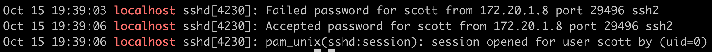


* `-i` case insensitive

```
$ grep -i break-in auth.log

Oct 15 19:11:50 localhost sshd[4218]: reverse mapping checking getaddrinfo for 172.25.200.11.rdns.example.com [172.25.200.11] failed - POSSIBLE BREAK-IN ATTEMPT!
Oct 15 19:11:52 localhost sshd[4220]: reverse mapping checking getaddrinfo for 172.25.200.11.rdns.example.com [172.25.200.11] failed - POSSIBLE BREAK-IN ATTEMPT!
```

##### Use aws to list specific things

**list 12th col things**

```
$ grep -i break-in auth.log | awk {'print $12'}

...
[172.25.200.11]
[172.25.200.11]
[172.25.200.11]
[172.25.200.11]
[172.25.200.11]
[172.25.200.11]
...
```

**get response time**


```
$ ping -c 1 example.com | grep 'bytes from' | cut -d = -f 4
```

* `ping -c`: set the count of the pings that it sends
* `cut`:  cut which lets you slice up lines based on a particular criteria
* `-d`: specify a delimiter
* `= -f 4`:  I want field four

```
$ ping -c 1 example.com
PING example.com (93.184.216.34) 56(84) bytes of data.
64 bytes from 93.184.216.34 (93.184.216.34): icmp_seq=1 ttl=128 time=199 ms
```

```
$ ping -c 1 example.com | grep 'bytes from'
64 bytes from 93.184.216.34 (93.184.216.34): icmp_seq=1 ttl=128 time=199 ms
```

```
$ ping -c 1 example.com | grep 'bytes from' | cut -d = -f 4
199 ms
```

### Bash Script syntax

* **Bash script syntax Bash refers to the whole shell**
 
 * Usually just one command 

* A script can contain 
  * Variables 
  * Arguments 
  * Flow-control logic 


`#!/bin/bash`

`#comment`

## Bash Script

### `echo`

```
#!/bin/bash
#This is a basic bash script

greeting='hello'

echo $greeting, world \( planet \)!
echo '$greeting, world \( planet \)!'
echo "$greeting, world ( planet )!"
```

* `\( \)`: special characters, you have to escape them with a `\`
* `''`: `''` where nothing inside of the quotes gets interpreted. So everything comes out literally, even if I put a variable inside

### `variable`

```
#!/bin/bash
# This is a basic bash script

a=Hello
b="Good Morning"
c=16

echo $a
echo $b
echo $c
```

#### Adding attributes to variables 

* `declare -i d=123`          # d is an integer
* `declare -r e=456`          # e is rad-only
* `declare -1 f="LOLCats"`    # f is lolcats
* `declare -u g="LOLCats"`    # g is LoLCATS

**Built-in variabel**

```
$ echo $PWD 
# return current directory
```

```
$ echo $MACHTYPE
x86_64-apple-darwin18
```

```
$ echo $HOSTNAME
# Return system name
C02S710EG8WM
```

```
$ echo $SECONDS
Return the number of sconds the bash sessions has run
```

```
$ echo $BASH_VERSION
3.2.57(1)-release
# Return version of bash
```

#### substition

```
#!/bin/bash

a=$(ping -c 1 example.com | grep 'bytes from' | cut -d = -f 4)
echo "This ping was $a"
```

```
$ bash 3sub.sh
$ This ping was 146.465 ms
```

### Arithmetic operations

```
$ val=$(( expression ))
```

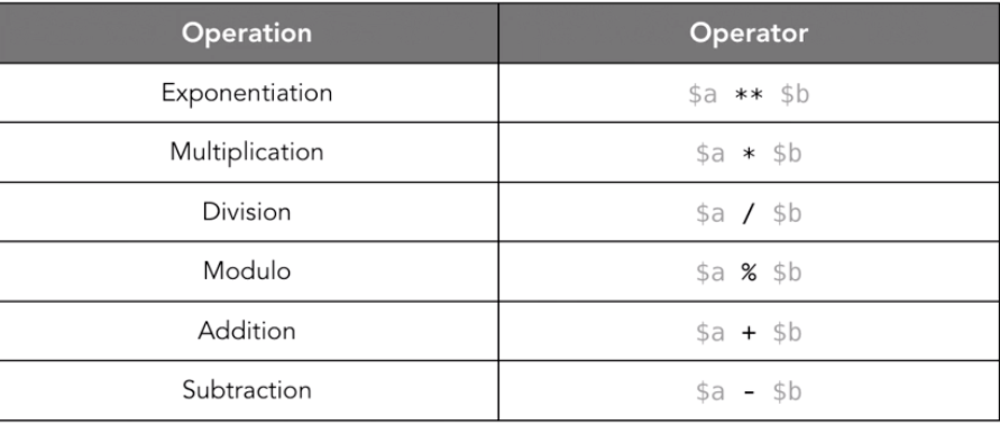

```
#!/bin/bash 
# This is a basic bash script. 
d=2 
e=$((d+2)) 
echo $e 
((e++)) 
echo $e 
((e--)) 
echo $e 
echo 
echo $((e+=5))
echo  
echo $e 
((e*=3)) 
echo $e 
((e/=3)) 
echo $e 
((e-=5))
echo $e
```

```
4
5
4

9

9
27
9
4
```


```
#!/bin/bash 
f=$((1/3))
echo $f
g=$(echo 1/3 | bc -l)
echo $g
```

```
0
.33333333333333333333
```

**`| bc -l`**

`bc -l, {- -mathlib } : Define the standard math library`


### Comparing values

```
 [[ expression ]] 
```

* 1: `False`
* 0: `True`

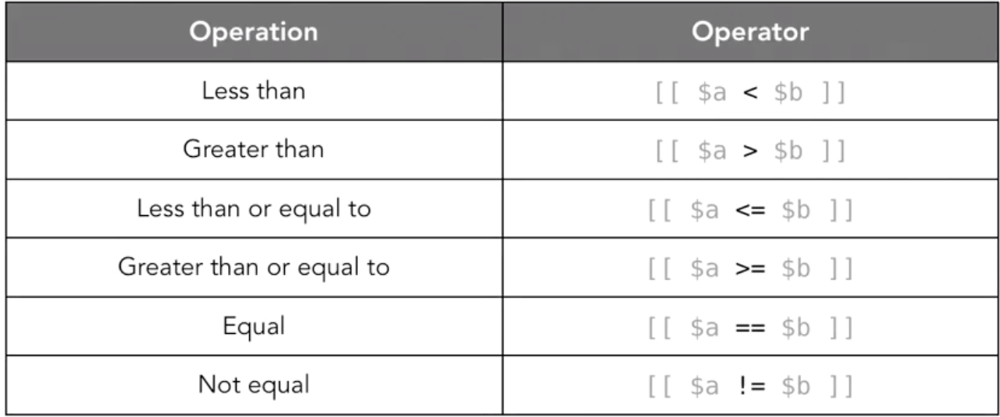

```
#!/bin/bash 
# This is a basic bash script. 
[[ "cat" == "cat" ]]
echo $?

[[ "cat" = "dog" ]]
echo $?

[[ 20 > 100 ]]
echo $?
```

```
0
1
0
```

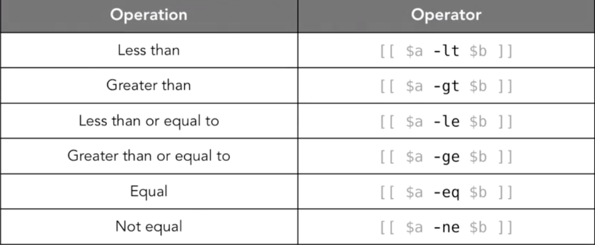

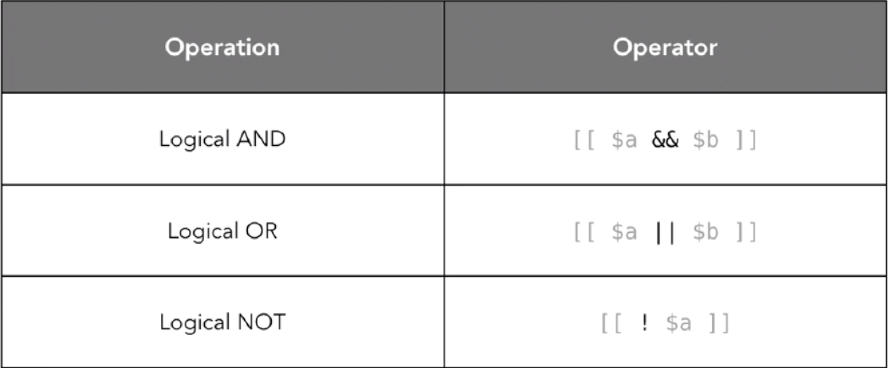

**String null value**

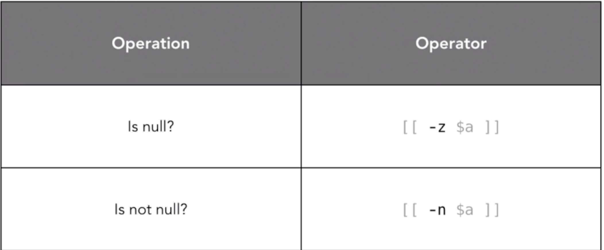

```
a=""
b="cat"
[[ -z $a || -n $b ]]
echo $?
```
```
0
```

### String

```
a="hello"
b="world"
c=$a$b
echo $c
```

* **concat** : `$a$b`

```
echo ${#a}
echo ${#c}

5
10
```

* **count string number**: `${#a}` 

```
d=${c:3}
echo $d

loworld
```

* `slice the string start from 3`

```
e=${c:3:4}
echo $e

lowo
```

* `start from 3 and asking for 4 characters`


```
r=${c: -4}
echo $r

orld
```

* `start from last 4 letters`

```
t=${c: -4:3}
echo $t

orl
```

* `start from last 4 letters and asking 3 characters`


##### Replace

```
$ fruit= "apple banana banana cherry"

echo ${fruit/banana/durian}   # change 1st banana with durian
apple durian banana cherry 

 
echo ${fruit//banana/durian}   # change all bananas with durian
apple durian durian cherry 

echo ${fruit/#apple/durian}   # only change very beginng of string
durian banana banana cherry

echo ${fruit/#bananan/durian}  # unchanged
durian banana banana cherry

echo ${fruit/%cherry/durian}   # only change very end of string
apple banana banana durian

echo ${fruit/%banana/durian}   # unchanged
durian banana banana cherry
```

### Coloring and styling text

```
#!/bin/bash
echo  -e '\033[34;42mColor Text\033[0m'
```

* `\033[34;42m`: escaped sequence
* `\033[0m`: reset the color

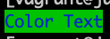

#### Color text

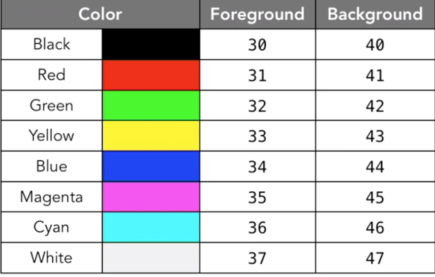

#### Color example

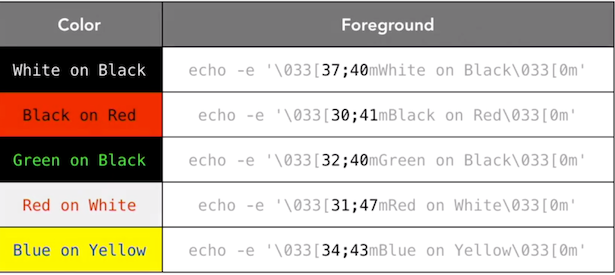

#### Style text

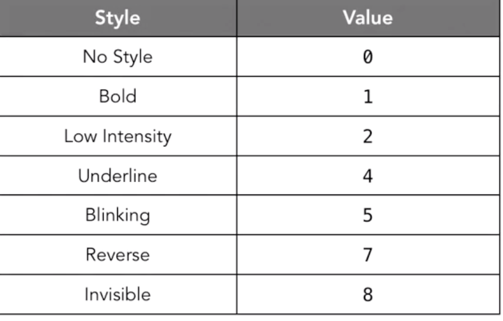

```
#!/bin/bash
flasherd="\033[5;31;40m"
red="\033[31;40m"
none="\033[31;0m"

echo -e $flasherd"ERROR: "$none$red"Something went wrong."$none
```

```
echo -e "\033[5;31;40mERROR: \033[31;40mSomething went wrong again.\033[31;0m"
```


### `Date` and `printf`

#### Date

```
$ date
Fri Jun 28 17:17:22 UTC 2019
```

##### The day, the month, and the year

```
$ date +"%d-%m-%Y"
01-07-2019
```

##### The hours, minutes, and seconds of the current time.

```
date +"%H-%M-%S"
13-33-23
```

#### `printf`

```
$ printf "Name:\t%s\nID:\t%04d\n" "Jacob" "29"
Name:   Jacob
ID:     0029
```

* `\t`: tab
* `%s`: place for string
* `\n`: start newline
* `%04d`: Pad this field with zeroes to four places


```
#!/bin/bash
#This is a basic bash script

today=$(date +"%d-%m-%Y")
time=$(date +"%H:%M:S")

printf -v d "Current User:\t%s\nDate:\t\t%s @ %s\n" $USER $today $time
echo "$d"
```

```
$ bash 9dateprintf.sh 
Current User:   i515190
Date:           01-07-2019 @ 14:29:25
```

* `\v     vertical tab`

### Array

```
#!/bin/bash
#This is a basic bash script

a=()
b=("apple" "banana" "cherry")

echo ${b[2]}
#Return index 2

b[5]="wiki"
#Assign the new attribute

b+=("mango")
#Add new value

echo ${b[@]}
# echo all
# apple banana cherry wiki mango

echo ${b[@]: -1}
```

* `${b[2]}` return index 2
* `${b[@]}` return all value from array
* `echo ${b[@]: -1}` slice array, start from last one

#### Declare the array

```
declare -A myarray
myarray[color]=blue

myarray["office building"]="HQ west"
echo ${myarray["office building"]} is ${myarray[color]}
```
```
$ bash array.sh
HQ west is blue
```

#### Reaing and writting text file

```
echo "Some text" > file.txt
echo "Some more text" >> file.txt
```

```
#!/bin/bash
i=1
while read f; do
    echo "Line $i; $f"
    ((i++))
done < file.txt
```

```
$ bash 11file.sh 
Line 1; Some text
Line 2; Some more text
```

#### Using here document

```
cat <<- EndofText
        This is a 
        multiline
        text string
EndofText
```

* `-`:  bash will strip out the leading tabs from the text that follow

```
	This is a 
    multiline
    text string
```

### Generate a system report

```
#!/bin/bash
freespace=$(df -h / | grep -E "\/$" | awk '{print $4}')
greentext="\033[32m"
bold="\033[1m"
normal="\033[0m"
logdate=$(date +"%Y%m%d")
logfile="$logdate"_report.log

echo -e $bold"Quick system report for "$greentext"$HOSTNAME"$normal
printf "\tSystem type:\t%s\n" $MACHTYPE
printf "\tBash Version:\t%s\n" $BASH_VERSION
printf "\tFree Space:\t%s\n" $freespace
printf "\tFiles in dir:\t%s\n" $(ls | wc -l)
printf "\tGenerated on:\t%s\n" $(date +"%m/%d/%y") # US date format
echo -e $greentext"A summary of this info has been saved to $logfile"$normal

cat <<- EOF > $logfile
	This report was automatically generated by my Bash script.
	It contains a brief summary of some system information.
EOF

printf "SYS:\t%s\n" $MACHTYPE >> $logfile
printf "BASH:\t%s\n" $BASH_VERSION >> $logfile
```
```
$ bash 12system_report.sh 
Quick system report for C02S710EG8WM
        System type:    x86_64-apple-darwin18
        Bash Version:   3.2.57(1)-release
        Free Space:     384Gi
        Files in dir:   14
        Generated on:   07/01/19
A summary of this info has been saved to 20190701_report.log
```
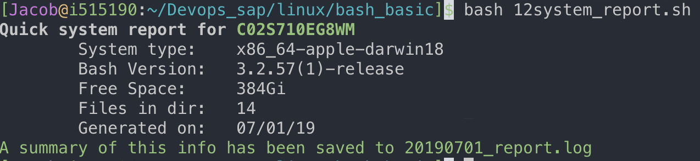

```
$ cat 20190701_report.log 
This report was automatically generated by my Bash script.
It contains a brief summary of some system information.
SYS:    x86_64-apple-darwin18
BASH:   3.2.57(1)-release
```

## Control Structure

* `if [ expression ]`
* `if [[ expression ]]`
* `if (( expression ))` : integer comparsion
* `if expression` 

`if expression; then`

```
if expression
then
```

```
if expression
then
	echo "True"
else
	echo "False"
fi
```

```
if expression
then 
	echo "True"
elif expression2; then
	echo "Ex is false, e2 is ture"
fi
```

```
#!/bin/bash

a=5

if [ $a -gt 4 ]; then
    echo $a is greater than 4!
else
    echo $a is not greater than 4!
fi
```
```
$ bash 13condi.sh 
5 is greater than 4!
```
```
#!/bin/bash
a="This is my #1 string!"
if [[ $a=~[0-9]+ ]];then
    echo "There are numbers in the string; $a"
else
    echo "There are no numbers in the string: $a"
fi
```

```
$ bash 13condi.sh 
There are numbers in the string; This is my #1 string!
```

### while and until

```
#!/bin/bash
i=0
while [ $i -le 10 ];do
    echo i:$i
    ((i+=1))
done

j=0
until [ $j -ge 10 ]; do 
    echo j:$j
    ((j+=1))
done
```

```
i:0
...
i:8
i:9
i:10
j:0
j:1
...
j:9
```

### For loop

```
#!/bin/bash

for i in 1 2 3
do 
    echo $i
done
```

```
#!/bin/bash

for i in {1..100..2}
do 
    echo $i
done
```

```
#!/bin/bash
for (( i=1;i<=10;i++ ))
do
	echo $i
done
```

```
arr=('apple' 'banana' 'cherry')
for i in ${arr[@]}
do
    echo $i
done
```

```
declare -A arr

arr["name"]='Jacob'
arr["id"]='1234'

for i in "${!arr[@]}"
do
    echo "$i: ${arr[$i]}"
done
```
```
name: Jacob
id: 1234
```

`!`:  Access the keys in the associative array


```
for i in $(ls)
do
	echo $i
done
```

```
10array.sh
11file.sh
12system_report.sh
13condi.sh
...
```

### Case

```
#!/bin/bash

a="dog"
case $a in
    cat) echo "Ragdoll";;
    dog|puppy) echo  "Corji";;
    *) echo "not pet";;
esac
```

```
$ bash 16case.sh 
Corji
```

### Using functions

```
#!/bin/bash

function testfunc {
	i=1
	for f in $@; do
		echo $i: $f
        ((i+=1))
	done
}

testfunc $(ls)
```
```
1: 10array.sh
2: 11file.sh
3: 12system_report.sh
...
```

## Interact with User

### working with arguments

```
#!/bin/bash
#This is a basic bash script
echo $1
echo $2

for i in $@
do
    echo $i
done

echo "There were $# arguments"
```

* `$1` first argument passed in
* `$2` second argument passed in
* **`$@` all in loop**
* **`$#` outout the index in loop**

```
$ bash 18arguments.sh 1 2 3 4 A
1
2
1
2
3
4
A
There were 5 arguments
```


### Working with flags

```
#!/bin/bash

while getopts :u:p:ab option; do
    case $option in
        u) user=$OPTARG;;
        p) password=$OPTARG;;
        a) echo "Got the A flag!!!";;
        b) echo "Got the B flag!!!";;
        ?) echo "I dont know what $OPTARG is!"
    esac
done

echo "User: $user / Pass: $password"
```

* `getopts`: get arguments with flag
* `OPTARG`, **which is the value that's passed in**
* `test -ab flag` was executed
* `:u:p`: Adding a colon on the beginning tells bash that I want to know about flags that were used at the command line that I haven't specified.


```
$ bash 19getopy.sh -p Password -u Username -ab
Got the A flag!!!
Got the B flag!!!
User: Username / Pass: Password
```

```
$ bash 19getopy.sh -z
I dont know what z is!
User:  / Pass: 
```

### Getting input during execution


```
#!/bin/bash

echo "What is your name?"
read name

echo "What is your password?"
read -s pass

read -p "What's your favorite animal? " animal

echo name: $name, pass: $pass, animal: $animal
```

* `-s`: for password silence mode
* `-p`: prompt in one line  `read -p "text" arg`


```
$ bash 20Input.sh
What is your name?
ja
What is your password?
What's your favorite animal? corji
name: ja, pass: 12, animal: corji
```


#### Select:Case options

```
select option in "cat" "dog" "quit"
do
    case $option in
        cat) echo "Cat like to sleep";;
        dog) echo "Dog like to play catch";;
        quit) break;;
        *) echo "I'm not sure what it is"
    esac
done
```

```
$ bash 20Input.sh
1) cat
2) dog
3) quit
#? 1
Cat like to sleep
#? 2
Dog like to play catch
#? 4
I'm not sure what it is
#? 3
```

### Ensuring reponse

```
#!/bin/bash
if [ $# -lt 3 ]; then
	cat <<- EOM
	this command require three arguments
	username, userid, and favorite number.
	EOM
else 
	echo "Username: $1"
	echo "Username: $2"
	echo "Username: $3"
fi
```

```
$ bash 20Input.sh
this command require three arguments
username, userid, and favorite number.
```
```
$ bash 20Input.sh jacob 12 1
Username: jacob
Username: 12
Username: 1
```

#### Input argument not empty 

```
read -p "Favorite animal?" a
while [[ -z "$a" ]]; do 
    read -p "I need an answer! " a
done
echo "$a was selected"
```

```
$ bash 20Input.sh
Favorite animal?
I need an answer! 
I need an answer! 
I need an answer! 
I need an answer! 
I need an answer! 
I need an answer! dog
```

#### Input argument with default value

```
read -p "Favorite animal?[cat]" a
while [[ -z "$a" ]]; do 
    a="cat"
done
echo "$a was selected"
```
```
$ bash 20Input.sh
Favorite animal?[cat]
cat was selected

$ bash 20Input.sh
Favorite animal?[cat]dog
dog was selected
```
#### Input argument match regular expression

```
#!/bin/bash
read -p "What year? [nnnn]" a
while [[ ! $a =~ [0-4]{4} ]]; do
    read -p "A year, please! [nnnn] " a
done
echo "Selected year; $a"
```
```
$ bash 20Input.sh
What year? [nnnn]3
A year, please! [nnnn] 0444
Selected year; 0444
```

### Challange

Make a script that takes interactive input from the user to guess a random number. Use a loop and a condition to check if the answer is right, and keep asking if it isn't. Make the script respond to having an argument, and give it some functionality if there isn't an argument provided as well. 


```
#!/bin/bash
rand=$RANDOM
secret=${rand:0:1}

function game {
	read -p "Guess a random one-digit number! " guess
        while [[ $guess != $secret ]]; do
                read -p "Nope, try again! " guess
        done
	echo "Good job, $secret is it! You're great at guessing!"
}

function generate {
        echo "A random number is: $rand"
	echo -e "Hint: type \033[1m$0 game\033[0m for a fun diversion!"
}

if [[ $1 =~ game|Game|GAME ]]; then
	game
else
	generate
fi
```

```
$ bash 21game.sh 
A random number is: 4014
Hint: type 21game.sh game for a fun diversion!

]$ bash 21game.sh game
Guess a random one-digit number! 1
Nope, try again! 2
Good job, 2 is it! You're great at guessing!
```


