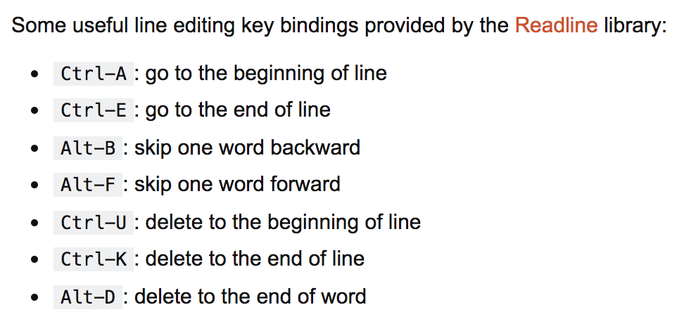

# Linux tutorial

## My Linux cheat lists

```
$ grep word folder/. * -ri     # find a word in all files inside the folder
$ netstat -lnotp | grep port
$ ps aux | grep PID
$ find folder -name file_name
$ find . -name 1Linux_interview.md
./1Linux_interview.md
$ grep -rnw . -e 'string'     # find string inside the folder
$ grep -rnw . -e 'linux'
```

## Linux Sysadmin Basics 

1. [Linux Sysadmin Basics - Process](2Linux_process.md)


## Common Sysadmin Commands

1. [如何理解linux top命令的输出结果](https://github.com/Chao-Xi/JacobTechBlog/blob/master/ops/top_command.md)
2. [用awk做基本运算](https://github.com/Chao-Xi/JacobTechBlog/blob/master/ops/awk.md)
3. [Network Tools in the Command Line](https://github.com/Chao-Xi/JacobTechBlog/blob/master/ops/linux_network_troubleshooting_tools.md)
4. [Linux Basic Networking Commands](https://github.com/Chao-Xi/JacobTechBlog/blob/master/ops/linux_network_command.md)
5. [8 Basic `lsof` Commands](3Linux_lsof.md)
6. [How to use GNU SCREEN - the Terminal Multiplexer](4Linux_GNU_Screen.md)
7. [运维实用的 Linux 命令](5Devops_Linux_commmand.md)
  * 实用的 `xargs` 命令
  * 命令或脚本后台运行
  * 找出当前系统内存使用量较高的进程
  * 找出当前系统CPU使用量较高的进程
  * 同时查看多个日志或数据文件
  * 持续 ping 并将结果记录到日志
  * 查看tcp连接状态
  * 查找80端口请求数最高的前20个IP
  * ssh实现端口转发
8. [Tmux 使用教程](11tmux.md)
9. [内存泄漏排查攻略之：Show me your Memory](12show_mem.md)
10. [Linux 平均负载，附排查工具](13show_loadbalancer.md)

## Linux Interview

1. [Top 9 Linux Job Interview Questions(command)](1top10linuxjobQA.md)
2. [50 Linux Interview Questions And Answers](1Linux_interview.md)

## Bash Script

1. [Bash Basic Script](8basch_basic.md)
2. [Bash Shell Scripting for Automation](7bash_automation.md)

## Linux Adv

### System Info

1. [查看特定进程内存使用信息`memory`](linux_adv1_mem_check.md)
2. [Linux 性能优化之应用高 `CPU` 处理](6Linux_high_cpu.md)
3. [如何Linux下查看系统CPU信息](linux_adv6_cpu_check.md)
4. [Linux硬盘性能检测](linux_adv7_disk_info.md)
5. [Linux进程实时监控 - `htop`](linux_adv8_procss_htop.md)


### Web Info

1. [使用`ab`对Web服务进行压力测试](linux_adv2_ab_web.md)
2. [使用`httperf`对`Web`服务进行压力测试](linux_adv4_httperf_web.md)


### Code Info

1. [使用cloc进行代码统计](linux_adv3_cloc_code.md)

### Network Info

1. [监控Linux系统当前监听使用的端口](linux_adv5_port_check.md)


