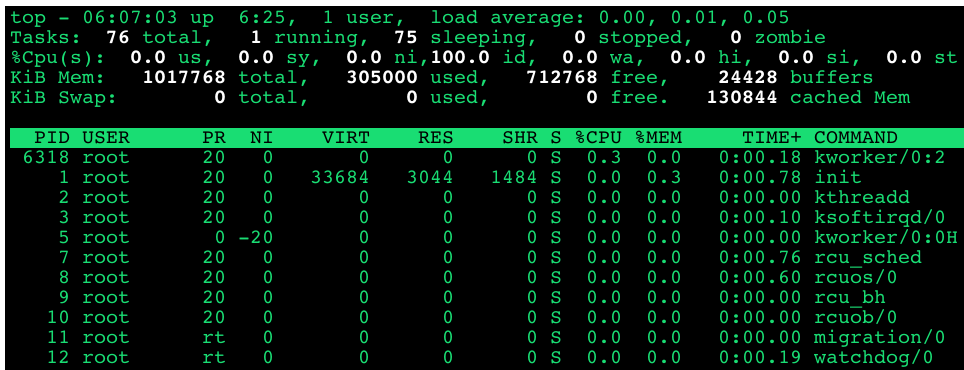

# 查看特定进程内存使用信息

## 1. 查看整个物理内存的情况

### 1. `free -m`

```
$ free -mh
             total       used       free     shared    buffers     cached
Mem:          993M       297M       696M       384K        23M       127M
-/+ buffers/cache:       146M       847M
Swap:           0B         0B         0B
```

* 整体: `993M`
* 使用: `297M`

### 2. `cat /proc/meminfo` for more details

```
$ cat meminfo
MemTotal:        1017768 kB
MemFree:          712768 kB
Buffers:           24420 kB
Cached:           130844 kB
SwapCached:            0 kB
Active:           154912 kB
Inactive:          99472 kB
Active(anon):      99228 kB
Inactive(anon):      272 kB
Active(file):      55684 kB
Inactive(file):    99200 kB
Unevictable:           0 kB
Mlocked:               0 kB
SwapTotal:             0 kB
SwapFree:              0 kB
Dirty:                 8 kB
Writeback:             0 kB
AnonPages:         99116 kB
Mapped:            23728 kB
Shmem:               384 kB
Slab:              33580 kB
SReclaimable:      24936 kB
SUnreclaim:         8644 kB
...
```

## 2. 查看特定进程的内存情况

### 1.Top



* `RES` **常驻内存就是我们实际使用的物理内存（关心)**
* `VIRT`: **虚拟内存的使用情况， 往往要比实际内存大很多**
* `SHR`: **共享内存的使用情况**

### 2. pmap + procssId

```
$ pidof init
1
```

```
$ sudo pmap 1
1:   /sbin/init
00007fa633784000     40K r-x-- libnss_files-2.19.so
00007fa63378e000   2044K ----- libnss_files-2.19.so
00007fa63398d000      4K r---- libnss_files-2.19.so
00007fa63398e000      4K rw--- libnss_files-2.19.so
00007fa63398f000     44K r-x-- libnss_nis-2.19.so
00007fa63399a000   2044K ----- libnss_nis-2.19.so
00007fa633b99000      4K r---- libnss_nis-2.19.so
00007fa633b9a000      4K rw--- libnss_nis-2.19.so
00007fa633b9b000     92K r-x-- libnsl-2.19.so
00007fa633bb2000   2044K ----- libnsl-2.19.so
00007fa633db1000      4K r---- libnsl-2.19.so
00007fa633db2000      4K rw--- libnsl-2.19.so
...
total            33688K
```

* **显示了一个procss下面，可执行文件，库文件，所有文件的使用内存都展示了出来**
* **第一列是内存寻址**


### 3. proc目录下的文件

**proc 文件系统是一个虚拟的文件系统，保存了操作系统的实时信息**

```
$ cd /proc
$ ls
1     1124  132   18   24    33    6312  734   937        consoles     filesystems  keys           meminfo       schedstat      sysvipc            zoneinfo
10    1125  1347  180  27    34    6318  7706  959        cpuinfo      fs           key-users      misc          scsi           timer_list
1066  1126  1374  181  2711  436   6405  8     977        crypto       interrupts   kmsg           modules       self           timer_stats
1069  1177  14    19   28    441   6406  813   980        devices      iomem        kpagecount     mounts        slabinfo       tty
1075  12    15    2    29    46    658   827   acpi       diskstats    ioports      kpageflags     mtrr          softirqs       uptime
1076  13    1514  20   3     469   66    876   buddyinfo  dma          ipmi         latency_stats  net           stat           version
1079  130   16    21   30    4917  67    9     bus        driver       irq          loadavg        pagetypeinfo  swaps          version_signature
109   131   17    22   31    5     7     904   cgroups    execdomains  kallsyms     locks          partitions    sys            vmallocinfo
11    1317  179   23   32    579   729   914   cmdline    fb           kcore        mdstat         sched_debug   sysrq-trigger  vmstat
```

**每个数字代表一个`process id`**

#### For example `init` process 1

```
$ cd 1
$ sudo ls
attr	   clear_refs	    cpuset   fd       latency	 maps	    mountstats	oom_adj        personality  schedstat  stack   syscall	wchan
autogroup  cmdline	    cwd      fdinfo   limits	 mem	    net		oom_score      projid_map   sessionid  stat    task
auxv	   comm		    environ  gid_map  loginuid	 mountinfo  ns		oom_score_adj  root	    setgroups  statm   timers
cgroup	   coredump_filter  exe      io       map_files  mounts     numa_maps	pagemap        sched	    smaps      status  uid_map
```

**根内存相关的两个文件 `status` and `smaps`**

**1.Staus file**

```
$ cat status
Name:	init
State:	S (sleeping)
Tgid:	1
Ngid:	0
Pid:	1
PPid:	0
TracerPid:	0
Uid:	0	0	0	0
Gid:	0	0	0	0
FDSize:	64
Groups:
VmPeak:	   33760 kB
VmSize:	   33684 kB
VmLck:	       0 kB
VmPin:	       0 kB
VmHWM:	    3044 kB
VmRSS:	    3044 kB
VmData:	    1448 kB
VmStk:	     132 kB
VmExe:	     248 kB
VmLib:	    3084 kB
VmPTE:	      88 kB
VmSwap:	       0 kB
Threads:	1
SigQ:	0/7869
SigPnd:	0000000000000000
ShdPnd:	0000000000000000
SigBlk:	0000000000000000
SigIgn:	0000000000001000
SigCgt:	00000001a0016623
CapInh:	0000000000000000
CapPrm:	0000001fffffffff
CapEff:	0000001fffffffff
CapBnd:	0000001fffffffff
Seccomp:	0
Cpus_allowed:	1
Cpus_allowed_list:	0
Mems_allowed:	00000000,00000001
Mems_allowed_list:	0
voluntary_ctxt_switches:	1174
nonvoluntary_ctxt_switches:	12719
```

#### `VmRSS:	3044 kB`是我们的实际物理内存

```
$ cat status | grep VmRSS
VmRSS:	    3044 kB
```
**`3044kb` 就是`init`所占用的实际物理内存**
 
**2.smaps file**

```
$ cat smaps
...
7fa63546b000-7fa63546c000 r--p 00008000 08:01 2185                       /lib/x86_64-linux-gnu/libnih-dbus.so.1.0.0
Size:                  4 kB
Rss:                   4 kB
Pss:                   4 kB
Shared_Clean:          0 kB
Shared_Dirty:          0 kB
Private_Clean:         0 kB
Private_Dirty:         4 kB
Referenced:            4 kB
Anonymous:             4 kB
AnonHugePages:         0 kB
Swap:                  0 kB
KernelPageSize:        4 kB
MMUPageSize:           4 kB
Locked:                0 kB
VmFlags: rd mr mw me ac sd
7fa63546c000-7fa63546d000 rw-p 00009000 08:01 2185                       /lib/x86_64-linux-gnu/libnih-dbus.so.1.0.0
Size:                  4 kB
Rss:                   4 kB
Pss:                   4 kB
Shared_Clean:          0 kB
Shared_Dirty:          0 kB
Private_Clean:         0 kB
Private_Dirty:         4 kB
Referenced:            4 kB
Anonymous:             4 kB
AnonHugePages:         0 kB
Swap:                  0 kB
KernelPageSize:        4 kB
MMUPageSize:           4 kB
Locked:                0 kB
VmFlags: rd wr mr mw me ac sd
7fa63546d000-7fa635484000 r-xp 00000000 08:01 2118                       /lib/x86_64-linux-gnu/libnih.so.1.0.0
...
```

* **`smaps`类似于`pmap`, 展示了所有和此`procss`相关联的内存使用信息**
* 


