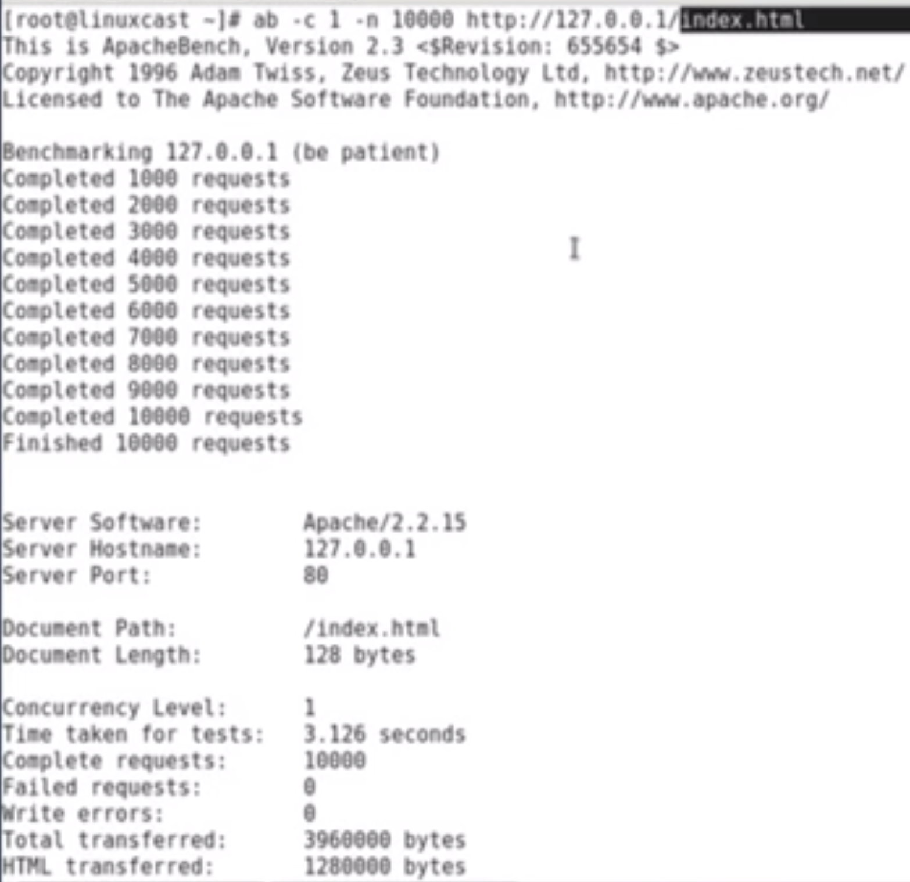
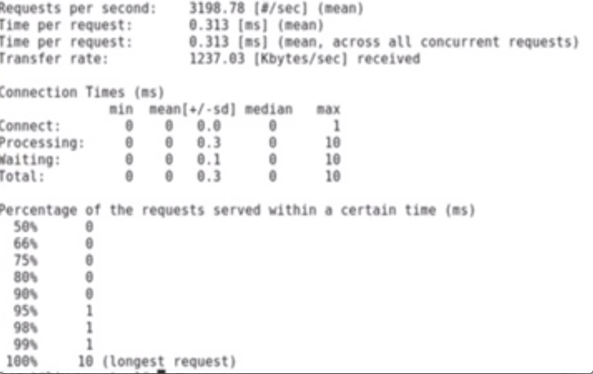

# 使用ab对Web服务进行压力测试

如何使用`apache`工具包内的`ab`命令对一个网站进行基本的压力测试，以获取网站的性能参数以备部署规划或稳定性测试使用

**在特定的服务器硬件条件下，对网站最大的能承受多大的访问压力，作为一个量化的指标，作为未来部署的时候的一个部署策略的定制的参考条件**

## 压力测试

1. 量化考核我们这个网站最大的性能，最大可以提供服务的上限
2. 找出程序代码，服务器中问题，例如内存泄漏，潜在的不稳定的因素
3. 付费工具包括	`LoadRunner`
4. 开源工具`Apache Benchmark`

## Apache Benchmark

```
$ sudo apt install apache2-utils
```

### 查看ab的具体路径

```
$ which ab
/usr/bin/ab
```

### 查看ab属于哪个软件包

```
$ sudo apt install rpm
```
```
$ rpm -qf /usr/bin/ab
```

### ab设置并发量

**模拟多个客户端对服务器的访问**

```
$ ab -c 并发数 -n 完成的请求数量 url
```

**例如： `$ ab -c 1 -n 10000 http://127.0.0.1/index.html`  1个用户，发送10000次请求**




* **`Concurrency` 同步请求 1**
* **`Time taken for test`花费的时间**
* **`Failed request`失败的请求**
* **主要考虑**: `Time per request`每个请求的时间， `Failed request`， **`requests per second`表示当前服务器的性能（单个页面，一般生产环境20-30次就已经很不错了）**

```
$ ab -h
Usage: ab [options] [http[s]://]hostname[:port]/path
Options are:
    -n requests     Number of requests to perform
    -c concurrency  Number of multiple requests to make at a time
    -t timelimit    Seconds to max. to spend on benchmarking
                    This implies -n 50000
    -s timeout      Seconds to max. wait for each response
                    Default is 30 seconds
    -b windowsize   Size of TCP send/receive buffer, in bytes
    -B address      Address to bind to when making outgoing connections
    -p postfile     File containing data to POST. Remember also to set -T
    -u putfile      File containing data to PUT. Remember also to set -T
    -T content-type Content-type header to use for POST/PUT data, eg.
                    'application/x-www-form-urlencoded'
                    Default is 'text/plain'
    -v verbosity    How much troubleshooting info to print
    -w              Print out results in HTML tables
    -i              Use HEAD instead of GET
    -x attributes   String to insert as table attributes
    -y attributes   String to insert as tr attributes
    -z attributes   String to insert as td or th attributes
    -C attribute    Add cookie, eg. 'Apache=1234'. (repeatable)
    -H attribute    Add Arbitrary header line, eg. 'Accept-Encoding: gzip'
                    Inserted after all normal header lines. (repeatable)
    -A attribute    Add Basic WWW Authentication, the attributes
                    are a colon separated username and password.
    -P attribute    Add Basic Proxy Authentication, the attributes
                    are a colon separated username and password.
    -X proxy:port   Proxyserver and port number to use
    -V              Print version number and exit
    -k              Use HTTP KeepAlive feature
    -d              Do not show percentiles served table.
    -S              Do not show confidence estimators and warnings.
    -q              Do not show progress when doing more than 150 requests
    -l              Accept variable document length (use this for dynamic pages)
    -g filename     Output collected data to gnuplot format file.
    -e filename     Output CSV file with percentages served
    -r              Don't exit on socket receive errors.
    -h              Display usage information (this message)
    -Z ciphersuite  Specify SSL/TLS cipher suite (See openssl ciphers)
    -f protocol     Specify SSL/TLS protocol
                    (SSL3, TLS1, TLS1.1, TLS1.2 or ALL)
```

* `-t`: 超时时间，最长的等待时间
* `-b`: `tcp`的窗口大小
* 

