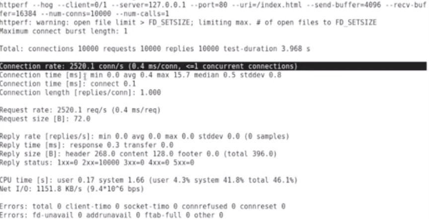
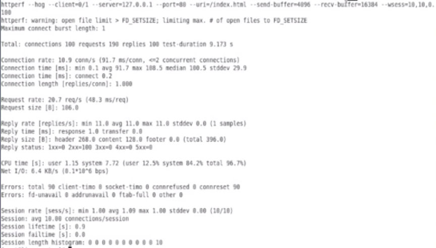

# 使用httperf对Web服务进行压力测试

使用`httperf`对网站`Web`服务进行压力测试，获取特定硬件环境下`Web`服务性能参数，以方便网站规划部署及稳定性分析等需求

### Download

[https://pkgs.org/download/httperf](https://pkgs.org/download/httperf)

```
$ sudo apt install httperf
```

```
$ man httperf

NAME
       httperf - HTTP performance measurement tool

EXAMPLES
       httperf --hog --server www
              This  command causes httperf to create a connection to host www, send a request for the root document (http://www/), receive the reply, close
              the connection, and then print some performance statistics.

       httperf --hog --server www --num-conn 100 --ra 10 --timeout 5
              Like above, except that a total of 100 connections are created and that connections are created at a fixed rate of 10 per second.  Note  that
              option ``--rate'' has been abbreviated to ``--ra''.

       httperf --hog --server=www --wsess=10,5,2 --rate 1 --timeout 5
              Causes httperf to generate a total of 10 sessions at a rate of 1 session per second.  Each session consists of 5 calls that are spaced out by
              2 seconds.

       httperf --hog --server=www --wsess=10,5,2 --rate=1 --timeout=5 --ssl
              Like above, except that httperf contacts server www via SSL at port 443 (the default port for SSL connections).

       httperf --hog --server www --wsess=10,5,2 --rate=1 --timeout=5 --ssl --ssl-ciphers=EXP-RC4-MD5:EXP-RC2-CBC-MD5 --ssl-no-reuse --http-version=1.0
              Like above, except that httperf will inform the server that it can only select from two cipher suites (EXP-RC4-MD5 or EXP-RC2-CBC-MD5);  fur‐
              thermore,  httperf  will use HTTP version 1.0 which requires a new TCP connection for each request.  Also, SSL session ids are not reused, so
              the entire SSL connection establishment process (known as the SSL handshake) occurs for each connection.
       
```
	
```
$ httperf --hog --server=127.0.0.1 --url=/index.html --nums-conns=10000
```

* `--hog`尽量以尽可能快的速度产生连接请求



### 相对于`ab`, 多了

1. **CPU Time**
2. **Reply status: 返回的状态码1xx, 2xx, 3xx, 4xx**


``` 
$ httperf --hog --server=127.0.0.1 --url=/index.html --nums-conns=10000 --wsess=10,10,0.1
```

1. `10`产生10个会话连接
2. `10`每个会话连接`10`次请求
3. `0.1` `sync time`, 每次请求之间的间隔,等待间隔时间


