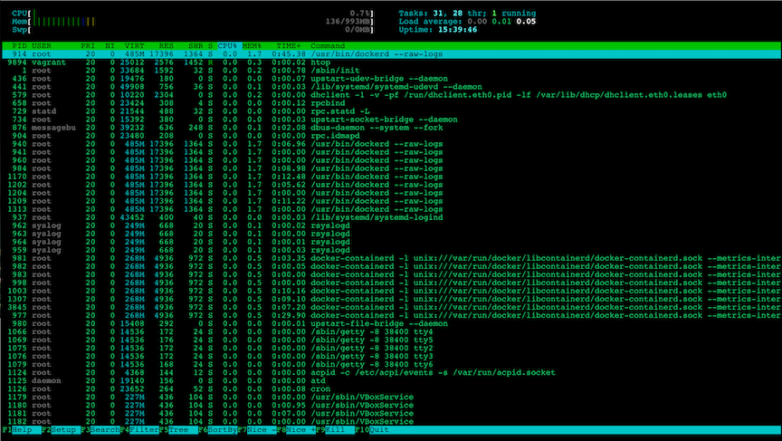
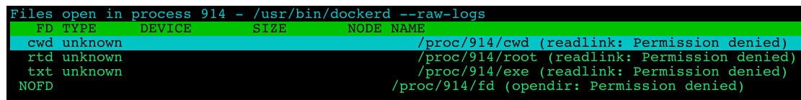
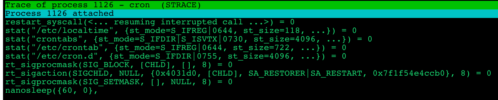

# Linux进程实时监控 - htop

介绍Linux下流行的进程实时监控工具`htop`，`htop`是Linux下流行的命令行终端进程实时监控工具**，很多地方已经取代之前大量使用的top工具，拥有美化、直观、操作简单等优点。**



* **按列排序**
* **选定进程（标记）**
* **选定进程，`l`查看进程文件 => lsof**



* **查看进行的系统调用**

* **选定进程，`s`查看进程文件 => strace(希望预先安装`strace`)**



```
$ man htop

NAME
       htop - interactive process viewer
DESCRIPTION
       Htop is a free (GPL) ncurses-based process viewer for Linux.

       It is similar to top, but allows you to scroll vertically and horizontally, so you can see all the processes running on the system, along with their
       full command lines.

       Tasks related to processes (killing, renicing) can be done without entering their PIDs.
```
    