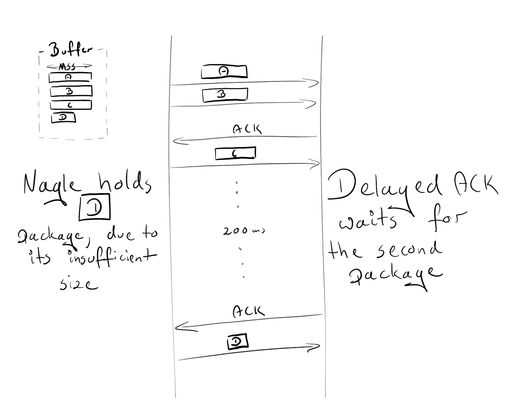

# Nginx Tutorial #2: Performance

## `tcp_nodelay`, `tcp_nopush`, and `sendfile`

### `tcp_nodelay`

In the early days of TCP, engineers faced the danger of **congestion collapse**. Quite a few solutions emerged as a way of preventing this, and one of them was an algorithm proposed by John Nagle.

Nagle’s algorithm aims to **prevent being overwhelmed by a great number of small packets**. It does not interfere with full-size TCP packets (Maximum Segment Size, or MSS in short), **only with packets that are smaller than MSS**. *Those packages will be transmitted only if the receiver successfully sends back all the acknowledegments of previous packages (ACKs). And during the wait, the sender can buffer more data.*

```
if package.size >= MSS.size
  send(package)
elsif acks.all_received?
  send(package)
else
  # accumulate data
end
```
During that time, another proposal emerged: ***the Delayed ACK***.

**In TCP communication, we send data and receive acknowledgements (ACK) that tell us that those data were delivered successfully.**

**A delayed ACK tries to resolve the issue where the wire is flooded by a massive number of ACK packages.** To cut this number, the receiver will wait for some data to be sent back to the sender and include ACK packages with those data. 

If there are no data to be sent back, we have to send ACKs at least every 2 * MSS, or every 200 to 500 ms (in case we are no longer receiving packages).

```
if packages.any?
  send
elsif last_ack_send_more_than_2MSS_ago? || 200_ms_timer.finished?
  send
else
  # wait
end

#If there are packages sent back, send ACK out. If there are no data to be sent back, we have 
#to send ACKs at least every 2 * MSS, or every 200 to 500 ms
```

You might have already noticed that this can lead to some temporary deadlocks on the persisted connection. Let's reproduce it!

Assumptions:

* The initial congestion window equals 2. The congestion window is part of another TCP mechanism called Slow-Start. The details are not important right now, just keep in mind that it restricts how many packages can be sent simultaneously. In the first round-trip, we are allowed to send 2 MSS packages; in the second, 4 MSS packages; in third, 8 MSS, and so on.
* 4 buffered packages waiting to be sent: A, B, C, D
* A, B, C are MSS packages
* D is a small package

Scenario:

* Due to the initial congestion window size, the sender is allowed to transmit two packages: A and B.
* The receiver sends an ACK upon obtaining both packages.
* The sender transmits the C package. However, Nagle holds him from sending D (the package is too small, so we need to wait for the ACK from C)
* On the receiver side, the Delayed ACK prevents him from sending the ACK (which is sent every 2 packages or every 200 ms)
* After 200ms, the receiver sends the ACK for the C package.
* The sender receives the ACK and sends the D package.



During this exchange, a 200ms lag was introduced due to the deadlock between Nagle and Delayed ACK.

The Nagle algorithm was a true saviour in its time and still provides great value. However, in most cases, we won’t need it for our website, and it can be safely turned down via adding the flag `TCP_NODELAY`. [no delay tcp]

`tcp_nodelay on;     # sets TCP_NODELAY flag, used on keepalive connections`

### `sendfile`

Normally, when a file needs to be sent, the following steps are required:

* `malloc(3)`: allocate a local buffer for storing object data
* `read(2)`: retrieve and copy the object into the local buffer
* `write(2)`: copy the object from the local buffer into the socket buffer


This involves two context switches (read, write) which make a second copy of the same object unnecessary. 

As you may see, it is not the optimal way. Thankfully, there is another system call that improves sending files, and it's called (surprise, surprise!): `sendfile(2)`. 
**This call retrieves an object to the file cache, and passes the pointers (without copying the whole object) straight to the socket descriptor.** Netflix states that using sendfile(2) increased the network throughput from [6Gbps to 30Gbps](https://people.freebsd.org/~rrs/asiabsd_2015_tls.pdf).

### `tcp_nopush`

`tcp_nopush` is opposite to `tcp_nodelay`. Instead of pushing packages as fast as possible, it aims to **optimise the amount of data sent simultaneously**.

**It will force the package to wait until it gets its maximum size (MSS) before sending it to the client.** This directive only works, when `sendfile` is on.

```
sendfile on;
tcp_nopush on;
#for package to wait until it get its maximu size
```

It may appear that tcp_nopush and tcp_nodelay are mutually exclusive. But if all 3 directives are turned on, nginx will:

* ensure packages are full before sending them to the client
* for the last packet, `tcp_nopush` will be removed, allowing TCP to send it immediately, without the 200ms delay

## How many processes should I have?

### Worker processes

The `worker_process` directive defines how many workers should be run. By default, this value is set to 1. **The safest setting is to use the number of cores by passing `auto`.**

But still, due to Nginx's architecture, which handles requests blazingly fast, we probably won’t use more than 2-4 processes at a time (unless you are hosting Facebook, or doing some CPU-intensive stuff inside nginx).

`worker_process auto;`

### Worker connections

This directive is directly related to worker_process is `worker_connections`. It specifies how many connections can be opened by a worker process at the same time. This number includes all connections (e.g. connections with proxied servers), and not only connections with clients. Also, it is worth keeping in mind that one client can open multiple connections to fetch other resources simultaneously.

`worker_connections 1024;`

### Open files limit

“Everything is a file” in Unix-based systems. It means that documents, directories, pipes, or even sockets are files. The system has a limitation how many files can be opened simultaneously by a process. To check the limits:

```
ulimit -Sn      # soft limit
ulimit -Sn      # hard limit
```
This system limit must be tweaked in accordance with `worker_connections`. Any incoming connection opens at least one file (usually a two-connection socket and either a backend connection socket or a static file on disk). So it is safe to have this value equal to worker_connections * 2. Nginx, fortunately, provides an option of increasing this system value within the nginx config. To do so, add the worker_rlimit_nofile directive with a proper number and reload the nginx.

`worker_rlimit_nofile 2048;`

### Config

```
worker_process auto;
worker_rlimit_nofile 2048; # Changes the limit on the maximum number of open files (RLIMIT_NOFILE) for worker processes.
worker_connections 1024;   # Sets the maximum number of simultaneous connections that can be opened by a worker process.
```

### Maximum number of connections

Given the above parameters, we can calculate how many concurrent connections we can handle simultaneously:

```
max no of connections =

    worker_processes * worker_connections
----------------------------------------------
 (keep_alive_timeout + avg_response_time) * 2
```

`keep_alive_timeout` (more on that later) + `avg_response_time` tells us how long a connection is opened. We also divide it by 2, as you will usually have 2 connections opened by one client: one between nginx and the client, the other one between nginx and the upstream server.

### Gzip

Enabling `gzip` should significantly reduce the weight of your response, thus it will appear faster on the client side.

### Compression level

Gzip has the different level of compressions: **from 1 to 9. Incrementing this level will reduce the size of the file, but also increase resources consumption.** 

As a standard, **we keep this number between 3 and 5, because increasing the number will give very small gains but significantly increase the CPU usage**.

Here is an example of compressing the file with gzip with different levels. 0 stands for an uncompressed file.

`curl -I -H 'Accept-Encoding: gzip,deflate' https://netguru.co/`

```
❯ du -sh ./*
 64K    ./0_gzip
 16K    ./1_gzip
 12K    ./2_gzip
 12K    ./3_gzip
 12K    ./4_gzip
 12K    ./5_gzip
 12K    ./6_gzip
 12K    ./7_gzip
 12K    ./8_gzip
 12K    ./9_gzip

❯ ls -al
-rw-r--r--   1 matDobek  staff  61711  3 Nov 08:46 0_gzip
-rw-r--r--   1 matDobek  staff  12331  3 Nov 08:48 1_gzip
-rw-r--r--   1 matDobek  staff  12123  3 Nov 08:48 2_gzip
-rw-r--r--   1 matDobek  staff  12003  3 Nov 08:48 3_gzip
-rw-r--r--   1 matDobek  staff  11264  3 Nov 08:49 4_gzip
-rw-r--r--   1 matDobek  staff  11111  3 Nov 08:50 5_gzip
-rw-r--r--   1 matDobek  staff  11097  3 Nov 08:50 6_gzip
-rw-r--r--   1 matDobek  staff  11080  3 Nov 08:50 7_gzip
-rw-r--r--   1 matDobek  staff  11071  3 Nov 08:51 8_gzip
-rw-r--r--   1 matDobek  staff  11005  3 Nov 08:51 9_gzip
```
### `gzip_http_version 1.1;`

This directive tells nginx to use gzip only for HTTP 1.1 and above. We don’t include HTTP 1.0 here, because for the 1.0 version, it is impossible to use both keepalive and gzip. You need to decide which one you prefer: HTTP 1.0 clients missing out on gzip or HTTP 1.0 clients missing out on keepalive.

### Config

```
gzip on;               # enable gzip
gzip_http_version 1.1; # turn on gzip for http 1.1 and higher
gzip_disable "msie6";  # IE 6 had issues with gzip
gzip_comp_level 5;     # inc compresion level, and CPU usage
gzip_min_length 100;   # minimal weight to gzip file
gzip_proxied any;      # enable gzip for proxied requests (e.g. CDN)
gzip_buffers 16 8k;    # compression buffers (if we exceed this value, disk will be used instead of RAM)
gzip_vary on;          # add header Vary Accept-Encoding (more on that in Caching section)

# define files which should be compressed
gzip_types text/plain;
gzip_types text/css;
gzip_types application/javascript;
gzip_types application/json;
gzip_types application/vnd.ms-fontobject;
gzip_types application/x-font-ttf;
gzip_types font/opentype;
gzip_types image/svg+xml;
gzip_types image/x-icon;
```

### Caching

Caching is another thing that can speed up requests nicely for returning users.

Managing the cache can be controlled just by two headers:

* `Cache-Control` for **managing cache in HTTP/1.1**
* `Pragma` for **backward compatibility with HTTP/1.0 clients**

Caches can be broken down into two categories: public and private caches. 

* Public cache store responses for reuse for more than one user. 
* A private cache is dedicated to a single user. 

We can easily define which cache should be used:

```
add_header Cache-Control public;
add_header Pragma public;
```
For standard assets we would also like to keep them for one month:

```
location ~* \.(jpg|jpeg|png|gif|ico|css|js)$ {
  expires 1M;
  add_header Cache-Control public;
  add_header Pragma public;
}
```

The configuration above seems to be sufficient. However, there is one caveat when using the public cache.

Let’s see what will happen if we stored our asset in a public cache (e.g. CDN) with URI as the only identifier. In this scenario, we also assume that gzip is on.

We have two browsers:

* an old one, which does not support gzip
* a new one, which does support gzip

The old browser sends a request for a `netguru.co/style.css` to our CDN. As CDN does not have this resource yet, it will query our server for it and return uncompressed response. CDN stores file in the hash (for later usage):

```
{
  ...
  netguru.co/styles.css => FILE("/sites/netguru/style.css")
  ...
}
```

Finally, the file will be returned to the client.

Now, the new browser sends the same request to the CDN, asking for `netguru.co/style.css`, expecting a gzipped resource. As CDN only identifies resources by the URI, it will return the same uncompressed resource for the new browser. The new browser will try to extract a non-gzipped file and will get garbage.

If we could tell a public cache to identify a resource based on URI, and encoding, we could avoid this issue.

```
{
  ...
  (netguru.co/styles.css, gzip) => FILE("/sites/netguru/style.css.gzip")
  (netguru.co/styles.css, text/css) => FILE("/sites/netguru/style.css")
  ...
}
```

And this is exactly what `Vary Accept-Encoding;` does. It tells a public cache that a resource can be distinguished by a URI and an `Accept-Encoding` header.

So our final configuration will look as follows:

```
location ~* \.(jpg|jpeg|png|gif|ico|css|js)$ {
  expires 1M;                       #expires 1 month
  add_header Cache-Control public;
  add_header Pragma public;
  add_header Vary Accept-Encoding;
}
```

### Timeouts

The `client_body_timeout` and `client_header_timeout` define **how long nginx should wait for a client to transmit the body or header before throwing the 408 (Request Time-out) error.**

`send_timeout` sets a timeout for transmitting a response to the client. The timeout is set only between two successive write operations, not for the transmission of the whole response. If the client does not receive anything within this time, the connection is closed.

**Be careful when setting those values, as too long waiting times can make you vulnerable to attackers, while too short times will cut off slow clients.**

```
# Configure timeouts
client_body_timeout   12;
client_header_timeout 12;
send_timeout          10;
```

### Buffers

### `client_body_buffer_size`

Sets the buffer size for reading the client's request body. In case the request body is larger than the buffer, the whole body or only its part is written to a temporary file. For `client_body_buffer_size`, setting 16k is enough in most cases.

This is yet another setting that can have a massive impact, but it has to be used with care. Put too little, and nginx will constantly use I/O to write remaining parts to the file. Put too much, and you will make yourself vulnerable to DOS attacks when the attacker could open all the connections, but you are not able to allocate a buffer on your system to handle those connections.

### `client_header_buffer_size` and `large_client_header_buffers`

If headers don’t fit into `client_header_buffer_size` then `large_client_header_buffers` will be used. If the request also won’t fit into that buffer, an error is returned to the client. For most requests, a buffer of 1K bytes is enough. However, if a request includes long cookies, it may not fit into 1K.

If the size of a request line is exceeded, the 414 (Request-URI Too Large) error is returned to the client.
If the size of a request header is exceeded, the 400 (Bad Request) error is thrown.

### `client_max_body_size`

### Config

```
client_body_buffer_size       16K;
client_header_buffer_size     1k;
large_client_header_buffers   2 1k;
client_max_body_size          8m;
```

### Keep-Alive

**The TCP protocol, on which HTTP is based, requires performing a three-way handshake to initiate the connection.** It means that before the server can send you data (e.g. images), three full roundtrips between the client and the server need to be made.

Assuming that you are requesting `/image.jpg` **_from Warsaw,_** and ***connecting to the nearest server in Berlin***:

```
Open connection

TCP Handshake:
Warsaw  ->------------------ synchronise packet (SYN) ----------------->- Berlin
Warsaw  -<--------- synchronise-acknowledgement packet (SYN-ACK) ------<- Berlin
Warsaw  ->------------------- acknowledgement (ACK) ------------------->- Berlin

Data transfer:
Warsaw  ->---------------------- /image.jpg --------------------------->- Berlin
Warsaw  -<--------------------- (image data) --------------------------<- Berlin

Close connection
```

Open connection: 

* TCP three hand-shake:
 1. client sent synchronsie packet (SYN) to server side
 2. server side send synchronise-acknowledgement packet (SYN-ACK) to client
 3. client send ACK to server side
* Data transfer:
 1. client sent url request to server side
 2. server side send image data back
 
 For another request, you will have to perform this whole initialisation once again. If you are sending multiple requests over short periods of time, this can add up fast. And this is where keepalive comes in handy. After the successful response, it keeps the connection idle for a given amount of time (e.g. 10s). If another request is made during this time, the existing connection will be reused and the idle time refreshed.

Nginx provides a few directives you can use to tweak keepalive settings. Those can be grouped into two categories:

* keepalive between `client` and `nginx`

```
keepalive_disable msie6;        # disable selected browsers.

# The number of requests a client can make over a single keepalive connection. The default is 100, but a much higher value can be especially useful for testing with a load‑generation tool, which generally sends a large number of requests from a single client.
keepalive_requests 100000;

# How long an idle keepalive connection remains open.
keepalive_timeout 60;
```

* keepalive between `nginx` and `upstream`

```
upstream backend {
    # The number of idle keepalive connections to an upstream server that remain open for each worker process
    keepalive 16;
}

server {
  location /http/ {
    proxy_pass http://http_backend;
    proxy_http_version 1.1;
    proxy_set_header Connection "";
  }
}
```

And that’s it.
