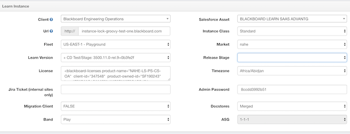
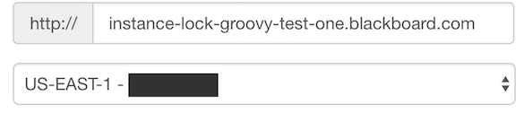
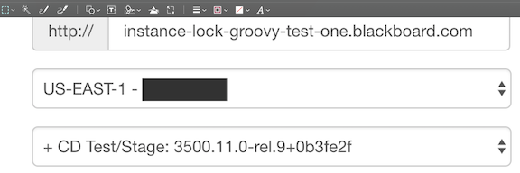
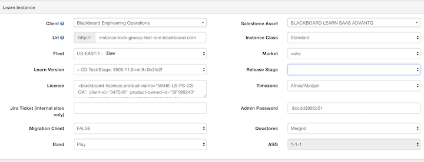

# Edit text on image with MAC preview

### Original Image

### Goal change Fleet "playground" to "Dev"

#### 1. Step one: Select "playground" part and delete

**"Select" -> "Delete"**

#### 2. Step two: Add text and move to proper position

Open the image you would like to caption from within the Preview app located inside of your Applications folder. Go to the View menu and select **"Show Edit Toolbar"** or push **`Command-Shift-A`** to bring up the Edit Toolbar. Click on the text tool within the toolbar and then click on the photo to create your text. From there you can adjust the size, color, and position of the text.

#### 3. Use this photo in macdown

#### 4. Word changed 

