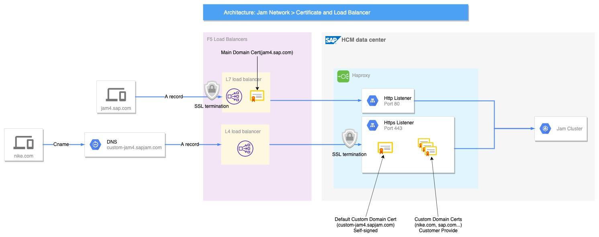

1. [用awk做基本运算](awk.md) 
2. [并发模型](concurrency.md)
3. [如何理解linux top命令的输出结果](top_command.md)
4. [Common Terminology and Abbreviations](ops_terminology_abbr.md)
5. [Scrum Ceremonies & Sizing Epics and Stories](ops_scrum_ceremonies.md)
6. [Edit text on image with MAC preview](EditWordOnImage.md)
7. [sed命令](sed.md)

### Git Management

1. [更优雅的git log](git_decorator.md)
2. [Git常用命令与GitHub使用技巧技巧整理](git_commands.md)
3. [Git Pull Request Guidelines & Process](git_pull_request.md)
4. [Git Tools - Rewriting History](git_squash.md)
5. [Git Package Management with Git LFS](git_package_management.md)
6. [git rebase vs git merge详解](git_rebase_merge.md)
7. [Git技巧：修改历史(修改最新一条历史/修改指定某条历史)](git_history.md)
8. [**动图展示 10 大 Git 命令**](git_10commands.md)
9. [**Git 中submodule的使用**](git_submod.md)

### Linux Network

1. [Network Tools in the Command Line](linux_network_troubleshooting_tools.md)
2. [Linux Basic Networking Commands](linux_network_command.md)
3. [How does DNS work?](linux_dns_work.md)

### Network Issue

1. [HTTPS 原理分析](https.md)
2. **SAP HTTPS 原理分析**

## Git Intermediate Techniques

### [Branch Management](gitadv1.md)

* Force push to remote
* Identify merged branches
* Delete local and remote branches
* Prune stale(`remote-tracking`) branches

### [Tagging](gitadv2.md)

* Create tags
* List tag 
* Delete tag
* Push, fetch and delete tags to a remote
* Check out tags

### [Interactive Staging](gitadv3.md)

* Interactive Mode
* Patch Mode
* Split a hunk `s`
* Edit a hunk  with `e` option mamually change

### [Share select changes](gitadv4.md)

* Cherry-picking commits
* Resolve cherry-picking conflicts
* Create diff patches
* Apply diff patches (Makes changes, but not commits)
* Create Formatted Patches (Includes commit messages )
* Apply formatted patches
* Formatted Patches vs diff patches

### [Rebasing](gitadv5.md)

* Rebase Commit
* Perform a rebase
* Merging vs. rebasing
* Resolve rebase conflicts
* Rebase onto other branches
* Undo a rebase
* Interactive rebasing
* Pull Rebase 

### [Track down the problems](gitadv6.md)

* Log Options 
* Blame
* Bisect