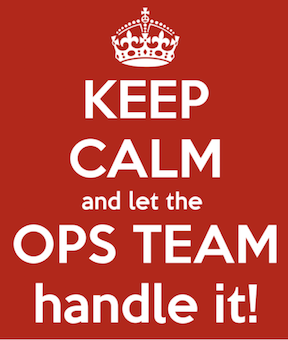

1. [用awk做基本运算](awk.md) 
2. [并发模型](concurrency.md)
3. [如何理解linux top命令的输出结果](top_command.md)
4. [Common Terminology and Abbreviations](ops_terminology_abbr.md)
5. [Scrum Ceremonies & Sizing Epics and Stories](ops_scrum_ceremonies.md)
6. [Edit text on image with MAC preview](EditWordOnImage.md)

### Git Management

1. [更优雅的git log](git_decorator.md)
2. [Git常用命令与GitHub使用技巧技巧整理](git_commands.md)
3. [Git Pull Request Guidelines & Process](git_pull_request.md)
4. [Git Tools - Rewriting History](git_squash.md)
5. [Git Package Management with Git LFS](git_package_management.md)
6. [git rebase vs git merge详解](git_rebase_merge.md)
7. [Git技巧：修改历史(修改最新一条历史/修改指定某条历史)](git_history.md)

### Linux Network

1. [Network Tools in the Command Line](linux_network_troubleshooting_tools.md)
2. [Linux Basic Networking Commands](linux_network_command.md)
3. [How does DNS work?](linux_dns_work.md)

