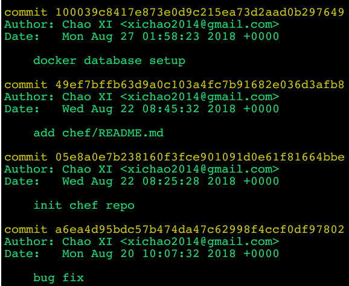
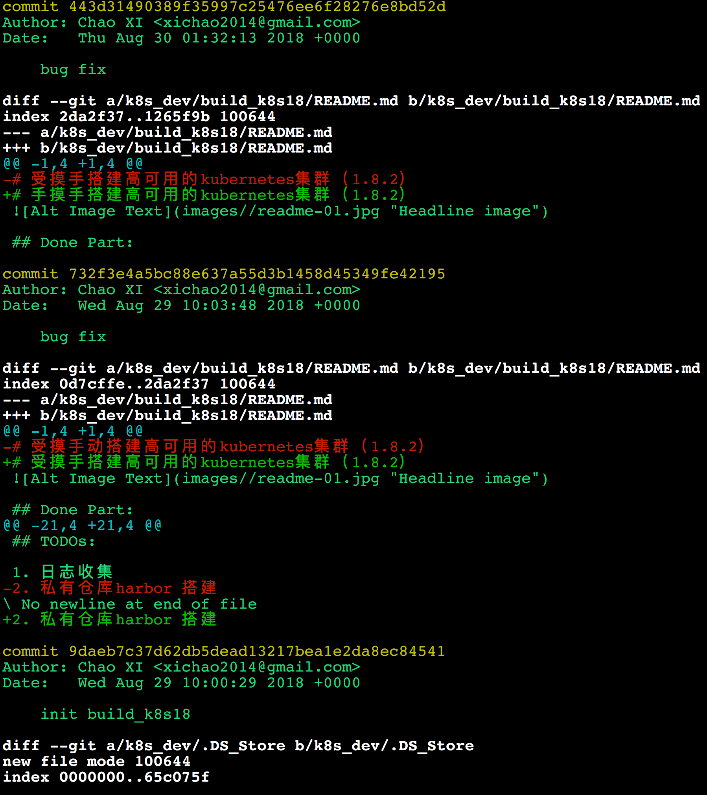

# 优雅的git log

对于码农来说`git log`是自然熟悉不过的了，但是每天面对`git log`原始的日志格式，你是不是觉得很烦人啊，因为上面的给的信息太不人性化了，而且我相信大部分的码农的提交日志都是随心所欲的

```
$git log
```



们看看下面的日志格式呢？是不是看上去很舒服~~


要实现上面的效果其实很简单，只需要在命令行输入下面的命令即可：

```
$ git log --graph --pretty=format:'%Cred%h%Creset -%C(yellow)%d%Creset %s %Cgreen(%cr) %C(bold blue)<%an>%Creset' --abbrev-commit

```

不过很显然上面的命令有点长，没关系，我们可以给上面的命令添加一个别名，如下：

```
git config --global alias.lg "log --color --graph --pretty=format:'%Cred%h%Creset -%C(yellow)%d%Creset %s %Cgreen(%cr) %C(bold blue)<%an>%Creset' --abbrev-commit"
```

现在当你需要查看你的日志的时候只需要输入`git lg`就可以，如果你想看一行的详细日志的话，只需要命令：`git lg -p`就可以了。

```
$ git lg
```


```
$ git lg -p
```

