# git rebase vs git merge详解

`git merge`应该只用于为了保留一个有用的，语义化的准确的历史信息，而希望将一个分支的整个变更集成到另外一个`branch`时使用。这样形成的清晰版本变更图有着重要的价值。

所有其他的情况都是以不同的方式使用rebase的适合场景：**经典型方式**，**三点式**，**interactive**和**cherry-picking**.

## 一个清晰的，有意义的版本变更信息

一个GIT用户的非常重要的技能是他们必须能够维护一个清晰的语义化的暴露给大众的变更历史。为了达到这个目的，他们必须依赖于四个主要的工具

* `git commit --amend`
* `git merge`外加或不外加`--no-ff`参数
* `git rebase`,特别是`git reabase -i`和`git rebase -p`
* `git cherry-pick`(实际上这个命令和rebase是紧密绑定在一起的）

我经常看到人们将`merge`和`rebase`都堆放到一个篮子里，这里说明人们存在的普遍的误解：**”获取别的branch的commits到我的branch上“**。

但是实际上，这两个命令实际上并没有什么共通之处。他们有着完全不同的目的，并且实际上应用他们的原因也是完全不同的！

我将不仅要highlight出来他们各自的role，而且给你足够的知识和最佳实践技能以便你暴露给公众的历史信息不仅是表意的，而且是语义化的（通过查看版本变更历史图就应该能够明显地反映出团队的不同的开发的目的）。而这个组织良好的历史信息对于团队的价值也是明显的：比如有新的团队成员加入，或者过一段时间再回来维护项目，或者对于项目的管理，code review等等。

## 什么时候我应该用git merge?

正如`merge`的名字所隐含的意思：**`merge`执行一个合并，或者说一个融合。我们希望在当前分支上往前走，所以我们需要融合合并其他分支的工作，从而放弃其他的分支**。

你需要问你自己的问题是：**这个其他分支到底代表了什么？？**

**它是不是仅仅是一个local的，临时性的分支，创建它的目的仅仅是为了在开发它的同时又能防止master变得不稳定？**

如果答案是yes，那么， it is not only useless but downright counter-productive for this branch to remain visible in the history graph, as an identifiable “railroad switch.”

* 如果`merge`的目标分支（比如说`master`分支）在这个分支创建后又往前走了，也就是说`master`分支（头tip)已经不再是这个临时local分支的直接祖先了,我们会认为我们这个`local`分支`too old`了，
* 所以我们往往需要使用`git rebase`命令来在`master`的`tip`上重新运行我们`local`分支上的`commit`以便保持一个线性的历史。
* 但是如果`master`分支在我们创建`local`分支之后一直没有改变，那么一个`fast-forward merge`就是足够的了。

结论：**如果是对`local` 私有的临时性质的分支，则直接`git rebase -i master`(梳理历史信息比如合并成一个commit)+`git merge`产生一个`fast forward`,最终以一个`commit`展示在`master`分支上；**

**它是一个`well-kown`的`branch`，被团队清晰了解或者仅仅是我的工作schedule来定义需要的？**

在这种情况下，我们的这个分支可能代表了一个sprint或者说user story的实现过程，或者说代表了我们的一个bug fix过程。

Is is then preferable, perhaps even mandatory, that the entire extent of our branch remain visible in the history graph. This would be the default result if the receiving branch (say master) had moved ahead since we branched out, but if it remained untouched, we will need to prevent Git from using its fast-forward trick. In both these cases, we will always use merge, never rebase.

**结论：如果是一个特别活动的跟踪，比如feature分支，bugfix分支那么永远不要使用rebase,而是git merge --no-ff，这样该分支历史永远存续在主分支上**


## 什么时候我应该使用rebase?

正如他的名字所隐含的意思：**rebase存在的价值是**：**对一个分支做“变基”操作**，这意味着改变这个`branch`的初始`commit`(我们知道commits本身组成了一颗树）。它会在新的`base`上一个一个地运行这个分支上的所有commits.

这通常在当本地的工作(由一些列的commits组成）被认为是在一个过时的base基础上做的工作的时候才需要用它。这可能每天都会有几次这样的场景出现，比如当你试图将local commits push到一个remote时而因为tracking branch(比如说origin/master)过于陈旧而被拒绝时（原因是自从我们上次和origin同步（通过git pull）后别的同事已经做了很多工作并且也push到了origin/master上）：这种情况下，如果我们强行将我们的代码push过去将会覆盖我们其他同事的并行工作成果。而这，往往是不允许的，所以push总会给出提示。

**一个merge动作（往往pull就会内置执行这个merge动作）在这种情况下并不是很好的应用场景，因为merge会产生一些杂乱的历史遗迹。**

另外一个对rebase的需求可能是：很久以前你曾经启动过一个并行的工作（比如做一些实验，做一些r&d工作），但是一直没有时间就耽搁了下来，现在又有了时间来做这件事情的时候，而这个时候你的R&D工作的base可能已经非常落后了。当你再次来继续这个工作时，你一定希望你的工作是在一个新的bas基础上来进行，以便你可以从已经解决的bugfix或者其他新的ready功能中获益。

最后还有一种场景：实际上是更频繁的场景：**实际上并不是变基，而是为了清理你的分支上commits。**

在使用git时，我们通常非常频繁地向repo中做commit，但是我们的commit本身往往是零散的不连续的，比如：

* 我在不同的topic之间来回切换，这样会导致我的历史中不同topic互相交叉，逻辑上组织混乱；
* 我们可能需要多个连续的commit来解决一个bug；
* 我可能会在commit中写了错别字，后来又做修改；
* 甚至我们在一次提交时纯粹就是因为懒惰的原因，我可能吧很多的变更都放在一个commit中做了提交。

上面的各种行为只要是保留在local repo中，这是没有问题的，也是正常的，但是如果为了尊重别人同时也为了自己将来能够返回来我绝对避免将这些杂乱的历史信息push到remote上去。

**在我push之前，我会使用`git rebase -i`的命令来清理一下历史。**

```
$ git rebase -i

# Rebase 0dbe0d8..0dbe0d8 onto 0dbe0d8
#
# Commands:
#  p, pick = use commit
#  r, reword = use commit, but edit the commit message
#  e, edit = use commit, but stop for amending
#  s, squash = use commit, but meld into previous commit
#  f, fixup = like "squash", but discard this commit's log message
#  x, exec = run command (the rest of the line) using shell
#
# These lines can be re-ordered; they are executed from top to bottom.
#
# If you remove a line here THAT COMMIT WILL BE LOST.
#
# However, if you remove everything, the rebase will be aborted.
#
# Note that empty commits are commented out
```

## rebase黄金定律

### 永远不要`rebase`一个已经分享的分支（到非`remote`分支，比如`rebase`到`master`,`develop`,`release`分支上），也就是说永远不要`rebase`一个已经在中央库中存在的分支.只能`rebase`你自己使用的私有分支

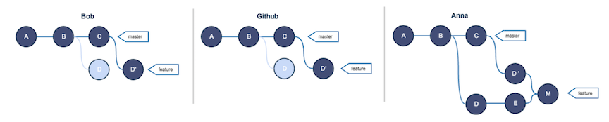

上面这个例子中展示了已经在中央库存在的feature分支，两个开发人员做了对feature分支针对master做rebase操作后，再次push并且同步工作带来的灾难：**历史混乱，并且merge后存在多个完全相同的changeset**。

在执行`git rebase`之前，总是多问问你自己：“有没有其他人也需要这个分支来工作？”，如果答案是yes，**那么你就需要思考必须使用一种非破坏性的方式来完成`rebase`一样的工作（就是需要合入别人的工作成果），比如使用`git revert`命令。**

**否则，如果这个`branch`没有别人来使用，那么很好，你可以非常安全地随心所欲地`re-write history`**（注意rebase往往会重写历史，所有已经存在的commits虽然内容没有改变，但是commit本身的hash都会改变!!!）

但是我们要注意，即使对于上面的这个已经分享的feature分支，Bob和Anna也可以互相rebase对方的feature分支，这并不违反上面强调的rebase黄金定律，下面用图例再说明一下：

**假如你和你的同事John都工作在一个feature开发上，你和他分别做了一些commit**，随后你`fetch`了John的`feature`分支（或者已经被John分享到中央库的feature分支），那么你的repo的版本历史可能已经是下面的样子了：

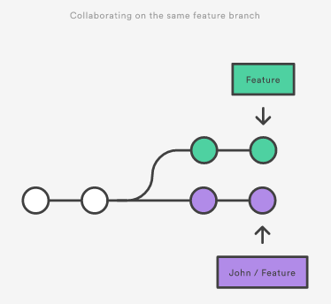

**这时你希望集成John的feature开发工作，你也有两个选择，要么`merge`,要么`rebase`,**

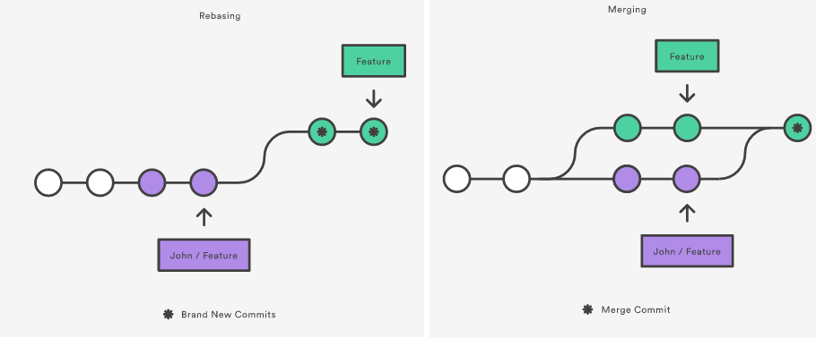

记住在这个场景中，你rebase到John/feature分支的操作并不违反rebase的黄金定律，因为：

**只有你的local本地私有（还未push的） `feature commits`被移动和重写历史了，而你的本地commit之前的所有commit都未做改变。**这就像是说“把我的改动放到John的工作之上”。在大多数情况下，这种rebase比用merge要好很多

> **结论：只要你的分支上需要`rebase`的所有`commits`历史还没有被`push`过(比如上例中rebase时从分叉处开始有两个commit历史会被重写)，就可以安全地使用`git rebase`来操作。**

上述结论可能还需要修正：**对于不再有子分支的branch，并且因为rebase而会被重写的commits都还没有push分享过，可以比较安全地做rebase**

我们在`rebase`自己的私有分支后希望`push`到中央库中，但是却会由于`rebase`改写了历史，因此`push`时肯定会存在冲突，从而`git`拒绝你的push，这时，你可以安全地使用`-f`参数来覆盖中央库的历史（同时其他对这个feature也使用的人员可以git pull）:

```
git push --force
```

## 快速sum up： 核心工作流原则和心法

下面的几个心法是你在使用git时必须磨砺在心的，在本文的后面，我们将具体说明哪些命令来负责执行这些心法：

1. 当我需要`merge`一个临时的本地`branch`时。。。我确保这个`branch`不会在版本变更历史图谱中显示，我总是使用一个`fast-forward merge`策略来`merge`这类`branch`，而这往往需要在`merge`之前做一个`rebase`;
2. 当我需要`merge`一个项目组都知道的`local branch`时。。。我得确保这个branch的信息会在历史图谱中一直展示，我总是执行一个`true merge`
3. 当我准备`push`我的本地工作时。。。我得首先清理我的本地历史信息以便我总是push一些清晰易读有用的功能；
4. **当我的`push`由于和别人已经发布的工作相冲突而被拒绝时，我总是`rebase`更新到最新的`remote branch`以避免用一些无意义的`micro-merge`来污染历史图谱**


### 聪明地merge一个branch

前面讲过，你只有在需要合并融入一个分支所提供的所有feature时才做merge。在这时，你需要问你的核心的问题是：这个分支需要在历史图谱中展示吗？

当这个分支代表了一个团队都熟知的一块工作时（比如在项目管理系统中的一个task,一个关联到一个ticket的bugfix,一个user story或者use case的实现，一个项目文档工作等），那么在这种情况下，我们应该将branch的信息永远留存在产品历史图谱中，甚至即使branch本身已经被删除。

否则，如果不代表一个well-known body of work,那么branch本身仅仅是一个技术意义上的实体，我们没有理由将它呈现在产品历史图谱中。我们得使用一个`rebase+fast-forward merge`来完成merge。

我们来看看上面两种场景分别长什么样：

**通过"true merge"来保留历史信息**

我们假设我们一个乘坐oauth-signin的feature branch,**该branch的merge 目标是master**.

如果`master`分支在`oauth-signin`分支从`master`创建后又往前走了一些`commits`（这可能是由于其他的branch已经merge到了master,或者在master上直接做了commit，或者有人在`master`上`cherry-picked`了一些`commits`)，那么这时在`master`和`oauth-signin`之间就产生了分叉（也就是说master不可能在不会退的情况下直接到`oauth-signin`)。在这种情况下，**git将会自动地产生一个"true merge"**

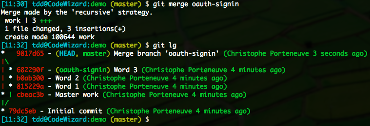

这是我们要的也是我们希望的，并不需要任何额外工作。

**然而，如果`master`在`oauth-signin`创建后并未向前走，后者就是`master`的直接后代（无分叉），这时GIT默认地在merge时是执行一个`fast-forward`的`merge`策略，git并不会创建一个merge commit而是简单地把master分支标签移动到oauth-signin分支tip所指向的commit。**


**这时oauth-sigin分支就变成了一个"透明"的分支了**：**在历史图谱中无法得知oauth-signin分支的起始位置在哪里**，并且一旦这个branch被删除，那么从历史上我们再也无法看到任何关于这个开发分支曾经存在的历史渊源。

这不是我们所想要的，所以我们通过强制git产生一个真正的merge---**通过使用`--no-ff`参数（no fast forward的意思）**。

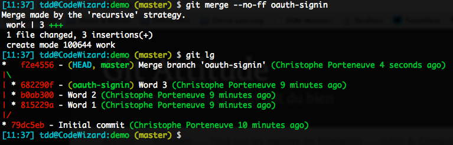

### 通过`fast-forward merge`来实现`merge`的透明

这是相反的情况：我们的branch因为没有任何实质语义，所以我们不希望它在历史图谱中存在。我们必须确保merge会使用fast-forward策略。

我们假设我们有一个仅仅为了开发的安全性起了一个local branch命名为quick-fixes,**而master仍然是要merge到的目标分支。**

**如果`master`在`quick-fixes`创建之后再也没有往前走，我们知道git会产生一个`fast-forward`的merge:**

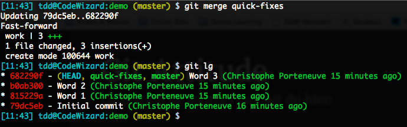

**另一方面，如果master在quick-fixes创建后又往前走了的话，我们如果直接`merge`的话`git`会给我们一个`true merge`，产生一个`merge commit`，那么我们的`branch`就会污染历史图谱，这不是我们想要的。**

在这种情况下，我们要做的事调整quick-fixes分支使得它重新成为master分支的直接后代（也就是不再分叉），这样就可以`fast-forward merge`了。要完成这个目的，**我们需要使用`git rebase`命令。我们希望通过更改`quick-fixes`分支的`base commit`，**以便它的base commit不再是master的老tip，而是当前的tip(注意tip是随着commit的不断引入而不断往前移动的！）。这个动作会重写quick-fixes分支的历史，由于quick-fixes完全是本地分支，重写历史是无关紧要的。

```
$ git rebase master quick-fixes
```

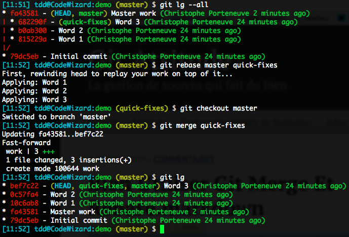

在这里我们特别要注意这个场景是如何运作的：

1. 我们有一个分叉过的分支但是我们希望透明化地merge，所以。。。
2. 我们首先变基到master的最新commit;
3. 我们随后到master上，执行merge命令就产生一个`fast-forward`

注意：我这里额外提醒一下，实际上我们看到上面的word1,word2,word3的commit可能还是不爽，我们在第3.步骤中可以**使用`git merge quick-fixes --squash`，来讲所有的`word1,2,3`都合并成一个`commit`;**

#### 注意留心merge的一些默认配置

如果在练习上面的操作时，你发现git并未如你所愿，你需要检查一下git对于merge的一些默认配置。

比如: `branch.master.mergeoptions = --no-ff/merge.ff=false`或者`branch.master.mergeoptions=--ff-only/merge.ff=only`

### Rebase一个古老的分支

有时候你创建一个feature分支开始工作后可能很长时间没有时间再做这个feature开发，当你回来时，你的feature分支就会缺失很多master上的bugfix或者一些其他的feature。在这种个情况下，我们先假设除了你没有其他人在这个分支上工作，那么你可以rebase你的feature分支：

`git rebase [basebranch] [topicbranch]` 注意这时git rebase的参数顺序，**第一个为基分支**，**第二个为要变基的分支**

```
(master) $ git rebase master better-stats
```
注意：**如果那个feature分支已经被push到remote了的话，你必须使用`-f`参数来push它**，以便你覆盖这个分支的commits历史，这时覆盖这个branch历史也无所谓，因为历史的所有commits都已经相应重新生成了！！。**（一个分支的历史由分支的起始commit和头tip commit来描述.有一点需要注意：一旦我们做一次rebase后，那么这个分支上的所有commit由于这次变基，其commit HASH都会改变！！）另外需要注意我们只能对private分支做这个rebase并且git push --force操作！！**

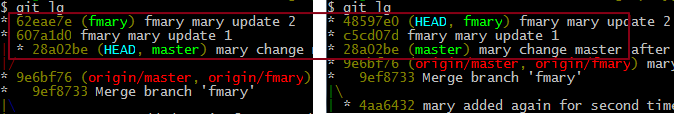


### 在Push之前清理你的本地历史


如果你正确地使用git，相信我们都会频繁地做一些原子commit.我们也要铭记以下警句：**不要落入SVN人员的行为模式：`commit+push`，这是集中式版本控制系统的最常见工作模式：每一个commit都立即push到`server`上**。

事实上，如果那样做的话，你就失去了分布式版本控制系统的灵活性：只要我们没有push，我们就有足够的灵活性。所有我们本地的commits只要没有push都是我们自己的，所以我们有完全的自由来清理这些commit，甚至删除取消某些commits。为什么我们要那么每个commit都频繁地Push从而失去我们应该有的灵活性呢？

**在一个git的典型工作流中，你每天可能会产生10到30个commit,但是我们往往可能只会push 2到3次，甚至更少。**

再次重申：**在push之前，我应该清理我的本地历史。**


有很多原因会导致我们的本地历史是混乱的，前面已经提及，但是现在还想再说一遍：

* 我在不同的`topic`之间来回切换，这样会导致我的历史中不同`topic`互相交叉，逻辑上组织混乱；
* 我们可能需要多个连续的`commit`来解决一个`bug`；
* 我可能会在`commit`中写了错别字，后来又做修改；
* 甚至我们在一次提交时纯粹就是因为懒惰的原因，我可能吧很多的变更都放在一个commit中做了提交。

这些场景都会导致一个混乱的历史产生，非常难以阅读，难以理解，难以被他人所重用，注意：这里的他人也可能是你自己哦，想想两个月后你再来看这段代码吧。


幸运的是，git给你提供了一个漂亮的方法来不用花什么精力就能理清你的本地历史：


1. **reorder commits;**

2. **squash them together;**

3. **split one up(trickier)**

4. **remove commits altogether;**

5. **rephrase commit messages**

**`interactive rebasing`就和普通的`rebase`很相像，它给你一个个地选择编辑你的commit的机会。**

在我们当下`rebase -i`的情形，`rebase`操作本身并不会实际的真真实实地变基。`rebase -i`操作仅仅会重写历史。在每天的工作场景中，可能那个分支已经在你的远端库中存在（也就是说已经发布了），你需要做的是清理自从最近一次git pull之后的所有local commits。假设你正在一个experiment分支。你的命令行可能是这样的：

```
(experiment) $ git rebase -i origin/experiment
```

在这里你在rebase你的当前分支（experiment分支)到一个已经存在历史中的commit(origin/experiment).如果这个rebase不是interactive的话，那么这个动作是毫无意义的（实际上会被作为一个短路的no-op).但是正是有了这个`-i`选项，你将可以编辑rebase将要执行的这个脚本化过程。那个脚本将会打开一个`git editor`,就像我们在commit提交时弹出的编辑框一样。

```
git rebase -i yourbasecommit
```

**比如你在`dev`分支为了一个小的功能或者`idea`连续提交了多个`commits`,这时你希望将这些`commit`合并为一个以免污染了`git`的历史信息，这时，你可以做的就是：找到这些`个commits`之前最早的`basecommit`，运行上述命令，**

**如果你希望为那个工作过程创建一个`alias`，正如就像在`push`之前的条件反射一样，你可能并不想敲那个`base`参数。由于`base`往往就是当前分支的`remote tracked branch`,你可以使用`@{u}`特殊语法（比如`@{upstream}`）：**

```
git config --global alias.tidy "rebase -i @{upstream}"
(experiment) $ git tidy
```

我们给出下面的snapshot作为后续行文展开的基础，大家可以看到从`origin/experiment`到本地`experiment`已经经过了从057ad88...2863a46共6个commit.

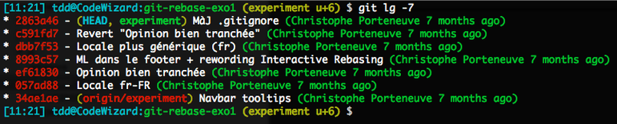

我们希望在push我们的本地experiment之前来清理这些commits：

```
(experiment) $ git rebase -i origin/experiment
```

这时会弹出`git editor`展示出下面的script供我们处理：

```
pick 057ad88 Locale fr-FR
pick ef61830 Opinion bien tranchée
pick 8993c57 ML dans le footer + rewording Interactive Rebasing
pick dbb7f53 Locale plus générique (fr)
pick c591fd7 Revert "Opinion bien tranchée"
pick 2863a46 MàJ .gitignore
# Rebase 34ae1ae..2863a46 onto 34ae1ae
#
# Commands:
# p, pick = use commit
# r, reword = use commit, but edit the commit message
# e, edit = use commit, but stop for amending
# s, squash = use commit, but meld into previous commit
# f, fixup = like "squash", but discard this commit's log message
# x, exec = run command (the rest of the line) using shell
#
# These lines can be re-ordered; they are executed from top to bottom.
#
# If you remove a line here THAT COMMIT WILL BE LOST.
#
# However, if you remove everything, the rebase will be aborted. #
# Note that empty commits are commented out
```

**默认情况下，这就是一个通常意义上的`rebase`: 将这个列表中的`commits`顺序采摘(`cherry-picking`)，需要注意的是这个列表是按时间顺序排列的（不像`git log`，默认情况下最新的总是列在最上面）。**


正如其他任何git里面的基于文本编辑器的操作：留空或者注释掉一行就会取消那行的操作。

我们来详细看看各种不同的use case:


* `Removing commits`: 我们只需要删除那个commit所在的行即可；
* `Reordering commits`: 我们只需要重新排序这些commits 行即可。然而注意实际结果最终是否成功并不能保证：如果commit B的changeset依赖于由commitA引入的代码，那么如果颠倒他们的顺序明显地将会产生问题。
* `Rewording commit messages`:由于编辑错误，表达清晰度不够等原因，我们可能需要改写commit附带的消息。
* `squash commits together`: squash这个术语包含着：将变更集和commit message糅合在一起的意思。
* split a commit: 

### squashing and rewording

我们使用两个`commit`来介绍所使用的场景：

如果我们简单地删除第一个commit是不行的：**因为第二个commit将找不到它自己的`changeset`对应的`code context`,从而`cherry-pick`可能失败。** 在这里我们要做的是将这两个`commits`打包`squash`起来。

要实现这一点，我们重新组织这个script连贯化：

```
pick 057ad88 Locale fr-FR
pick dbb7f53 Locale plus générique (fr)
```

由于我们现在不想使用squash方法，我们使用fixup选项：

```
reword 057ad88 Locale fr-FR
fixup dbb7f53 Locale plus générique (fr)
…
```

在这个特定情形下，起初的第一个commit消息不是很精确，所以我们使用`reword`来改变第一个commit.

我们再来看看下面的场景：

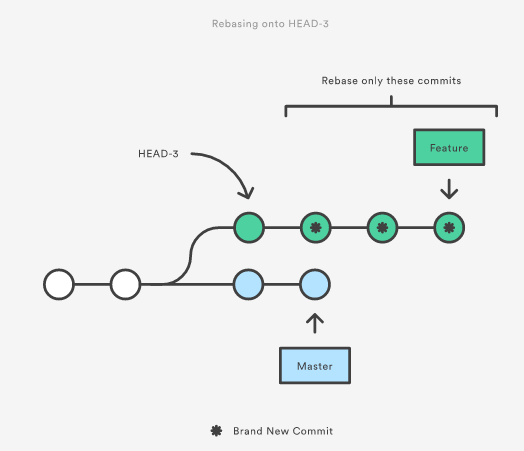

```
git checkout feature
git rebase -i HEAD~3
//或者使用下面的命令先列出feature分支拉出来时在master上的那个commit
$ git merge-base develop master
f96e3c4057cfe2713619d3050ad9c1a3943ae8cb

Administrator@USER-20151001BU MINGW64 ~/gitplayground/dev2 (develop)
$ git rebase -i f96e3c4057cfe2713619d3050ad9c1a3943ae8cb
[detached HEAD 3c63e67] dev develop.c line1
 Date: Fri Apr 1 14:43:01 2016 +0800
files changed, 4 insertions(+)
 create mode 100644 develop.c
Successfully rebased and updated refs/heads/develop.

Administrator@USER-20151001BU MINGW64 ~/gitplayground/dev2 (develop)
$ git lg
* 3c63e67 (HEAD -> develop) dev develop.c line1
| * 11bddec (master) master branch updated
|/
| * 4922bbd (hotfix) hotfix added
| * 18515e8 dev develop.c line2
| * c8bc641 (origin/develop) dev dev.c line2 before merged with updated l.git
| * 61025fc dev develop.c line1
|/
* f96e3c4 (origin/master, origin/HEAD) dev mod a.c line3
* 6bdb183 dev dev.c line1
* 9e6c445 a.c line3 in l.git and l1.c new added
* 227eb73 l add a.c line2
* af23226 l add a.c line1

Administrator@USER-20151001BU MINGW64 ~/gitplayground/dev2 (develop)
```

### git pull+push条件反射陷阱

到现在我们到了最后一个reabase相关的话题： git pull

如果我们在一个分支上不需要协同，一切都非常简单：我们所有的git push都能成功，不需要频繁地git pull操作。但是只要有其他人同样在我们共同的分支上工作（这实际上是非常常见的场景），我们就非常普遍地碰到下面的障碍：在我们的最近一次同步（使用git pull)和我们需要发布local history（要使用git push）的这个时刻，另外一个同事已经分享了他们的工作到中央库上面，所以`remote branch`(比如说`origin/feature`分支上） 是比我们的本地拷贝要更新一些。

这样，`git push`的时候，git就会拒绝接受（因为如果接受就会丢失历史）

```
(feature u+3) $ git push
To /tmp/remote
  ! [rejected] feature -> feature (fetch first)
error: failed to push some refs to '/tmp/remote'
hint: Updates were rejected because the remote contains work
hint: that you do not have locally. This is usually caused by
hint: another repository pushing to the same ref. You may want
hint: to first integrate the remote changes
hint: (e.g., 'git pull ...') before pushing again.
hint: See the 'Note about fast-forwards' in 'git push --help'
hint: for details.
(feature u+3) $
```

#### 在这种情况下，大多数人都会接受`git`的建议，先做一次`git pull`,随后再`git push`.这看起来没有问题，但是还是有些需要思考的：

**git pull到底做了什么？**

pull实际上包含了两项顺序执行的操作：

1. 将`local copy repo`和`remote repo`做一次网络同步。这实际上就是一次`git fetch`，也只有这次我们需要有和`remote repo`的网络连接；
2. 默认的，一个`git merge`操作（将r`emote tracked branch merge`到我们的`local trakcing branch`,比如说`orgin/featurex->featureX`)
3. 为了便于演示，我们假设如果我当前在`feature`分支上，而它的`remote track branch`是`origin/feature`,那么一个`git pull`操作就等效于：

```
1. git fetch;2.git merge origin/feature
```

**git pull自带merge动作的问题**

由于我有了local的变更，而remote又有另外的一些变更，这样由于local 和 remote有了分叉，因此git pull中的merge就会产生一个真实的merge,就像我们之前看到过的一样，我们的repo库的历史图谱就会像下面这个样子：


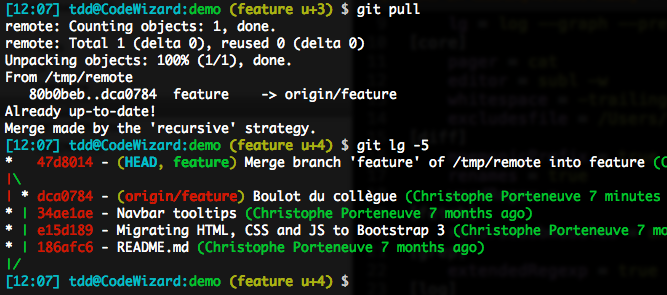

而这明显和我们一直宣导的原则：一个merge动作代表了我们将一个well-known branch需要合并融入主流的动作，而不是一次繁文缛节的技术动作！


在这里，我们运气确实不是那么好：有人在我们push之前抢先push了代码。在一个理想的场景中，他们可能push的更早一些（在我们最后一个git pull之前发生生的），或者push的更晚一些（在我们push之后才push的）的话，我们的历史图谱就依然能够保持线性的。


而这种在执行一个git pull操作动作时保持这个分支历史信息的线性化，往往是我们希望达到的。而要达到这一点，我们唯一需要做的就是要求git pull操作时不要执行merge操作，而是执行rebase操作，所以git pull执行的结果就是让你的local commits一个一个地在新拉下来的base基础上重新run一遍。

### `git pull`时使用`rebase`

我们可以通过`git pull --rebase`来明确要求`git`，但是这不是一个很可靠的解决方案，因为这需要我们在`git pull`操作时时时保持警惕，但这往往并不太可能，因为只要是人就容易犯错误。


上面这个案例要求git pull使用git rebase，而不是merge.虽然很cool，但是往外容易丢三落四犯错误。

我们可以通过一个配置选项来保证我们不会忘记这件事儿（要求`git pull`时使用`rebase`而不是`merg`e)，这个配置可以在`branch`级别`(branch.feature.rebase = true`)，或者`global`级别，比如`pull.rebase=true`.

从GIT1.8.5开始，有另外一个更好的配置选项，为了理解为什么说更好，我们需要了解一下pulling over a local history that includes a merge的问题。


**The tricky case of a rebasing pull over a local merge**

默认地，`rebase`操作会做`inline merge`.我们既然希望确保我们的`merge`有清晰的语意，那么这种inlining实在是令人讨厌，我们来看看下面的场景：`local master`已经有过一次`merge`动作(fast forward)，随后我们再做`git pull --rebase`，得到的历史图谱：

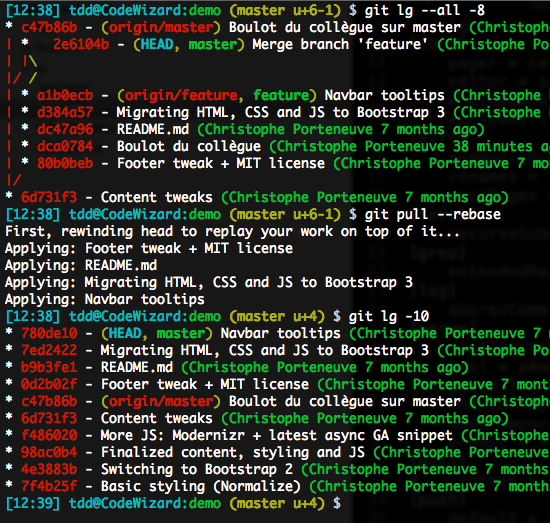

在这种情况下，`git pull --rebase`之后，我们只有了线性历史，看得我们头晕目眩。为了阻止这种行为，我们需要使用`--preserve-merges`(或者是-p）参数。然而在1.8.5版本之前，并不存在这样的选项。这个选项可以使用`git pull --rebase=preserve`来调用，或者直接卸载配置选项中

`pull.rebase = preserve`

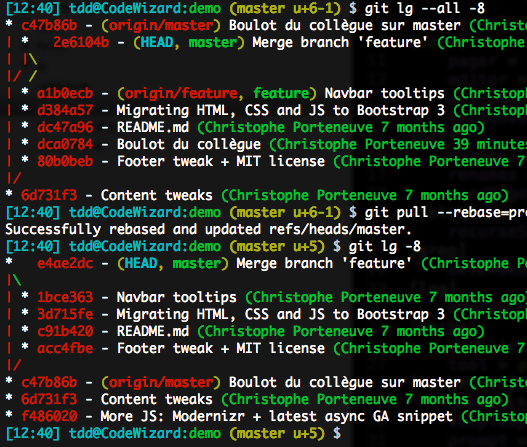

在上图中，我们使用`pull with rebase`策略，但是却保留了`local merge`，非常清爽！


