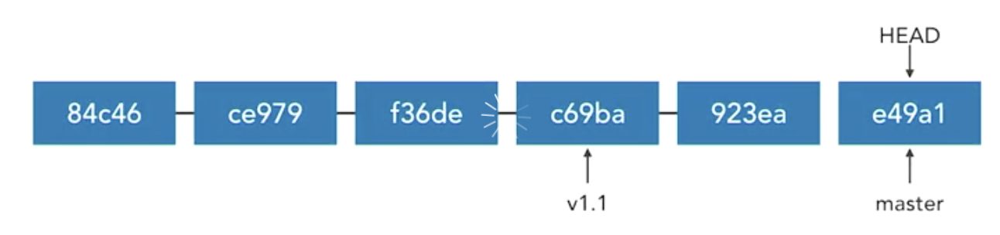
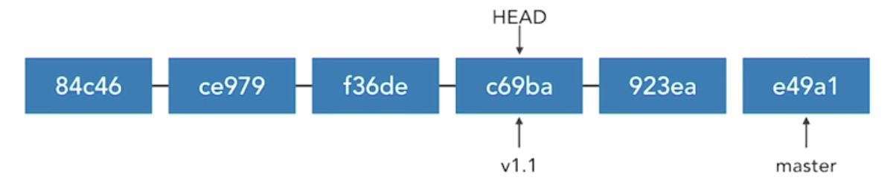
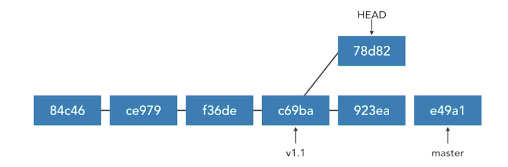

# Tagging

* Create tags
* List tag
* Delete tag
* Check out tags


## Create tags

* Tags allow marking points in histoiy as important  
* A named reference to a commit
* Most often used to mark releases (v1.0, v1.1, v2.0) 
* Can mark key features or changes (ecommerce, redesign) 
* Can mark points for team discussion (bug, issue136) 


###  Add lightweight tag 

```
git tag issue136 655da716e7 
```

### Add annotated tag (most common)

```
git tag -a v1.1 -m "Version 1.0" dd5c49428a0 
```

* provide message
* `-a` add annotated tag
* `-m` provide the message that should be used for the annotation
* `"Version 1.0"` name of the tag
* `dd5c49428a0` sha of commit to rederence


### Demo

```
$ git log

commit a4974b2e6413a358e8dc5f3334d799b1e77493f5 
author: KS <someone@nowhere.com> 
Date: Tue Jan 23 16:28:44 2018 -0500 

	Add to do list 

commit 1d8afcb9ec2b88bfl3c9Olaald725f26d15e7b72 
Author: KS <someone@nowhere.com> 
Date: Tue Jan 23 15:55:13 2018 -0500 
	
	Added shopping list 

commit d55bc490e301a135e095f3cb00d8bfd9bb6adebf 
Author: KS <someone@nowhere.com> 
Date: Tue Jan 23 15:22:28 2018 -0500 

	First commit 
```


```
$ git tag -am "start" v0.0 d55bc490e301a
```

```
git tag v0.1
```

**This will automatically add tag to first line of log the latest commmit**


## List tag

### List tags 

```
$ git tag 
$ git tag --list 
$ git tag -l 
```

### List tags beginning with "v2" 

```
$ git tag -l "v2*" 
```

### List tags with annotations 

```

$ git tag -l -n 
```

### Work with tags (like SHAs) 

```
$ git show v1.1 

$ git diff v1.0..v1.1 
```

### Demo

```
$ git tag -l
lastStableBuild

$ git tag -ln
lastStableBuild deploy integration701 to R539


$ git show lastStableBuild
commit 9074d3459467438cc4d6d28ed9f12b6f7ab24729 (tag: lastStableBuild)
Author: jambot <jambot@sap.com>
Date:   Wed Feb 12 07:08:38 2020 +0000

    deploy integration701 to R539

diff --git a/instances/integration701-k8s.yaml b/instances/integration701-k8s.yaml
index 79229c8..c23e629 100644
--- a/instances/integration701-k8s.yaml
+++ b/instances/integration701-k8s.yaml
@@ -2,7 +2,7 @@ jam:
   deploymentLandscape: aws
   namespace: integration701
   releaseContainerSuffix: ''
-  nonce: '20200212065835'
+  nonce: '20200212070837'
   agentserver:
     webhook:
       replicas: 2
@@ -69,7 +69,7 @@ jam:
   initialize:
     data: production
     resetDb: false
-  release: lastStableBuild
+  release: R539
...
```

```
git tag -l "v*'
v0.0
v0.1
```

## Delete tag

```
# Delete a tag 
$ git tag --delete v1.1 
$ git tag -d v1.1 
```

## Push, fetch and delete tags to a remote

* Like branches, tags are local unless shared to a remote 
* `git push` does not transfer tags 
* Tags must be explicitly transferred 
* **git fetch automatically retrieves shared tags** 


### Push

```
# Push a tag to a remote server 
$ git push origin v1.1 

# Push all tags to a remote server 
$ git push origin --tags 
```

### Fetch

```
# Fetch commits and tags 
$ git fetch 

# Fetch only tags (with necessary commits) 
$ git fetch --tags 
```

### Delete remote tags like remote branches 

```
$ git push origin :v1.1 
$ git push --delete origin v1.1 
$ git push -d origin v1.1 
```

### Demo

```
# push one tag
(master) $ git push origin v0.0 
Counting objects: 1, done. 
Writing objects: 100% (1/1), 162 bytes 1 0 bytes/s, done. 
Total 1 (delta 0), reused 0 (delta 0) 
To github.com:ks/demo_repo.git 
	* [new tag] v0.0 -> v0.0 

# push all tags
(master) > git push --tags 
Total 0 (delta 0), reused 0 (delta 0) 
To github.com:ks/demo_repo.git 
	* [new tag] v0.1 -> v0.1 
```

* Delete

```
(master) $ git push origin :v0.1
To github.com:ks/demo_repo.git 
	- [deleted] v0.1 demo

(master) $ git tag -l 
v0.0 
v0.1 
```

## Check out tags

### Checking Out Tags 

* **Tags are not branches** 
* **Tags can be checked out**, just like any commit 
* `git checkout -b new branch v1.1` 
* `git checkout v1.1`


### Detached HEAD State 


* **Checking out a commit puts the local repository in a "detached HEAD state"** 
* Like being on an unnamed branch 
* New commits will not belong to any branch 
* **Detached commits will be garbage collected (~2 weeks)** 




* There is a tag v1.1 on `c69ba`



* checkout v1.1. move the **head** or **working directory** back to the commit that's defined by `c69ba`



* If we start doing additional work, it's not going to be work that's on the master branch
* It has to make it off of that commit into a new unnamed branch. 
* **That's the detached head state**. 
* The problem here is that if we check out another branch, for example, we check back out master again, now there's not an easy way to get back to those commits that we had. 
* **They're orphaned**, they're not on another branch and git **will eventually see them as garbage and throw them away**. 

### Rescue this orphaned branch

* **Tag the commit (HEAD detached)** 

```
git tag temp 
```

Tag that commit with a name then that will be able to be found in the future

* Create a branch (HEAD detached) 

```
git branch temp branch 
```

Create a branch and then we can move back and forth and it'll have regular branch behavior

**downside**:  git branch is that our head is still in that detached state.

* **Create branch and reattach HEAD (Better Way)**

```
git checkout -b temp branch 
```

**The better way to do it is to checkout that branch and reattach the head at the same time**

```
(master) $  git checkout v0.0 
Note: checking out 'v0.0'. 

You are in 'detached HEAD' state. You can look around, make experimental changes and commit them, and you can discard any commits you make in this state without impacting any branches by performing another checkout. 

If you want to create a new branch to retain commits you create, you may do so (now or later) by using -b with the checkout command again. 

Example: 

	git checkout -b <new-branch-name> 

HEAD is now at d55bc49... First Commit
```
