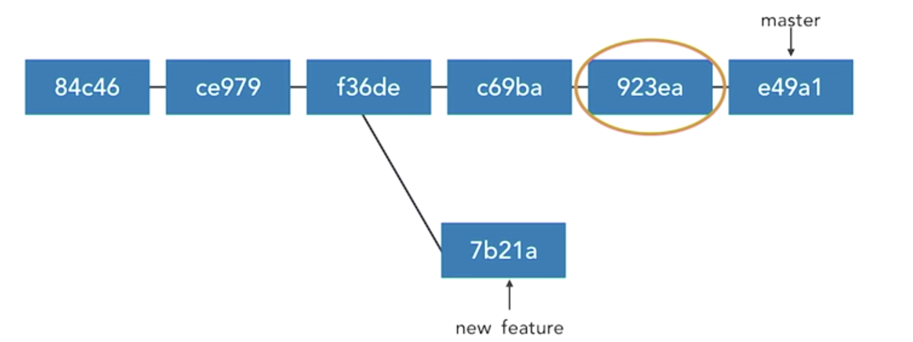
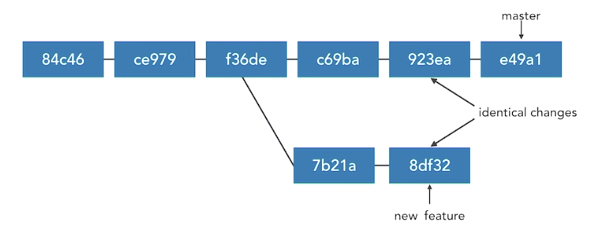

# Share select changes

* Cherry-picking commits
* Resolve cherry-picking conflicts
* Create diff patches
* Apply diff patches (Makes changes, but not commits)
* Create Formatted Patches (Includes commit messages )
* Apply formatted patches
* Formatted Patches vs diff patches

## Cherry-picking commits

* **Apply the changes from one or more existing commits** 
* Each existing commit is recorded as a new commit on the current branch
* Conceptually similar to copy-paste 
* **New commits have different SHAs** 

### different SHAs

* SHA is created by git, it creates a SHA based on the 
	* **content** of the commit, the changes that are being made 
	* all of the **metadata**, 
	* The **parent commit**  

Since this commit is going to **have different metadata and the different parent commit**, it's not going to have the same SHA. 



**Grab one commit (`923ea`) and bring it into `new feature` branch**



* Cherry-pick grab one commit and apply its change sets to our new feature branch. 
* The result will be that we get a new commit with those same changes.
* **We'll have identical changes between both of them, even though they'll both have different SHAs that reference them**.

```
git cherry-pick d4e8411d09 

git cherry-pick d4e841109..57d290ec44  (pick multiple commit)
```

### Demo (cherry pick one commit)

```
d(master) > git log 
commit e24cf053950621f542ac192b771c74ecf53cdf3f 
Author: ks <someone@nowhere.com> 
Date: Fri Jan 26 10:59:25 2018 -0500 
	
	Update shopping items 
	
commit 2d1991d525d2137a876883445b577cd223d182f8 
Author: ks <someone@nowhere.com> 
Date: Fri Jan 26 10:59:09 2018 -0500 
	
	Fix typo 

commit 8527e7ade737897082d384b95de421d1ddc3dcla 
Author: ks <someone@nowhere.com> 
Date: Thu Jan 25 15:09:48 2018 -0500 

	Clarify shopping list 

commit ec41a80cd4daca28494c8a5a5bebdd50251c738c 
Author: ks <someone@nowhere.com> 
Date: Thu Jan 25 14:52:50 2018 -0500 

	Edit shopping list 

commit 14584f28d38b63a599c20940ddc0d01798350a53 
Author: ks <someone@nowhere.com> 
Date: Thu Jan 25 14:35:36 2018 -0500 

	Add butter to shopping list 
```

**Want to pick 2nd one Fix typo into another branch**

```
$ git checkout key_feature
(key.feature) $ git cherry-pick 2d1991 
[key_feature 394fecb] Fix typo 
	Date: Fri Jan 26 10:59:09 2018 -0500 
	1 file changed, 1 insertion(+), 2 deletions(-) 


(key.feature) $ git show 
commit t94fecb694c3373417316d6c11f5lbf096f48875 
Author: ks <someone@nowhere.com> 
Date: Fri Jan 26 10:59:09 2018 -0500 
	
	Fix typo 
	
diff --git a/README.md b/README.md 
index eb84f95..7646b91 100644 
--- a/README.md 
+++ b/README.md 
@@ -1,2 +1 @@ 
-This is a demonstraton repository for Git Intermediate Techniques. 
-
+This is a demonstration repository for Git Intermediate Techniques. 
```


### Cherry Picking Commits feature

* Cannot cherry pick a merge commit 
	*  **A merge commit is merging together two other sets of commits.** That's its purpose. 
	*  If we try to `cherry-pick` it, then git wouldn't know which one of those parents that it was joining should be brought into the current branch. 
* Use `--edit, -e` to edit the commit message 
* **Can result in conflicts which must be resolved** 


## Resolve cherry-picking conflicts

```
(key_feature)$ git cherry-pick 8527e7a 
error: could not apply 8527e7a... Clarify shopping list 
hint: after resolving the conflicts, mark the corrected paths 
hint: with 'git add <paths>' or 'git rm <paths>' 
hint: and commit the result with 'git commit' 
```


```
(key_feature|CHERRY-PICKING) $ git status 
On branch key_feature 
Your branch is ahead of 'origin/key_feature' by 4 commits. 
	(use "git push" to publish your local commits) 
You are currently cherry-picking commit 8527e7a. 
	(fix conflicts and run "git cherry-pick --continue") 
	(use "git cherry-pick --abort" to cancel the cherry-pick operation) 
```

**Resolve the comflict**

```
(key_feature|CHERRY-PICKING) $ git cherry-pick --continue 
[key feature 7185657] Clarify shopping list 
Date: Thu Jan 25 15:09:48 2018 -0500 
1 file changed, 3 insertions(+), 3 deletions(-) 
```

## Create diff patches

### Create Diff Patches 

* Share changes via files 
* Useful when changes are not ready for a public branch 
* seful when collaborators do not share a remote 
* Discussion, review, approval process 


```
git diff first-commit to-commit > out.diff
```

```
(master) $  git log --oneline 
e24cf05 Update shopping items 
2d1991d Fix typo 
8527e7a Clarify shopping list 
ec41a80 Edit shopping list 
14584f2 Add butter to shopping list 
la5ae0e Add party invites 
a4974b2 Add to do list 
1d8afcb Added shopping list 
d55bc49 First commit 
```

```
(master) $ git diff 8527e7a e24cf05 > for_review.diff 
```

## Apply diff patches (Makes changes, but not commits)

* Apply changes in a diff patch file to the working directory 
* **Makes changes, but not commits** 
* No commit history transferr

```
git apply output.diff
```
```
(master) $ git log --oneline 

e24cf05 Update shopping items
2d1991d Fix typo
8527e7a Clarify shopping list.  *
ec41a80 Edit shopping list
14584f2 Add butter to shopping list
la5aeOe Add party invites
a4974b2 Add to do list
ld8afcb Added shopping list
d55bc49 First commit 
```

**Checkout from Clarify shopping list**

```
(master) $ git checkout -b tester 8527e7a 
Switched to a new branch 'tester' 

(tester) $ git log --oneline 
8527e7a Clarify shopping list 
ec41a80 Edit shopping list 
14584f2 Add butter to shopping list 
la5aeOe Add party invites 
a4974b2 Add to do list 
1d8afcb Added shopping list 
d55bc49 First commit 
```
```
(tester) $ git apply review.diff 

(tester) $ git status 
On branch tester Changes not staged for commit: 
	(use "git add <file>..." to update what will be committed) 
	(use "git checkout -- <file>..." to discard changes in working directory) 

	modified: modified: 
	README.md shopping.txt 
	
no changes added to commit (use "git add" and/or "git commit -a") 
```

I seem to recall that the `-- `is a way to tell Git to treat what follows checkout as a file and not as a branch.

```
git checkout stuff       # checkout the branch stuff
git checkout -- stuff    # checkout the file stuff
```

## Create Formatted Patches (Includes commit messages )

* Export each commit in Unix mailbox format 
* Useful for email distribution of changes
* Includes **commit messages** 
* One commit per file by default 
	* So if we have 5 commits that we're creating, we're going to end up with 5 files being exported.
 
 
```
# Export all commits i the range 
$ git format-patch 2e33d..655da 

# Export all commits on current branch 
# which are not in master branch 
$ git format-patch master

# Export a single commit
git format-patch -1 655da
```

### One of the working ways 

`git format-patch` used is if we want to export all the commits on the current branch which are different from another branch such as master.   

```
# Put patch files into a directory 
$ git format-patch master -o feature 

# Output patches as a single file 
$ git format-patch 2e33d..655da --stdout > feature.patch 
```

### Demo

```
(master) $ git log --oneline 

e24cf05 Update shopping items   * end
2d1991d Fix typo
8527e7a Clarify shopping list.  * begin (no include)
ec41a80 Edit shopping list
14584f2 Add butter to shopping list
la5aeOe Add party invites
a4974b2 Add to do list
ld8afcb Added shopping list
d55bc49 First commit 
```

Patch format commit from `8527e7a` to `e24cf05`

```
(master) $ git format-patch 8527e7a..e24cf05 -o -o Desktop/patches 

/Users/ks/Desktop/patches/0001-Fix-typo.patch 
/Users/ks/Desktop/patches/0002-Update-shopping-items.patch 
```

## Apply formatted patches

* Extract author, commit message, and changes from a mailbox message and apply them to the current branch 
* **Similar to cherry-picking: same changes, different SHAs** 
* Commit history is transferred 

```
# Apply singgle pacth 
$ git am feature/0001-some-namempatch 

# Apply  all patches in
$ git am feature/-.patch 
```

```
(master) $ git log --oneline 
e24cf05 Update shopping items  
2d1991d Fix typo
8527e7a Clarify shopping list
ec41a80 Edit shopping list
14584f2 Add butter to shopping list
la5aeOe Add party invites
a4974b2 Add to do list
ld8afcb Added shopping list
d55bc49 First commit 


(tester) $ git log --oneline 
8527e7a Clarify shopping list 
ec41a80 Edit shopping list 
14584f2 Add butter to shopping list 
la5aeOe Add party invites 
a4974b2 Add to do list 
1d8afcb Added shopping list 
d55bc49 First commit 
```

### Applying mail box => am

```
(tester) $ git am ~/Desktop/patches/*.patch Applying: Fix typo 
Applying: Update shopping items 

(tester) $  git status 
On branch tester 
nothing to commit, working tree clean 
```

### After applied, changes identical but `sha` changed 

```
(master) $ git log --oneline 
b30a092 Update shopping items   # sha changed
ec77767 Fix typo
...


(tester) $ git log --oneline 
e24cf05 Update shopping items  
2d1991d Fix typo
...
```

## Formatted Patches vs diff patches

* Formatted patches are more useful most of the time 
* If we **don't want to actually give someone the commits, we just want to give them a set of changes**, then the **diff patches** is probably the way to go
* Give them the commits, go with the **formatted patch**