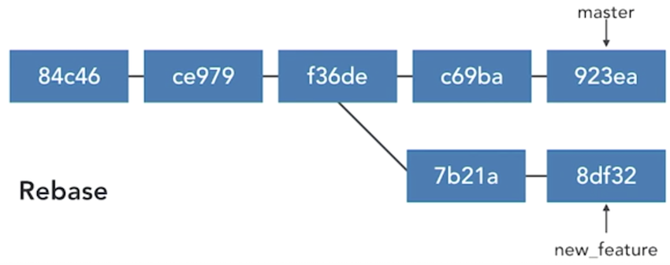

# Rebasing

* Rebase Commit
* Perform a rebase
* Merging vs. rebasing
* Resolve rebase conflicts
* Rebase onto other branches
* Undo a rebase
* Interactive rebasing
* Pull Rebase 


## Rebase Commit


* Take commits from a branch and replay them at the end of another branch 
* **Useful to integrate recent commits without merging** 
* **Maintains a cleaner, more linear project history**
* Ensures topic branch commits apply cleanly 


We have a branch that's master, and we've started a new topic or feature branch, called `new_feature`.

**New commits made on master and `new_feature` branch**

### Why rebase

We want to incorporate those new commits into our new feature branch, not just because we want to make use of them, **but because we want to make sure that the commits that are in our new feature branch will fit cleanly with what's there**.

What rebase does is it takes the commits in our `new_feature` branch, and it shifts them down to the tip of the master branch.


Moving these to the end, **the sha's that identify each of the commits will change.** It's the **same change set, but the identifiers have change**


### Rebase current branch to tip of master 

`git rebase master`

### Rebase new feature to tip of master 

`git rebase master new_feature` 


### Useful for visualizing branches 

`git log --graph --all --decorate --oneline`

### Return commit where topic branch diverges 

`git merge-base master new feature `


## Perform a rebase

### Checkout new branch from master and add new commits to both branches

```
(master) $ git log --oneline 
e24cf05 Update shopping items  
2d1991d Fix typo
...

(master) $  git checkout -b campaing

### Add some changes

(camping) $ git commit -am "ToDo: Add weekend camping" 
[camping 5a3afff] 
	1 file changed, 2 insertions(+) 


(camping) $ git commit -am "ToDo: Add camping activities" 
[camping dd8969e] ToDo: Add camping activities 
	1 file changed, 2 insertions(+) 
	
(camping) $ git log --oneline 
dd8969e ToDo: Add camping activities 
5a3afff ToDo: Add weekend camping 
e24cf05 Update shopping items  
...

(camping) $  git checkout master

(master) $ git commit -am "Add limes to shopping list" 
[master 676da05] Add limes to shopping list 
	1 file changed, 1 insertion(+) 
```

### Check visualizing branches

```
(camping)$ git log --graph --all --decorate --oneline
* 676da05 (HEAD -> master) Add limes to shopping list 
| * dd8969e (camping) ToDo: Add camping activities 
| * 5a3afff ToDo: Add weekend camping 
| /
e24cf05 Update shopping items  
```
 
### where topic branch diverges

```
(master) $ git merge-base master new feature 
e24cf05  ....
```

It knows what their common ancestor is.

`Update shopping items` is the  topic where branch diverges


### Move current branch new commits to the tip of master

`rebase master` It's backing up and picking up each of those commits, and then it applies them in order, one after another.

```
(master) $  git checkout camping 
Switched to branch 'camping' 

### On the current bracnh
(camping) > git rebase master 
First, rewinding head to replay your work on top of it... 
Applying: ToDo: Add weekend camping 
Applying: ToDo: Add camping activities 
```

```
(camping)$ git log --graph --all --decorate --oneline

* 3b802b9 (HEAD -> camping) ToDo: Add camping activities 
* 6ecd529 ToDo: Add weekend camping 
* (master) Add limes to shopping list 
e24cf05 Update shopping items  
```

### diverged branch changed to new commit on the master

```
(camping) $ git merge-base master camping 
676da05...
```

## Merging vs. rebasing

**Merging and rebasing are both ways to incorporate changes from one branch into another branch**. 

The result is similar, but the means of doing it are very different.


Incorporate the recent changes in the master branch into the new feature branch, we could **merge them in**




* **Taking the commits that are in the new feature branch** 
* **Shifting them to the tip of the master branch**
* Replay these commits at the tip of the branch, 
* Going to change the SHAs of those commits at the same time.

### Merging

* Adds a merge commit 
* Nondestructive 
* Complete record of what happened and when 
* Easy to undo 
* Log can become clutted, non-linear

### Rebasing 

* **No additional merge commit** 
* Destructive: **SHA changes, commits are rewritten** 
* No longer a complete record of what happened and when 
* Tricky to undo 
* Logs are cleaner, more linear 

### The Golden Rule of Rebasing 

* **Don't rebase a public branch.** 

* Rebase abandons existing, shared commits and creates new, similar commits instead 
* Collaborators would see the project history vanish 
* Getting all collaborators back in sync can be a nightmare 

### How to Choose? 

* **Merge** to allow commits to stand out or to be clearly grouped 
* **Merge** to **bring large topic branches back into master** 

* **Rebase** to add **minor commits** in master to a topic branch 
* **Rebase** to **move commits from one branch to another** 


* **Merge anytime the topic branch is already public and being used by others (The Golden Rule of Rebasing)**

## Resolve rebase conflicts

### Handle Rebase Conflicts 

* Rebasing creates new commits on existing code 
* May conflict with existing code 
* **Git pauses rebase before each conflicting commit **
* Simiar to resolving merge conflicts 

```
git rebase --continue
```

After resolve the conflict, the **continue** option will say I've resolved this commit. Go ahead and commit it and then go to the next commit. **And keep going down the chain of commits that are waiting to be rebased.** 


```
git rebase --skip
```

I don't want to rebase this one, but I do want you to keep going with the rest of the commits in the chain

**Underlying code already contains the change that's in your conflicting commit, and you'd like to use the existing one instead of yours.**

```
git rebase --abort
```

**Rebase will stop and your code will be just like it was before you attempted the rebase**


### Demo

**Add new concflict caused commit into master**

```
(master) $ git commit -am "Add clean closet to do" 
[master 4611a0c] Add clean closet to do 
1 file changed, 1 insertion(+) 

(master) $  git log --graph --all --decorate --oneline 
* 4611a0c (HEAD -> master) Add clean closet to do 
| * 3b802b9 (camping) ToDo: Add camping activities 
| * 6ecd529 ToDo: Add weekend camping 
|/
```

```
(master) $ git rebase master camping 
First, rewinding head to replay your work on top of it... 
Applying: ToDo: Add weekend camping 
Using index info to reconstruct a base tree... 
M 	to_do.txt 
Falling back to patching base and 3-way merge... 
Auto-merging to_do.txt 
CONFLICT (content): Merge conflict in to_do.txt 
error: Failed to merge in the changes. 
Patch failed at 0001 ToDo: Add weekend camping 
The copy of the patch that failed is found in: .git/rebase-apply/patch 

When you have resolved this problem, run "git rebase --continue". 
If you prefer to skip this patch, run "git rebase --skip" instead. 
To check out the original branch and stop rebasing, run "git rebase --abort". 
```

**Resolve the conflict**

```
(camping | REBASE 1/2) $ git add to_do.txt
(camping | REBASE 1/2) $ git rebase --continue 
Applying: ToDo: Add weekend camping 
Applying: ToDo: Add camping activities 
Using index info to reconstruct a base tree... 
M to_do.txt 
Falling back to patching base and 3-way merge... 
Auto-merging to_do.txt 
```
```
$ git log --graph --all --decorate --onetine 
* 7b93514 (HEAD -> camping) ToDo: Add camping activities 
* 82bfal9 ToDo: Add weekend camping 
* 4611a0c (master) Add clean closet to do 
* 676da05 Add limes to shopping list 
```

## Rebase onto other branches

```
git rebase --onto newbase upstream branch 
git rebase --onto master ecommerce new_feature 
```

### Rebase ecommerce to master


### Demo: Rebase ecommerce(frm camping branch) to master

* **Checkout from expense from camping**

```
(camping) $ git checkout -b expenses Switched to a new branch 'expenses' 
(expenses) $ git add expenses.txt 
(expenses) $ git commit -m "Add file for expenses" 
[expenses fc99822] Add file for expenses 
1 file changed, 6 insertions(+) 
create mode 100644 expenses.txt 
```

```
(expenses) > git log --graph --all --decorate --oneline 
* fc99822 (HEAD -> expenses) Add file for expenses 
* 7b93514 (camping) ToDo: Add camping activities 
* 82bfa19 ToDo: Add weekend camping 
* 4611a0c (master) Add clean closet to do 
* 676da05 Add limes to shopping list 
```

**Rebase that expenses branch so that it's no longer based off of camping, but instead we're going to move it to the master branch**.

```
(master) > git rebase --onto master camping expenses 
First, rewinding head to replay your work on top of it... Applying: Add file for expenses 
```

* **newbase**: master
* **upstream**: camping (**The place where we want to find out where it diverged**)
* **branch**: expenses


```
(expenses) $ git log --graph --all --decorate --oneline 
* e60555a (HEAD -> expenses) Add file for expenses 
| * 7b93514 (camping) ToDo: Add camping activities 
| * 82bfa19 ToDo: Add weekend camping 
| /
* 4611a0c (master) Add clean closet to do 
```

### rebaseexpense to the camping

* The upstream is going to be master and we're still moving the expenses branch.

```
(expenses) $ git rebase --onto camping master expenses 
First, rewinding head to replay your work on top of it... 
Applying: Add file for expenses
```


## Undo a rebase


* Can undo simple rebases 
* Rebase is destructive 
* SHAs, commit messages, change sets, and more 
* **Undoing complex rebases may lose data**

```
# Undo, unless ORIG_HEAD has changed again 
# (rebase, reset, merge change ORIG_HEAD) 
$ git reset --hard ORIG_HEAD
 
# Undo by rebasing to former merge-base SHA 
$ git rebase --onto 9291f0c88 master new_feature 
```

### Demo

**Do rebase**

```
(expenses) $ git rebase --onto master camping expenses 
First, rewinding head to replay your work on top of it... 
Applying: Add file for expenses
```

**expenses now is based on master not camping anymore**

```
(expenses) > git log --graph --all --decorate --oneline 
* d6a6870 (HEAD -> expenses) Add file for expenses 
| * 7b93514 (camping) ToDo: Add camping activities 
| * 82bfa19 ToDo: Add weekend camping 
| / 
* 4611a0c (master) Add clean closet to do 
```

**Undo rebase**

```
(expenses) $ git reset --hard ORIG_HEAD
HEAD is now at 3b88c8c Add file for expenses 
```

```
(expenses) > git log --graph --all --decorate --oneline 
* 3b88C8c (HEAD -> expenses) Add file for expenses 
* 7b93514 (camping) ToDo: Add camping activities 
* 82bfa19 ToDo: Add weekend camping 
* 4611a0c (master) Add clean closet to do 
```
**now the expenses now is based on camping**

```
(expenses) $ git rebase --onto 7b93514 master expenses

First, rewinding head to replay your work on top of it... 
Applying: Add file for expenses 

(expenses) $ git log --graph --all --decorate --oneline 
* 458b6bc (HEAD -> expenses) Add file for expenses 
* 7b93514 (camping) ToDo: Add camping activities 
* 82bfa19 ToDo: Add weekend camping
``` 

## Interactive rebasing

* Chance to modify commits as they are being replayed 
* Opens the `git-rebase-todo` file for editing 
* Can reorder or skip commits
* Can edit commit contents 

### Interactive rebasing Choices

* pick, drop
* reword, edit
* squash, fixup
* exec

### Interactive rebasing

```
git rebase -i master new feature 
```

```
(expenses) $ git log --graph --all --decorate --oneline 
* 458b6bc (HEAD -> expenses) Add file for expenses 
* 7b93514 (camping) ToDo: Add camping activities 
* 82bfal9 ToDo: Add weekend camping 
* 4611a0c (master) Add clean closet to do 
* 676da05 Add limes to shopping list 
```

* **expenses** is branch from **camping**
* **camping** is branch from **master**

### Demo (pick)

```
$ git rebase -i camping expenses
```

**pop out**

```
p 458b6bc Add file for expenses 

# Rebase 7b93514..458b6bc onto 7b93514 (1 command) 
# 
# Commands: 
# P, pick = use commit 
# r, reword = use commit, but edit the commit message
# e, edit = use commit message, but stop for amending squash 
# s, squash = use commit, but meld into previous commit
# f, fixup = like "squash", but discard this commit's log message
# x, exec = run command (the rest of the line)
# d, drop = remove commit 
# These lines can be re-ordered; they are executed from top to bottom.
# 
# If you remove a line here THAT COMMIT WILL BE LOT. 
#
# However, if you remove everything, the rebase will be aborted. 
#
# Note that empty commits are commented out 
```

```
(expenses) $ git rebase -i camping expenses 
Successfully rebased and updated refs/heads/expenses. 
```

### Demo (reword)

```
(expenses)$ git rebase -i --onto master camping expenses
```

**rebase from expenses on master**

**Pop out**

```
reword 458b6bc Add file for expenses 
```
**Another Pop out: Edit the commit message**

```
Add file for expenses
```

```
(expenses) $ git rebase -i --onto master camping expenses 
[detached HEAD d8a1720] Add a file for expenses 
	Date: Thu Feb 1 12:12:47 2018 -0500 
	1 file changed, 6 insertions(+) 
	create mode 100644 expenses.txt Successfully rebased and updated refs/heads/expenses. 
```

```
$ git log --graph --all --decorate --oneline 

* f8375c5 (HEAD -> expenses) Edit sugar
* 443ea3a Clarify wich rice
| * d6a6870 (expenses) Add file for expenses 
|/
| * 7b93514 (camping) ToDo: Add camping activities 
| * 82bfa19 ToDo: Add weekend camping 
| / 
* 4611a0c Add clean closet to do
```

**Rebase the tip expenses on master** 

### Demo (edit, stop for amending)

```
(master) $ git rebase -i --onto master camping 

pick 82bfa19 ToDo: Add weekend camping 
edit 7b93514 ToDo: Add camping activities 

Stopped at 7b93514... ToDo: Add camping activities 
You can amend the commit now, with 
	git commit --amend 

Once you are satisfied with your changes, run 
	git rebase --continue 

(camping|REBASE-i 2/2 > git rebase --continue Successfully rebased and updated refs/heads/camping. 
```

```
# Rebase last 3 commits onto the same branch 
# but with the opportunity to modify them 
$ git rebase -i HEAD~3 
```

### Squash commits

* Fold two or more commits into one 
* squash: combine change sets, concatenate messages 
* fixup: combine change sets, discard this message 
* Uses first author in the commit series 


### Squash

We want to concatenate together the commit messages. We'll also have an opportunity to edit those messages that will take both of the existing messages, concatenate them together and present them to us

### fixup

Fixup is a variation on squash. Does the exact same thing except that it discards this commit message.

* pick 81a73ff Redesign 
* squash b2baf90 Change image sizes 
* fixup c0261b3 Bug fix to the redesign 
* squash 0f7760e Adjust styles 


* **Rebase last 3 commits onto the same branch**
* **but with the opportunity to modify them** 

```
$ git rebase -i HEAD~3 
```

```
(camping)$ git rebase -i HEAD~3 

pick 7fc5c02 ToDo: Add weekend camping 
squash 5dcOca3 ToDo: Add camping activities 
fixup 155d5ac Minor text edit 
```

```
# This is a combination of 3 commits. 
# This is the 1st commit message: 

ToDo: Add weekend camping 

# This is the commit message #2: 

ToDo: Add camping activities 

# The commit message #3 will be skipped: 

# Minor text edit 
```

Change to 


```
# This is a combination of 3 commits. 
# This is the 1st commit message: 

ToDo: Add weekend camping and activities

# This is the commit message #2: 

# The commit message #3 will be skipped: 

# Minor text edit 
```

```
[detached HEAD 2dfe474] ToDo: Add weekend camping and activities 
Date: Wed Jan 31 13:45:37 2018 -0500 
	1 file changed, 4 insertions(+) 
Successfully rebased and updated refs/heads/camping.
``` 

## Pull Rebase 


* **Fetch from remote, then rebase instead of merging** 
* **Keeps history cleaner by reducing merge commits** 
* Only use on local commits not shared to a remote 


* Making some commit on the master branch on local repository
* collaborators pushed up commits to the master branch in the remote repository. 

### Pull the commit from remote down (option one)

* `git fetch` and it would bring down those commits 


* `Merge` or `git pull`, remember **git pull is just a fetch followed by a merge**, then it would create a merge commit to merge in those changes.


>  Every time it's going to create that merge commit,in order to bring our changes together

###  [A cleaner way] rebase the commit from remote down (option two)


Bebase the commit that we've made.

* we're going to tell git that it ought to **pick up that commit**,
* Then **re-commit** it after the changes that have just been brought down from git fetch. 
* **No merge commit will be needed**

```
git pull --rebase 
git pull -r 
```

`rebase preserve`, which will **preserve locally created merge commits** and not flatten them. In other words, **if the commits that you're rebasing include some merge commits**, then you probably want to use preserve

```
git pull --rebase preserve 
git pull --rebase interactive 
```

### Demo

* local master

```
(master) $ git log --oneline 
6b85d3 Specify which grapes to buy   *
f8375c5 Edit sugar 
443ea3a Clarify which rice 
```

* remote master

```
(master) $ git log --oneline origin/master   * 
d5bd16f Specify chicken soup                 *
f8375c5 Edit sugar 
443ea3a Clarify which rice 
4611a0c Add clean closet to do 
```

* **pull rebase: the local commit**

```
(master) > git pull --rebase 
First, rewinding head to replay your work on top of it... 
Applying: Specify which grapes to buy
```

* Output the local log 

```
(master) $  git log --oneline 
908774c Specify which grapes to buy 
d5bd16f Specify chicken soup 
f8375c5 Edit sugar 
```

