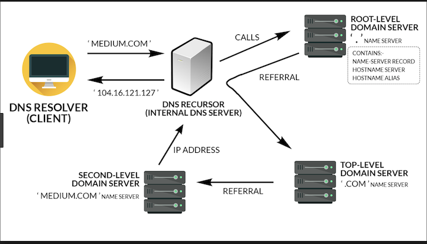

# How does DNS work?

1. **You input domain name(`www.example.com.`) (url)** (There is finale dot inside the url)
2. **Resolving Name Server(According to the `dot` to find root name server)**
3. **Root Name Server** (get query find **com** name server)
4. **TLD(Top Level Domain) Name Server** [Get query, find `example.com` in name server, with help of Domain Register]
5. **Authoritative Name Server**
6. **Give the IP address back**

            
## User to `Resolving Name Server`

* `TTL (Time To Live)` => 1800S 
* One user, Within 1800S, the result cache are stored in `RNS(Resolving Name Server)`
* Therefore, the query don’t have to be sent to ANS

## Graph to resolve DNS

### 1.PC input `url` to `Resolving Name Server`

### 2.`RNS` to `Root Server`

**Root Server:**

* The top or the root, of the DNS hierarchy
* 13 sets of these root servers strategically places around the world
* Operated by 12 different organizations
* **Each Set hash their own unique I.P. address**

### 2.`RNS` to `Top level Domain Server`

**Top level Domain Server**

Stores the address information for top level domains

**such as `.COM`, `.NET`, `.ORG` etc**

### 3.`RNS` to `Authoritative Name Server`

**Responsible for knowing everything about the domain**

**Including the I.P. address**

### 4.`RNS` storing I.P. address

