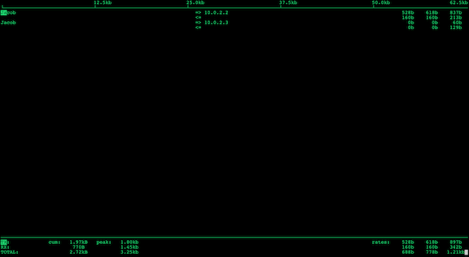

#  Network Tools in the Command Line

## `ping` - Tests if peer host/gateway is reachable

```
$ ping 10.145.52.205
PING 10.145.52.205 (10.145.52.205) 56(84) bytes of data.
From 10.145.52.205 icmp_seq=1 Time to live exceeded
From 10.145.52.205 icmp_seq=2 Time to live exceeded
From 10.145.52.205 icmp_seq=3 Time to live exceeded
^C
--- 10.145.52.205 ping statistics ---
4 packets transmitted, 0 received, +3 errors, 100% packet loss, time 3007ms
```

## `traceroute` - shows paths to the destination IP address

```
$ sudo apt-get install traceroute
```

**The traceroute command is used in Linux to map the journey that a packet of information undertakes from its source to its destination.**

One use for traceroute is to locate when data loss occurs throughout a network, which could signify a node that's down.


Because each hop in the record reflects a new server or router between the originating PC and the intended target, reviewing the results of a traceroute scan also lets you identify slow points that may adversely affect your network traffic.

```
$ traceroute 10.145.52.205
traceroute to 10.145.52.205 (10.145.52.205), 30 hops max, 60 byte packets
 1  10.0.2.2 (10.0.2.2)  0.101 ms  0.064 ms  0.124 ms
 2  10.75.106.1 (10.75.106.1)  7.165 ms  7.081 ms  7.017 ms
 3  * * *
 4  * * *
 5  * * *
 ...
 
 
```

## `dig` - queries DNS

```
$ dig zaoaoaoaoao.com

; <<>> DiG 9.9.5-3ubuntu0.17-Ubuntu <<>> zaoaoaoaoao.com
;; global options: +cmd
;; Got answer:
;; ->>HEADER<<- opcode: QUERY, status: NOERROR, id: 56926
;; flags: qr rd ra; QUERY: 1, ANSWER: 1, AUTHORITY: 0, ADDITIONAL: 1

;; OPT PSEUDOSECTION:
; EDNS: version: 0, flags:; udp: 4000
;; QUESTION SECTION:
;zaoaoaoaoao.com.		IN	A

;; ANSWER SECTION:
zaoaoaoaoao.com.	228	IN	A	54.180.90.200

;; Query time: 4 msec
;; SERVER: 10.0.2.3#53(10.0.2.3)
;; WHEN: Tue Mar 05 06:22:37 UTC 2019
;; MSG SIZE  rcvd: 60
```

```
$ dig www.youtube.com

; <<>> DiG 9.9.5-3ubuntu0.17-Ubuntu <<>> www.youtube.com
;; global options: +cmd
;; Got answer:
;; ->>HEADER<<- opcode: QUERY, status: NOERROR, id: 23162
;; flags: qr rd ra; QUERY: 1, ANSWER: 12, AUTHORITY: 0, ADDITIONAL: 1

;; OPT PSEUDOSECTION:
; EDNS: version: 0, flags:; udp: 4000
;; QUESTION SECTION:
;www.youtube.com.		IN	A

;; ANSWER SECTION:
www.youtube.com.	62706	IN	CNAME	youtube-ui.l.google.com.
youtube-ui.l.google.com. 71	IN	A	172.217.168.238
youtube-ui.l.google.com. 71	IN	A	172.217.17.46
youtube-ui.l.google.com. 71	IN	A	172.217.17.78
youtube-ui.l.google.com. 71	IN	A	172.217.19.206
youtube-ui.l.google.com. 71	IN	A	172.217.168.206
youtube-ui.l.google.com. 71	IN	A	172.217.20.110
youtube-ui.l.google.com. 71	IN	A	216.58.212.142
youtube-ui.l.google.com. 71	IN	A	172.217.17.110
youtube-ui.l.google.com. 71	IN	A	172.217.17.142
youtube-ui.l.google.com. 71	IN	A	216.58.211.110
youtube-ui.l.google.com. 71	IN	A	172.217.20.78

;; Query time: 4 msec
;; SERVER: 10.0.2.3#53(10.0.2.3)
;; WHEN: Tue Mar 05 06:23:16 UTC 2019
;; MSG SIZE  rcvd: 25
```

### `dig txt domain_name[wiki_page]`

```
$ dig txt en.wikipedia.org/wiki/dota2

; <<>> DiG 9.9.5-3ubuntu0.17-Ubuntu <<>> txt en.wikipedia.org/wiki/dota2
;; global options: +cmd
;; Got answer:
;; ->>HEADER<<- opcode: QUERY, status: NXDOMAIN, id: 26809
;; flags: qr rd ra; QUERY: 1, ANSWER: 0, AUTHORITY: 1, ADDITIONAL: 1

;; OPT PSEUDOSECTION:
; EDNS: version: 0, flags:; udp: 4000
;; QUESTION SECTION:
;en.wikipedia.org/wiki/dota2.	IN	TXT

;; AUTHORITY SECTION:
.			900	IN	SOA	a.root-servers.net. nstld.verisign-grs.com. 2019030500 1800 900 604800 86400

;; Query time: 313 msec
;; SERVER: 10.0.2.3#53(10.0.2.3)
;; WHEN: Tue Mar 05 06:25:10 UTC 2019
;; MSG SIZE  rcvd: 131
```

## `iftop` - displays a table of current bandwidth usage by hosts

```
$ sudo apt-get install iftop
```

```
$ iftop
interface: eth0
IP address is: 10.0.2.15
MAC address is: 08:00:27:9e:58:5a
pcap_open_live(eth0): eth0: You don't have permission to capture on that device (socket: Operation not permitted)
```

```
$ sudo iftop
```



## `whois` - get information on domain names or IPs you choose

```
$ sudo apt-get install whois
$ whois
Usage: whois [OPTION]... OBJECT...

-h HOST, --host HOST   connect to server HOST
-p PORT, --port PORT   connect to PORT
-H                     hide legal disclaimers
      --verbose        explain what is being done
      --help           display this help and exit
      --version        output version information and exit

These flags are supported by whois.ripe.net and some RIPE-like servers:
-l                     find the one level less specific match
-L                     find all levels less specific matches
-m                     find all one level more specific matches
-M                     find all levels of more specific matches
-c                     find the smallest match containing a mnt-irt attribute
-x                     exact match
-b                     return brief IP address ranges with abuse contact
-B                     turn off object filtering (show email addresses)
-G                     turn off grouping of associated objects
-d                     return DNS reverse delegation objects too
-i ATTR[,ATTR]...      do an inverse look-up for specified ATTRibutes
-T TYPE[,TYPE]...      only look for objects of TYPE
-K                     only primary keys are returned
-r                     turn off recursive look-ups for contact information
-R                     force to show local copy of the domain object even
                       if it contains referral
-a                     also search all the mirrored databases
-s SOURCE[,SOURCE]...  search the database mirrored from SOURCE
-g SOURCE:FIRST-LAST   find updates from SOURCE from serial FIRST to LAST
-t TYPE                request template for object of TYPE
-v TYPE                request verbose template for obj
```

```
$ whois zaoaoaoaoao.com
   Domain Name: ZAOAOAOAOAO.COM
   Registry Domain ID: 1989339504_DOMAIN_COM-VRSN
   Registrar WHOIS Server: grs-whois.hichina.com
   Registrar URL: http://www.net.cn
   Updated Date: 2018-12-03T03:55:06Z
   Creation Date: 2015-12-24T06:47:35Z
   Registry Expiry Date: 2021-12-24T06:47:35Z
   Registrar: Alibaba Cloud Computing (Beijing) Co., Ltd.
   Registrar IANA ID: 420
   Registrar Abuse Contact Email: DomainAbuse@service.aliyun.com
   Registrar Abuse Contact Phone: +86.95187
   Domain Status: clientTransferProhibited https://icann.org/epp#clientTransferProhibited
   Name Server: ERIC.NS.CLOUDFLARE.COM
   Name Server: MARGE.NS.CLOUDFLARE.COM
   DNSSEC: unsigned
   URL of the ICANN Whois Inaccuracy Complaint Form: https://www.icann.org/wicf/
>>> Last update of whois database: 2019-03-05T06:56:25Z <<<

For more information on Whois status codes, please visit https://icann.org/epp
```

```
$ whois youtoube.com
   Domain Name: YOUTOUBE.COM
   Registry Domain ID: 594919189_DOMAIN_COM-VRSN
   Registrar WHOIS Server: whois.markmonitor.com
   Registrar URL: http://www.markmonitor.com
   Updated Date: 2018-08-14T09:32:07Z
   Creation Date: 2006-09-15T18:42:44Z
   Registry Expiry Date: 2019-09-15T18:42:44Z
   Registrar: MarkMonitor Inc.
   Registrar IANA ID: 292
   Registrar Abuse Contact Email: abusecomplaints@markmonitor.com
   Registrar Abuse Contact Phone: +1.2083895740
   Domain Status: clientDeleteProhibited https://icann.org/epp#clientDeleteProhibited
   Domain Status: clientTransferProhibited https://icann.org/epp#clientTransferProhibited
   Domain Status: clientUpdateProhibited https://icann.org/epp#clientUpdateProhibited
   Name Server: NS1.GOOGLEDOMAINS.COM
   Name Server: NS2.GOOGLEDOMAINS.COM
   Name Server: NS3.GOOGLEDOMAINS.COM
   Name Server: NS4.GOOGLEDOMAINS.COM
   DNSSEC: unsigned
   URL of the ICANN Whois Inaccuracy Complaint Form: https://www.icann.org/wicf/
>>> Last update of whois database: 2019-03-05T06:59:13Z <<<
```

