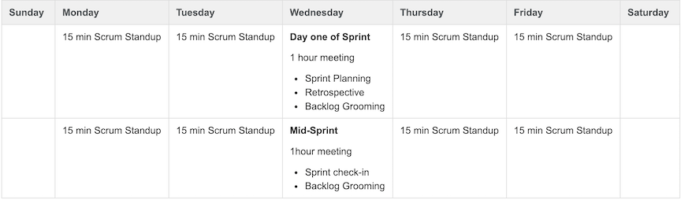

# Scrum Ceremonies &  Sizing Epics and Stories

This is a review of the current scrum ceremonies teams is using for sprint development. While teams may differ in some of the details of the execution all should be following the below guidelines.

## Sprint Planning

**Frequency:** Every 2 weeks, first day of the sprint

**Duration:** At least 1 hour

**Goal:** Plan and start the sprint

The team should start out with a **prioritized backlog** where the top `~1/3` of stories is ready to work on and estimate.  

During the meeting: Go through each story in priority order:

* Verify **everyone** understands the story.
* Verify the Acceptance Criteria are documented.
* Add Story Points to the story and assign to an engineer.
* Drag the story into the sprint.

In reality, you probably are not starting out with a perfectly groomed backlog.  

You will then need to go through stories and work on getting them ready.  If a story is well understood but not fully documented that task can be completed during or directly after sprint planning. 

If it is clear that stories need to be broken down for an epic that that should be done during a separate backlog grooming or story mapping session.

#### Epic =`broken down`=> Stories

If an **epic is not close to ready**, you can plan **Spike work** for the sprint.  

**Spikes are essentially `timeboxed` stories for investigation of unknown work.  The result of these is often a story or set of stories that are well defined.**

## Standup

**Frequency**: Every day of the sprint except days for planning and mid-sprint review.

**Duration**: 15 minutes

**Goal:** Assess where you are with the sprint, find out if anyone is blocked

Standup should be a quick and efficient discussion, and should not devolve into detailed discussion.  It is up to the Scrum Master to make sure these conversations are taken outside the meeting. The goal is to find out who is blocked and figure out how to unblock them, and to assess where you are in the sprint and if adjustments need to be made.  It's a good idea to have the board and burndown ready for review in these meetings.

The meeting consists of:

* Quick round of status updates
  * What you did yesterday
  * What you’re doing today
  * Blockers – don’t just say no blockers out of habit! (if something is taking longer than you thought, if you haven’t been able to get anywhere with something, if you need help of some kind)
* Quick check on where we are with the sprint
* Anything else anyone has to bring up?

Danger signs to look for:

* Burnflat or Burnup - if your Burndown isn't going down, you need to take a look at why
* Board - all stories have tasks in progress at once - this is rarely OK 
* New stories/bugs/tasks suddenly appearing in the sprint - this should NEVER happen without agreement of the entire team and requires explicit approval of the product owner.  Things do come up, but everyone needs to be aware that pulling stories in mid sprint will almost always result in other stories not being complete

## Mid-Sprint Review

**Frequency**: One meeting mid-sprint

**Duration**: 30 minutes

**Goal**:  Summarize the sprint and keep the team focused on the sprint deliverables. Assess how the sprint is progressing, changes in the work included in the sprint, concerns about completing work within the sprint

Mid-sprint review provides the team with a check in point during the sprint to assess any risks, concerns or changes. While these issues may be raised during Standup and discussed in separate sessions this is an opportunity to communicate across team members.

The meeting consists of:

* An update from each team member how their overall work is progressing for the sprint; it is not meant to be a deep dive into any one story
* An update from the Product Owner and / or Dev Manager on any changes in work or risks in the sprint and subsequent discussion on how to mitigate that

Danger signs to look for (very similar to standup):

* Burnflat or Burnup - if your Burndown isn't going down or remains stagnant, you need to take a look at why
* Board - all stories have tasks in progress at once - this is rarely OK

## Backlog Grooming

**Frequency**: **At least once per sprint**, **usually in the middle of the sprint**. 

**Currently some teams are doing this as part of their Sprint Planning, ideally it is a separate meeting but teams may use their judgement on what works best for them**. 

Other teams are completing this asynchronously; for example, the member of the team who best understands the epic (Product Owner, DevManager, Engineer) writes the stories and have the others review. If this method is used, then please ensure that the Product Owner and Dev Manager do review the epic breakdown.

**Duration**: At least 1 hour

**Goal**: **Get stories Ready for Sprint Planning**

Backlog Grooming is one of the more laborious Scrum Ceremonies, but it is well worth the time. 

**During Backlog Grooming the team writes stories for all work required to complete an epic;** 

including documentation, handoff or release, etc. These sessions encourage team discussions and surface questions and assumptions. 

During Backlog Grooming, you do the following:

* **Review the prioritized stories and bugs in the backlog and ensure it is correct.**
* **Epic breakdown and story mapping**
* Discuss new stories or bugs to propose for prioritization
* Review the stories in the Backlog and get them ready for development

Getting a story to Ready:

1. Have the PO (or team member with best understanding ) give an overview of what the story entails
2. Discuss the story. A good way to do this is to start defining Acceptance Criteria:
  * **Walk through the technical requirements or TPP(Technical Planning Page)**.  This breakdown helps developers think about how to structure and componentize the work, and helps the entire team understand the story with a fine granularity.  The more detail you get into, the better prepared you will be during story development and the more likely it is that the team builds what is intended.
  * Stop and ask if this work can be broken down further.  Often times this realization will happen naturally in step a.
  * Discuss and note dependencies. If dependencies are unresolved, discuss how to resolve them and make notes in the story.
  * Ask if everyone is happy with the story.  Cut off the discussion if it devolves into minutia.  It's very easy for the planning process to get derailed by lengthy technical discussions. If the technical discussion is on a large scale (e.g. if it's about how the back end can support a feature given the current data model versus how are we going to match the top gradient color on this button), then the story needs more investigation, and it's time to create a Spike for it.
  * **Do story point estimation**

## Retrospective

**Frequency**: Once per sprint, **on the last day**

**Duration**: 30 minutes

**Goal:** As a team, discuss what went well and what did not go well, and come up with 1 or 2  action items to be focused on for the next sprint.

Each person should come up with the following on his/her own:

* What went well this sprint
* What didn't go well
* Special appreciations

Then the team discusses and comes up with 1 or 2 action items to work on for the next sprint.

## Sprint Demo

**Frequency**: Once per sprint, **on the last day**

**Duration**: 30 minutes

**Goal**: Demo **DONE** stories to the team to show progress for the sprint

**Invites**: In addition to the full team, invite Product Manager and Product Owner for any features being demoed.  **Note that not all people will be able to attend all demo meetings so it is a good idea to record these sessions and make the recording available.**

Team members should rotate responsibility for the sprint demo.

When 'preparing materials’ for any demos, create a confluence page containing a rough description of what is going to be demoed. The demo needs to be quick and focus on the features being demoed.  (Watching someone create data for longer than it takes to demo the feature kills the interest and excitement of the demo.)

Creating a demo outline eases the process and serves multiple purposes: 

1. It helps you plan what you’re actually going to demo 
2. It gives you a chance to run through the demo yourself first since you have to make sure your plan will work
3. It keeps the demo meetings physically short - by having a prepared and practiced demo it will go much smoother.

## Sample Scrum Meeting Calendar

The following is a sample calendar teams may use which combines some of the above meetings:

	

# Sizing Epics and Stories

## Sizing Epics

All epics must be sized as part of the continuous planning process. Epics should not be finalized on a Quarterly Plan until they have a T-shirt size assigned to them. **Sizing will be done based on manweeks (MW) per an individual engineer.** The following T-shirt sizing should be used when sizing epics:

* X-Small = .5 Sprint
* Small = 1 sprint
* Medium = 2 sprints
* Large = 5 sprints
* XL =  Break it down 🙂

## Sizing Stories

**A story must be sized prior to pulling it into a sprint. Use story points when estimating stories within an epic.**

* Use **Fibonacci (1,2,3,5, 8, 13, & 21)** with 13 being the most complex that can be completed in one sprint
* Points are based on the team’s interpretation and complexity of work
* 21 means that the story is too complex or requirements aren’t baked enough to complete in a sprint so it needs to be broken down further before you can plan it in a sprint
* Points represent a story’s complexity relative to other work in that sprint (Not Time)
* In reality, when teams actually get down to estimating, all we talk about is time 🙂
* Over time planning gets easier by tracking the team’s sprint velocity – the number of points that can be completed in a sprint

