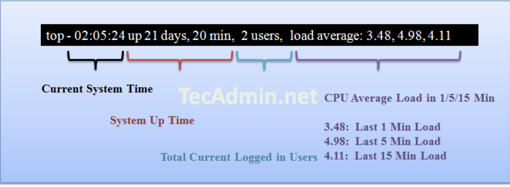
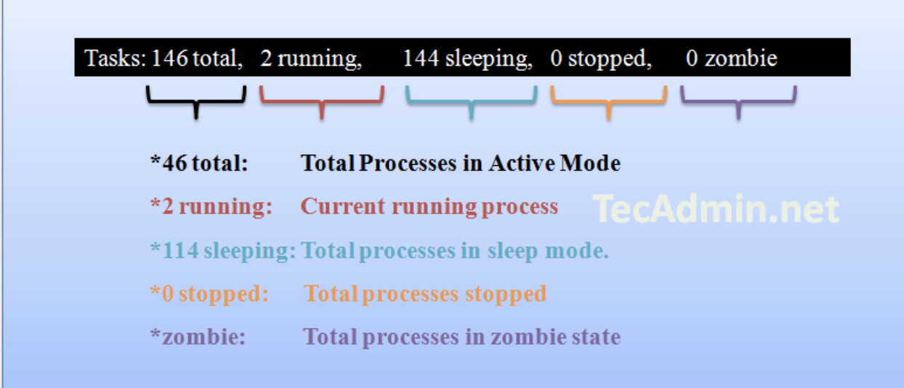
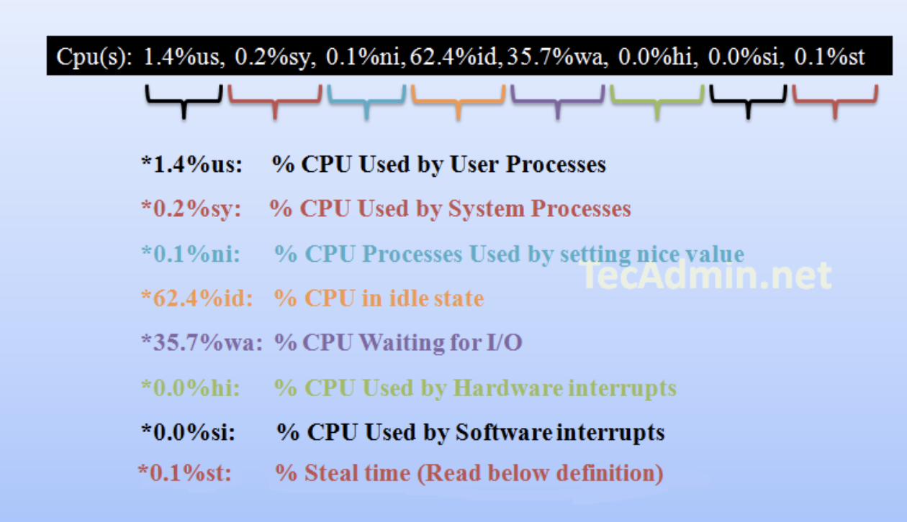
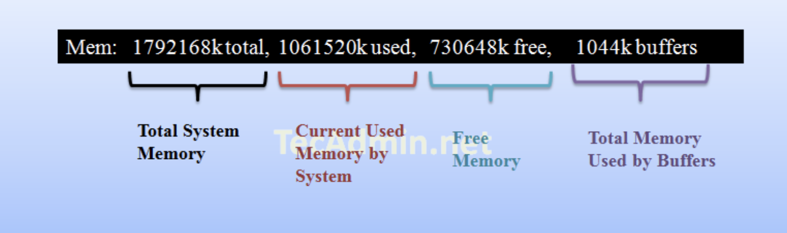
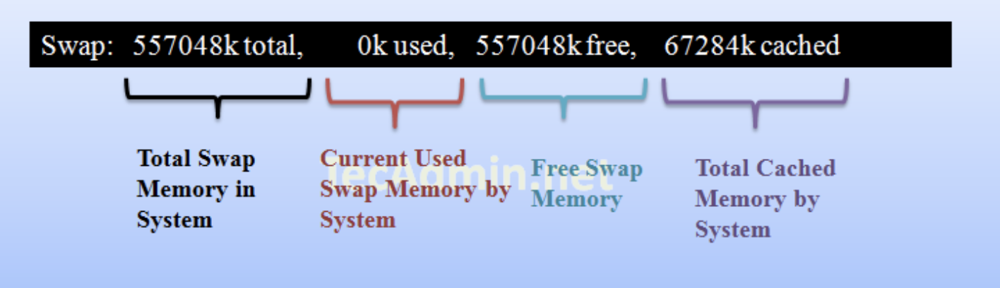
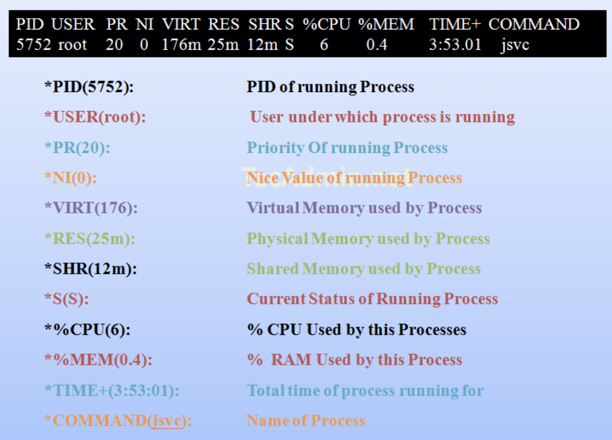

# 如何理解linux top命令的输出结果

如何理解`top`命令的结果，做为`Linux system administrator`，`top`命令是经常被使用的指令，它被用来查看服务中每一个进程所使用的资源量。 这个指令可以帮助我们发现任何一个进程在系统中所使用的资源。


## How to Read Linux Top Command Output

When you execute the top command on Linux, it shows a lot of results, here I am trying to show you to how to read it row by row.

## Result Row #1

Row 1 results show about 

**1.server uptime from the last reboot**, 

**2.currently logged in users**  

**3.CPU load on the server**. 

The same output you can find using Linux uptime command.



```
top - 06:38:50 up 7 days,  1:47,  1 user,  load average: 0.24, 0.25, 0.26
```

## Result Row #2

Row 2 shows the **number of process running on the server and their state**.



```
Tasks: 167 total,   1 running, 166 sleeping,   0 stopped,   0 zombie
```

`Zombie process` or `defunct process` is a process that has completed execution but still has an entry in the process table. 

**This entry is still needed to allow the parent process to read its child’s exit status.**

## Result Row #3

Row three shows the **CPU utilization status on the server**, you can find here how much **CPU is free and how much is utilizing by the system**.



```
%Cpu(s):  1.9 us,  1.0 sy,  0.0 ni, 96.4 id,  0.2 wa,  0.0 hi,  0.5 si,  0.0 st
```

**Steal time is the time that a virtual CPU waits for a real CPU while the hypervisor is servicing another virtual processor.**

## Result Row #4

Row 4 shows the **memory utilization on the server**, you can find here how much memory is used, the same results you can find using free command.



```
KiB Mem :  1015964 total,    67444 free,   583720 used,   364800 buff/cache
```

## Result Row #5

Row 5 shows the **swap memory utilization on the server**, you can find here how much swap is being used, the same results you can find using free command.

**Swap is very useful for that system which required more RAM that physical available. If memory is full and system required more RAM to run applications properly it check for swap space and transfer files there. In general terms, swap is a part of the hard disk used as RAM on the system.**



```
KiB Swap:  1048572 total,   604584 free,   443988 used.   181540 avail Mem
```

## Result Row #6 ( Running Processes )

In this steps you will see all **running process on servers and there additional details** about them like below.



```
 PID USER      PR  NI    VIRT    RES    SHR S  %CPU %MEM     TIME+ COMMAND
31956 root      20   0 1402540  65788  14384 S   3.7  6.5 259:20.46 kubelet
```

## Short Results Based on Specific Fields

You can also short the results based on the specific field. Use the following key combination to do short.

```
Press "SHIFT + F" and Select your choice below and press ENTER.

  A     ( PID = Process Id )
  b     (  PPID   = Parent Process Pid )
  d     (  UID= User Id )
  e     (  USER   = User Name )
  f     (  GROUP  = Group Name )
  g     (  TTY= Controlling Tty )
  h     (  PR = Priority )
  i     (  NI = Nice value )
  j     (  P  = Last used cpu (SMP) )
  k     (  %CPU  = CPU usage )
  l     (  TIME  = CPU Time )
  n     (  %MEM  = Memory usage (RES) )
  o     (  VIRT  = Virtual Image (kb) )
  p     (  SWAP  = Swapped size (kb) )
  q     (  RES= Resident size (kb) )
  r     (  CODE  = Code size  (kb) )
  s     (  DATA  = Data+Stack size (kb) )
  t     (  SHR= Shared Mem size (kb) )
  w     (  S  = Process Status )
  x     (  COMMAND= Command name/line )

```

```
Fields Management for window 1:Def, whose current sort field is %CPU
   Navigate with Up/Dn, Right selects for move then <Enter> or Left commits,
   'd' or <Space> toggles display, 's' sets sort.  Use 'q' or <Esc> to end!
```

