# RabbitMQ指南

1. RabbitMQ 历史
2. RabbitMQ 应用场景
3. RabbitMQ 系统架构
4. RabbitMQ 基本概念
5. RabbitMQ 细节阐明

## 历史-从开始到现在

`RabbitMQ`是一个`Erlang`开发的`AMQP`（`Advanced Message Queuing Protocol` ）的开源实现。`AMQP` 的出现其实也是应了广大人民群众的需求，虽然在同步消息通讯的世界里有很多公开标准（如 `Cobar`）的 `IIOP` ，或者是 `SOAP` 等），但是在异步消息处理中却不是这样，只有大企业有一些商业实现（如微软的 `MSMQ` ，`IBM` 的 `WebSphere MQ` 等），因此，在 2006 年的 6 月，Cisco 、Red Hat、iMatix 等联合制定了 AMQP 的公开标准。

[RabbitMQ官网](https://www.rabbitmq.com/)

## 一、应用场景

言归正传。RabbitMQ，或者说AMQP解决了什么问题，或者说它的应用场景是什么？

对于一个大型的软件系统来说，它会有很多的组件或者说模块，又或者说子系统。那这些模块又如何通信？这和传统的IPC有很大的区别。传统的IPC很多都是在单一系统上的，模块耦合性很大，不适合扩展（Scalability）。

如果使用Socket，那么不同的模块的确可以部署到不同的机器上，但是还是有很多问题需要解决。比如：

* 信息的发送者和接收者如何维持这个连接，如果一方的连接中断，这期间的数据是以什么方式丢失？
* 如何降低发送者和接收者的耦合度？
* 如何让Priority高的接收者先接到数据？
* 如何做到Load Balance？有效均衡接收者的负载？
* 如何有效的将数据发送到相关的接收者？也就是说将接收者subscribe 不同的数据，如何做有效的filter。
* 如何做到可扩展，甚至将这个通信模块发到cluster上？
* 如何保证接收者接收到了完整，正确的数据？

`AMQP`协议解决了以上的问题，而`RabbitMQ`实现了`AMQP`。

## 二、系统架构

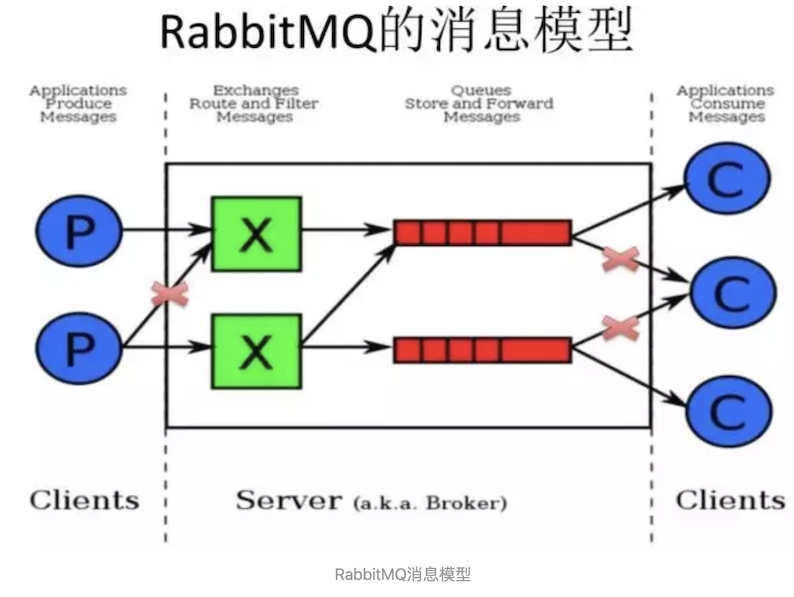

### RabbitMQ Server

也叫`Broker Server`，它不是运送食物的卡车，而是一种**传输服务**。原话是`RabbitMQ isn't a food truck, it's a delivery service`. **它的角色就是维护一条从`Producer`到`Consumer`的路线，保证数据能够按照指定的方式进行传输。** 虽然这个保证也不是100%的保证，但是对于普通的应用来说这已经足够了。当然对于商业系统来说，可以再做一层数据一致性的`guard`，就可以彻底保证系统的一致性了。

### Client P

也叫`Producer`，数据的发送方。`Create messages and publish (send) them to a Broker Server (RabbitMQ)`。一个`Message`有两个部分：`payload（有效载荷）`和`label（标签）`。

* `payload`顾名思义就是传输的数据。
* `label`是`exchange`的名字或者说是一个`tag`，它描述了`payload`，而且`RabbitMQ`也是通过这个`label`来决定把这个`Message`发给哪个`Consumer`。

`AMQP`仅仅描述了`label`，而`RabbitMQ`决定了如何使用这个`label`的规则。

### Client C

也叫`Consumer`，数据的接收方。`Consumers attach to a Broker Server (RabbitMQ) and subscribe to a queue`。

把`queue`比作是一个有名字的邮箱。当有`Message`到达某个邮箱后，`RabbitMQ`把它发送给它的某个订阅者即`Consumer`。**当然可能会把同一个`Message`发送给很多的`Consumer`。在这个`Message`中，只有`payload`，`label`已经被删掉了。**

对于`Consumer`来说，它是不知道谁发送的这个信息的，就是协议本身不支持。当然了，如果`Producer`发送的`payload`包含了`Producer`的信息就另当别论了。

对于一个数据从`Producer`到`Consumer`的正确传递，还有三个概念需要明确：`exchanges, queues and bindings`。

* Exchanges are where producers publish their messages.
* **Queues are where the messages end up and are received by consumers.**
* **Bindings are how the messages get routed from the exchange to particular queues.**

还有几个概念是上述图中没有标明的，那就是`Connection`（连接）和`Channel`（通道，频道）。

### Connection

就是一个`TCP`的连接。`Producer`和`Consumer`都是通过`TCP`连接到`RabbitMQ Server`的。以后我们可以看到，程序的起始处就是建立这个`TCP`连接。

### Channel

对于`OS`来说，建立和关闭`TCP`连接是有代价的，频繁的建立关闭`TCP`连接对于系统的性能有很大的影响，而且`TCP`的连接数也有限制，这也限制了系统处理高并发的能力。

**但是，在`TCP`连接中建立`Channel`是没有上述代价的**。对于`Producer`或者`Consumer`来说，可以并发的使用多个`Channel`进行`Publish`或者`Receive`。有实验表明，`1s`的数据可以`Publish 10K`的数据包。当然对于不同的硬件环境，不同的数据包大小这个数据肯定不一样，但是我只想说明，对于普通的`Consumer`或者`Producer`来说，这已经足够了。如果不够用，你考虑的应该是如何细化`SPLIT`你的设计。

相关定义：

* `Broker`： 简单来说就是消息队列服务器实体
* `Exchange`： **消息交换机，它指定消息按什么规则，路由到哪个队列**
* `Queue`： **消息队列载体，每个消息都会被投入到一个或多个队列**
* `Binding`： 绑定，它的作用就是把`exchange`和`queue`按照路由规则绑定起来
* `Routing Key`： 路由关键字，`exchange`根据这个关键字进行消息投递
* `VHost`： 虚拟主机，一个`broker`里可以开设多个`vhost`，用作不同用户的权限分离。
* `Producer`： 消息生产者，就是投递消息的程序
* `Consumer`： 消息消费者，就是接受消息的程序
* `Channel`：**消息通道，在客户端的每个连接里，可建立多个channel，每个channel代表一个会话任务**

由`Exchange`、`Queue`、`RoutingKey`三个才能决定一个从`Exchange`到`Queue`的唯一的线路。

## 三、基本概念

`Connection Factory`、`Connection`、`Channel`都是`RabbitMQ`对外提供的`API`中最基本的对象。

`Connection`是`RabbitMQ`的`socket`链接，它封装了`socket`协议相关部分逻辑。`Connection Factory`则是`Connection`的制造工厂。

`Channel`是我们与`RabbitMQ`打交道的最重要的一个接口，我们大部分的业务操作是在`Channel`这个接口中完成的，包括

* 定义`Queue`、
* 定义`Exchange`、
* 绑定`Queue`与`Exchange`、
* 发布消息等。

### Queue

`Queue`（队列）是`RabbitMQ`的内部对象，用于存储消息，如下图表示。

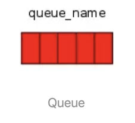

`RabbitMQ`中的消息都只能存储在`Queue`中，生产者（下图中的P）生产消息并最终投递到`Queue`中，消费者（下图中的C）可以从`Queue`中获取消息并消费。

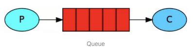

**多个消费者可以订阅同一个`Queue`**，**这时`Queue`中的消息会被平均分摊给多个消费者进行处理，而不是每个消费者都收到所有的消息并处理**。

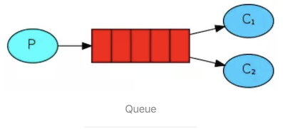

### Message acknowledgment

在实际应用中，可能会发生消费者收到`Queue`中的消息，但没有处理完成就宕机（或出现其他意外）的情况，这种情况下就可能会导致消息丢失。为了避免这种情况发生，我们可以要求消费者在消费完消息后发送一个回执给RabbitMQ，`RabbitMQ`收到消息回执（`Message acknowledgment`）后才将该消息从`Queue`中移除。

如果`RabbitMQ`没有收到回执并检测到消费者的`RabbitMQ`连接断开，则`RabbitMQ`会将该消息发送给其他消费者（如果存在多个消费者）进行处理。

**这里不存在`timeout`，一个消费者处理消息时间再长也不会导致该消息被发送给其他消费者，除非它的`RabbitMQ`连接断开。**

这里会产生另外一个问题，如果我们的开发人员在处理完业务逻辑后，忘记发送回执给`RabbitMQ`，**这将会导致严重的`bug——Queue`中堆积的消息会越来越多。消费者重启后会重复消费这些消息并重复执行业务逻辑**。

<mark>另外publish message 是没有ACK的。</mark>

### Message durability

如果我们希望即使在`RabbitMQ`服务重启的情况下，也不会丢失消息，我们可以将`Queue`与`Message`都设置为可持久化的（`durable`），这样可以保证绝大部分情况下我们的RabbitMQ消息不会丢失。

但依然解决不了小概率丢失事件的发生（比如RabbitMQ服务器已经接收到生产者的消息，但还没来得及持久化该消息时RabbitMQ服务器就断电了），如果我们需要对这种小概率事件也要管理起来，那么我们要用到事务。由于这里仅为RabbitMQ的简单介绍，所以这里将不讲解RabbitMQ相关的事务。

### Prefetch count

前面我们讲到如果有多个消费者同时订阅同一个Queue中的消息，Queue中的消息会被平摊给多个消费者。这时如果每个消息的处理时间不同，就有可能会导致某些消费者一直在忙，而另外一些消费者很快就处理完手头工作并一直空闲的情况。

我们可以通过设置`Prefetch count`来限制`Queue`每次发送给每个消费者的消息数，

**比如我们设置`prefetchCount=1`，则`Queue`每次给每个消费者发送一条消息；消费者处理完这条消息后`Queue`会再给该消费者发送一条消息。**

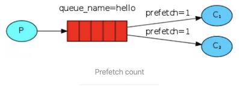

### Exchange

在上一节我们看到生产者将消息投递到Queue中，实际上这在RabbitMQ中这种事情永远都不会发生。实际的情况是，生产者将消息发送到`Exchange`（交换器，下图中的X），**由`Exchange`将消息路由到一个或多个`Queue`中（或者丢弃）**。

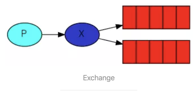

Exchange是按照什么逻辑将消息路由到Queue的？这个将在Binding一节中介绍。

RabbitMQ中的Exchange有四种类型，不同的类型有着不同的路由策略，这将在Exchange Types一节介绍。

### Routing Key

生产者在将消息发送给`Exchange`的时候，**一般会指定一个`Routing Key`，来指定这个消息的路由规则，而这个`Routing Key`需要与`Exchange Type`及`Binding key`联合使用才能最终生效**。

在`Exchange Type`与`Binding key`固定的情况下（在正常使用时一般这些内容都是固定配置好的），我们的生产者就可以在发送消息给`Exchange`时，通过指定`Routing Key`来决定消息流向哪里。

`RabbitMQ`为`Routing Key`设定的长度限制为`255 bytes`。

### Binding

`RabbitMQ`中通过`Binding`将`Exchange`与`Queue`关联起来，这样RabbitMQ就知道如何正确地将消息路由到指定的Queue了。

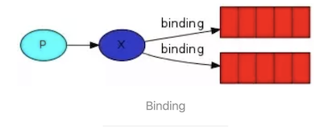

### Binding key

在绑定（`Binding`）`Exchange`与`Queue`的同时，一般会指定一个`Binding ke`y。消费者将消息发送给`Exchange`时，一般会指定一个`Routing Key`。当`Binding key`与`Routing Key`相匹配时，消息将会被路由到对应的`Queue`中。这个将在`Exchange Types`章节会列举实际的例子加以说明。

**在绑定多个`Queue`到同一个`Exchange`的时候，这些`Binding`允许使用相同的`Binding key`。**

`Binding key`并不是在所有情况下都生效，它依赖于`Exchange Type`，

* 比如`fanout`类型的`Exchange`就会无视`Binding key`，而是将消息路由到所有绑定到该`Exchange`的`Queue`。

### Exchange Types

**`RabbitMQ`常用的`Exchange Type`有`fanout`、`direct`、`topic`、`headers`这四种**（AMQP规范里还提到两种Exchange Type，分别为`system`与自定义，这里不予以描述），下面分别进行介绍。

#### fanout

`fanout`类型的`Exchange`路由规则非常简单，它会把所有发送到该`Exchange`的消息路由到所有与它绑定的`Queue`中。

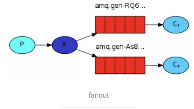

上图中，**生产者（P）**发送到**Exchange（X）**的所有消息都会路由到图中的两个`Queue`，并最终被两个消费者（C1与C2）消费。

#### direct

`direct`类型的`Exchange`路由规则也很简单**，它会把消息路由到那些`Binding key`与`Routing key`完全匹配的`Queue`中**。

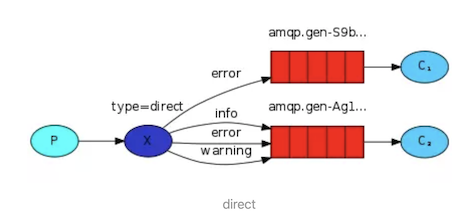

以上图的配置为例，

* 我们以`routingKey="error"`发送消息到`Exchange`，
* 则消息会路由到`Queue1`（`amqp.gen-S9b…`，这是由`RabbitMQ`自动生成的`Queue`名称）和`Queue2`（`amqp.gen-Agl…`）；
* 如果我们以`Routing Key="info"`或`routingKey="warning"`来发送消息，则消息只会路由到`Queue2`。
* 如果我们以其他`Routing Key`发送消息，则消息不会路由到这两个`Queue`中。

#### topic

前面讲到`direct`类型的`Exchange`路由规则是完全匹配`Binding Key`与`Routing Key`，但这种严格的匹配方式在很多情况下不能满足实际业务需求。

`topic`类型的`Exchange`在匹配规则上进行了扩展，它与`direct`类型的`Exchage`相似，也是将消息路由到`Binding Key`与`Routing Key`相匹配的`Queue`中，但这里的匹配规则有些不同，它约定：

`Routing Key`为一个句点号`“.”`分隔的字符串（我们将被句点号`". "`分隔开的每一段独立的字符串称为一个单词），如`"stock.usd.nyse"`、`"nyse.vmw`"、`"quick.orange.rabbit"`。`Binding Key`与`Routing Key`一样也是句点号`“. ”`分隔的字符串。

**`Binding Key`中可以存在两种特殊字符`"*"`与`"#"`，用于做模糊匹配，其中`"*"`用于匹配一个单词，`"#"`用于匹配多个单词（可以是零个）。**

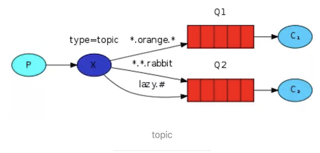

以上图中的配置为例，

* `routingKey=”quick.orange.rabbit”`的消息会同时路由到`Q1`与`Q2`，
* `routingKey=”lazy.orange.fox”`的消息会路由到`Q1`，
* `routingKey=”lazy.brown.fox”`的消息会路由到`Q2`，
* `routingKey=”lazy.pink.rabbit”`的消息会路由到`Q2`（只会投递给Q2一次，虽然这个`routingKey`与Q2的两个`bindingKey`都匹配）；
* `routingKey=”quick.brown.fox”`、`routingKey=”orange”`、`routingKey=”quick.orange.male.rabbit”`的**消息将会被丢弃，因为它们没有匹配任何`bindingKey`**。

#### headers

**`headers`类型的`Exchange`不依赖`于Routing Key`与`Binding Key`的匹配规则来路由消息，而是根据发送的消息内容中的`headers`属性进行匹配。**

* 在绑定`Queue`与`Exchange`时指定一组键值对；
* 当消息发送到`Exchange`时，`RabbitMQ`会取到该消息的`headers`（也是一个键值对的形式），对比其中的键值对是否完全匹配`Queue`与`Exchang`e绑定时指定的键值对。
* 如果完全匹配则消息会路由到该`Queue`，否则不会路由到该`Queue`。

该类型的Exchange没有用到过（不过也应该很有用武之地），所以不做介绍。

### RPC

`MQ`本身是基于异步的消息处理，前面的示例中所有的生产者（P）将消息发送到RabbitMQ后不会知道消费者（C）处理成功或者失败（甚至连有没有消费者来处理这条消息都不知道）。

但实际的应用场景中，**我们很可能需要一些同步处理，需要同步等待服务端将我的消息处理完成后再进行下一步处理。这相当于`RPC`（`Remote Procedure Call`，远程过程调用）。在`RabbitMQ`中也支持`RPC`。**

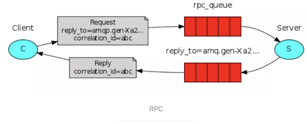

### RabbitMQ中实现RPC的机制是：

客户端发送请求（消息）时，在消息的属性（`Message Properties`，在`AMQP`协议中定义了14种`properties`，这些属性会随着消息一起发送）中**设置两个值`replyTo`**（一个`Queue`名称，用于告诉服务器处理完成后将通知我的消息发送到这个`Queue`中）和`correlationId`（此次请求的标识号，服务器处理完成后需要将此属性返还，客户端将根据这个id了解哪条请求被成功执行了或执行失败）。

服务器端收到消息处理完后，将生成一条应答消息到`replyTo`指定的`Queue`，同时带上`correlationId`属性。客户端之前已订阅`replyTo`指定的`Queue`，从中收到服务器的应答消息后，根据其中的`correlationId`属性分析哪条请求被执行了，根据执行结果进行后续业务处理。

## 四、细节阐明

### 使用`ACK`确认`Message的`正确传递

默认情况下，如果`Message` 已经被某个`Consumer`正确的接收到了，那么该`Message`就会被从`Queue`中移除。**当然也可以让同一个`Message`发送到很多的`Consumer`。**

**如果一个`Queue`没被任何的`Consumer Subscribe`（订阅），当有数据到达时，这个数据会被`cache`，不会被丢弃。当有`Consumer`时，这个数据会被立即发送到这个`Consumer`。这个数据被`Consumer`正确收到时，这个数据就被从`Queue`中删除。**

那么什么是正确收到呢？通过`ACK`。每个`Message`都要被`acknowledged`（确认，ACK）。我们可以显示的在程序中去`ACK`，也可以自动的`ACK`。**如果有数据没有被`ACK`，那么`RabbitMQ Server`会把这个信息发送到下一个`Consumer`。**

如果这个`APP`有`bug`，忘记了`ACK`，那么`RabbitMQ Server`不会再发送数据给它，因为`Server`认为这个`Consumer`处理能力有限。而且`ACK`的机制可以起到限流的作用（`Benefitto throttling`）：在`Consumer`处理完成数据后发送`ACK`，甚至在额外的延时后发送`ACK`，将有效的`balance Consumer`的`load`。

当然对于实际的例子，比如我们可能会对某些数据进行`merge`，比如`merge 4s`内的数据，然后`sleep 4s`后再获取数据。特别是在监听系统的`state`，我们不希望所有的`state`实时的传递上去，而是希望有一定的延时。这样可以减少某些`IO`，而且终端用户也不会感觉到。

### Reject a message

有两种方式，

* 第一种的`Reject`可以让`RabbitMQ Server`将该`Message` 发送到下一`个Consumer`。
* 第二种是从`Queue`中立即删除该`Message`。

### Creating a queue

**`Consumer`和`Procuder`都可以通过 `queue.declare` 创建`queue`。**

对于某个`Channel`来说，`Consumer`不能`declare`一个`queue`，却订阅其他的`queue`。当然也可以创建私有的`queue`。这样只有`APP`本身才可以使用这个`queue`。`queue`也可以自动删除，被标为`auto-delete`的`queue`在最后一个`Consumer unsubscribe`后就会被自动删除。那么如果是创建一个已经存在的`queue`呢？那么不会有任何的影响。需要注意的是没有任何的影响，也就是说第二次创建如果参数和第一次不一样，那么该操作虽然成功，但是`queue`的属性并不会被修改。

那么谁应该负责创建这个`queue`呢？是`Consumer`，还是`Producer`？

如果`queue`不存在，当然`Consumer`不会得到任何的`Message`。那么`Producer Publish`的`Message`会被丢弃。所以，还是为了数据不丢失，`Consumer`和`Producer`都`try to create the queue！`反正不管怎么样，这个接口都不会出问题。

`queue`对`load balance`的处理是完美的。对于多个`Consumer`来说，`RabbitMQ` 使用循环的方式（`round-robin`）的方式均衡的发送给不同的`Consumer`。

### Exchanges

从架构图可以看出，`Procuder Publish`的`Message`进入`了Exchange`。接着通过`"routing keys”`，` RabbitMQ`会找到应该把这个`Message`放到哪个`queue`里。`queue`也是通过这个`routing keys`来做的绑定。

有三种类型的`Exchanges`：`direct`, `fanout,` `topic`。 每个实现了不同的路由算法（`routing algorithm`）。

* **Direct exchange**：如果 `routing key` 匹配，那么`Message`就会被传递到相应的`queue`中。其实在`queue`创建时，它会自动的以`queue`的名字作为`routing key`来绑定那个`exchange`。
* **Fanout exchange：会向响应的`queue`广播。**
* **Topic exchange**：对`key`进行模式匹配，比如`ab`可以传递到所有`ab`的`queue`。

### Virtual hosts

每个`virtual host`本质上都是一个`RabbitMQ Server`，拥有它自己的`queue`，`exchagne`，和`bings rule`等等。这保证了你可以在多个不同的`Application`中使用`RabbitMQ`。

