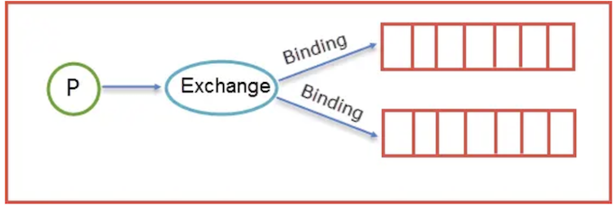

# rabbitmq 快速学习与使用

## 基础概念

### 消息队列

消息队列（`message queue`）是应用程序间通信的一种方式。应用程序通过读写出入队列的消息来通信，而非直接调用彼此来通信（例如RPC远程进程调用）。

消息队列也是分布式应用间交换信息的一种技术。**队列中的消息是可以驻留在内存或者磁盘上，直到存储的消息被应用读取**。通过消息队列，应用可以独立的运行，消息的生产者不需要知道消息的消费者位置，消息的消费者也不需要知道消息的生产者在哪里。


### AMQP

AMQP（Advanced Message Queuing Protocol）高级消息队列协议，是应用层协议的一个开放标准，为面向消息的中间件设计。消息中间件主要用于组件之间的解耦，消息的发送者无需知道消息使用者的存在，反之亦然。

AMQP的主要特征是面向消息、队列、路由（包括点对点和发布/订阅）、可靠性、安全。


### rabbitmq

RabbitMQ是一个开源的AMQP实现，服务器端用Erlang语言编写，支持多种客户端，如：Python、Ruby、.NET、Java、JMS、C、PHP、ActionScript、XMPP、STOMP等，支持AJAX。用于在分布式系统中存储转发消息，在易用性、扩展性、高可用性等方面表现不俗。


* 可靠性（`Reliability`）
	* RabbitMQ 使用一些机制来保证可靠性，如持久化、传输确认、发布确认。

* 灵活的路由（`Flexible Routing`）
	* 在消息进入队列之前，通过 Exchange 来路由消息的。对于典型的路由功能，RabbitMQ 已经提供了一些内置的 Exchange 来实现。针对更复杂的路由功能，可以将多个 Exchange 绑定在一起，也通过插件机制实现自己的Exchange 。

* 消息集群（`Clustering`）
	* 多个 RabbitMQ 服务器可以组成一个集群，形成一个逻辑 `Broker` 。

* 高可用（`Highly Available Queues`）
	* 队列可以在集群中的机器上进行镜像，使得在部分节点出问题的情况下队列仍然可用。

* 多种协议（`Multi-protocol`）
	* RabbitMQ 支持多种消息队列协议，比如 STOMP、MQTT 等等。

* 多语言客户端（Many Clients）
	* RabbitMQ 几乎支持所有常用语言，比如 Java、.NET、Ruby 等等。

* 管理界面（Management UI）
	* RabbitMQ 提供了一个易用的用户界面，使得用户可以监控和管理消息 Broker 的许多方面。

* 跟踪机制（	`Tracing`）
	* 如果消息异常，RabbitMQ 提供了消息跟踪机制，使用者可以找出发生了什么。

* 插件机制（`Plugin System`）
	* RabbitMQ 提供了许多插件，来从多方面进行扩展，也可以编写自己的插件。


## 消息策略

rabbitmq消息基本原理


我们在开篇的时候就留了一个坑，就是那个应用结构图里面，消费者`Client A`和消费者`Client B`是如何知道我发送的消息是给`Queue1`还是给`Queue2`，有没有过这个问题，那么我们就来解开这个面纱，看看到底是个什么构造。

首先明确一点就是生产者产生的消息并不是直接发送给消息队列`Queue`的，而是要经过`Exchange`（交换器），由`Exchange`再将消息路由到一个或多个`Queue`，当然这里还会对不符合路由规则的消息进行丢弃掉，这里指的是后续要谈到的`Exchange Type`。

那么`Exchange`是怎样将消息准确的推送到对应的`Queue`的呢？那么这里的功劳最大的当属`Binding`，`RabbitMQ`是通过`Binding`将`Exchange`和`Queue`链接在一起，这样`Exchang`e就知道如何将消息准确的推送到`Queue`中去。简单示意图如下所示：




* 在绑定（`Binding`）`Exchange`和`Queue`的同时，一般会指定一个`Binding Key`，
* 生产者将消息发送给`Exchange`的时候，一般会产生一个`Routing Key`，
* 当`Routing Key`和`Binding Key`对应上的时候，消息就会发送到对应的`Queue`中去。

那么Exchange有四种类型，不同的类型有着不同的策略。也就是表明不同的类型将决定绑定的Queue不同，换言之就是说生产者发送了一个消息，`Routing Key`的规则是`A`，那么生产者会将`Routing Key=A`的消息推送到`Exchange`中，这时候`Exchange`中会有自己的规则，对应的规则去筛选生产者发来的消息，如果能够对应上`Exchange`的内部规则就将消息推送到对应的`Queue`中去。那么接下来就来详细讲解下`Exchange`里面类型。

### Exchange Type

我来用表格来描述下类型以及类型之间的区别。

* fanout

`fanout`类型的`Exchange`路由规则非常简单，它会把所有发送到该`Exchange`的消息路由到所有与它绑定的`Queue`中。


上图所示，生产者（P）生产消息`1`将消息`1`推送到Exchange，由于`Exchange Type=fanout`这时候会遵循`fanout`的规则将消息推送到所有与它绑定`Queue`，也就是图上的两个`Queue`最后两个消费者消费。

* direct

`direct`类型的`Exchange`路由规则也很简单，它会把消息路由到那些`binding key`与`routing key`完全匹配的`Queue`中


当生产者（P）发送消息时`Rotuing key=booking`时，这时候将消息传送给`Exchange`，`Exchange`获取到生产者发送过来消息后，会根据自身的规则进行与匹配相应的`Queue`，这时发现`Queue1`和`Queue2`都符合，就会将消息传送给这两个队列，如果我们以`Routing key=create`和`Rotuing key=confirm`发送消息时，这时消息只会被推送到`Queue2`队列中，其他`Routing Key`的消息将会被丢弃。

* topic

前面提到的direct规则是严格意义上的匹配，换言之Routing Key必须与Binding Key相匹配的时候才将消息传送给Queue，那么topic这个规则就是模糊匹配，可以通过通配符满足一部分规则就可以传送。它的约定是：


* `routing key`为一个句点号`“. ”`分隔的字符串（我们将被句点号`“. ”`分隔开的每一段独立的字符串称为一个单词）如`“stock.usd.nyse”`、`“nyse.vmw”`、`“quick.orange.rabbit”`
* `binding key`与`routing key`一样也是句点号`“. ”`分隔的字符串
* `binding key`中可以存在两种特殊字符`“”`与`“#”`，用于做模糊匹配，**其中`“”`用于匹配一个单词，`“#”`用于匹配多个单词（可以是零个）**


* 当生产者发送消息`Routing Key=F.C.E`的时候，这时候只满足`Queue1`，所以会被路由到`Queue`中，
* 如果`Routing Key=A.C.E`这时候会被同是路由到`Queue1`和`Queue2`中，
* 如果`Routing Key=A.F.B`时，这里只会发送一条消息到Queue2中。


* headers

`headers`类型的`Exchange`不依赖于`routing key`与`binding key`的匹配规则来路由消息，而是根据发送的消息内容中的`headers`属性进行匹配。

在绑定`Queue`与`Exchange`时指定一组键值对；当消息发送到`Exchange`时，`RabbitMQ`会取到该消息的`headers`（也是一个键值对的形式），对比其中的键值对是否完全匹配`Queue`与`Exchange`绑定时指定的键值对；如果完全匹配则消息会路由到该`Queue`，否则不会路由到该`Queue`。

## 生产者消费者Python代码验证

python 安装`rabbitmq`库

```
$ pip install pika
```

### 生产者(`sender.py`)

```
import pika
username    = "root"
passwd      = "password"
auth    = pika.PlainCredentials(username, passwd)
s_conn  = pika.BlockingConnection(pika.ConnectionParameters('192.168.1.100', credentials=auth))
channel = s_conn.channel()
channel.queue_declare(queue='hello')
for i in range(1,10):
    channel.basic_publish(exchange='', routing_key='hello', body='message '+ str(i))
    print("[生产者] send 'hello" + 'message '+ str(i))

s_conn.close()
```

**代码解读**

* `pika.PlainCredentials`是一种身份证数据格式，将用户名密码包含在内，作为`pika.ConnectionParameters`的一个参数,若不指定用户名和密码，默认会使用`guest/guest`作为用户名和密码来使用。
* `pika.ConnectionParameters`有如下多个连接参数配置，包括用户身份、主机、端口、加密、超时时间等。

```
host=_DEFAULT,port=_DEFAULT,virtual_host=_DEFAULT,credentials=_DEFAULT,channel_max=_DEFAULT,frame_max=_DEFAULT,heartbeat=_DEFAULT,ssl=_DEFAULT,ssl_options=_DEFAULT,connection_attempts=_DEFAULT,retry_delay=_DEFAULT,socket_timeout=_DEFAULT,locale=_DEFAULT,backpressure_detection=_DEFAULT,blocked_connection_timeout=_DEFAULT,client_properties=_DEFAULT,tcp_options=_DEFAULT
```

* `pika.BlockingConnection` 创建一个连接，
* `s_conn.channel()`创建一个频道、
* `queue_declare`指定一个队列也可以配置是否需要数据持久，
* `basic_publish()`发送消息，
* `exchange`, `routing_key`, `body`, `properties=None`,  `mandatory=False` , `immediate=False`是`basic_publish`的参数，
	* `exchange`是交换器，
	* `routing_key`是转发至哪一个队列，如果有多个`queue`，可以模糊匹配发送至匹配到的`queue`
	* `body`是发送的消息体，
	* `properties`中可以配置数据持久化，`properties=pika.BasicProperties(delivery_mode=2,)`


### 消费者(`receiver.py`)

```
import pika
def callback(ch, method, properties, body):
    print(" [Consumer] Received %r" % body)
    #ch.basic_ack(delivery_tag = method.delivery_tag)
username    = "admin"
passwd      = "admin"
auth    = pika.PlainCredentials(username, passwd)
s_conn  = pika.BlockingConnection(pika.ConnectionParameters('192.168.33.10', credentials=auth))
channel = s_conn.channel()
channel.queue_declare(queue='hello')
channel.basic_qos(prefetch_count=1)

# channel.basic_consume(consumer_callback=callback,queue="hello",no_ack=True)
channel.basic_consume(on_message_callback=callback, queue="hello", auto_ack=True)

print(' [*] Waiting for messages. To exit press CTRL+C')
channel.start_consuming()
```

**代码解读**

其他与生产者基本类似，

* `basic_consume`是从队列中获取数据，`callback`是有消息后产生的回调函数，`queue`是队列名称，`auto_ack`是获取消息后是否发送ack回应，若为`True`则需要代码回复`ack`，若为`False`，内部封装会自动回复`ack`。
* `basic_qos`就是`RabbitMQ`给消费者发消息的时候检测下消费者里的消息数量，如果超过指定值（比如`1`条），就不给你发了。

### Run the code

**Terminal one**

```
 python3 receiver.py 
 [*] Waiting for messages. To exit press CTRL+C
 [Consumer] Received b'message 1'
 [Consumer] Received b'message 2'
 [Consumer] Received b'message 3'
 [Consumer] Received b'message 4'
 [Consumer] Received b'message 5'
 [Consumer] Received b'message 6'
 [Consumer] Received b'message 7'
 [Consumer] Received b'message 8'
 [Consumer] Received b'message 9'
```
**Terminal two**

```
$ python3 sender.py 
[Sender] send 'hellomessage 1
[Sender] send 'hellomessage 2
[Sender] send 'hellomessage 3
[Sender] send 'hellomessage 4
[Sender] send 'hellomessage 5
[Sender] send 'hellomessage 6
[Sender] send 'hellomessage 7
[Sender] send 'hellomessage 8
[Sender] send 'hellomessage 9
```


## 消息持久化

bbitmq 数据持久化需要满足三个条件

* 队列的持久化
* 交换器的持久化
* 消息的持久化

* 若`durable=False`，`rabbitmq`重启之后`exchange`、`queue`和`message`都会被清除
* 若`durable=True,rabbitmq`重启之后`exchange`和`queue`不会被清除，但是如果`delivery_mode=1`，数据依旧会被清除
* 只有当`durable=True，delivery_mode=2`时，才能实现消息的持久化。

