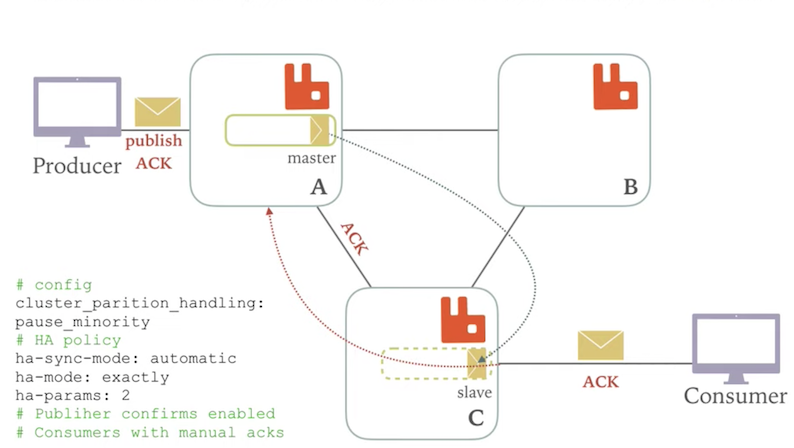
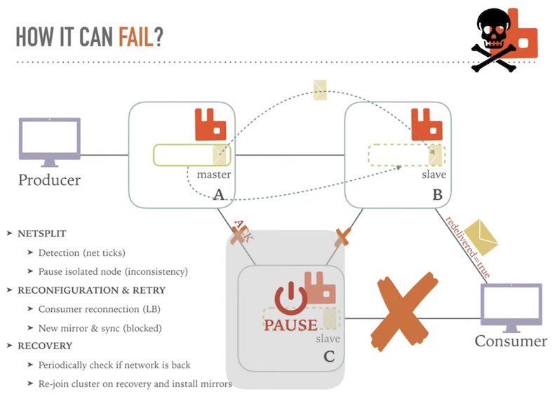

# **L5 分布式集群架构和高可用性**

### **设计集群的目的**

* 允许消费者和生产者在`RabbitMQ`节点崩溃的情况下继续运行
* 通过增加更多的节点来扩展消息通信的吞吐量

### **集群配置方式**

RabbitMQ可以通过三种方法来部署分布式集群系统，分别是：`cluster`,`federation`,`shovel`

* **cluster**:
	* 不支持跨网段，用于同一个网段内的局域网
	* 可以随意的动态增加或者减少
	* 节点之间需要运行相同版本的`RabbitMQ`和`Erlang`

* `federation`:应用于广域网，允许单台服务器上的交换机或队列接收发布到另一台服务器上交换机或队列的消息，可以是单独机器或集群。federation队列类似于单向点对点连接，消息会在联盟队列之间转发任意次，直到被消费者接受。通常使用`federation`来连接`internet`上的中间服务器，用作订阅分发消息或工作队列。

* `shovel`:连接方式与`federation`的连接方式类似，但它工作在更低层次。可以应用于广域网

## **1、RabbitMQ cluster 集群同步原理**

上面图中采用三个节点组成了一个`RabbitMQ`的集群，`Exchange A`的元数据信息在所有节点上是一致的，而`Queue`（存放消息的队列）的完整数据则只会存在于它所创建的那个节点上。，其他节点只知道这个`queue`的`metadata`信息和一个指向`queue`的`owner node`的指针。

### **1-1 RabbitMQ集群元数据的同步**

RabbitMQ集群会始终同步四种类型的内部元数据（类似索引）：

1. 队列元数据：队列名称和它的属性；
2. 交换器元数据：交换器名称、类型和属性；
3. 绑定元数据：一张简单的表格展示了如何将消息路由到队列；
4. vhost元数据：为vhost内的队列、交换器和绑定提供命名空间和安全属性； 因此，当用户访问其中任何一个RabbitMQ节点时，通过`rabbitmqctl`查询到的`queue/user/exchange/vhost`等信息都是相同的。

### 为何RabbitMQ集群仅采用元数据同步的方式

* 一，存储空间，如果每个集群节点都拥有所有Queue的完全数据拷贝，那么每个节点的存储空间会非常大，集群的消息积压能力会非常弱（无法通过集群节点的扩容提高消息积压能力）； 
* 二，性能，消息的发布者需要将消息复制到每一个集群节点，对于持久化消息，网络和磁盘同步复制的开销都会明显增加。

## RabbitMQ cluster 集群的两种模式

1. **普通模式：默认的集群模式。**

2. 镜像模式：把需要的队列做成镜像队列，存在于多个节点，属于`RabbitMQ`的`HA`方案

### 普通模式：

当消息进入`A`节点的`Queue`中后，`consumer`从`B`节点拉取时，`RabbitMQ`会临时在`A、B`间进行消息传输，把`A`中的消息实体取出并经过`B`发送给`consumer`，所以`consumer`应平均连接每一个节点，从中取消息。该模式存在一个问题就是当`A`节点故障后，`B`节点无法取到`A`节点中还未消费的消息实体。

* 如果做了队列持久化或消息持久化，那么得等`A`节点恢复，然后才可被消费，并且在`A`节点恢复之前其它节点不能再创建`A`节点已经创建过的持久队列；
* 如果没有持久化的话，消息就会失丢。这种模式更适合非持久化队列，只有该队列是非持久的，客户端才能重新连接到集群里的其他节点，并重新创建队列。

* **假如该队列是持久化的，那么唯一办法是将故障节点恢复起来。**

为什么`RabbitMQ`不将队列复制到集群里每个节点呢？这与它的集群的设计本意相冲突，集群的设计目的就是增加更多节点时，能线性的增加性能（CPU、内存）和容量（内存、磁盘）。当然`RabbitMQ`新版本集群也支持队列复制（有个选项可以配置）。比如在有五个节点的集群里，可以指定某个队列的内容在2个节点上进行存储，从而在性能与高可用性之间取得一个平衡（应该就是指镜像模式）。

### 镜像模式：

其实质和普通模式不同之处在于，消息实体会主动在镜像节点间同步，而不是在`consumer`取数据时临时拉取。该模式带来的副作用也很明显，除了降低系统性能外，如果镜像队列数量过多，加之大量的消息进入，集群内部的网络带宽将会被这种同步通讯大大消耗掉。所以在对可靠性要求较高的场合中适用.

## 节点类型

* `RAM node`:内存节点将所有的队列、交换机、绑定、用户、权限和vhost的元数据定义存储在内存中，好处是可以使得像交换机和队列声明等操作更加的快速。
* `Disk node`:将元数据存储在磁盘中，单节点系统只允许磁盘类型的节点，防止重启RabbitMQ的时候，丢失系统的配置信息。

## 注意

* `RabbitMQ`要求在集群中至少有一个磁盘节点，所有其他节点可以是内存节点，当节点加入或者离开集群时，必须要将该变更通知到至少一个磁盘节点。
* 如果集群中唯一的一个磁盘节点崩溃的话，集群仍然可以保持运行，但是无法进行其他操作(包括创建队列、交换器、绑定，添加用户、更改权限、添加和删除集群结点)，直到节点恢复。
* 解决方案：设置两个磁盘节点，至少有一个是可用的，可以保存元数据的更改。

## Erlang Cookie

`Erlang Cookie`是保证不同节点可以相互通信的密钥，要保证集群中的不同节点相互通信必须共享相同的`Erlang Cookie`。具体的目录存放在`/var/lib/rabbitmq/.erlang.cookie`。

