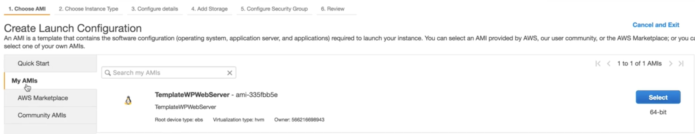
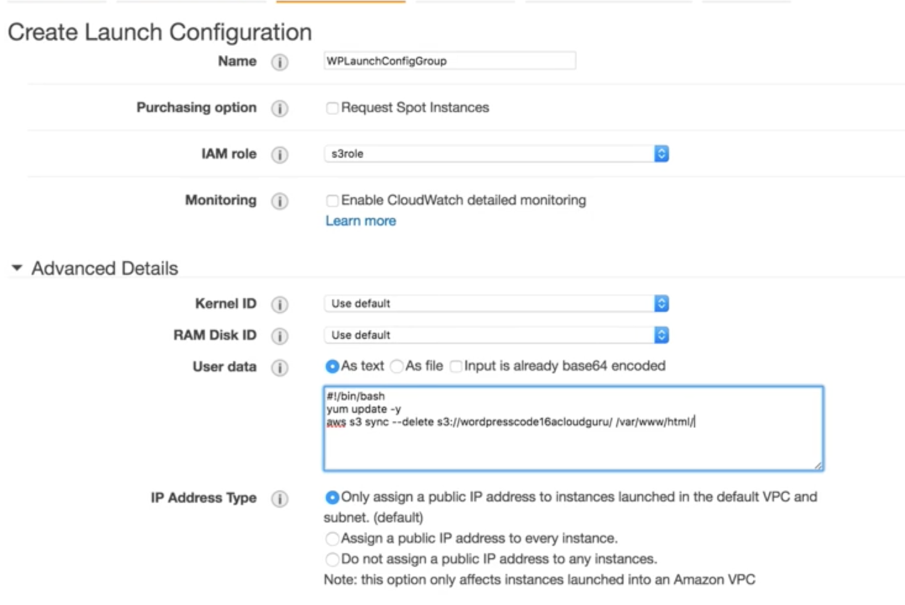
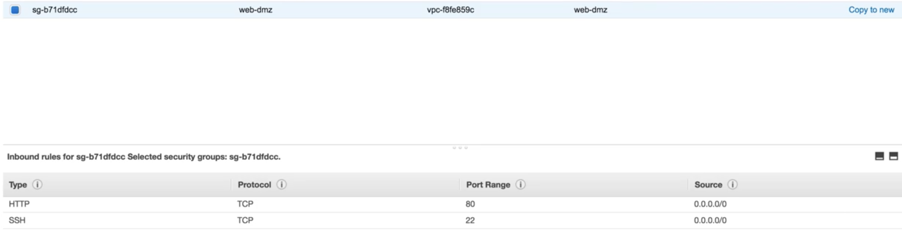
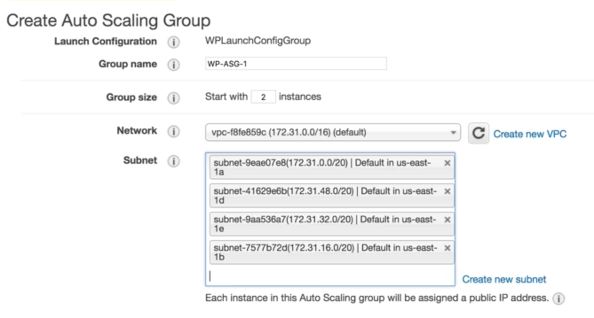
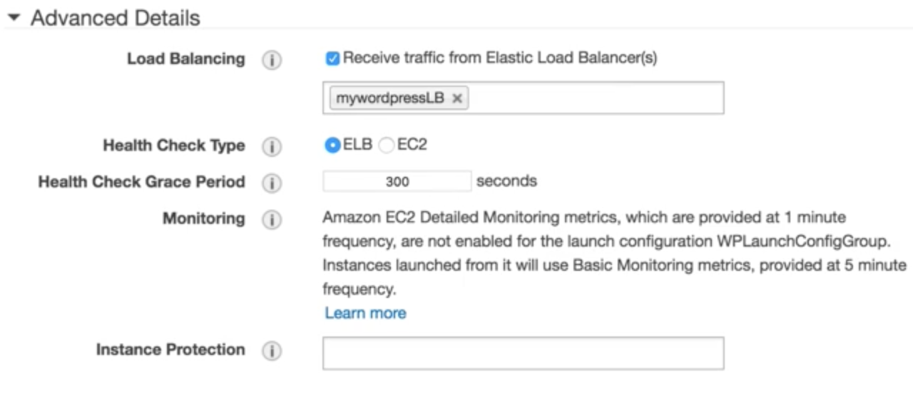
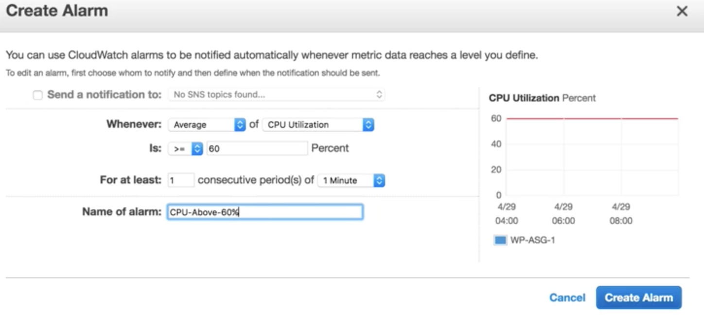
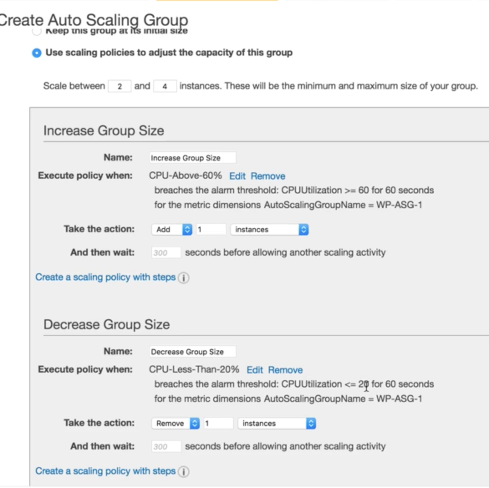
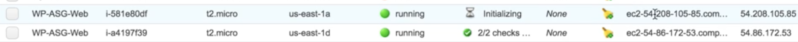
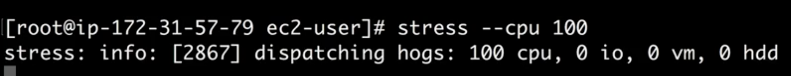
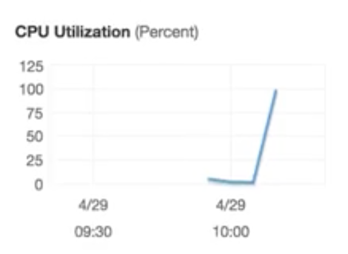

# Building A fault Tolerant Wordpress Site: Lab4 - Autoscaling & Load Testing

## Create Launch Configuration for ASG



### create launch configuration and user data

```
#!/bin/bash
yum update -y
aws s3 sync --delete s3://s3code_bucket /var/www//html
```


* IAM: S3role

### Assign SG to to `Launch Configuration`




## Create ASG



* start with 2 instances
* with all subnet

### retrieve traffic from ELB



* Health Check: ELB


## Create Alarm for ASG

### Alarm one: CPU >= 60%




### Alarm two: CPU <= 20%


### Actions







## Put stress CPU on one instance 

### already `install stress` and stress CPU to 100%

```
sudo stress --cpu 100
```





### provisioning new instance


