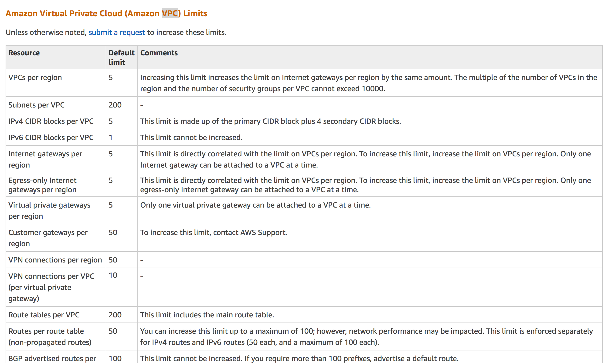

# Well Architected Framework - Pillar two Reliability

## The Reliability Pillar

The reliability pillar covers the ability of a system to **recover from service or infrastructure outages/disruptions** as well as the ability to **dynamically acquire computing resources to meet demand**. 

## Design Principles 

* **Test recovery procedures** 
* **Automatically recover from failure**
* **Scale horizontally to increase aggregate system availability**
* **Stop guessing capacity**

## Definition

Reliability in the cloud consists of 3 areas; 

* **Foundations** 
* **Change management** 
* **Failure management** 

## Best Practices - Foundations

Before building a house, you always make sure that the foundations are in place before you lay the first brick. Similarly before achictecting any system, you need to make sure you have the prerequisite foundations. In traditional IT one of the first things you should consider is the size of the comms link between your HQ and your datacenter. If you misprovision this link, it can take 3 - 6 months to upgrade which can cause a huge disruption to your traditional IT estate. 

With AWS, they handle most of the foundations for you. The cloud is designed to be essentially limitless meaning that **AWS handle the networking and compute requirements themselves**. **However they do set service limits to stop customers from accidentally over-provisioning resources.**



[https://docs.aws.amazon.com/general/latest/gr/aws_service_limits.html](https://docs.aws.amazon.com/general/latest/gr/aws_service_limits.html)

## Best Practices - Foundation Questions

* How are you managing AWS service limits for your account?

```
someone on is in change of its
someone raise tickets for change control process
```

* How are you planning your network topology on AWS? 
* Do you have an escalation path to deal with technical issues? 


## Best Practices - Change Management 

You need to be aware of how change affects a system so that you can plan proactively around it. Monitoring allows you to detect any changes to your environment and react. In traditional systems, change control is done manually and are carefully co-ordinated with auditing. 

With AWS things are a lot easier, you can use CloudWatch to monitor your environment and services such as autoscaling to automate change in response to changes on your production environment. 
 
 
## Best Practices - Change Management Questions 

* How does your system adapt to changes in demand? 
* How are you monitoring AWS resources? 
* How are you executing change management? 


## Best Practices - Failure Management

With cloud, you should always architect your systems with the assumptions that failure will occur. You should become aware of these failures, how they occurred, how to respond to them and then plan on how to prevent these from happening again. 


## Best Practices - Failure Management Questions

* How are you backing up your data? 
* How does your system withstand component failures? 
* How are you planning for recovery?  


## Key AWS Services 

### Foundations 

IAM, VPC 

### Change Management 

AWS CloudTrail 

### Failure Management 

AWS CloudFormation 


## Exam Tips: Reliability Pillar


### Reliability in the cloud consists of 3 areas; 

* **Foundations** 
* **Change management** 
* **Failure management** 

### Reliability Pillar Questions

#### Foundations

* How are you managing AWS service limits for your account?

```
someone on is in change of its
someone raise tickets for change control process
```

* How are you planning your network topology on AWS? 
* Do you have an escalation path to deal with technical issues? 

#### Change Management

* How does your system adapt to changes in demand? 
* How are you monitoring AWS resources? 
* How are you executing change management? 

#### Failure Management

* How are you backing up your data? 
* How does your system withstand component failures? 
* How are you planning for recovery? 

