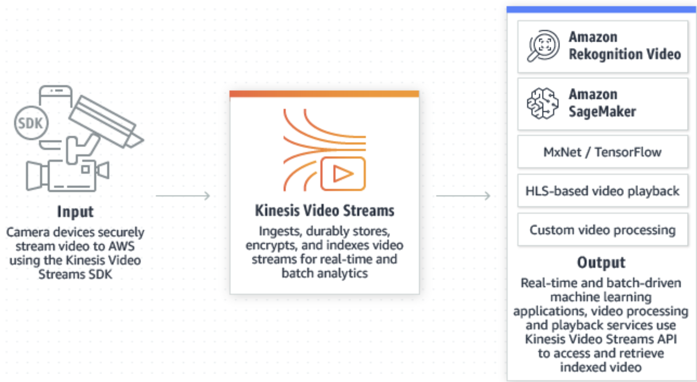
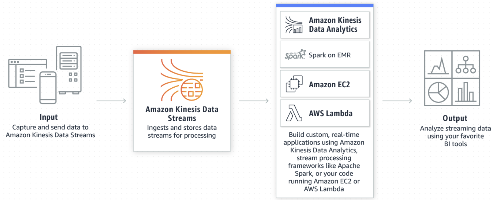
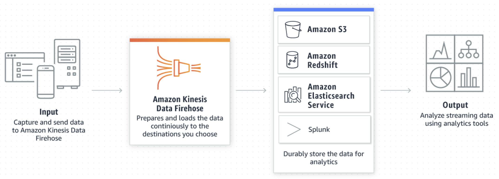
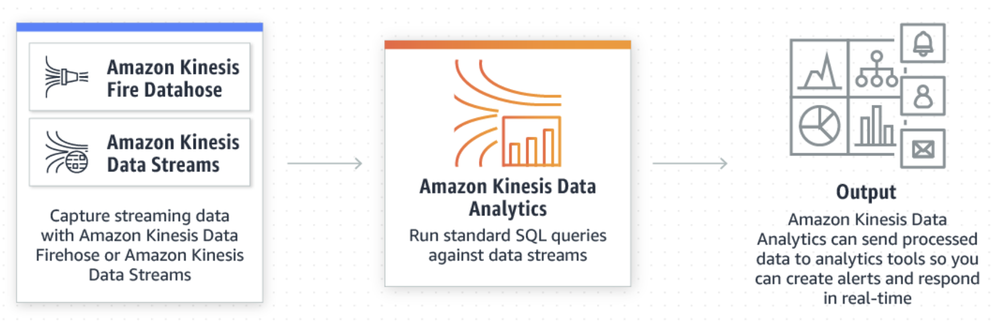

# Amazon Kinesis

With Amazon Kinesis, you can **ingest real-time** data such as video, audio, application logs, website clickstreams, and IoT telemetry data **for machine learning, analytics, and other applications.**

Amazon Kinesis enables you to process and analyze data as it arrives and respond instantly instead of having to wait until all your data is collected before the processing can begin.

## Benefits

* Real-time
* Fully managed
* Scalable

### Amazon Kinesis Video Streams

### Amazon Kinesis Data Streams

### Amazon Kinesis Data Firehose

### Amazon Kinesis Data Analytics

