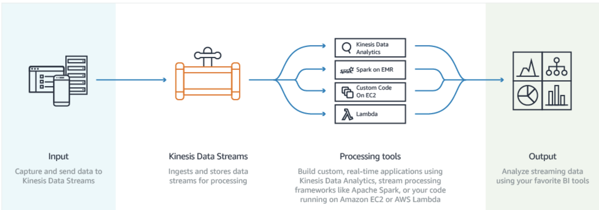

# Additional Exam Tips 1

## 1. What is Kinesis

#### Amazon Kinesis is a fully managed service for `real-time processing of streaming data at massive scale`. 

#### You can configure hundreds of thousands of data producers to continuously put data into an Amazon Kinesis stream. 

For example, data from website clickstreams, application logs, and social media feeds. Within less than a second, the data will be available for your Amazon Kinesis Applications to read and process from the stream.

### Kinesis 

*  Used to consume big data
*  Stream large amounts of social media, news feeds logs etc in to the cloud
*  Think Kinesis
*  Process large amounts of data; 
   * **Redshift for business intelligence**
   * **Elastic Map Reduce for Big Data Processing**

### How it works

## 2.EC2 EBS Backed vs Instance Store 

* **EBS backed volumes are persistent.** 
* **Instance Store backed volumes are not persistent (ephemeral)**
* **EBS Volumes can be detached and reattached to other EC2 instances.**
* **Instance store volume cannot be detached and reattached to other instances. They exist only for the life of that instance.**
* **EBS volumes can be stopped, data will persist.**
* **Instance store volumes cannot be stopped. If you do this the data will be wiped.**

### EBS Backed = Store Data Long Term 
### Instance Store = Shouldn't be used for long-term data storage.

## 3.OpsWork

### Automate Operations with Chef and Puppet

* Chef consists of recipes to maintain a consistent state. 
* Look for the term "chef" or "recipes" or "cook books" and think Opsworks

## 4.Elastic Transcoder 

* Media Transcoder in the cloud
* **Convert media files from theft original source format into different formats** that will play on smartphones, tablets, PC's etc.
* **Provides transcoding presets for popular output formats**, which means that you don't need to guess about which settings work best on particular devices.
* **Pay based on the minutes that you transcode and the resolution at which you transcode.** 

## 5.SWF - Actors 

### Workflow Starters 

An application that can initiate (start) a workflow. Could be your e-commerce website when placing an order or a mobile app searching for bus times.

### Deciders

Control the flow of activity tasks in a workflow execution. If something has finished in a workflow (or fails) a Decider decides what to do next. 

### Activity Workers

Carry out the activity tasks 

## 6.EC2 - Get public IP address 

### Need to query the instances metadata:

#### curl http://169.254.169.254/latestimeta-data/ 
#### get http://169.254.169.254/latestimeta-data/ 
#### Key thing to remember is that it's an instances META DATA, not user data. 

