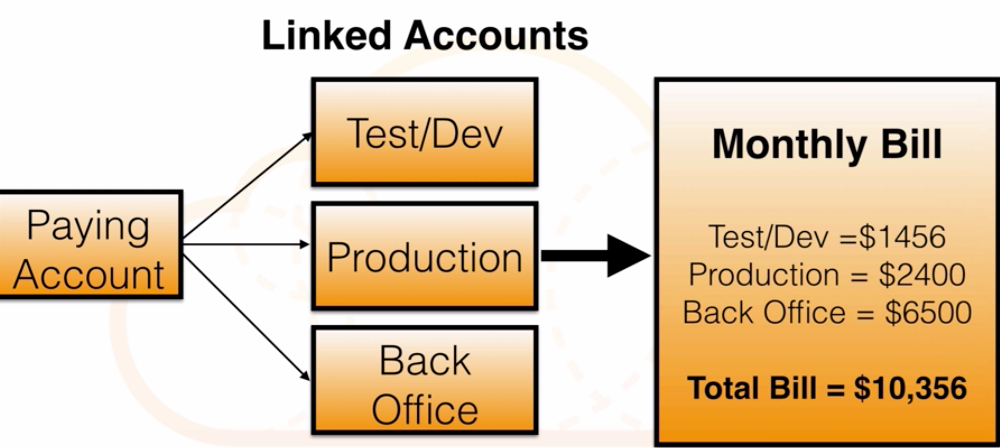
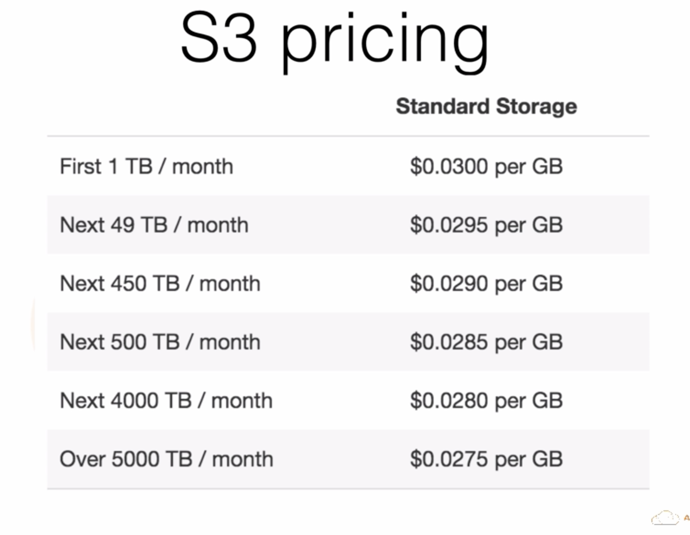

# Consolidated Billing

### 1.Paying account is independent. Cannot access resources of the other accounts. 
### 2.All linked accounts are independent 
### 3.Currently a limit of 20 linked accounts for consolidated billing 

## For Example - Consolidated Billing for S3

## Example 

Our Test/Dev account uses 600 GB, Production uses 900 GB and Back Office uses 500 GB

### Without consolidated billing we would pay:

* 600 x `$0.03` = `$18` 
* 900 x `$0.03` = `$27` 
* 500 x `$0.03` = `$15` 
* Total Bill = `$60` for 2 TB of storage

### With consolidated billing:

* 1TB x 0.03 = `$30` 
* Next 1TB x 0.0295 = `$29.50` 
* Total Bill of `$59.50` 