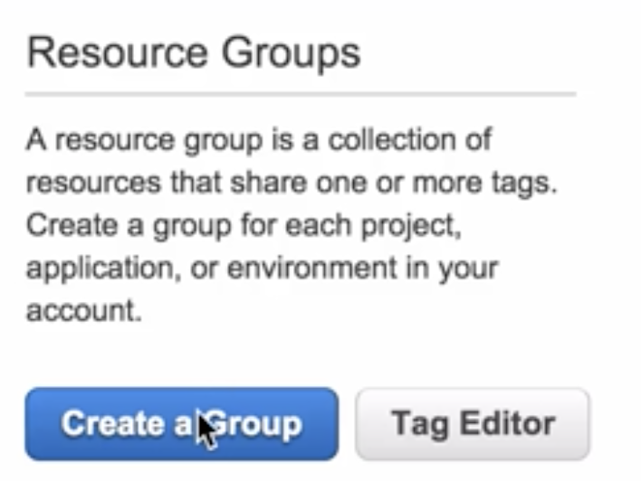

# Tags and Resource Group

## What are tags

* **Key Value Pairs** attached to AWS resources
* **Metadata** (data about data)
* Tags can sometimes be inherited
 * Autoscaling, CloudFormation and Elastic Beanstalk can create other resources 

## What Are Resource Groups? 

Resource groups make it easy to **group your resources using the tags** that are assigned to them. **You can group resources that share one or more tags**. 

### Resource groups contain information such as; 

* Region
* Name
* Health Checks

### Specific information

* **For EC2** - Public & Private IP Addresses 
* **For ELB** - Port Configurations 
* **For RDS** - Database Engine etc 

## Create Resource Groups with tags

### Resource Group shows all resources contained 

## Tag Editor

### Show all your tags and their resources

### add values for those keys

## Exam Tips：

### Resource Groups is great thing to track resources aren't tagged and track resource which department it belongs to 

