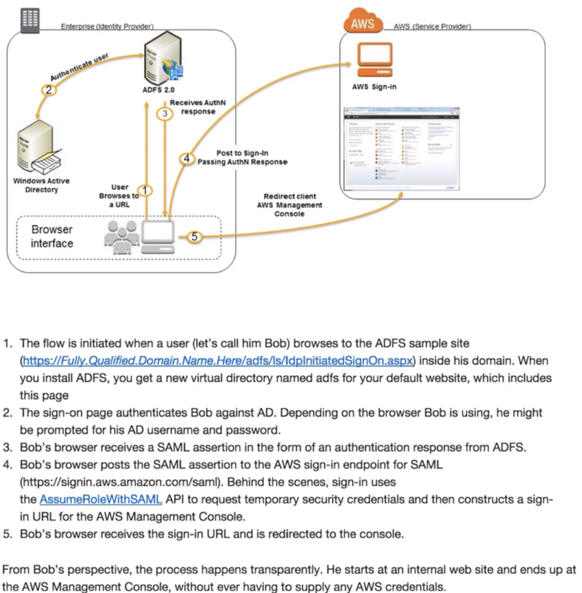

# AWS Federated Authentication with Active Directory Federation Services (AD FS)

## IAM Role Naming Convention for User Access

**Once the AWS identity provider configuration is complete, it is necessary to create the roles in AWS that federated users can assume via SAML 2.0.**

**An IAM role is an AWS identity with permission policies that determine what the identity can and cannot do in AWS**